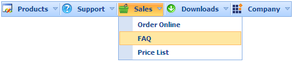

::: {style="DISPLAY: none"}
{#d2h_url_template}{#d2h_package_url style="WIDTH: 0px; DISPLAY: none; HEIGHT: 0px"}
:::

::::: {#nsbanner .d2h_main_nsbanner style="BORDER-BOTTOM: #999999 1px solid; POSITION: relative; PADDING-BOTTOM: 0px; BACKGROUND-COLOR: transparent; PADDING-LEFT: 0px; PADDING-RIGHT: 0px; DISPLAY: none; BORDER-TOP: #999999 1px solid; PADDING-TOP: 0px; LEFT: 0px"}
:::: {#TitleRow .d2h_main_titlerow style="PADDING-BOTTOM: 4px; BACKGROUND-COLOR: transparent; PADDING-LEFT: 22px; WIDTH: 100%; PADDING-RIGHT: 10px; DISPLAY: none; PADDING-TOP: 4px"}
::: {#ienav .d2h_main_ienav style="DISPLAY: none"}
{#D2HPrevious .D2HPreviousEnabled}  {#D2HNext .D2HNextEnabled}
:::
::::
:::::

:::::: {#nstext .d2h_main_nstext style="PADDING-BOTTOM: 10px; BACKGROUND-COLOR: transparent; PADDING-LEFT: 22px; PADDING-RIGHT: 10px; HEIGHT: 100%; OVERFLOW: auto; PADDING-TOP: 5px" hasuserbackground="true" valign="bottom"}
::: {#d2h_breadcrumbs .d2h_breadcrumbs}
[Essential Studio User Guide Documentation](ms-xhelp:///?Id=12457748-09e3-4d74-a240-8e049cedf030){.d2h_breadcrumbsNormal}[ \> ]{.d2h_breadcrumbsLinkSeparator}[User Interface Edition](ms-xhelp:///?Id=c29296b7-531c-413b-a0ec-488ca1f7f669){.d2h_breadcrumbsNormal}[ \> ]{.d2h_breadcrumbsLinkSeparator}[Essential ASP.NET MVC](ms-xhelp:///?Id=4b14e7d1-65c4-4f67-b1aa-2c37709905a5){.d2h_breadcrumbsNormal}[ \> ]{.d2h_breadcrumbsLinkSeparator}[Essential Tools]{.d2h_breadcrumbsContentsOnly}[ \> ]{.d2h_breadcrumbsLinkSeparator}[Controls and Components](ms-xhelp:///?Id=f0af2fff-6f00-4ca4-85a6-54e41ac5dc96){.d2h_breadcrumbsNormal}[ \> ]{.d2h_breadcrumbsLinkSeparator}[Menu](ms-xhelp:///?Id=0dba17bd-8ff1-4898-93ae-173132de6e67){.d2h_breadcrumbsNormal}
:::

### Adding Menu to the MVC application {#adding-menu-to-the-mvc-application style="tab-stops: 0pt"}

In the [Getting Started]{.UGHyperlink} section, we discussed how to [create an MVC application]{.UGHyperlink} and [add Tools package to the application]{.UGHyperlink}. This section guides you to add Menu control to an application.

1.   In **View**, create ul-li hierarchy of menu items and invoke the menu helper with the menu contents ID as the first argument.

 

+--------------------------------------------------------------------------------------------------------------------------------------------------------------------------------------------------------------------------------------------------------------------------------------------------------------------------------------------------------------------------------+
| **View\[ASPX\]**                                                                                                                                                                                                                                                                                                                                                               |
|                                                                                                                                                                                                                                                                                                                                                                                |
| [\<]{style="FONT-FAMILY: Consolas; COLOR: blue; FONT-SIZE: 9.5pt"}[ul]{style="FONT-FAMILY: Consolas; COLOR: maroon; FONT-SIZE: 9.5pt"}[ [id]{style="COLOR: red"}[=\"myMenu\"]{style="COLOR: blue"} [style]{style="COLOR: red"}[=\"]{style="COLOR: blue"}[visibility]{style="COLOR: red"}[: hidden\"\>]{style="COLOR: blue"}]{style="FONT-FAMILY: Consolas; FONT-SIZE: 9.5pt"}  |
|                                                                                                                                                                                                                                                                                                                                                                                |
| [        [\<]{style="COLOR: blue"}[li]{style="COLOR: maroon"} [id]{style="COLOR: red"}[=\"Products\"\>]{style="COLOR: blue"}]{style="FONT-FAMILY: Consolas; FONT-SIZE: 9.5pt"}                                                                                                                                                                                                 |
|                                                                                                                                                                                                                                                                                                                                                                                |
| [            [\<]{style="COLOR: blue"}[img]{style="COLOR: maroon"} [src]{style="COLOR: red"}[=\']{style="COLOR: blue"}[\<%]{style="BACKGROUND: yellow"}[=]{style="COLOR: blue"} Url.Content(\"\~/Images/products.png\")[%\>]{style="BACKGROUND: yellow"}[\']{style="COLOR: blue"} [/\>]{style="COLOR: blue"}]{style="FONT-FAMILY: Consolas; FONT-SIZE: 9.5pt"}                 |
|                                                                                                                                                                                                                                                                                                                                                                                |
| [            [\<]{style="COLOR: blue"}[a]{style="COLOR: maroon"}[\>]{style="COLOR: blue"}Products[\</]{style="COLOR: blue"}[a]{style="COLOR: maroon"}[\>]{style="COLOR: blue"}]{style="FONT-FAMILY: Consolas; FONT-SIZE: 9.5pt"}                                                                                                                                               |
|                                                                                                                                                                                                                                                                                                                                                                                |
| [            [\<]{style="COLOR: blue"}[ul]{style="COLOR: maroon"}[\>]{style="COLOR: blue"}]{style="FONT-FAMILY: Consolas; FONT-SIZE: 9.5pt"}                                                                                                                                                                                                                                   |
|                                                                                                                                                                                                                                                                                                                                                                                |
| [                [\<]{style="COLOR: blue"}[li]{style="COLOR: maroon"}[\>\<]{style="COLOR: blue"}[a]{style="COLOR: maroon"}[\>]{style="COLOR: blue"}ASP.NET MVC[\</]{style="COLOR: blue"}[a]{style="COLOR: maroon"}[\>]{style="COLOR: blue"} [\</]{style="COLOR: blue"}[li]{style="COLOR: maroon"}[\>]{style="COLOR: blue"}]{style="FONT-FAMILY: Consolas; FONT-SIZE: 9.5pt"}   |
|                                                                                                                                                                                                                                                                                                                                                                                |
| [                [\<]{style="COLOR: blue"}[li]{style="COLOR: maroon"}[\>\<]{style="COLOR: blue"}[a]{style="COLOR: maroon"}[\>]{style="COLOR: blue"}ASP.NET[\</]{style="COLOR: blue"}[a]{style="COLOR: maroon"}[\>\</]{style="COLOR: blue"}[li]{style="COLOR: maroon"}[\>]{style="COLOR: blue"}]{style="FONT-FAMILY: Consolas; FONT-SIZE: 9.5pt"}                               |
|                                                                                                                                                                                                                                                                                                                                                                                |
| [                [\<]{style="COLOR: blue"}[li]{style="COLOR: maroon"}[\>\<]{style="COLOR: blue"}[a]{style="COLOR: maroon"}[\>]{style="COLOR: blue"}Windows Forms[\</]{style="COLOR: blue"}[a]{style="COLOR: maroon"}[\>]{style="COLOR: blue"} [\</]{style="COLOR: blue"}[li]{style="COLOR: maroon"}[\>]{style="COLOR: blue"}]{style="FONT-FAMILY: Consolas; FONT-SIZE: 9.5pt"} |
|                                                                                                                                                                                                                                                                                                                                                                                |
| [            [\</]{style="COLOR: blue"}[ul]{style="COLOR: maroon"}[\>]{style="COLOR: blue"}]{style="FONT-FAMILY: Consolas; FONT-SIZE: 9.5pt"}                                                                                                                                                                                                                                  |
|                                                                                                                                                                                                                                                                                                                                                                                |
| [        [\</]{style="COLOR: blue"}[li]{style="COLOR: maroon"}[\>]{style="COLOR: blue"}]{style="FONT-FAMILY: Consolas; FONT-SIZE: 9.5pt"}                                                                                                                                                                                                                                      |
|                                                                                                                                                                                                                                                                                                                                                                                |
| [        [\<]{style="COLOR: blue"}[li]{style="COLOR: maroon"} [class]{style="COLOR: red"}[=\"separator\"\>\</]{style="COLOR: blue"}[li]{style="COLOR: maroon"}[\>]{style="COLOR: blue"}]{style="FONT-FAMILY: Consolas; FONT-SIZE: 9.5pt"}                                                                                                                                      |
|                                                                                                                                                                                                                                                                                                                                                                                |
| [        [\<]{style="COLOR: blue"}[li]{style="COLOR: maroon"} [id]{style="COLOR: red"}[=\"Support\"\>]{style="COLOR: blue"}]{style="FONT-FAMILY: Consolas; FONT-SIZE: 9.5pt"}                                                                                                                                                                                                  |
|                                                                                                                                                                                                                                                                                                                                                                                |
| [            [\<]{style="COLOR: blue"}[img]{style="COLOR: maroon"} [src]{style="COLOR: red"}[=\']{style="COLOR: blue"}[\<%]{style="BACKGROUND: yellow"}[=]{style="COLOR: blue"} Url.Content(\"\~/Images/help.png\")[%\>]{style="BACKGROUND: yellow"}[\']{style="COLOR: blue"} [/\>\                                                                                            |
|             \<]{style="COLOR: blue"}[a]{style="COLOR: maroon"}[\>]{style="COLOR: blue"}Support[\</]{style="COLOR: blue"}[a]{style="COLOR: maroon"}[\>]{style="COLOR: blue"}]{style="FONT-FAMILY: Consolas; FONT-SIZE: 9.5pt"}                                                                                                                                                  |
|                                                                                                                                                                                                                                                                                                                                                                                |
| [            [\<]{style="COLOR: blue"}[ul]{style="COLOR: maroon"}[\>]{style="COLOR: blue"}]{style="FONT-FAMILY: Consolas; FONT-SIZE: 9.5pt"}                                                                                                                                                                                                                                   |
|                                                                                                                                                                                                                                                                                                                                                                                |
| [                [\<]{style="COLOR: blue"}[li]{style="COLOR: maroon"}[\>\<]{style="COLOR: blue"}[a]{style="COLOR: maroon"}[\>]{style="COLOR: blue"}Direct-Trac Support[\</]{style="COLOR: blue"}[a]{style="COLOR: maroon"}[\>\</]{style="COLOR: blue"}[li]{style="COLOR: maroon"}[\>]{style="COLOR: blue"}]{style="FONT-FAMILY: Consolas; FONT-SIZE: 9.5pt"}                   |
|                                                                                                                                                                                                                                                                                                                                                                                |
| [                [\<]{style="COLOR: blue"}[li]{style="COLOR: maroon"}[\>\<]{style="COLOR: blue"}[a]{style="COLOR: maroon"}[\>]{style="COLOR: blue"}Knowledge Base[\</]{style="COLOR: blue"}[a]{style="COLOR: maroon"}[\>\</]{style="COLOR: blue"}[li]{style="COLOR: maroon"}[\>]{style="COLOR: blue"}]{style="FONT-FAMILY: Consolas; FONT-SIZE: 9.5pt"}                        |
|                                                                                                                                                                                                                                                                                                                                                                                |
| [                [\<]{style="COLOR: blue"}[li]{style="COLOR: maroon"}[\>\<]{style="COLOR: blue"}[a]{style="COLOR: maroon"}[\>]{style="COLOR: blue"}Community Forums[\</]{style="COLOR: blue"}[a]{style="COLOR: maroon"}[\>\</]{style="COLOR: blue"}[li]{style="COLOR: maroon"}[\>]{style="COLOR: blue"}]{style="FONT-FAMILY: Consolas; FONT-SIZE: 9.5pt"}                      |
|                                                                                                                                                                                                                                                                                                                                                                                |
| [            [\</]{style="COLOR: blue"}[ul]{style="COLOR: maroon"}[\>]{style="COLOR: blue"}]{style="FONT-FAMILY: Consolas; FONT-SIZE: 9.5pt"}                                                                                                                                                                                                                                  |
|                                                                                                                                                                                                                                                                                                                                                                                |
| [        [\</]{style="COLOR: blue"}[li]{style="COLOR: maroon"}[\>]{style="COLOR: blue"}]{style="FONT-FAMILY: Consolas; FONT-SIZE: 9.5pt"}                                                                                                                                                                                                                                      |
|                                                                                                                                                                                                                                                                                                                                                                                |
| [        [\<]{style="COLOR: blue"}[li]{style="COLOR: maroon"} [class]{style="COLOR: red"}[=\"separator\"\>\</]{style="COLOR: blue"}[li]{style="COLOR: maroon"}[\>]{style="COLOR: blue"}]{style="FONT-FAMILY: Consolas; FONT-SIZE: 9.5pt"}                                                                                                                                      |
|                                                                                                                                                                                                                                                                                                                                                                                |
| [        [\<]{style="COLOR: blue"}[li]{style="COLOR: maroon"} [id]{style="COLOR: red"}[=\"Sales\"\>]{style="COLOR: blue"}]{style="FONT-FAMILY: Consolas; FONT-SIZE: 9.5pt"}                                                                                                                                                                                                    |
|                                                                                                                                                                                                                                                                                                                                                                                |
| [            [\<]{style="COLOR: blue"}[img]{style="COLOR: maroon"} [src]{style="COLOR: red"}[=\']{style="COLOR: blue"}[\<%]{style="BACKGROUND: yellow"}[=]{style="COLOR: blue"} Url.Content(\"\~/Images/Buy.png\")[%\>]{style="BACKGROUND: yellow"}[\']{style="COLOR: blue"} [/\>\                                                                                             |
|             \<]{style="COLOR: blue"}[a]{style="COLOR: maroon"}[\>]{style="COLOR: blue"}Sales[\</]{style="COLOR: blue"}[a]{style="COLOR: maroon"}[\>]{style="COLOR: blue"}]{style="FONT-FAMILY: Consolas; FONT-SIZE: 9.5pt"}                                                                                                                                                    |
|                                                                                                                                                                                                                                                                                                                                                                                |
| [            [\<]{style="COLOR: blue"}[ul]{style="COLOR: maroon"}[\>]{style="COLOR: blue"}]{style="FONT-FAMILY: Consolas; FONT-SIZE: 9.5pt"}                                                                                                                                                                                                                                   |
|                                                                                                                                                                                                                                                                                                                                                                                |
| [                [\<]{style="COLOR: blue"}[li]{style="COLOR: maroon"}[\>\<]{style="COLOR: blue"}[a]{style="COLOR: maroon"}[\>]{style="COLOR: blue"}Order Online[\</]{style="COLOR: blue"}[a]{style="COLOR: maroon"}[\>\</]{style="COLOR: blue"}[li]{style="COLOR: maroon"}[\>]{style="COLOR: blue"}]{style="FONT-FAMILY: Consolas; FONT-SIZE: 9.5pt"}                          |
|                                                                                                                                                                                                                                                                                                                                                                                |
| [                [\<]{style="COLOR: blue"}[li]{style="COLOR: maroon"}[\>\<]{style="COLOR: blue"}[a]{style="COLOR: maroon"}[\>]{style="COLOR: blue"}FAQ[\</]{style="COLOR: blue"}[a]{style="COLOR: maroon"}[\>\</]{style="COLOR: blue"}[li]{style="COLOR: maroon"}[\>]{style="COLOR: blue"}]{style="FONT-FAMILY: Consolas; FONT-SIZE: 9.5pt"}                                   |
|                                                                                                                                                                                                                                                                                                                                                                                |
| [                [\<]{style="COLOR: blue"}[li]{style="COLOR: maroon"}[\>\<]{style="COLOR: blue"}[a]{style="COLOR: maroon"}[\>]{style="COLOR: blue"}Price List[\</]{style="COLOR: blue"}[a]{style="COLOR: maroon"}[\>\</]{style="COLOR: blue"}[li]{style="COLOR: maroon"}[\>]{style="COLOR: blue"}]{style="FONT-FAMILY: Consolas; FONT-SIZE: 9.5pt"}                            |
|                                                                                                                                                                                                                                                                                                                                                                                |
| [            [\</]{style="COLOR: blue"}[ul]{style="COLOR: maroon"}[\>]{style="COLOR: blue"}]{style="FONT-FAMILY: Consolas; FONT-SIZE: 9.5pt"}                                                                                                                                                                                                                                  |
|                                                                                                                                                                                                                                                                                                                                                                                |
| [        [\</]{style="COLOR: blue"}[li]{style="COLOR: maroon"}[\>]{style="COLOR: blue"}]{style="FONT-FAMILY: Consolas; FONT-SIZE: 9.5pt"}                                                                                                                                                                                                                                      |
|                                                                                                                                                                                                                                                                                                                                                                                |
| [        [\<]{style="COLOR: blue"}[li]{style="COLOR: maroon"} [class]{style="COLOR: red"}[=\"separator\"\>\</]{style="COLOR: blue"}[li]{style="COLOR: maroon"}[\>]{style="COLOR: blue"}]{style="FONT-FAMILY: Consolas; FONT-SIZE: 9.5pt"}                                                                                                                                      |
|                                                                                                                                                                                                                                                                                                                                                                                |
| [        [\<]{style="COLOR: blue"}[li]{style="COLOR: maroon"} [id]{style="COLOR: red"}[=\"Downloads\"\>]{style="COLOR: blue"}]{style="FONT-FAMILY: Consolas; FONT-SIZE: 9.5pt"}                                                                                                                                                                                                |
|                                                                                                                                                                                                                                                                                                                                                                                |
| [            [\<]{style="COLOR: blue"}[img]{style="COLOR: maroon"} [src]{style="COLOR: red"}[=\']{style="COLOR: blue"}[\<%]{style="BACKGROUND: yellow"}[=]{style="COLOR: blue"} Url.Content(\"\~/Images/download.png\")[%\>]{style="BACKGROUND: yellow"}[\']{style="COLOR: blue"} [/\>\                                                                                        |
|             \<]{style="COLOR: blue"}[a]{style="COLOR: maroon"}[\>]{style="COLOR: blue"}Downloads[\</]{style="COLOR: blue"}[a]{style="COLOR: maroon"}[\>]{style="COLOR: blue"}]{style="FONT-FAMILY: Consolas; FONT-SIZE: 9.5pt"}                                                                                                                                                |
|                                                                                                                                                                                                                                                                                                                                                                                |
| [            [\<]{style="COLOR: blue"}[ul]{style="COLOR: maroon"}[\>]{style="COLOR: blue"}]{style="FONT-FAMILY: Consolas; FONT-SIZE: 9.5pt"}                                                                                                                                                                                                                                   |
|                                                                                                                                                                                                                                                                                                                                                                                |
| [                [\<]{style="COLOR: blue"}[li]{style="COLOR: maroon"}[\>\<]{style="COLOR: blue"}[a]{style="COLOR: maroon"}[\>]{style="COLOR: blue"}Evaluation[\</]{style="COLOR: blue"}[a]{style="COLOR: maroon"}[\>\</]{style="COLOR: blue"}[li]{style="COLOR: maroon"}[\>]{style="COLOR: blue"}]{style="FONT-FAMILY: Consolas; FONT-SIZE: 9.5pt"}                            |
|                                                                                                                                                                                                                                                                                                                                                                                |
| [                [\<]{style="COLOR: blue"}[li]{style="COLOR: maroon"}[\>\<]{style="COLOR: blue"}[a]{style="COLOR: maroon"}[\>]{style="COLOR: blue"}Latest Version[\</]{style="COLOR: blue"}[a]{style="COLOR: maroon"}[\>\</]{style="COLOR: blue"}[li]{style="COLOR: maroon"}[\>]{style="COLOR: blue"}]{style="FONT-FAMILY: Consolas; FONT-SIZE: 9.5pt"}                        |
|                                                                                                                                                                                                                                                                                                                                                                                |
| [                [\<]{style="COLOR: blue"}[li]{style="COLOR: maroon"}[\>\<]{style="COLOR: blue"}[a]{style="COLOR: maroon"}[\>]{style="COLOR: blue"}Version History[\</]{style="COLOR: blue"}[a]{style="COLOR: maroon"}[\>\</]{style="COLOR: blue"}[li]{style="COLOR: maroon"}[\>]{style="COLOR: blue"}]{style="FONT-FAMILY: Consolas; FONT-SIZE: 9.5pt"}                       |
|                                                                                                                                                                                                                                                                                                                                                                                |
| [            [\</]{style="COLOR: blue"}[ul]{style="COLOR: maroon"}[\>]{style="COLOR: blue"}]{style="FONT-FAMILY: Consolas; FONT-SIZE: 9.5pt"}                                                                                                                                                                                                                                  |
|                                                                                                                                                                                                                                                                                                                                                                                |
| [        [\</]{style="COLOR: blue"}[li]{style="COLOR: maroon"}[\>]{style="COLOR: blue"}]{style="FONT-FAMILY: Consolas; FONT-SIZE: 9.5pt"}                                                                                                                                                                                                                                      |
|                                                                                                                                                                                                                                                                                                                                                                                |
| [        [\<]{style="COLOR: blue"}[li]{style="COLOR: maroon"} [class]{style="COLOR: red"}[=\"separator\"\>\</]{style="COLOR: blue"}[li]{style="COLOR: maroon"}[\>]{style="COLOR: blue"}]{style="FONT-FAMILY: Consolas; FONT-SIZE: 9.5pt"}                                                                                                                                      |
|                                                                                                                                                                                                                                                                                                                                                                                |
| [        [\<]{style="COLOR: blue"}[li]{style="COLOR: maroon"} [id]{style="COLOR: red"}[=\"Company\"\>]{style="COLOR: blue"}]{style="FONT-FAMILY: Consolas; FONT-SIZE: 9.5pt"}                                                                                                                                                                                                  |
|                                                                                                                                                                                                                                                                                                                                                                                |
| [            [\<]{style="COLOR: blue"}[img]{style="COLOR: maroon"} [src]{style="COLOR: red"}[=\']{style="COLOR: blue"}[\<%]{style="BACKGROUND: yellow"}[=]{style="COLOR: blue"} Url.Content(\"\~/Images/company.png\")[%\>]{style="BACKGROUND: yellow"}[\']{style="COLOR: blue"} [/\>\                                                                                         |
|             \<]{style="COLOR: blue"}[a]{style="COLOR: maroon"}[\>]{style="COLOR: blue"}Company[\</]{style="COLOR: blue"}[a]{style="COLOR: maroon"}[\>]{style="COLOR: blue"}]{style="FONT-FAMILY: Consolas; FONT-SIZE: 9.5pt"}                                                                                                                                                  |
|                                                                                                                                                                                                                                                                                                                                                                                |
| [            [\<]{style="COLOR: blue"}[ul]{style="COLOR: maroon"}[\>]{style="COLOR: blue"}]{style="FONT-FAMILY: Consolas; FONT-SIZE: 9.5pt"}                                                                                                                                                                                                                                   |
|                                                                                                                                                                                                                                                                                                                                                                                |
| [                [\<]{style="COLOR: blue"}[li]{style="COLOR: maroon"}[\>\<]{style="COLOR: blue"}[a]{style="COLOR: maroon"}[\>]{style="COLOR: blue"}About Us[\</]{style="COLOR: blue"}[a]{style="COLOR: maroon"}[\>]{style="COLOR: blue"} [\</]{style="COLOR: blue"}[li]{style="COLOR: maroon"}[\>]{style="COLOR: blue"}]{style="FONT-FAMILY: Consolas; FONT-SIZE: 9.5pt"}      |
|                                                                                                                                                                                                                                                                                                                                                                                |
| [                [\<]{style="COLOR: blue"}[li]{style="COLOR: maroon"}[\>\<]{style="COLOR: blue"}[a]{style="COLOR: maroon"}[\>]{style="COLOR: blue"}News[\</]{style="COLOR: blue"}[a]{style="COLOR: maroon"}[\>]{style="COLOR: blue"} [\</]{style="COLOR: blue"}[li]{style="COLOR: maroon"}[\>]{style="COLOR: blue"}]{style="FONT-FAMILY: Consolas; FONT-SIZE: 9.5pt"}          |
|                                                                                                                                                                                                                                                                                                                                                                                |
| [                [\<]{style="COLOR: blue"}[li]{style="COLOR: maroon"}[\>\<]{style="COLOR: blue"}[a]{style="COLOR: maroon"}[\>]{style="COLOR: blue"}Careers[\</]{style="COLOR: blue"}[a]{style="COLOR: maroon"}[\>]{style="COLOR: blue"} [\</]{style="COLOR: blue"}[li]{style="COLOR: maroon"}[\>]{style="COLOR: blue"}]{style="FONT-FAMILY: Consolas; FONT-SIZE: 9.5pt"}       |
|                                                                                                                                                                                                                                                                                                                                                                                |
| [            [\</]{style="COLOR: blue"}[ul]{style="COLOR: maroon"}[\>]{style="COLOR: blue"}]{style="FONT-FAMILY: Consolas; FONT-SIZE: 9.5pt"}                                                                                                                                                                                                                                  |
|                                                                                                                                                                                                                                                                                                                                                                                |
| [        [\</]{style="COLOR: blue"}[li]{style="COLOR: maroon"}[\>]{style="COLOR: blue"}]{style="FONT-FAMILY: Consolas; FONT-SIZE: 9.5pt"}                                                                                                                                                                                                                                      |
|                                                                                                                                                                                                                                                                                                                                                                                |
| [    [\</]{style="COLOR: blue"}[ul]{style="COLOR: maroon"}[\>]{style="COLOR: blue"}]{style="FONT-FAMILY: Consolas; FONT-SIZE: 9.5pt"}                                                                                                                                                                                                                                          |
|                                                                                                                                                                                                                                                                                                                                                                                |
| [    [\<%]{style="BACKGROUND: yellow"}[=]{style="COLOR: blue"}Html.Syncfusion().Menu([\"myMenu\"]{style="COLOR: #a31515"}) [%\>]{style="BACKGROUND: yellow"}]{style="FONT-FAMILY: Consolas; FONT-SIZE: 9.5pt"}                                                                                                                                                                 |
|                                                                                                                                                                                                                                                                                                                                                                                |
| []{style="FONT-FAMILY: Consolas; BACKGROUND: yellow; FONT-SIZE: 9.5pt"}                                                                                                                                                                                                                                                                                                        |
+--------------------------------------------------------------------------------------------------------------------------------------------------------------------------------------------------------------------------------------------------------------------------------------------------------------------------------------------------------------------------------+

 

 

+--------------------------------------------------------------------------------------------------------------------------------------------------------------------------------------------------------------------------------------------------------------------------------------------------------------------------------------------------------------------------------+
| **View\[cshtml\]**                                                                                                                                                                                                                                                                                                                                                             |
|                                                                                                                                                                                                                                                                                                                                                                                |
| [\<]{style="FONT-FAMILY: Consolas; COLOR: blue; FONT-SIZE: 9.5pt"}[ul]{style="FONT-FAMILY: Consolas; COLOR: maroon; FONT-SIZE: 9.5pt"}[ [id]{style="COLOR: red"}[=\"myMenu\"]{style="COLOR: blue"} [style]{style="COLOR: red"}[=\"]{style="COLOR: blue"}[visibility]{style="COLOR: red"}[: hidden\"\>]{style="COLOR: blue"}]{style="FONT-FAMILY: Consolas; FONT-SIZE: 9.5pt"}  |
|                                                                                                                                                                                                                                                                                                                                                                                |
| [        [\<]{style="COLOR: blue"}[li]{style="COLOR: maroon"} [id]{style="COLOR: red"}[=\"Products\"\>]{style="COLOR: blue"}]{style="FONT-FAMILY: Consolas; FONT-SIZE: 9.5pt"}                                                                                                                                                                                                 |
|                                                                                                                                                                                                                                                                                                                                                                                |
| [            [\<]{style="COLOR: blue"}[img]{style="COLOR: maroon"} [src]{style="COLOR: red"}[=\']{style="COLOR: blue"}[@]{style="BACKGROUND: yellow"}Url.Content(\"\~/Images/products.png\")[\']{style="COLOR: blue"} [/\>]{style="COLOR: blue"}]{style="FONT-FAMILY: Consolas; FONT-SIZE: 9.5pt"}                                                                             |
|                                                                                                                                                                                                                                                                                                                                                                                |
| [            [\<]{style="COLOR: blue"}[a]{style="COLOR: maroon"}[\>]{style="COLOR: blue"}Products[\</]{style="COLOR: blue"}[a]{style="COLOR: maroon"}[\>]{style="COLOR: blue"}]{style="FONT-FAMILY: Consolas; FONT-SIZE: 9.5pt"}                                                                                                                                               |
|                                                                                                                                                                                                                                                                                                                                                                                |
| [            [\<]{style="COLOR: blue"}[ul]{style="COLOR: maroon"}[\>]{style="COLOR: blue"}]{style="FONT-FAMILY: Consolas; FONT-SIZE: 9.5pt"}                                                                                                                                                                                                                                   |
|                                                                                                                                                                                                                                                                                                                                                                                |
| [                [\<]{style="COLOR: blue"}[li]{style="COLOR: maroon"}[\>\<]{style="COLOR: blue"}[a]{style="COLOR: maroon"}[\>]{style="COLOR: blue"}ASP.NET MVC[\</]{style="COLOR: blue"}[a]{style="COLOR: maroon"}[\>]{style="COLOR: blue"} [\</]{style="COLOR: blue"}[li]{style="COLOR: maroon"}[\>]{style="COLOR: blue"}]{style="FONT-FAMILY: Consolas; FONT-SIZE: 9.5pt"}   |
|                                                                                                                                                                                                                                                                                                                                                                                |
| [                [\<]{style="COLOR: blue"}[li]{style="COLOR: maroon"}[\>\<]{style="COLOR: blue"}[a]{style="COLOR: maroon"}[\>]{style="COLOR: blue"}ASP.NET[\</]{style="COLOR: blue"}[a]{style="COLOR: maroon"}[\>\</]{style="COLOR: blue"}[li]{style="COLOR: maroon"}[\>]{style="COLOR: blue"}]{style="FONT-FAMILY: Consolas; FONT-SIZE: 9.5pt"}                               |
|                                                                                                                                                                                                                                                                                                                                                                                |
| [                [\<]{style="COLOR: blue"}[li]{style="COLOR: maroon"}[\>\<]{style="COLOR: blue"}[a]{style="COLOR: maroon"}[\>]{style="COLOR: blue"}Windows Forms[\</]{style="COLOR: blue"}[a]{style="COLOR: maroon"}[\>]{style="COLOR: blue"} [\</]{style="COLOR: blue"}[li]{style="COLOR: maroon"}[\>]{style="COLOR: blue"}]{style="FONT-FAMILY: Consolas; FONT-SIZE: 9.5pt"} |
|                                                                                                                                                                                                                                                                                                                                                                                |
| [            [\</]{style="COLOR: blue"}[ul]{style="COLOR: maroon"}[\>]{style="COLOR: blue"}]{style="FONT-FAMILY: Consolas; FONT-SIZE: 9.5pt"}                                                                                                                                                                                                                                  |
|                                                                                                                                                                                                                                                                                                                                                                                |
| [        [\</]{style="COLOR: blue"}[li]{style="COLOR: maroon"}[\>]{style="COLOR: blue"}]{style="FONT-FAMILY: Consolas; FONT-SIZE: 9.5pt"}                                                                                                                                                                                                                                      |
|                                                                                                                                                                                                                                                                                                                                                                                |
| [        [\<]{style="COLOR: blue"}[li]{style="COLOR: maroon"} [class]{style="COLOR: red"}[=\"separator\"\>\</]{style="COLOR: blue"}[li]{style="COLOR: maroon"}[\>]{style="COLOR: blue"}]{style="FONT-FAMILY: Consolas; FONT-SIZE: 9.5pt"}                                                                                                                                      |
|                                                                                                                                                                                                                                                                                                                                                                                |
| [        [\<]{style="COLOR: blue"}[li]{style="COLOR: maroon"} [id]{style="COLOR: red"}[=\"Support\"\>]{style="COLOR: blue"}]{style="FONT-FAMILY: Consolas; FONT-SIZE: 9.5pt"}                                                                                                                                                                                                  |
|                                                                                                                                                                                                                                                                                                                                                                                |
| [            [\<]{style="COLOR: blue"}[img]{style="COLOR: maroon"} [src]{style="COLOR: red"}[=\']{style="COLOR: blue"}[@]{style="BACKGROUND: yellow"}Url.Content(\"\~/Images/help.png\")[\']{style="COLOR: blue"} [/\>\                                                                                                                                                        |
|             \<]{style="COLOR: blue"}[a]{style="COLOR: maroon"}[\>]{style="COLOR: blue"}Support[\</]{style="COLOR: blue"}[a]{style="COLOR: maroon"}[\>]{style="COLOR: blue"}]{style="FONT-FAMILY: Consolas; FONT-SIZE: 9.5pt"}                                                                                                                                                  |
|                                                                                                                                                                                                                                                                                                                                                                                |
| [            [\<]{style="COLOR: blue"}[ul]{style="COLOR: maroon"}[\>]{style="COLOR: blue"}]{style="FONT-FAMILY: Consolas; FONT-SIZE: 9.5pt"}                                                                                                                                                                                                                                   |
|                                                                                                                                                                                                                                                                                                                                                                                |
| [                [\<]{style="COLOR: blue"}[li]{style="COLOR: maroon"}[\>\<]{style="COLOR: blue"}[a]{style="COLOR: maroon"}[\>]{style="COLOR: blue"}Direct-Trac Support[\</]{style="COLOR: blue"}[a]{style="COLOR: maroon"}[\>\</]{style="COLOR: blue"}[li]{style="COLOR: maroon"}[\>]{style="COLOR: blue"}]{style="FONT-FAMILY: Consolas; FONT-SIZE: 9.5pt"}                   |
|                                                                                                                                                                                                                                                                                                                                                                                |
| [                [\<]{style="COLOR: blue"}[li]{style="COLOR: maroon"}[\>\<]{style="COLOR: blue"}[a]{style="COLOR: maroon"}[\>]{style="COLOR: blue"}Knowledge Base[\</]{style="COLOR: blue"}[a]{style="COLOR: maroon"}[\>\</]{style="COLOR: blue"}[li]{style="COLOR: maroon"}[\>]{style="COLOR: blue"}]{style="FONT-FAMILY: Consolas; FONT-SIZE: 9.5pt"}                        |
|                                                                                                                                                                                                                                                                                                                                                                                |
| [                [\<]{style="COLOR: blue"}[li]{style="COLOR: maroon"}[\>\<]{style="COLOR: blue"}[a]{style="COLOR: maroon"}[\>]{style="COLOR: blue"}Community Forums[\</]{style="COLOR: blue"}[a]{style="COLOR: maroon"}[\>\</]{style="COLOR: blue"}[li]{style="COLOR: maroon"}[\>]{style="COLOR: blue"}]{style="FONT-FAMILY: Consolas; FONT-SIZE: 9.5pt"}                      |
|                                                                                                                                                                                                                                                                                                                                                                                |
| [            [\</]{style="COLOR: blue"}[ul]{style="COLOR: maroon"}[\>]{style="COLOR: blue"}]{style="FONT-FAMILY: Consolas; FONT-SIZE: 9.5pt"}                                                                                                                                                                                                                                  |
|                                                                                                                                                                                                                                                                                                                                                                                |
| [        [\</]{style="COLOR: blue"}[li]{style="COLOR: maroon"}[\>]{style="COLOR: blue"}]{style="FONT-FAMILY: Consolas; FONT-SIZE: 9.5pt"}                                                                                                                                                                                                                                      |
|                                                                                                                                                                                                                                                                                                                                                                                |
| [        [\<]{style="COLOR: blue"}[li]{style="COLOR: maroon"} [class]{style="COLOR: red"}[=\"separator\"\>\</]{style="COLOR: blue"}[li]{style="COLOR: maroon"}[\>]{style="COLOR: blue"}]{style="FONT-FAMILY: Consolas; FONT-SIZE: 9.5pt"}                                                                                                                                      |
|                                                                                                                                                                                                                                                                                                                                                                                |
| [        [\<]{style="COLOR: blue"}[li]{style="COLOR: maroon"} [id]{style="COLOR: red"}[=\"Sales\"\>]{style="COLOR: blue"}]{style="FONT-FAMILY: Consolas; FONT-SIZE: 9.5pt"}                                                                                                                                                                                                    |
|                                                                                                                                                                                                                                                                                                                                                                                |
| [            [\<]{style="COLOR: blue"}[img]{style="COLOR: maroon"} [src]{style="COLOR: red"}[=\']{style="COLOR: blue"}[@]{style="BACKGROUND: yellow"}Url.Content(\"\~/Images/Buy.png\")[\']{style="COLOR: blue"} [/\>\                                                                                                                                                         |
|             \<]{style="COLOR: blue"}[a]{style="COLOR: maroon"}[\>]{style="COLOR: blue"}Sales[\</]{style="COLOR: blue"}[a]{style="COLOR: maroon"}[\>]{style="COLOR: blue"}]{style="FONT-FAMILY: Consolas; FONT-SIZE: 9.5pt"}                                                                                                                                                    |
|                                                                                                                                                                                                                                                                                                                                                                                |
| [            [\<]{style="COLOR: blue"}[ul]{style="COLOR: maroon"}[\>]{style="COLOR: blue"}]{style="FONT-FAMILY: Consolas; FONT-SIZE: 9.5pt"}                                                                                                                                                                                                                                   |
|                                                                                                                                                                                                                                                                                                                                                                                |
| [                [\<]{style="COLOR: blue"}[li]{style="COLOR: maroon"}[\>\<]{style="COLOR: blue"}[a]{style="COLOR: maroon"}[\>]{style="COLOR: blue"}Order Online[\</]{style="COLOR: blue"}[a]{style="COLOR: maroon"}[\>\</]{style="COLOR: blue"}[li]{style="COLOR: maroon"}[\>]{style="COLOR: blue"}]{style="FONT-FAMILY: Consolas; FONT-SIZE: 9.5pt"}                          |
|                                                                                                                                                                                                                                                                                                                                                                                |
| [                [\<]{style="COLOR: blue"}[li]{style="COLOR: maroon"}[\>\<]{style="COLOR: blue"}[a]{style="COLOR: maroon"}[\>]{style="COLOR: blue"}FAQ[\</]{style="COLOR: blue"}[a]{style="COLOR: maroon"}[\>\</]{style="COLOR: blue"}[li]{style="COLOR: maroon"}[\>]{style="COLOR: blue"}]{style="FONT-FAMILY: Consolas; FONT-SIZE: 9.5pt"}                                   |
|                                                                                                                                                                                                                                                                                                                                                                                |
| [                [\<]{style="COLOR: blue"}[li]{style="COLOR: maroon"}[\>\<]{style="COLOR: blue"}[a]{style="COLOR: maroon"}[\>]{style="COLOR: blue"}Price List[\</]{style="COLOR: blue"}[a]{style="COLOR: maroon"}[\>\</]{style="COLOR: blue"}[li]{style="COLOR: maroon"}[\>]{style="COLOR: blue"}]{style="FONT-FAMILY: Consolas; FONT-SIZE: 9.5pt"}                            |
|                                                                                                                                                                                                                                                                                                                                                                                |
| [            [\</]{style="COLOR: blue"}[ul]{style="COLOR: maroon"}[\>]{style="COLOR: blue"}]{style="FONT-FAMILY: Consolas; FONT-SIZE: 9.5pt"}                                                                                                                                                                                                                                  |
|                                                                                                                                                                                                                                                                                                                                                                                |
| [        [\</]{style="COLOR: blue"}[li]{style="COLOR: maroon"}[\>]{style="COLOR: blue"}]{style="FONT-FAMILY: Consolas; FONT-SIZE: 9.5pt"}                                                                                                                                                                                                                                      |
|                                                                                                                                                                                                                                                                                                                                                                                |
| [        [\<]{style="COLOR: blue"}[li]{style="COLOR: maroon"} [class]{style="COLOR: red"}[=\"separator\"\>\</]{style="COLOR: blue"}[li]{style="COLOR: maroon"}[\>]{style="COLOR: blue"}]{style="FONT-FAMILY: Consolas; FONT-SIZE: 9.5pt"}                                                                                                                                      |
|                                                                                                                                                                                                                                                                                                                                                                                |
| [        [\<]{style="COLOR: blue"}[li]{style="COLOR: maroon"} [id]{style="COLOR: red"}[=\"Downloads\"\>]{style="COLOR: blue"}]{style="FONT-FAMILY: Consolas; FONT-SIZE: 9.5pt"}                                                                                                                                                                                                |
|                                                                                                                                                                                                                                                                                                                                                                                |
| [            [\<]{style="COLOR: blue"}[img]{style="COLOR: maroon"} [src]{style="COLOR: red"}[=\']{style="COLOR: blue"}[@]{style="BACKGROUND: yellow"}Url.Content(\"\~/Images/download.png\")[\']{style="COLOR: blue"} [/\>\                                                                                                                                                    |
|             \<]{style="COLOR: blue"}[a]{style="COLOR: maroon"}[\>]{style="COLOR: blue"}Downloads[\</]{style="COLOR: blue"}[a]{style="COLOR: maroon"}[\>]{style="COLOR: blue"}]{style="FONT-FAMILY: Consolas; FONT-SIZE: 9.5pt"}                                                                                                                                                |
|                                                                                                                                                                                                                                                                                                                                                                                |
| [            [\<]{style="COLOR: blue"}[ul]{style="COLOR: maroon"}[\>]{style="COLOR: blue"}]{style="FONT-FAMILY: Consolas; FONT-SIZE: 9.5pt"}                                                                                                                                                                                                                                   |
|                                                                                                                                                                                                                                                                                                                                                                                |
| [                [\<]{style="COLOR: blue"}[li]{style="COLOR: maroon"}[\>\<]{style="COLOR: blue"}[a]{style="COLOR: maroon"}[\>]{style="COLOR: blue"}Evaluation[\</]{style="COLOR: blue"}[a]{style="COLOR: maroon"}[\>\</]{style="COLOR: blue"}[li]{style="COLOR: maroon"}[\>]{style="COLOR: blue"}]{style="FONT-FAMILY: Consolas; FONT-SIZE: 9.5pt"}                            |
|                                                                                                                                                                                                                                                                                                                                                                                |
| [                [\<]{style="COLOR: blue"}[li]{style="COLOR: maroon"}[\>\<]{style="COLOR: blue"}[a]{style="COLOR: maroon"}[\>]{style="COLOR: blue"}Latest Version[\</]{style="COLOR: blue"}[a]{style="COLOR: maroon"}[\>\</]{style="COLOR: blue"}[li]{style="COLOR: maroon"}[\>]{style="COLOR: blue"}]{style="FONT-FAMILY: Consolas; FONT-SIZE: 9.5pt"}                        |
|                                                                                                                                                                                                                                                                                                                                                                                |
| [                [\<]{style="COLOR: blue"}[li]{style="COLOR: maroon"}[\>\<]{style="COLOR: blue"}[a]{style="COLOR: maroon"}[\>]{style="COLOR: blue"}Version History[\</]{style="COLOR: blue"}[a]{style="COLOR: maroon"}[\>\</]{style="COLOR: blue"}[li]{style="COLOR: maroon"}[\>]{style="COLOR: blue"}]{style="FONT-FAMILY: Consolas; FONT-SIZE: 9.5pt"}                       |
|                                                                                                                                                                                                                                                                                                                                                                                |
| [            [\</]{style="COLOR: blue"}[ul]{style="COLOR: maroon"}[\>]{style="COLOR: blue"}]{style="FONT-FAMILY: Consolas; FONT-SIZE: 9.5pt"}                                                                                                                                                                                                                                  |
|                                                                                                                                                                                                                                                                                                                                                                                |
| [        [\</]{style="COLOR: blue"}[li]{style="COLOR: maroon"}[\>]{style="COLOR: blue"}]{style="FONT-FAMILY: Consolas; FONT-SIZE: 9.5pt"}                                                                                                                                                                                                                                      |
|                                                                                                                                                                                                                                                                                                                                                                                |
| [        [\<]{style="COLOR: blue"}[li]{style="COLOR: maroon"} [class]{style="COLOR: red"}[=\"separator\"\>\</]{style="COLOR: blue"}[li]{style="COLOR: maroon"}[\>]{style="COLOR: blue"}]{style="FONT-FAMILY: Consolas; FONT-SIZE: 9.5pt"}                                                                                                                                      |
|                                                                                                                                                                                                                                                                                                                                                                                |
| [        [\<]{style="COLOR: blue"}[li]{style="COLOR: maroon"} [id]{style="COLOR: red"}[=\"Company\"\>]{style="COLOR: blue"}]{style="FONT-FAMILY: Consolas; FONT-SIZE: 9.5pt"}                                                                                                                                                                                                  |
|                                                                                                                                                                                                                                                                                                                                                                                |
| [            [\<]{style="COLOR: blue"}[img]{style="COLOR: maroon"} [src]{style="COLOR: red"}[=\']{style="COLOR: blue"}[@]{style="BACKGROUND: yellow"}Url.Content(\"\~/Images/company.png\")[\']{style="COLOR: blue"} [/\>\                                                                                                                                                     |
|             \<]{style="COLOR: blue"}[a]{style="COLOR: maroon"}[\>]{style="COLOR: blue"}Company[\</]{style="COLOR: blue"}[a]{style="COLOR: maroon"}[\>]{style="COLOR: blue"}]{style="FONT-FAMILY: Consolas; FONT-SIZE: 9.5pt"}                                                                                                                                                  |
|                                                                                                                                                                                                                                                                                                                                                                                |
| [            [\<]{style="COLOR: blue"}[ul]{style="COLOR: maroon"}[\>]{style="COLOR: blue"}]{style="FONT-FAMILY: Consolas; FONT-SIZE: 9.5pt"}                                                                                                                                                                                                                                   |
|                                                                                                                                                                                                                                                                                                                                                                                |
| [                [\<]{style="COLOR: blue"}[li]{style="COLOR: maroon"}[\>\<]{style="COLOR: blue"}[a]{style="COLOR: maroon"}[\>]{style="COLOR: blue"}About Us[\</]{style="COLOR: blue"}[a]{style="COLOR: maroon"}[\>]{style="COLOR: blue"} [\</]{style="COLOR: blue"}[li]{style="COLOR: maroon"}[\>]{style="COLOR: blue"}]{style="FONT-FAMILY: Consolas; FONT-SIZE: 9.5pt"}      |
|                                                                                                                                                                                                                                                                                                                                                                                |
| [                [\<]{style="COLOR: blue"}[li]{style="COLOR: maroon"}[\>\<]{style="COLOR: blue"}[a]{style="COLOR: maroon"}[\>]{style="COLOR: blue"}News[\</]{style="COLOR: blue"}[a]{style="COLOR: maroon"}[\>]{style="COLOR: blue"} [\</]{style="COLOR: blue"}[li]{style="COLOR: maroon"}[\>]{style="COLOR: blue"}]{style="FONT-FAMILY: Consolas; FONT-SIZE: 9.5pt"}          |
|                                                                                                                                                                                                                                                                                                                                                                                |
| [                [\<]{style="COLOR: blue"}[li]{style="COLOR: maroon"}[\>\<]{style="COLOR: blue"}[a]{style="COLOR: maroon"}[\>]{style="COLOR: blue"}Careers[\</]{style="COLOR: blue"}[a]{style="COLOR: maroon"}[\>]{style="COLOR: blue"} [\</]{style="COLOR: blue"}[li]{style="COLOR: maroon"}[\>]{style="COLOR: blue"}]{style="FONT-FAMILY: Consolas; FONT-SIZE: 9.5pt"}       |
|                                                                                                                                                                                                                                                                                                                                                                                |
| [            [\</]{style="COLOR: blue"}[ul]{style="COLOR: maroon"}[\>]{style="COLOR: blue"}]{style="FONT-FAMILY: Consolas; FONT-SIZE: 9.5pt"}                                                                                                                                                                                                                                  |
|                                                                                                                                                                                                                                                                                                                                                                                |
| [        [\</]{style="COLOR: blue"}[li]{style="COLOR: maroon"}[\>]{style="COLOR: blue"}]{style="FONT-FAMILY: Consolas; FONT-SIZE: 9.5pt"}                                                                                                                                                                                                                                      |
|                                                                                                                                                                                                                                                                                                                                                                                |
| [    [\</]{style="COLOR: blue"}[ul]{style="COLOR: maroon"}[\>]{style="COLOR: blue"}]{style="FONT-FAMILY: Consolas; FONT-SIZE: 9.5pt"}                                                                                                                                                                                                                                          |
|                                                                                                                                                                                                                                                                                                                                                                                |
| [    [\@{]{style="BACKGROUND: yellow"}[ ]{style="COLOR: blue"}Html.Syncfusion().Menu([\"myMenu\"]{style="COLOR: #a31515"}).Render(); [}]{style="BACKGROUND: yellow"}]{style="FONT-FAMILY: Consolas; FONT-SIZE: 9.5pt"}                                                                                                                                                         |
|                                                                                                                                                                                                                                                                                                                                                                                |
| []{style="FONT-FAMILY: Consolas; BACKGROUND: yellow; FONT-SIZE: 9.5pt"}                                                                                                                                                                                                                                                                                                        |
+--------------------------------------------------------------------------------------------------------------------------------------------------------------------------------------------------------------------------------------------------------------------------------------------------------------------------------------------------------------------------------+

::: {style="BORDER-BOTTOM: windowtext 1pt solid; BORDER-LEFT: medium none; PADDING-BOTTOM: 1pt; MARGIN-TOP: 9pt; PADDING-LEFT: 0pt; PADDING-RIGHT: 0pt; MARGIN-BOTTOM: 9pt; BORDER-TOP: windowtext 1pt solid; BORDER-RIGHT: medium none; PADDING-TOP: 1pt"}
 

{border="0"}Note: The style attribute visibility of the menu contents is set to hidden for better rendering on page load. The visibility will be reset internally once the resources related to the control gets loaded completely. The \<li\> tags with class attribute set to "separator" are optional and are used to render separators between the two menu items.
:::

[]{style="FONT-FAMILY: 'Calibri','sans-serif'"} 

2.   Run the application.

The output is shown in the following screenshot.

 

{border="0"}

Figure 149: Menu

 

A sample which demonstrates a basic Menu control can be downloaded from the following link.

[]{style="FONT-FAMILY: 'Calibri','sans-serif'; COLOR: black"} 

[[Menu]{.UGHyperlink}](http://files.syncfusion.com/Support/Tools_MVC/v8.3.0.20/Test_Menu.zip)[]{.UGHyperlink}

::: {style="BORDER-BOTTOM: windowtext 1pt solid; BORDER-LEFT: medium none; PADDING-BOTTOM: 1pt; MARGIN-TOP: 9pt; PADDING-LEFT: 0pt; PADDING-RIGHT: 0pt; MARGIN-BOTTOM: 9pt; BORDER-TOP: windowtext 1pt solid; BORDER-RIGHT: medium none; PADDING-TOP: 1pt"}
{border="0"}Note: The version number for the assemblies has been set to 8.3.0.20 in the Web.config file of the attached sample. Change the version number to the appropriate version in the Web-2008.config or Web-2010.config files (available in root directory) and those will automatically be updated in the Web.config file.

[]{style="FONT-SIZE: 12pt"} 
:::

[]{#related-topics}
::::::
