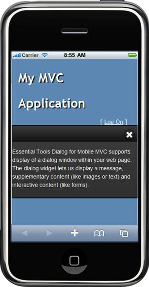

::: {style="DISPLAY: none"}
{#d2h_url_template} {#d2h_package_url style="WIDTH: 0px; DISPLAY: none; HEIGHT: 0px"}
:::

::::: {#nsbanner .d2h_main_nsbanner style="BORDER-BOTTOM: #999999 1px solid; POSITION: relative; PADDING-BOTTOM: 0px; BACKGROUND-COLOR: transparent; PADDING-LEFT: 0px; PADDING-RIGHT: 0px; DISPLAY: none; BORDER-TOP: #999999 1px solid; PADDING-TOP: 0px; LEFT: 0px"}
:::: {#TitleRow .d2h_main_titlerow style="PADDING-BOTTOM: 4px; BACKGROUND-COLOR: transparent; PADDING-LEFT: 22px; WIDTH: 100%; PADDING-RIGHT: 10px; DISPLAY: none; PADDING-TOP: 4px"}
::: {#ienav .d2h_main_ienav style="DISPLAY: none"}
{#D2HPrevious .D2HPreviousEnabled}  {#D2HNext .D2HNextEnabled}
:::
::::
:::::

:::: {#nstext .d2h_main_nstext style="PADDING-BOTTOM: 10px; BACKGROUND-COLOR: transparent; PADDING-LEFT: 22px; PADDING-RIGHT: 10px; HEIGHT: 100%; OVERFLOW: auto; PADDING-TOP: 5px" hasuserbackground="true" valign="bottom"}
::: {#d2h_breadcrumbs .d2h_breadcrumbs}
[Essential Studio User Guide Documentation](ms-xhelp:///?Id=12457748-09e3-4d74-a240-8e049cedf030){.d2h_breadcrumbsNormal} [ \> ]{.d2h_breadcrumbsLinkSeparator} [User Interface Edition](ms-xhelp:///?Id=c29296b7-531c-413b-a0ec-488ca1f7f669){.d2h_breadcrumbsNormal} [ \> ]{.d2h_breadcrumbsLinkSeparator} [Essential Mobile MVC](ms-xhelp:///?Id=74df42e3-5434-4590-9be6-3ae2f911cbbc){.d2h_breadcrumbsNormal} [ \> ]{.d2h_breadcrumbsLinkSeparator} [Essential Tools]{.d2h_breadcrumbsContentsOnly} [ \> ]{.d2h_breadcrumbsLinkSeparator} [Controls and Components](ms-xhelp:///?Id=143afae1-3f83-4d32-9bfa-92ed7022a696){.d2h_breadcrumbsNormal} [ \> ]{.d2h_breadcrumbsLinkSeparator} [Dialog](ms-xhelp:///?Id=90d3481b-3786-41e1-bec0-03e5f0fbd388){.d2h_breadcrumbsNormal}
:::

### Adding Mobile Dialog to the MVC application {#adding-mobile-dialog-to-the-mvc-application style="tab-stops: 0pt"}

Refer to the [Getting Started]{.UGHyperlink} section to know the pre-requisites before stepping in to add a Mobile dialog control to the MVC application.

 

Using Builder

The following steps explain the addition of a dialog to an application using Builder.

1.   In **View**, invoke the dialog helper with the Control ID as the first argument followed by the **Template** method with the dialog contents as argument.

[]{style="FONT-FAMILY: 'Calibri','sans-serif'"} 

+------------------------------------------------------------------------------------------------------------------------------------------------------------------------+
| **[\[ASPX\]]{style="FONT-FAMILY: 'Courier New'"}**                                                                                                                     |
|                                                                                                                                                                        |
| **[]{style="FONT-FAMILY: 'Courier New'"}**                                                                                                                             |
|                                                                                                                                                                        |
| [    [\<%]{style="BACKGROUND: yellow"} {]{style="FONT-FAMILY: 'Courier New'"}                                                                                          |
|                                                                                                                                                                        |
| [           Html.MobSyncfusion().Dialog([\"myDialog\"]{style="COLOR: #a31515"})]{style="FONT-FAMILY: 'Courier New'"}                                                   |
|                                                                                                                                                                        |
| [                  ]{style="FONT-FAMILY: 'Courier New'"}                                                                                                               |
|                                                                                                                                                                        |
| [                  .Template(() =\>]{style="FONT-FAMILY: 'Courier New'"}                                                                                               |
|                                                                                                                                                                        |
| [                  {[%\>]{style="BACKGROUND: yellow"}[\<]{style="COLOR: blue"}[p]{style="COLOR: maroon"}[\>]{style="COLOR: blue"}]{style="FONT-FAMILY: 'Courier New'"} |
|                                                                                                                                                                        |
| [        This is the Syncfusion Dialog control with the \'x\' icon. The dialog window can be]{style="FONT-FAMILY: 'Courier New'"}                                      |
|                                                                                                                                                                        |
| [        moved, resized and closed.[\</]{style="COLOR: blue"}[p]{style="COLOR: maroon"}[\>]{style="COLOR: blue"}]{style="FONT-FAMILY: 'Courier New'"}                  |
|                                                                                                                                                                        |
| []{style="FONT-FAMILY: 'Courier New'"}                                                                                                                                 |
|                                                                                                                                                                        |
| [    [\<%]{style="BACKGROUND: yellow"}}).Render();]{style="FONT-FAMILY: 'Courier New'"}                                                                                |
|                                                                                                                                                                        |
| [       }[%\>]{style="BACKGROUND: yellow"}]{style="FONT-FAMILY: 'Courier New'"}                                                                                        |
|                                                                                                                                                                        |
| []{style="FONT-FAMILY: 'Courier New'; BACKGROUND: yellow"}                                                                                                             |
+------------------------------------------------------------------------------------------------------------------------------------------------------------------------+

 

+-------------------------------------------------------------------------------------------------------------------------------------------------------+
| **[\[Razor\]]{style="FONT-FAMILY: 'Courier New'"}**                                                                                                   |
|                                                                                                                                                       |
| **[]{style="FONT-FAMILY: 'Courier New'"}**                                                                                                            |
|                                                                                                                                                       |
| [   [\@{]{style="BACKGROUND: yellow"} Html.MobSyncfusion().Dialog([\"myDialog\"]{style="COLOR: #a31515"})]{style="FONT-FAMILY: 'Courier New'"}        |
|                                                                                                                                                       |
| [        .Template(]{style="FONT-FAMILY: 'Courier New'"}                                                                                              |
|                                                                                                                                                       |
| []{style="FONT-FAMILY: 'Courier New'"}                                                                                                                |
|                                                                                                                                                       |
| [    [@]{style="BACKGROUND: yellow"}[\<]{style="COLOR: blue"}[p]{style="COLOR: maroon"}[\>]{style="COLOR: blue"}]{style="FONT-FAMILY: 'Courier New'"} |
|                                                                                                                                                       |
| [        This is the Syncfusion Dialog control with the \'x\' icon. The dialog window can be]{style="FONT-FAMILY: 'Courier New'"}                     |
|                                                                                                                                                       |
| [        moved, resized and closed.[\</]{style="COLOR: blue"}[p]{style="COLOR: maroon"}[\>]{style="COLOR: blue"}]{style="FONT-FAMILY: 'Courier New'"} |
|                                                                                                                                                       |
| [        ).Render();]{style="FONT-FAMILY: 'Courier New'"}                                                                                             |
|                                                                                                                                                       |
| [}]{style="FONT-FAMILY: 'Courier New'; BACKGROUND: yellow"}                                                                                           |
|                                                                                                                                                       |
| []{style="FONT-FAMILY: 'Courier New'"}                                                                                                                |
+-------------------------------------------------------------------------------------------------------------------------------------------------------+

 

2.   Build and run the application in emulator.

**[]{style="FONT-FAMILY: 'Calibri','sans-serif'; FONT-SIZE: 12pt"}**  

Using Properties Model

The following steps explain the addition of a dialog to an application using the Properties model:

1.   In the Controller, create an instance of the MobDialogModel, define the properties and pass the instance through **View Specific Data** to **View** as given below:**

[]{style="FONT-FAMILY: 'Calibri','sans-serif'"} 

+-------------------------------------------------------------------------------------------------------------------------------------------------------------------------+
| **[\[Controller\]]{style="FONT-FAMILY: 'Courier New'"}**                                                                                                                |
|                                                                                                                                                                         |
| **[]{style="FONT-FAMILY: 'Courier New'"}**                                                                                                                              |
|                                                                                                                                                                         |
| [        [public]{style="COLOR: blue"}[ActionResult]{style="COLOR: #2b91af"} Dialog()]{style="FONT-FAMILY: 'Courier New'"}                                              |
|                                                                                                                                                                         |
| [        {]{style="FONT-FAMILY: 'Courier New'"}                                                                                                                         |
|                                                                                                                                                                         |
| [            [//create an instance of MobDialogModel]{style="COLOR: green"}]{style="FONT-FAMILY: 'Courier New'"}                                                        |
|                                                                                                                                                                         |
| [            [MobDialogModel]{style="COLOR: #2b91af"} model = [new]{style="COLOR: blue"}[MobDialogModel]{style="COLOR: #2b91af"}()]{style="FONT-FAMILY: 'Courier New'"} |
|                                                                                                                                                                         |
| [            {]{style="FONT-FAMILY: 'Courier New'"}                                                                                                                     |
|                                                                                                                                                                         |
| [                AutoFormat=[MobSkins]{style="COLOR: #2b91af"}.DarkNight]{style="FONT-FAMILY: 'Courier New'"}                                                           |
|                                                                                                                                                                         |
| [            };]{style="FONT-FAMILY: 'Courier New'"}                                                                                                                    |
|                                                                                                                                                                         |
| [            ViewData\[[\"myDialog\"]{style="COLOR: #a31515"}\] = model;]{style="FONT-FAMILY: 'Courier New'"}                                                           |
|                                                                                                                                                                         |
| [            [return]{style="COLOR: blue"} View();]{style="FONT-FAMILY: 'Courier New'"}                                                                                 |
|                                                                                                                                                                         |
| [        }]{style="FONT-FAMILY: 'Courier New'"}                                                                                                                         |
|                                                                                                                                                                         |
| []{style="FONT-FAMILY: 'Courier New'"}                                                                                                                                  |
+-------------------------------------------------------------------------------------------------------------------------------------------------------------------------+

[]{style="FONT-FAMILY: Consolas; FONT-SIZE: 9.5pt"} 

2.   In **View**, create the dialog contents and invoke the dialog helper with the **View Data** key as the first argument.

[]{style="FONT-FAMILY: 'Calibri','sans-serif'"} 

+--------------------------------------------------------------------------------------------------------------------------------------------------------------------------------------------------------------------------------------------------------------------------------------------------------------------------------------------------------------------------+
| **[\[ASPX\]]{style="FONT-FAMILY: 'Courier New'"}**                                                                                                                                                                                                                                                                                                                       |
|                                                                                                                                                                                                                                                                                                                                                                          |
| **[]{style="FONT-FAMILY: 'Courier New'"}**                                                                                                                                                                                                                                                                                                                               |
|                                                                                                                                                                                                                                                                                                                                                                          |
| [    [\<%]{style="BACKGROUND: yellow"}{]{style="FONT-FAMILY: 'Courier New'"}                                                                                                                                                                                                                                                                                             |
|                                                                                                                                                                                                                                                                                                                                                                          |
| [           Html.MobSyncfusion().Dialog([\"myDialog\"]{style="COLOR: #a31515"})]{style="FONT-FAMILY: 'Courier New'"}                                                                                                                                                                                                                                                     |
|                                                                                                                                                                                                                                                                                                                                                                          |
| [               .Template(() =\>]{style="FONT-FAMILY: 'Courier New'"}                                                                                                                                                                                                                                                                                                    |
|                                                                                                                                                                                                                                                                                                                                                                          |
| [               {[%\>]{style="BACKGROUND: yellow"}[ \<]{style="COLOR: blue"}[p]{style="COLOR: maroon"}[\>]{style="COLOR: blue"}]{style="FONT-FAMILY: 'Courier New'"}                                                                                                                                                                                                     |
|                                                                                                                                                                                                                                                                                                                                                                          |
| [        Essential Tools Mobile Dialog for MVC supports display of a dialog window within                your web page. The dialog widget lets us display a message, supplementary content (like images or text) and interactive content (like forms).[\</]{style="COLOR: blue"}[p]{style="COLOR: maroon"}[\>]{style="COLOR: blue"}]{style="FONT-FAMILY: 'Courier New'"} |
|                                                                                                                                                                                                                                                                                                                                                                          |
| [    [\<%]{style="BACKGROUND: yellow"}})]{style="FONT-FAMILY: 'Courier New'"}                                                                                                                                                                                                                                                                                            |
|                                                                                                                                                                                                                                                                                                                                                                          |
| [       .Render();]{style="FONT-FAMILY: 'Courier New'"}                                                                                                                                                                                                                                                                                                                  |
|                                                                                                                                                                                                                                                                                                                                                                          |
| [       }[%\>]{style="BACKGROUND: yellow"}]{style="FONT-FAMILY: 'Courier New'"}                                                                                                                                                                                                                                                                                          |
|                                                                                                                                                                                                                                                                                                                                                                          |
| []{style="FONT-FAMILY: 'Courier New'; BACKGROUND: yellow"}                                                                                                                                                                                                                                                                                                               |
+--------------------------------------------------------------------------------------------------------------------------------------------------------------------------------------------------------------------------------------------------------------------------------------------------------------------------------------------------------------------------+

[]{style="BACKGROUND: yellow"} 

+-----------------------------------------------------------------------------------------------------------------------------------------------------------------------------------------------------------------------------------------------------------------------------------------------------------------------------------------------------------+
| **[\[Razor\]]{style="FONT-FAMILY: 'Courier New'"}**                                                                                                                                                                                                                                                                                                       |
|                                                                                                                                                                                                                                                                                                                                                           |
| **[]{style="FONT-FAMILY: 'Courier New'"}**                                                                                                                                                                                                                                                                                                                |
|                                                                                                                                                                                                                                                                                                                                                           |
| [    [\@{]{style="BACKGROUND: yellow"}]{style="FONT-FAMILY: 'Courier New'"}                                                                                                                                                                                                                                                                               |
|                                                                                                                                                                                                                                                                                                                                                           |
| [        Html.MobSyncfusion().Dialog([\"myDialog\"]{style="COLOR: #a31515"})]{style="FONT-FAMILY: 'Courier New'"}                                                                                                                                                                                                                                         |
|                                                                                                                                                                                                                                                                                                                                                           |
| [            .Template[ \<]{style="COLOR: blue"}[p]{style="COLOR: maroon"}[\>]{style="COLOR: blue"}]{style="FONT-FAMILY: 'Courier New'"}                                                                                                                                                                                                                  |
|                                                                                                                                                                                                                                                                                                                                                           |
| [        Essential Tools Mobile Dialog for MVC supports display of a dialog window within your web page. The dialog widget lets us display a message, supplementary content (like images or text) and interactive content (like forms).[\</]{style="COLOR: blue"}[p]{style="COLOR: maroon"}[\>]{style="COLOR: blue"}]{style="FONT-FAMILY: 'Courier New'"} |
|                                                                                                                                                                                                                                                                                                                                                           |
| [    )]{style="FONT-FAMILY: 'Courier New'"}                                                                                                                                                                                                                                                                                                               |
|                                                                                                                                                                                                                                                                                                                                                           |
| [.Render();[}]{style="BACKGROUND: yellow"}]{style="FONT-FAMILY: 'Courier New'"} []{style="FONT-FAMILY: 'Courier New'; BACKGROUND: yellow"}                                                                                                                                                                                                                |
+-----------------------------------------------------------------------------------------------------------------------------------------------------------------------------------------------------------------------------------------------------------------------------------------------------------------------------------------------------------+

[]{style="BACKGROUND: yellow"} 

3.   Build and run the application in emulator.

 

The output is shown in the following screenshot:

{border="0"}

Figure 40: Dialog

[]{style="FONT-FAMILY: 'Calibri','sans-serif'; COLOR: black"} 

A sample that demonstrates a basic Dialog control can be downloaded from the following links.

[]{style="FONT-FAMILY: 'Calibri','sans-serif'; COLOR: black"} 

[[Dialog --ASPX Application]{.UGHyperlink}](http://files2.syncfusion.com/Support/ToolsMobileMVC/9.4.0.62/dialog/ASPXApplication.zip) []{.UGHyperlink}

[[Dialog -- Razor Application]{.UGHyperlink}](http://files2.syncfusion.com/Support/ToolsMobileMVC/9.4.0.62/dialog/RazorApplication.zip) []{.UGHyperlink}

[]{#related-topics}
::::
