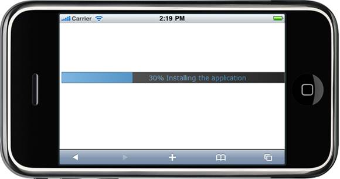

::: {style="DISPLAY: none"}
{#d2h_url_template} {#d2h_package_url style="WIDTH: 0px; DISPLAY: none; HEIGHT: 0px"}
:::

::::: {#nsbanner .d2h_main_nsbanner style="BORDER-BOTTOM: #999999 1px solid; POSITION: relative; PADDING-BOTTOM: 0px; BACKGROUND-COLOR: transparent; PADDING-LEFT: 0px; PADDING-RIGHT: 0px; DISPLAY: none; BORDER-TOP: #999999 1px solid; PADDING-TOP: 0px; LEFT: 0px"}
:::: {#TitleRow .d2h_main_titlerow style="PADDING-BOTTOM: 4px; BACKGROUND-COLOR: transparent; PADDING-LEFT: 22px; WIDTH: 100%; PADDING-RIGHT: 10px; DISPLAY: none; PADDING-TOP: 4px"}
::: {#ienav .d2h_main_ienav style="DISPLAY: none"}
{#D2HPrevious .D2HPreviousEnabled}  {#D2HNext .D2HNextEnabled}
:::
::::
:::::

:::: {#nstext .d2h_main_nstext style="PADDING-BOTTOM: 10px; BACKGROUND-COLOR: transparent; PADDING-LEFT: 22px; PADDING-RIGHT: 10px; HEIGHT: 100%; OVERFLOW: auto; PADDING-TOP: 5px" hasuserbackground="true" valign="bottom"}
::: {#d2h_breadcrumbs .d2h_breadcrumbs}
[Essential Studio User Guide Documentation](ms-xhelp:///?Id=12457748-09e3-4d74-a240-8e049cedf030){.d2h_breadcrumbsNormal} [ \> ]{.d2h_breadcrumbsLinkSeparator} [User Interface Edition](ms-xhelp:///?Id=c29296b7-531c-413b-a0ec-488ca1f7f669){.d2h_breadcrumbsNormal} [ \> ]{.d2h_breadcrumbsLinkSeparator} [Essential Mobile MVC](ms-xhelp:///?Id=74df42e3-5434-4590-9be6-3ae2f911cbbc){.d2h_breadcrumbsNormal} [ \> ]{.d2h_breadcrumbsLinkSeparator} [Essential Tools]{.d2h_breadcrumbsContentsOnly} [ \> ]{.d2h_breadcrumbsLinkSeparator} [Controls and Components](ms-xhelp:///?Id=143afae1-3f83-4d32-9bfa-92ed7022a696){.d2h_breadcrumbsNormal} [ \> ]{.d2h_breadcrumbsLinkSeparator} [Progress Bar](ms-xhelp:///?Id=e8262db4-adca-4fab-96e1-d31f62c8869a){.d2h_breadcrumbsNormal}
:::

### Adding Mobile ProgressBar control to MVC Application {#adding-mobile-progressbar-control-to-mvc-application style="LINE-HEIGHT: 115%; MARGIN: 10pt 0pt 0pt; tab-stops: 0pt"}

 

[In the]{style="COLOR: black"} [ ]{style="COLOR: black"} [Getting Started]{style="COLOR: windowtext; TEXT-DECORATION: none; text-underline: none"} [ ]{style="COLOR: black"} [section, we discussed how to]{style="COLOR: black"} [ ]{style="COLOR: black"} create an MVC application  [and]{style="COLOR: black"} [ ]{style="COLOR: black"} [add Tools package to the application]{.UGHyperlink} [. This section guides you to add the ProgressBar to an application.]{style="COLOR: black"}

Using Builder

[The following steps guide you to add the Mobile ProgressBar to an MVCapplication through Builder:]{style="BACKGROUND: white"}

1.   In **View**, [invoke the ProgressBar helper with the **ProgressBarid** as the first argument.]{style="BACKGROUND: white; COLOR: black"}[ ]{style="FONT-FAMILY: 'Times New Roman','serif'; FONT-SIZE: 12pt"}

+---------------------------------------------------------------------------------------------------------------------------------------------------------------------------------+
| **[\[ASPX\]]{style="FONT-FAMILY: 'Courier New'"}**                                                                                                                              |
|                                                                                                                                                                                 |
| [\<%]{style="FONT-FAMILY: 'Courier New'; BACKGROUND: yellow"} [Html.MobSyncfusion().ProgressBar([\"progressBar\"]{style="COLOR: #a31515"})]{style="FONT-FAMILY: 'Courier New'"} |
|                                                                                                                                                                                 |
| [       .Value(30)]{style="FONT-FAMILY: 'Courier New'"}                                                                                                                         |
|                                                                                                                                                                                 |
| [       .AllowCustomText(true)]{style="FONT-FAMILY: 'Courier New'"}                                                                                                             |
|                                                                                                                                                                                 |
| [       .ClientSideOnCustomTextRendering([\"onCustomText\"]{style="COLOR: #a31515"})]{style="FONT-FAMILY: 'Courier New'"}                                                       |
|                                                                                                                                                                                 |
| [      .Render();]{style="FONT-FAMILY: 'Courier New'"}                                                                                                                          |
|                                                                                                                                                                                 |
| [    [%\>]{style="BACKGROUND: yellow"}]{style="FONT-FAMILY: 'Courier New'"}                                                                                                     |
+---------------------------------------------------------------------------------------------------------------------------------------------------------------------------------+

[]{style="COLOR: black"} 

+---------------------------------------------------------------------------------------------------------------------------------------------------------------+
| **[\[Razor\]]{style="FONT-FAMILY: 'Courier New'"}**                                                                                                           |
|                                                                                                                                                               |
| [ [\@{]{style="BACKGROUND: yellow"}]{style="FONT-FAMILY: 'Courier New'; COLOR: black"}                                                                        |
|                                                                                                                                                               |
| [      ]{style="COLOR: black"} [Html.MobSyncfusion().ProgressBar([\"progressBar\"]{style="COLOR: #a31515"})]{style="FONT-FAMILY: Consolas; FONT-SIZE: 9.5pt"} |
|                                                                                                                                                               |
| [       .Value(30)]{style="FONT-FAMILY: Consolas; FONT-SIZE: 9.5pt"}                                                                                          |
|                                                                                                                                                               |
| [       .AllowCustomText(true)]{style="FONT-FAMILY: Consolas; FONT-SIZE: 9.5pt"}                                                                              |
|                                                                                                                                                               |
| [       .ClientSideOnCustomTextRendering([\"onCustomText\"]{style="COLOR: #a31515"})]{style="FONT-FAMILY: Consolas; FONT-SIZE: 9.5pt"}                        |
|                                                                                                                                                               |
| [      .Render();]{style="FONT-FAMILY: Consolas; FONT-SIZE: 9.5pt"}                                                                                           |
|                                                                                                                                                               |
| [ }]{style="FONT-FAMILY: 'Courier New'; COLOR: black"} []{style="COLOR: black"}                                                                               |
+---------------------------------------------------------------------------------------------------------------------------------------------------------------+

[]{style="COLOR: black"} 

[5.  ]{style="COLOR: black"} [Define the customtext handler in view.]{style="COLOR: black"}

[]{style="COLOR: black"} 

+---------------------------------------------------------------------------------------------------------------------------------------------------------------------------------------------------------------------------------------------------------------------------+
| []{style="FONT-FAMILY: Consolas; COLOR: blue; FONT-SIZE: 9.5pt"}                                                                                                                                                                                                          |
|                                                                                                                                                                                                                                                                           |
| **[\[Javascript\]]{style="FONT-FAMILY: 'Courier New'"}** []{style="FONT-FAMILY: Consolas; COLOR: blue; FONT-SIZE: 9.5pt"}                                                                                                                                                 |
|                                                                                                                                                                                                                                                                           |
| []{style="FONT-FAMILY: Consolas; COLOR: blue; FONT-SIZE: 9.5pt"}                                                                                                                                                                                                          |
|                                                                                                                                                                                                                                                                           |
| [\<]{style="FONT-FAMILY: Consolas; COLOR: blue; FONT-SIZE: 9.5pt"} [script]{style="FONT-FAMILY: Consolas; COLOR: maroon; FONT-SIZE: 9.5pt"} [ [type]{style="COLOR: red"} [=\"text/javascript\"\>]{style="COLOR: blue"} ]{style="FONT-FAMILY: Consolas; FONT-SIZE: 9.5pt"} |
|                                                                                                                                                                                                                                                                           |
| [        [function]{style="COLOR: blue"} onCustomText(progressBar, currentValue) {]{style="FONT-FAMILY: Consolas; FONT-SIZE: 9.5pt"}                                                                                                                                      |
|                                                                                                                                                                                                                                                                           |
| [            [var]{style="COLOR: blue"} context = currentValue.Context;]{style="FONT-FAMILY: Consolas; FONT-SIZE: 9.5pt"}                                                                                                                                                 |
|                                                                                                                                                                                                                                                                           |
| [            [var]{style="COLOR: blue"} text = currentValue.Text;]{style="FONT-FAMILY: Consolas; FONT-SIZE: 9.5pt"}                                                                                                                                                       |
|                                                                                                                                                                                                                                                                           |
| [            [var]{style="COLOR: blue"} textwidth = 131;]{style="FONT-FAMILY: Consolas; FONT-SIZE: 9.5pt"}                                                                                                                                                                |
|                                                                                                                                                                                                                                                                           |
| [            [var]{style="COLOR: blue"} ang = 270;]{style="FONT-FAMILY: Consolas; FONT-SIZE: 9.5pt"}                                                                                                                                                                      |
|                                                                                                                                                                                                                                                                           |
| [            [var]{style="COLOR: blue"} fontsize = 22, progressOrientation = [null]{style="COLOR: blue"} ;]{style="FONT-FAMILY: Consolas; FONT-SIZE: 9.5pt"}                                                                                                              |
|                                                                                                                                                                                                                                                                           |
| [            [if]{style="COLOR: blue"} (progressOrientation == [null]{style="COLOR: blue"})]{style="FONT-FAMILY: Consolas; FONT-SIZE: 9.5pt"}                                                                                                                             |
|                                                                                                                                                                                                                                                                           |
| [                progressOrientation = [\"horizontal\"]{style="COLOR: maroon"};]{style="FONT-FAMILY: Consolas; FONT-SIZE: 9.5pt"}                                                                                                                                         |
|                                                                                                                                                                                                                                                                           |
| [            context.save();]{style="FONT-FAMILY: Consolas; FONT-SIZE: 9.5pt"}                                                                                                                                                                                            |
|                                                                                                                                                                                                                                                                           |
| [            [if]{style="COLOR: blue"} (progressOrientation == [\"horizontal\"]{style="COLOR: maroon"}) {]{style="FONT-FAMILY: Consolas; FONT-SIZE: 9.5pt"}                                                                                                               |
|                                                                                                                                                                                                                                                                           |
| [                [var]{style="COLOR: blue"} textx = currentValue.OffsetX + currentValue.Width / 2 - textwidth / 2;]{style="FONT-FAMILY: Consolas; FONT-SIZE: 9.5pt"}                                                                                                      |
|                                                                                                                                                                                                                                                                           |
| [                context.fillText(text, textx, currentValue.Height / 2 + currentValue.OffsetY + currentValue.Radius / 2);]{style="FONT-FAMILY: Consolas; FONT-SIZE: 9.5pt"}                                                                                               |
|                                                                                                                                                                                                                                                                           |
| [            }]{style="FONT-FAMILY: Consolas; FONT-SIZE: 9.5pt"}                                                                                                                                                                                                          |
|                                                                                                                                                                                                                                                                           |
| [            [else]{style="COLOR: blue"} {]{style="FONT-FAMILY: Consolas; FONT-SIZE: 9.5pt"}                                                                                                                                                                              |
|                                                                                                                                                                                                                                                                           |
| [                [var]{style="COLOR: blue"} textx = currentValue.Width / 2 - currentValue.Radius / 2 + currentValue.OffsetX;]{style="FONT-FAMILY: Consolas; FONT-SIZE: 9.5pt"}                                                                                            |
|                                                                                                                                                                                                                                                                           |
| [                context.fillText(text, fontsize, textx, currentValue.OffsetX + currentValue.Height / 2, [\"\"]{style="COLOR: maroon"} + ang);]{style="FONT-FAMILY: Consolas; FONT-SIZE: 9.5pt"}                                                                          |
|                                                                                                                                                                                                                                                                           |
| [            }]{style="FONT-FAMILY: Consolas; FONT-SIZE: 9.5pt"}                                                                                                                                                                                                          |
|                                                                                                                                                                                                                                                                           |
| [            context.restore();]{style="FONT-FAMILY: Consolas; FONT-SIZE: 9.5pt"}                                                                                                                                                                                         |
|                                                                                                                                                                                                                                                                           |
| [        }]{style="FONT-FAMILY: Consolas; FONT-SIZE: 9.5pt"}                                                                                                                                                                                                              |
|                                                                                                                                                                                                                                                                           |
| [    [\</]{style="COLOR: blue"}[script]{style="COLOR: maroon"}[\>]{style="COLOR: blue"}]{style="FONT-FAMILY: Consolas; FONT-SIZE: 9.5pt"}                                                                                                                                 |
|                                                                                                                                                                                                                                                                           |
| []{style="COLOR: black"}                                                                                                                                                                                                                                                  |
+---------------------------------------------------------------------------------------------------------------------------------------------------------------------------------------------------------------------------------------------------------------------------+

[]{style="COLOR: black"} 

6.   Build and run the application.

 

 

{border="0"}

Figure 84: Progressbar

A sample demonstrating a progress bar control can be downloaded from the following link:

[ [[Progressbar ASPX Application]{style="COLOR: blue"}](http://files2.syncfusion.com/Support/ToolsMobileMVC/9.4.0.62/Progressbar/ASPXApplication.zip) ]{.UGHyperlink}

[ []{style="TEXT-DECORATION: none"} ]{.UGHyperlink} 

[ [[Progressbar Razor Application]{style="COLOR: blue"}](http://files2.syncfusion.com/Support/ToolsMobileMVC/9.4.0.62/Progressbar/RazorApplication.zip) ]{.UGHyperlink}

 

[]{#related-topics}
::::
