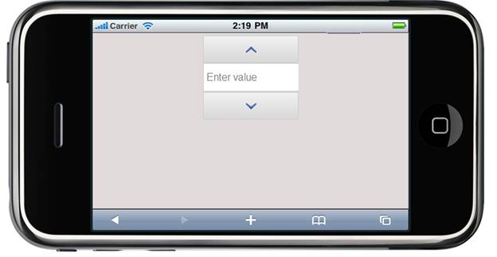

::: {style="DISPLAY: none"}
{#d2h_url_template} {#d2h_package_url style="WIDTH: 0px; DISPLAY: none; HEIGHT: 0px"}
:::

::::: {#nsbanner .d2h_main_nsbanner style="BORDER-BOTTOM: #999999 1px solid; POSITION: relative; PADDING-BOTTOM: 0px; BACKGROUND-COLOR: transparent; PADDING-LEFT: 0px; PADDING-RIGHT: 0px; DISPLAY: none; BORDER-TOP: #999999 1px solid; PADDING-TOP: 0px; LEFT: 0px"}
:::: {#TitleRow .d2h_main_titlerow style="PADDING-BOTTOM: 4px; BACKGROUND-COLOR: transparent; PADDING-LEFT: 22px; WIDTH: 100%; PADDING-RIGHT: 10px; DISPLAY: none; PADDING-TOP: 4px"}
::: {#ienav .d2h_main_ienav style="DISPLAY: none"}
{#D2HPrevious .D2HPreviousEnabled}  {#D2HNext .D2HNextEnabled}
:::
::::
:::::

::::: {#nstext .d2h_main_nstext style="PADDING-BOTTOM: 10px; BACKGROUND-COLOR: transparent; PADDING-LEFT: 22px; PADDING-RIGHT: 10px; HEIGHT: 100%; OVERFLOW: auto; PADDING-TOP: 5px" hasuserbackground="true" valign="bottom"}
::: {#d2h_breadcrumbs .d2h_breadcrumbs}
[Essential Studio User Guide Documentation](ms-xhelp:///?Id=12457748-09e3-4d74-a240-8e049cedf030){.d2h_breadcrumbsNormal} [ \> ]{.d2h_breadcrumbsLinkSeparator} [User Interface Edition](ms-xhelp:///?Id=c29296b7-531c-413b-a0ec-488ca1f7f669){.d2h_breadcrumbsNormal} [ \> ]{.d2h_breadcrumbsLinkSeparator} [Essential Mobile MVC](ms-xhelp:///?Id=74df42e3-5434-4590-9be6-3ae2f911cbbc){.d2h_breadcrumbsNormal} [ \> ]{.d2h_breadcrumbsLinkSeparator} [Essential Tools]{.d2h_breadcrumbsContentsOnly} [ \> ]{.d2h_breadcrumbsLinkSeparator} [Controls and Components](ms-xhelp:///?Id=143afae1-3f83-4d32-9bfa-92ed7022a696){.d2h_breadcrumbsNormal} [ \> ]{.d2h_breadcrumbsLinkSeparator} [Numeric Textbox](ms-xhelp:///?Id=ba89029d-e136-415f-8140-12e371d7af40){.d2h_breadcrumbsNormal}
:::

### Adding Numeric textbox to the Mobile MVC application {#adding-numeric-textbox-to-the-mobile-mvc-application style="tab-stops: 0pt"}

In the [Getting Started]{.UGHyperlink} section, we discussed how to [create a Mobile MVC application]{.UGHyperlink} and how to [add Tools package to an application]{.UGHyperlink}. This section guides you to add Numeric textbox control to an application.

To add the Numeric textbox control to an application:

 

1.   In View, invoke the Numeric textbox helper with the numeric ID as the first argument.

 

+-------------------------------------------------------------------------------------------------------------------------------------------------------------------------------------------------------------------------------------------------------------------------------------------------------------------------------------------------------+
| **\[ASPX\]**                                                                                                                                                                                                                                                                                                                                          |
|                                                                                                                                                                                                                                                                                                                                                       |
| [  ]{style="FONT-FAMILY: Consolas; FONT-SIZE: 9.5pt"} [\<%]{style="FONT-FAMILY: Consolas; BACKGROUND: yellow; FONT-SIZE: 9.5pt"} [{                                ]{style="FONT-FAMILY: Consolas; FONT-SIZE: 9.5pt"}                                                                                                                                 |
|                                                                                                                                                                                                                                                                                                                                                       |
| [    Html.MobSyncfusion().NumericTextbox([\"WebsiteNumeric\")]{style="COLOR: #a31515"}.WaterMarkText([\"Enter value\"]{style="COLOR: #a31515"}).Render();]{style="FONT-FAMILY: Consolas; FONT-SIZE: 9.5pt"}                                                                                                                                           |
|                                                                                                                                                                                                                                                                                                                                                       |
| [       }[%\>]{style="BACKGROUND: yellow"}]{style="FONT-FAMILY: Consolas; FONT-SIZE: 9.5pt"}                                                                                                                                                                                                                                                          |
|                                                                                                                                                                                                                                                                                                                                                       |
| ** \[Razor\]**                                                                                                                                                                                                                                                                                                                                        |
|                                                                                                                                                                                                                                                                                                                                                       |
| [    ]{style="FONT-FAMILY: Consolas; FONT-SIZE: 9.5pt"} [\@{]{style="FONT-FAMILY: Consolas; BACKGROUND: yellow; FONT-SIZE: 9.5pt"} [           Html.MobSyncfusion().NumericTextbox([\"WebsiteNumeric\"]{style="COLOR: #a31515"}).WaterMarkText([\"Enter value\"]{style="COLOR: #a31515"}).Render();]{style="FONT-FAMILY: Consolas; FONT-SIZE: 9.5pt"} |
|                                                                                                                                                                                                                                                                                                                                                       |
| [       [}]{style="BACKGROUND: yellow"}]{style="FONT-FAMILY: Consolas; FONT-SIZE: 9.5pt"} []{style="FONT-FAMILY: Consolas; BACKGROUND: yellow; FONT-SIZE: 9.5pt"}                                                                                                                                                                                     |
+-------------------------------------------------------------------------------------------------------------------------------------------------------------------------------------------------------------------------------------------------------------------------------------------------------------------------------------------------------+

 

2.   Run the application.

 

The output is shown in the following screenshot:

{border="0"}

Figure 232: Numeric textbox

 

A sample demonstration about the Numeric textbox control can be downloaded from the following link:

[]{style="FONT-FAMILY: 'Calibri','sans-serif'; COLOR: black"} 

[[Numeric - ASPX Application]{.UGHyperlink}](http://files2.syncfusion.com/Support/ToolsMobileMVC/10.1.0.43/Numeric/ASPX_Application.zip) []{.UGHyperlink}

[[Numeric - Razor Application]{.UGHyperlink}](http://files2.syncfusion.com/Support/ToolsMobileMVC/10.1.0.43/Numeric/Razor_Application.zip)

 

 

::: {style="BORDER-BOTTOM: windowtext 1pt solid; BORDER-LEFT: medium none; PADDING-BOTTOM: 1pt; MARGIN-TOP: 9pt; PADDING-LEFT: 0pt; PADDING-RIGHT: 0pt; MARGIN-BOTTOM: 9pt; BORDER-TOP: windowtext 1pt solid; BORDER-RIGHT: medium none; PADDING-TOP: 1pt"}
{border="0"}Note: The version number for the assemblies has been set to 10.1.0.43  in the Web.config file of the attached sample. Change the version number to the appropriate version in the Web-2008.config or Web-2010.config files (available in root directory) and those will automatically be updated in the Web.config file.
:::

[]{#related-topics}
:::::
