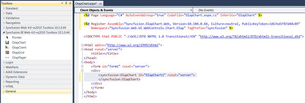
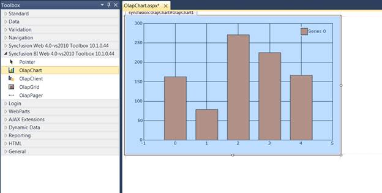
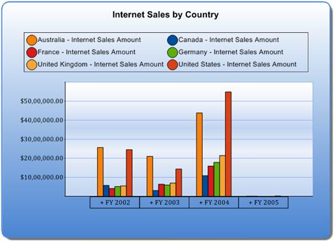

::: {style="DISPLAY: none"}
{#d2h_url_template}{#d2h_package_url style="WIDTH: 0px; DISPLAY: none; HEIGHT: 0px"}
:::

::::: {#nsbanner .d2h_main_nsbanner style="BORDER-BOTTOM: #999999 1px solid; POSITION: relative; PADDING-BOTTOM: 0px; BACKGROUND-COLOR: transparent; PADDING-LEFT: 0px; PADDING-RIGHT: 0px; DISPLAY: none; BORDER-TOP: #999999 1px solid; PADDING-TOP: 0px; LEFT: 0px"}
:::: {#TitleRow .d2h_main_titlerow style="PADDING-BOTTOM: 4px; BACKGROUND-COLOR: transparent; PADDING-LEFT: 22px; WIDTH: 100%; PADDING-RIGHT: 10px; DISPLAY: none; PADDING-TOP: 4px"}
::: {#ienav .d2h_main_ienav style="DISPLAY: none"}
{#D2HPrevious .D2HPreviousEnabled}  {#D2HNext .D2HNextEnabled}
:::
::::
:::::

::::: {#nstext .d2h_main_nstext style="PADDING-BOTTOM: 10px; BACKGROUND-COLOR: transparent; PADDING-LEFT: 22px; PADDING-RIGHT: 10px; HEIGHT: 100%; OVERFLOW: auto; PADDING-TOP: 5px" hasuserbackground="true" valign="bottom"}
::: {#d2h_breadcrumbs .d2h_breadcrumbs}
[Essential Studio User Guide Documentation](ms-xhelp:///?Id=12457748-09e3-4d74-a240-8e049cedf030){.d2h_breadcrumbsNormal}[ \> ]{.d2h_breadcrumbsLinkSeparator}[Business Intelligence Edition](ms-xhelp:///?Id=fdf33dd8-62b2-47b9-ad7b-fc50e590bca5){.d2h_breadcrumbsNormal}[ \> ]{.d2h_breadcrumbsLinkSeparator}[Essential BI ASP.NET](ms-xhelp:///?Id=99c6694e-59c3-4c59-abb5-ce9ce9a948bc){.d2h_breadcrumbsNormal}[ \> ]{.d2h_breadcrumbsLinkSeparator}[Essential BI Chart]{.d2h_breadcrumbsContentsOnly}[ \> ]{.d2h_breadcrumbsLinkSeparator}[Getting Started](ms-xhelp:///?Id=0805e396-dbf2-432a-8c85-ab30e3bf5765){.d2h_breadcrumbsNormal}
:::

## Adding OLAP Chart Control to an Application {#adding-olap-chart-control-to-an-application style="tab-stops: 0pt"}

To create an OLAP Chart for web:

 

1.  Click[[ ]{style="COLOR: black"}]{.apple-converted-space}**Start**[**[ ]{style="COLOR: black"}**]{.apple-converted-space}**\>**[**[ ]{style="COLOR: black"}**]{.apple-converted-space}**All Programs**[**[ ]{style="COLOR: black"}**]{.apple-converted-space}**\>**[**[ ]{style="COLOR: black"}**]{.apple-converted-space}**Microsoft Visual Studio 2010.**

2.  Create a new[[ ]{style="COLOR: black"}]{.apple-converted-space}**ASP.NET Web Site.**

3.  [Drag the[ ]{.apple-converted-space}**OlapChart**[ ]{.apple-converted-space}control from the[ ]{.apple-converted-space}**Syncfusion BI Web Toolbox**[ ]{.apple-converted-space}onto the[ ]{.apple-converted-space}**Design**[ ]{.apple-converted-space}page.]{style="BACKGROUND: white; COLOR: black"}

{border="0"}

 

Figure 5: OLAP Chart control in Source Page

 

 

{border="0"}

 

Figure 6: OLAP Chart control in Design Page

[4.   Add the following namespaces in the code-behind:]{style="FONT-FAMILY: 'Arial','sans-serif'; COLOR: black; FONT-SIZE: 10pt"}

[·      ]{style="FONT-FAMILY: Symbol; COLOR: black; FONT-SIZE: 10pt"}[Syncfusion.Web.UI.WebControls.Chart.Olap]{style="FONT-FAMILY: 'Arial','sans-serif'; COLOR: black; FONT-SIZE: 10pt"}

[·      ]{style="FONT-FAMILY: Symbol; COLOR: black; FONT-SIZE: 10pt"}[Syncfusion.Olap.Manager]{style="FONT-FAMILY: 'Arial','sans-serif'; COLOR: black; FONT-SIZE: 10pt"}

[·      ]{style="FONT-FAMILY: Symbol; COLOR: black; FONT-SIZE: 10pt"}[Syncfusion.Olap.Reports]{style="FONT-FAMILY: 'Arial','sans-serif'; COLOR: black; FONT-SIZE: 10pt"}

[·      ]{style="FONT-FAMILY: Symbol; COLOR: black; FONT-SIZE: 10pt"}[Syncfusion.Olap.DataProvider]{style="FONT-FAMILY: 'Arial','sans-serif'; COLOR: black; FONT-SIZE: 10pt"}

[]{style="FONT-FAMILY: 'Arial','sans-serif'; COLOR: black; FONT-SIZE: 10pt"} 

[To bind the OlapChart control with cube data, initiate the]{style="BACKGROUND: white; COLOR: black"}[[ ]{style="BACKGROUND: white; COLOR: #4f4f4f"}]{.apple-converted-space}[**[OlapDataManager]{style="FONT-FAMILY: 'Arial','sans-serif'; BACKGROUND: white; COLOR: #1b75bb"}**](http://help.syncfusion.com/UG/Business%20Intelligence/OLAP%20Common/Common/default.htm#!documents/42olapdatamanager.htm)[[ ]{style="BACKGROUND: white; COLOR: #4f4f4f"}]{.apple-converted-space}[using the methods provided in the following link.]{style="BACKGROUND: white; COLOR: black"}[]{style="COLOR: black"}

[]{style="COLOR: black"} 

**[Methods for instantiating OlapDataManager]{style="COLOR: black"}**[]{style="COLOR: black"}

[2.   After instantiating the OlapDataManager*,[ ]{.apple-converted-space}*create an[ ]{.apple-converted-space}]{style="COLOR: black"}[[OlapReport]{style="COLOR: black"}](http://help.syncfusion.com/UG/Business%20Intelligence/OLAP%20Common/Common/default.htm#!documents/4311creatingtheolapr.htm)[[ ]{style="COLOR: black"}]{.apple-converted-space}[and add it to the OlapDataManager either[* *]{.apple-converted-space}through the[ ]{.apple-converted-space}**SetCurrentReport(OlapReport)**[ ]{.apple-converted-space}method or by the[ ]{.apple-converted-space}**CurrentReport**[ ]{.apple-converted-space}property.]{style="COLOR: black"}

[3.   Now the OlapReport[* *]{.apple-converted-space}is assigned to the OlapChart control's[** **]{.apple-converted-space}**OlapDataManager**[* *]{.apple-converted-space}and the[ ]{.apple-converted-space}**DataBind()**[ ]{.apple-converted-space}method is called to render the OLAP Chart with the current report information.]{style="COLOR: black"}

[]{style="COLOR: #4f4f4f"} 

[The OlapDataManager can be bound to the OlapChart using the following code:]{style="COLOR: black"}

 

+-----------------------------------------------------------------------------------------------------------------------------------------+
| []{#OLE_LINK2}[**[\[C#\]]{style="FONT-FAMILY: 'Courier New'"}**]{#OLE_LINK1}                                                            |
|                                                                                                                                         |
| [DataManager.SetCurrentReport([this]{style="COLOR: blue"}.CreateReport());]{style="FONT-FAMILY: 'Courier New'"}                         |
|                                                                                                                                         |
| [this]{style="FONT-FAMILY: 'Courier New'; COLOR: blue"}[.olapChart1.OlapDataManager = DataManager;]{style="FONT-FAMILY: 'Courier New'"} |
|                                                                                                                                         |
| [this]{style="FONT-FAMILY: 'Courier New'; COLOR: blue"}[.olapChart1.DataBind();]{style="FONT-FAMILY: 'Courier New'"}                    |
+-----------------------------------------------------------------------------------------------------------------------------------------+

 

+--------------------------------------------------------------------------------------------------------------------------------------+
| **[\[VB\]]{style="FONT-FAMILY: 'Courier New'"}**                                                                                     |
|                                                                                                                                      |
| [DataManager.SetCurrentReport([Me]{style="COLOR: blue"}.CreateReport())]{style="FONT-FAMILY: 'Courier New'"}                         |
|                                                                                                                                      |
| [Me]{style="FONT-FAMILY: 'Courier New'; COLOR: blue"}[.olapChart1.OlapDataManager = DataManager]{style="FONT-FAMILY: 'Courier New'"} |
|                                                                                                                                      |
| [Me]{style="FONT-FAMILY: 'Courier New'; COLOR: blue"}[.olapChart1.DataBind()]{style="FONT-FAMILY: 'Courier New'"}                    |
+--------------------------------------------------------------------------------------------------------------------------------------+

[]{style="FONT-FAMILY: 'Segoe UI','sans-serif'; BACKGROUND: white; COLOR: #4f4f4f"} 

[Also,]{style="BACKGROUND: white; COLOR: black"}[[ ]{style="BACKGROUND: white; COLOR: #4f4f4f"}]{.apple-converted-space}[[click here]{style="FONT-FAMILY: 'Arial','sans-serif'; BACKGROUND: white; COLOR: #1b75bb"}](http://help.syncfusion.com/UG/Business%20Intelligence/OLAP%20Common/Common/default.htm#!documents/43olapreport.htm)[[ ]{style="BACKGROUND: white; COLOR: #4f4f4f"}]{.apple-converted-space}[for more sample reports.]{style="BACKGROUND: white; COLOR: black"}[ ]{style="BACKGROUND: white; COLOR: #4f4f4f"}OLAP Chart control uses HttpHandler by default to procure the images of chart, label and legend each time. Therefore, it's required to include the handler in the httphandlers section of web.config file.

 

+----------------------------------------------------------------------------------------------------------------------------------------------------------------------------------------------------------------------------------------------------------------------+
| **[\[Web.Config\]]{style="FONT-FAMILY: 'Courier New'; COLOR: black"}**                                                                                                                                                                                               |
|                                                                                                                                                                                                                                                                      |
| [\<httpHandlers\>]{style="FONT-FAMILY: 'Courier New'; COLOR: blue"}                                                                                                                                                                                                  |
|                                                                                                                                                                                                                                                                      |
| [      \.....]{style="FONT-FAMILY: 'Courier New'; COLOR: blue"}                                                                                                                                                                                                      |
|                                                                                                                                                                                                                                                                      |
| [      \<add path=\"syncfusion_generate.ashx\" verb=\"\*\" type=\"Syncfusion.Web.UI.WebControls.Chart.ChartWebHandler,Syncfusion.Chart.Web, Version=x.x.x.x, Culture=neutral, PublicKeyToken=3d67ed1f87d44c89\"/\>]{style="FONT-FAMILY: 'Courier New'; COLOR: blue"} |
|                                                                                                                                                                                                                                                                      |
| [\</httpHandlers\>]{style="FONT-FAMILY: 'Courier New'; COLOR: blue"}                                                                                                                                                                                                 |
+----------------------------------------------------------------------------------------------------------------------------------------------------------------------------------------------------------------------------------------------------------------------+

***[]{style="COLOR: black"}*** 

::: {style="BORDER-BOTTOM: windowtext 1pt solid; BORDER-LEFT: medium none; PADDING-BOTTOM: 1pt; MARGIN-TOP: 9pt; PADDING-LEFT: 0pt; PADDING-RIGHT: 0pt; MARGIN-BOTTOM: 9pt; BORDER-TOP: windowtext 1pt solid; BORDER-RIGHT: medium none; PADDING-TOP: 1pt"}
{border="0"}Note: x.x.x.x in the above code snippet refers to the current version of Essential Studio running in your system.
:::

Run the application. The following output is generated.

 

{border="0"}

 

Figure 7: Chart displaying OLAP Data

[]{#related-topics}
:::::
