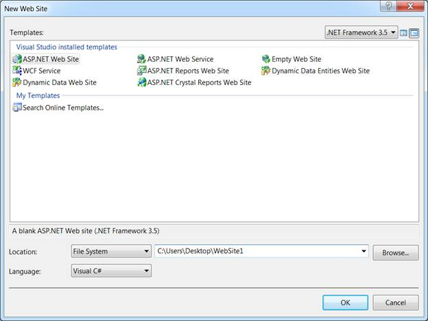
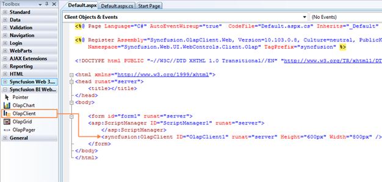
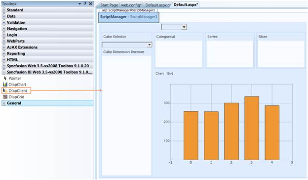
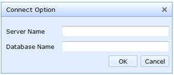

::: {style="DISPLAY: none"}
{#d2h_url_template}{#d2h_package_url style="WIDTH: 0px; DISPLAY: none; HEIGHT: 0px"}
:::

::::: {#nsbanner .d2h_main_nsbanner style="BORDER-BOTTOM: #999999 1px solid; POSITION: relative; PADDING-BOTTOM: 0px; BACKGROUND-COLOR: transparent; PADDING-LEFT: 0px; PADDING-RIGHT: 0px; DISPLAY: none; BORDER-TOP: #999999 1px solid; PADDING-TOP: 0px; LEFT: 0px"}
:::: {#TitleRow .d2h_main_titlerow style="PADDING-BOTTOM: 4px; BACKGROUND-COLOR: transparent; PADDING-LEFT: 22px; WIDTH: 100%; PADDING-RIGHT: 10px; DISPLAY: none; PADDING-TOP: 4px"}
::: {#ienav .d2h_main_ienav style="DISPLAY: none"}
{#D2HPrevious .D2HPreviousEnabled}  {#D2HNext .D2HNextEnabled}
:::
::::
:::::

:::::: {#nstext .d2h_main_nstext style="PADDING-BOTTOM: 10px; BACKGROUND-COLOR: transparent; PADDING-LEFT: 22px; PADDING-RIGHT: 10px; HEIGHT: 100%; OVERFLOW: auto; PADDING-TOP: 5px" hasuserbackground="true" valign="bottom"}
::: {#d2h_breadcrumbs .d2h_breadcrumbs}
[Essential Studio User Guide Documentation](ms-xhelp:///?Id=12457748-09e3-4d74-a240-8e049cedf030){.d2h_breadcrumbsNormal}[ \> ]{.d2h_breadcrumbsLinkSeparator}[Business Intelligence Edition](ms-xhelp:///?Id=fdf33dd8-62b2-47b9-ad7b-fc50e590bca5){.d2h_breadcrumbsNormal}[ \> ]{.d2h_breadcrumbsLinkSeparator}[Essential BI ASP.NET](ms-xhelp:///?Id=99c6694e-59c3-4c59-abb5-ce9ce9a948bc){.d2h_breadcrumbsNormal}[ \> ]{.d2h_breadcrumbsLinkSeparator}[Essential BI Client]{.d2h_breadcrumbsContentsOnly}[ \> ]{.d2h_breadcrumbsLinkSeparator}[Getting Started](ms-xhelp:///?Id=d67227c0-bba2-4943-acc1-d5c64f70f90b){.d2h_breadcrumbsNormal}
:::

## Adding OLAP Client control to an application {#adding-olap-client-control-to-an-application style="tab-stops: 0pt"}

To create OLAP Client for Web:

1.   Click Start [à]{style="FONT-FAMILY: Wingdings"} All Programs [à]{style="FONT-FAMILY: Wingdings"} Microsoft Visual Studio 2008.

2.   Now go **to File** **[à]{style="FONT-FAMILY: Wingdings"} New Website**. The New Web Site dialog box appears.

 

{border="0"}

 

Figure 5: New Web Site Dialog Box

 

3.   Select **ASP.NET Web Site** in the New Web Site dialog box and click **OK**. A new web form gets created.

4.   The **OLAP Client control** is now available in the toolbox under the tab named **"Syncfusion BI Web 3.5--vs2008 Toolbox \<Essential studio version number\>"**. Drag and drop the OLAP Client control onto the web form. The following assemblies will be referenced in your application for using the OLAP Client Web control.

 

[·      ]{style="FONT-FAMILY: Symbol"}Syncfusion.Core

[·      ]{style="FONT-FAMILY: Symbol"}Syncfusion.DocIO.Base

[·      ]{style="FONT-FAMILY: Symbol"}Syncfusion.XlsIO.Base

[·      ]{style="FONT-FAMILY: Symbol"}Syncfusion.Linq.Base

[·      ]{style="FONT-FAMILY: Symbol"}Syncfusion.Chart.Base

[·      ]{style="FONT-FAMILY: Symbol"}Syncfusion.Chart.Web

[·      ]{style="FONT-FAMILY: Symbol"}Syncfusion.Shared.Base

[·      ]{style="FONT-FAMILY: Symbol"}Syncfusion.Shared.Web

[·      ]{style="FONT-FAMILY: Symbol"}Syncfusion.Olap.Base

[·      ]{style="FONT-FAMILY: Symbol"}Syncfusion.OlapChart.Web

[·      ]{style="FONT-FAMILY: Symbol"}Syncfusion.OlapGrid.Web

[·      ]{style="FONT-FAMILY: Symbol"}Syncfusion.OlapSampleUtils

[·      ]{style="FONT-FAMILY: Symbol"}Syncfusion.Tools.Web

 

{border="0"}

 

Figure 6: Syncfusion BI Web 3.5--vs2008 Toolbox

 

 

 

 

{border="0"}

 

Figure 7: OLAP Client in Designer

5.   The Syncfusion control, client API is enhanced with ASP.NET AJAX.  The ASP.NET Script Manger or Syncfusion Script Manger is required on the page in which the controls are used. The ASP.NET AJAX 3.5 is required for .NET Framework v3.5.

 

**Adding Script Manager:**

 

+--------------------------------------------------------------------------------------------------------------------------------------------------------------------------------------------------------------------------------------------------------------------------------------------------------------------------------------------------------------------------------------------------------------+
| **[\[ASPX\]]{style="FONT-FAMILY: 'Courier New'"}**                                                                                                                                                                                                                                                                                                                                                           |
|                                                                                                                                                                                                                                                                                                                                                                                                              |
| [\<]{style="FONT-FAMILY: 'Courier New'; COLOR: blue"}[asp]{style="FONT-FAMILY: 'Courier New'; COLOR: maroon"}[:]{style="FONT-FAMILY: 'Courier New'; COLOR: blue"}[ScriptManager]{style="FONT-FAMILY: 'Courier New'; COLOR: maroon"}[ [ID]{style="COLOR: red"}[=\"ScriptManager1\"]{style="COLOR: blue"} [runat]{style="COLOR: red"}[=\"server\"\>]{style="COLOR: blue"}]{style="FONT-FAMILY: 'Courier New'"} |
|                                                                                                                                                                                                                                                                                                                                                                                                              |
| [\</]{style="FONT-FAMILY: 'Courier New'; COLOR: blue"}[asp]{style="FONT-FAMILY: 'Courier New'; COLOR: maroon"}[:]{style="FONT-FAMILY: 'Courier New'; COLOR: blue"}[ScriptManager]{style="FONT-FAMILY: 'Courier New'; COLOR: maroon"}[\>]{style="FONT-FAMILY: 'Courier New'; COLOR: blue"}                                                                                                                    |
|                                                                                                                                                                                                                                                                                                                                                                                                              |
|                                                                                                                                                                                                                                                                                                                                                                                                              |
+--------------------------------------------------------------------------------------------------------------------------------------------------------------------------------------------------------------------------------------------------------------------------------------------------------------------------------------------------------------------------------------------------------------+

 

6.   The height, width and other properties of OLAP Client control are set either through the property window or manually in the source code as well as in the code behind region.

 

For example, the height and width property set in the source code region is shown below:

 

+-----------------------------------------------------------------------------------------------------------------------------------------------------------------------------------------------------------------------------------------------------------------------------------------------------------------------------------------------------------------------------------------------------------------------------------------------------------------------------------------------------------------------------------------------------------------------------------------------+
| **[\[ASPX\]]{style="FONT-FAMILY: 'Courier New'"}**                                                                                                                                                                                                                                                                                                                                                                                                                                                                                                                                            |
|                                                                                                                                                                                                                                                                                                                                                                                                                                                                                                                                                                                               |
| [\<]{style="FONT-FAMILY: Consolas; COLOR: blue; FONT-SIZE: 9.5pt"}[asp]{style="FONT-FAMILY: Consolas; COLOR: maroon; FONT-SIZE: 9.5pt"}[:]{style="FONT-FAMILY: Consolas; COLOR: blue; FONT-SIZE: 9.5pt"}[ScriptManager]{style="FONT-FAMILY: Consolas; COLOR: maroon; FONT-SIZE: 9.5pt"}[ [ID]{style="COLOR: red"}[=\"ScriptManager1\"]{style="COLOR: blue"} [runat]{style="COLOR: red"}[=\"server\"\>]{style="COLOR: blue"}]{style="FONT-FAMILY: Consolas; FONT-SIZE: 9.5pt"}                                                                                                                 |
|                                                                                                                                                                                                                                                                                                                                                                                                                                                                                                                                                                                               |
| [\</]{style="FONT-FAMILY: 'Courier New'; COLOR: blue"}[asp]{style="FONT-FAMILY: 'Courier New'; COLOR: maroon"}[:]{style="FONT-FAMILY: 'Courier New'; COLOR: blue"}[ScriptManager]{style="FONT-FAMILY: 'Courier New'; COLOR: maroon"}[\>]{style="FONT-FAMILY: 'Courier New'; COLOR: blue"}[]{style="FONT-FAMILY: Consolas; COLOR: blue; FONT-SIZE: 9.5pt"}                                                                                                                                                                                                                                     |
|                                                                                                                                                                                                                                                                                                                                                                                                                                                                                                                                                                                               |
| [\<]{style="FONT-FAMILY: 'Courier New'"}[Syncfusion]{style="FONT-FAMILY: Consolas; COLOR: maroon; FONT-SIZE: 9.5pt"}[:]{style="FONT-FAMILY: 'Courier New'"}[ OlapClient]{style="FONT-FAMILY: Consolas; COLOR: maroon; FONT-SIZE: 9.5pt"}[ [ID]{style="COLOR: red"}[=\"OlapClient1\"]{style="COLOR: blue"} [Height]{style="COLOR: red"}[=\"600px\"]{style="COLOR: blue"} [Width]{style="COLOR: red"}[=\"800px\" ]{style="COLOR: blue"}[runat]{style="COLOR: red"}[=\"server\"]{style="COLOR: blue"} ]{style="FONT-FAMILY: Consolas; FONT-SIZE: 9.5pt"}[\>]{style="FONT-FAMILY: 'Courier New'"} |
|                                                                                                                                                                                                                                                                                                                                                                                                                                                                                                                                                                                               |
| [\</]{style="FONT-FAMILY: 'Courier New'"}[Syncfusion]{style="FONT-FAMILY: Consolas; COLOR: maroon; FONT-SIZE: 9.5pt"}[:]{style="FONT-FAMILY: 'Courier New'"}[ OlapClient]{style="FONT-FAMILY: Consolas; COLOR: maroon; FONT-SIZE: 9.5pt"}[ ]{style="FONT-FAMILY: Consolas; FONT-SIZE: 9.5pt"}[\>]{style="FONT-FAMILY: 'Courier New'"}                                                                                                                                                                                                                                                         |
|                                                                                                                                                                                                                                                                                                                                                                                                                                                                                                                                                                                               |
|                                                                                                                                                                                                                                                                                                                                                                                                                                                                                                                                                                                               |
+-----------------------------------------------------------------------------------------------------------------------------------------------------------------------------------------------------------------------------------------------------------------------------------------------------------------------------------------------------------------------------------------------------------------------------------------------------------------------------------------------------------------------------------------------------------------------------------------------+

 

7.   Once the OLAP Client control is defined, navigate to the code-behind file.

8.   Now to bind the OLAP Client control with cube data, the **OlapDataManager** is instantiated first through any one of the following methods in the page load event. [Then it is assigned to ]{style="COLOR: black"}**client controls OlapDataManager***[ ]{style="COLOR: black"}*[and finally the Databind() method is called.]{style="COLOR: black"}

 

Binding OLAP Client to the Server:

**[]{style="FONT-SIZE: 12pt"}** 

+----------------------------------------------------------------------------------------------------------------+
| **[\[C#\]]{style="FONT-FAMILY: 'Courier New'"}**                                                               |
|                                                                                                                |
| [OlapDataManager olapDataManager = new OlapDataManager(connectionString);]{style="FONT-FAMILY: 'Courier New'"} |
|                                                                                                                |
| [this.olapClient1.OlapDataManager = olapDataManager;]{style="FONT-FAMILY: 'Courier New'"}                      |
|                                                                                                                |
| [this.olapClient1.DataBind();]{style="FONT-FAMILY: 'Courier New'"}[]{style="FONT-SIZE: 12pt"}                  |
+----------------------------------------------------------------------------------------------------------------+

 

+----------------------------------------------------------------------------------------------------------------------+
| **[\[VB\]]{style="FONT-FAMILY: 'Courier New'"}**                                                                     |
|                                                                                                                      |
| [Dim olapDataManager As OlapDataManager = New OlapDataManager(connectionString)]{style="FONT-FAMILY: 'Courier New'"} |
|                                                                                                                      |
| [Me.olapClient1.OlapDataManager = olapDataManager]{style="FONT-FAMILY: 'Courier New'"}                               |
|                                                                                                                      |
| [Me.olapClient1.DataBind()]{style="FONT-FAMILY: 'Courier New'"}[]{style="FONT-SIZE: 12pt"}                           |
+----------------------------------------------------------------------------------------------------------------------+

**[]{style="FONT-SIZE: 12pt"}** 

Binding OLAP Client to the Offline Cube:

+-----------------------------------------------------------------------------------------------------------------+
| **[\[C#\]]{style="FONT-FAMILY: 'Courier New'"}**                                                                |
|                                                                                                                 |
| [OlapDataManager olapDataManager = new OlapDataManager(connectionString); ]{style="FONT-FAMILY: 'Courier New'"} |
|                                                                                                                 |
| [this.olapClient1.OlapDataManager = olapDataManager;]{style="FONT-FAMILY: 'Courier New'"}                       |
|                                                                                                                 |
| [this.olapClient1.DataBind();]{style="FONT-FAMILY: 'Courier New'"}[]{style="FONT-SIZE: 12pt"}                   |
+-----------------------------------------------------------------------------------------------------------------+

 

+----------------------------------------------------------------------------------------------------------------------+
| **[\[VB\]]{style="FONT-FAMILY: 'Courier New'"}**                                                                     |
|                                                                                                                      |
| [Dim olapDataManager As OlapDataManager = New OlapDataManager(connectionString)]{style="FONT-FAMILY: 'Courier New'"} |
|                                                                                                                      |
| [Me.olapClient1.OlapDataManager = olapDataManager]{style="FONT-FAMILY: 'Courier New'"}                               |
|                                                                                                                      |
| [Me.olapClient1.DataBind()]{style="FONT-FAMILY: 'Courier New'"}[]{style="FONT-SIZE: 12pt"}                           |
+----------------------------------------------------------------------------------------------------------------------+

 

Binding OLAP Client to the Server using Data Provider:

+-----------------------------------------------------------------------------------------------------------------+
| **[\[C#\]]{style="FONT-FAMILY: 'Courier New'"}**                                                                |
|                                                                                                                 |
| [AdomdDataProvider dataProvider = new AdomdDataProvider(connectionString);]{style="FONT-FAMILY: 'Courier New'"} |
|                                                                                                                 |
| [OlapDataManager olapDataManager = new OlapDataManager(dataProvider);]{style="FONT-FAMILY: 'Courier New'"}      |
|                                                                                                                 |
| [this.olapClient1.OlapDataManager = olapDataManager;]{style="FONT-FAMILY: 'Courier New'"}                       |
|                                                                                                                 |
| [this.olapClient1.DataBind();]{style="FONT-FAMILY: 'Courier New'"}[]{style="FONT-SIZE: 12pt"}                   |
+-----------------------------------------------------------------------------------------------------------------+

 

+-----------------------------------------------------------------------------------------------------------------------+
| **[\[VB\]]{style="FONT-FAMILY: 'Courier New'"}**                                                                      |
|                                                                                                                       |
| [Dim dataProvider As AdomdDataProvider = New AdomdDataProvider(connectionString)]{style="FONT-FAMILY: 'Courier New'"} |
|                                                                                                                       |
| [Dim olapDataManager As OlapDataManager = New OlapDataManager(dataProvider)]{style="FONT-FAMILY: 'Courier New'"}      |
|                                                                                                                       |
| [Me.olapClient1.OlapDataManager = olapDataManager]{style="FONT-FAMILY: 'Courier New'"}                                |
|                                                                                                                       |
| [Me.olapClient1.DataBind()]{style="FONT-FAMILY: 'Courier New'"}[]{style="FONT-SIZE: 12pt"}                            |
+-----------------------------------------------------------------------------------------------------------------------+

 

::: {style="BORDER-BOTTOM: windowtext 1pt solid; BORDER-LEFT: medium none; PADDING-BOTTOM: 1pt; MARGIN-TOP: 9pt; PADDING-LEFT: 0pt; PADDING-RIGHT: 0pt; MARGIN-BOTTOM: 9pt; BORDER-TOP: windowtext 1pt solid; BORDER-RIGHT: medium none; PADDING-TOP: 1pt"}
{border="0"}Tip: If the user works in an intranet, he or she can instantiate the connection option dialog by clicking the "Connection Option" in the toolbar.
:::

{border="0"}

 

Figure 8: Connection Option in Toolbar

{border="0"}

 

Figure 9: Connection Option

9.   [i) ]{style="FONT-FAMILY: 'Calibri','sans-serif'; FONT-SIZE: 11pt"}OLAP Grid control uses HttpHandler by default to procure data from the OLAP Server on the          member drilldown and for the header cell tooltip.

ii\) OLAP Chart control uses HttpHandler by default to procure the images of chart, label and legend each time.

 

Therefore, it's required to include the handler in the httphandlers section of web.config file.

+-----------------------------------------------------------------------------------------------------------------------------------------------------------------------------------------------------------------------------------------------------------------------------+
| **[\[Web.Config\]]{style="FONT-FAMILY: 'Courier New'"}**                                                                                                                                                                                                                    |
|                                                                                                                                                                                                                                                                             |
| [\<httpHandlers\>]{style="FONT-FAMILY: 'Courier New'; COLOR: blue"}                                                                                                                                                                                                         |
|                                                                                                                                                                                                                                                                             |
| [      \.....]{style="FONT-FAMILY: 'Courier New'; COLOR: blue"}                                                                                                                                                                                                             |
|                                                                                                                                                                                                                                                                             |
| [      \<add verb=\"GET\" path=\"\*UpdateOlap\*\" type=\"Syncfusion.Web.UI.WebControls.Grid.Olap.Handlers.OLAPDataHandler, Syncfusion.OlapGrid.Web,Version=x.x.x.x, Culture=neutral, PublicKeyToken=3d67ed1f87d44c89\"/\>]{style="FONT-FAMILY: 'Courier New'; COLOR: blue"} |
|                                                                                                                                                                                                                                                                             |
| [      \<add path=\"syncfusion_generate.ashx\" verb=\"\*\" type=\"Syncfusion.Web.UI.WebControls.Chart.ChartWebHandler,Syncfusion.Chart.Web, Version= x.x.x.x, Culture=neutral, PublicKeyToken=3d67ed1f87d44c89\"/\>]{style="FONT-FAMILY: 'Courier New'; COLOR: blue"}       |
|                                                                                                                                                                                                                                                                             |
| [      \<add path=\"SourceCodeTabBrowser.ashx\" verb=\"\*\" type=\"DemoUtility.SourceCodeTabHandler,Syncfusion.DemoUtility, Version= x.x.x.x, Culture=neutral, PublicKeyToken=3d67ed1f87d44c89\"/\>]{style="FONT-FAMILY: 'Courier New'; COLOR: blue"}                       |
|                                                                                                                                                                                                                                                                             |
| [\</httpHandlers\>]{style="FONT-FAMILY: 'Courier New'; COLOR: blue"}                                                                                                                                                                                                        |
+-----------------------------------------------------------------------------------------------------------------------------------------------------------------------------------------------------------------------------------------------------------------------------+

::: {style="BORDER-BOTTOM: windowtext 1pt solid; BORDER-LEFT: medium none; PADDING-BOTTOM: 1pt; MARGIN-TOP: 9pt; PADDING-LEFT: 0pt; PADDING-RIGHT: 0pt; MARGIN-BOTTOM: 9pt; BORDER-TOP: windowtext 1pt solid; BORDER-RIGHT: medium none; PADDING-TOP: 1pt"}
[{border="0"}]{style="FONT-FAMILY: 'Calibri','sans-serif'; COLOR: black; FONT-SIZE: 11pt"}Note: x.x.x.x in the above code snippet refers to the current version of the Essential Studio running in your system.
:::

10.  Run the application and the following output is obtained.

 

{border="0"}

 

Figure 10: OLAP Client

[]{#related-topics}
::::::
