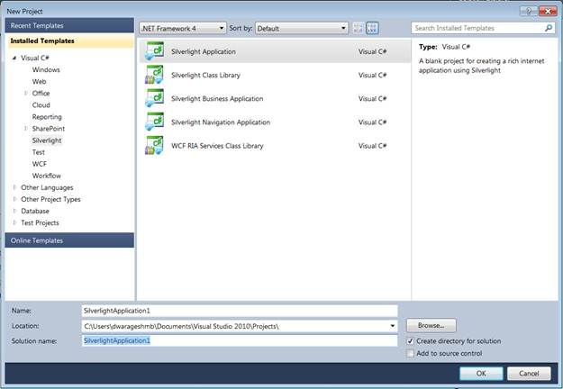
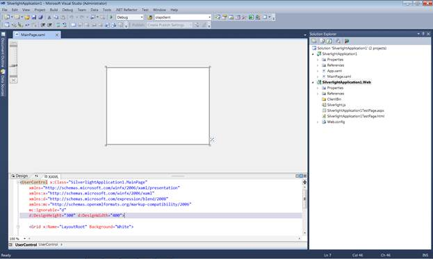
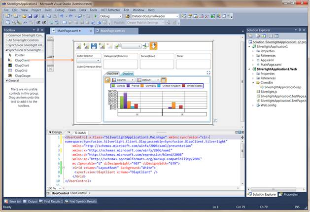
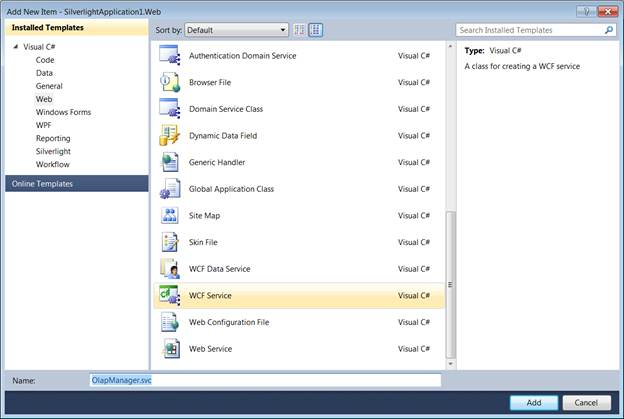

::: {style="DISPLAY: none"}
{#d2h_url_template}{#d2h_package_url style="WIDTH: 0px; DISPLAY: none; HEIGHT: 0px"}
:::

::::: {#nsbanner .d2h_main_nsbanner style="BORDER-BOTTOM: #999999 1px solid; POSITION: relative; PADDING-BOTTOM: 0px; BACKGROUND-COLOR: transparent; PADDING-LEFT: 0px; PADDING-RIGHT: 0px; DISPLAY: none; BORDER-TOP: #999999 1px solid; PADDING-TOP: 0px; LEFT: 0px"}
:::: {#TitleRow .d2h_main_titlerow style="PADDING-BOTTOM: 4px; BACKGROUND-COLOR: transparent; PADDING-LEFT: 22px; WIDTH: 100%; PADDING-RIGHT: 10px; DISPLAY: none; PADDING-TOP: 4px"}
::: {#ienav .d2h_main_ienav style="DISPLAY: none"}
{#D2HPrevious .D2HPreviousEnabled}  {#D2HNext .D2HNextEnabled}
:::
::::
:::::

:::: {#nstext .d2h_main_nstext style="PADDING-BOTTOM: 10px; BACKGROUND-COLOR: transparent; PADDING-LEFT: 22px; PADDING-RIGHT: 10px; HEIGHT: 100%; OVERFLOW: auto; PADDING-TOP: 5px" hasuserbackground="true" valign="bottom"}
::: {#d2h_breadcrumbs .d2h_breadcrumbs}
[Essential Studio User Guide Documentation](ms-xhelp:///?Id=12457748-09e3-4d74-a240-8e049cedf030){.d2h_breadcrumbsNormal}[ \> ]{.d2h_breadcrumbsLinkSeparator}[Business Intelligence Edition](ms-xhelp:///?Id=fdf33dd8-62b2-47b9-ad7b-fc50e590bca5){.d2h_breadcrumbsNormal}[ \> ]{.d2h_breadcrumbsLinkSeparator}[Essential BI Silverlight](ms-xhelp:///?Id=c006b39c-6aa2-4637-b7de-3e7b6cb3f9f9){.d2h_breadcrumbsNormal}[ \> ]{.d2h_breadcrumbsLinkSeparator}[Essential BI Client]{.d2h_breadcrumbsContentsOnly}[ \> ]{.d2h_breadcrumbsLinkSeparator}[Getting Started](ms-xhelp:///?Id=2e1ad51f-2428-46e4-ab7c-d12cb2ab2848){.d2h_breadcrumbsNormal}
:::

## Adding OLAP Client to an Application {#adding-olap-client-to-an-application style="tab-stops: 0pt"}

To add OLAP Client to an application:

 

4.   Click the Start menu, and then click Microsoft Visual Studio 2010.

5.   From the File menu, click New Project. The New Project dialog box is displayed, as shown below.

 

{border="0"}

 

Figure 5: New Project Dialog Box

 

6.   Select the Silverlight Application by navigating to the Silverlight node and then click OK.

7.   Host the Silverlight application on the website.

{border="0"}

 

Figure 6: Hosting Silverlight Application in Web

 

8.   Click OK, to create a web project as well as a Silverlight project, as shown below.

 

 

 

{border="0"}

 

Figure 7: New Silverlight Application

 

9.   Drag and drop the OLAP Client from the toolbox on the MainPage.xaml.

 

 

{border="0"}

 

Figure 8: Silverlight Application with OLAP Client

 

10.  Add the following two assemblies as references to the web project:

[·      ]{style="FONT-FAMILY: Symbol"}Syncfusion.Olap.Base

[·      ]{style="FONT-FAMILY: Symbol"}Syncfusion.OlapSilverlight.BaseWrapper

 

11.  Add a WCF Service to the web project by right-clicking the Project -\> Add New Item -\> WCF Service. Then, name the Service as OLAP Manager and delete the IOlapManager.cs file as the service needs to be inherited with IOlapDataProvider.

 

{border="0"}

 

Figure 9: Add New Item Dialog Window

 

12.  Inherit the newly added WCF service with the IOlapDataProvider and explicitly implement the IOlapDataProvider. The connection to the database is done with the help of the WCF service. The service has to be created and instantiated as described below.

 

13.  The WCF Service has to implement the IOlapDataProvider interface, and for implementing this interface, you require the OlapDataProvider, which can be instantiated by passing the connection string.

The code snippet is displayed below:

 

+--------------------------------------------------------------------------------------------------------------------------------------------+
| **[\[C#\]]{style="FONT-FAMILY: 'Courier New'"}**                                                                                           |
|                                                                                                                                            |
| []{style="FONT-FAMILY: 'Courier New'"}                                                                                                     |
|                                                                                                                                            |
| [    public class OlapManager : IOlapDataProvider\                                                                                         |
|     {\                                                                                                                                     |
|         OlapDataProvider dataManager = null;\                                                                                              |
|         /// \<summary\>\                                                                                                                   |
|         /// Initializes a new instance of the \<see cref=\"OlapManager\"/\> class.\                                                        |
|         /// \</summary\>\                                                                                                                  |
|         public OlapManager()\                                                                                                              |
|         {\                                                                                                                                 |
|             // Instantiating the OlapDataProvider with Connection String\                                                                  |
|             dataManager = new OlapDataProvider(\"DataSource=localhost; Initial Catalog=Adventure Works DW\");\                             |
|         }\                                                                                                                                 |
|  \                                                                                                                                         |
|         #region IOlapDataProvider Members\                                                                                                 |
|  \                                                                                                                                         |
|         /// \<summary\>\                                                                                                                   |
|         /// Executes the olap report.\                                                                                                     |
|         /// \</summary\>\                                                                                                                  |
|         /// \<param name=\"report\"\>The report.\</param\>\                                                                                |
|         /// \<returns\>\</returns\>\                                                                                                       |
|         public Syncfusion.OlapSilverlight.Data.CellSet ExecuteOlapReport(Syncfusion.OlapSilverlight.Reports.OlapReport report)\            |
|         {\                                                                                                                                 |
|             Syncfusion.OlapSilverlight.Data.CellSet cellSet = this.dataManager.ExecuteOlapReport(report);\                                 |
|             // Closing the Provider Connection\                                                                                            |
|             this.dataManager.DataProvider.CloseConnection();\                                                                              |
|             return cellSet;\                                                                                                               |
|         }\                                                                                                                                 |
|  \                                                                                                                                         |
|         /// \<summary\>\                                                                                                                   |
|         /// Executes the MDX query.\                                                                                                       |
|         /// \</summary\>\                                                                                                                  |
|         /// \<param name=\"mdxQuery\"\>The MDX query.\</param\>\                                                                           |
|         /// \<returns\>\</returns\>\                                                                                                       |
|         public Syncfusion.OlapSilverlight.Data.CellSet ExecuteMdxQuery(string mdxQuery)\                                                   |
|         {\                                                                                                                                 |
|             Syncfusion.OlapSilverlight.Data.CellSet cellSet = this.dataManager.ExecuteMdxQuery(mdxQuery);\                                 |
|             // Closing the Provider Connection\                                                                                            |
|             this.dataManager.DataProvider.CloseConnection();\                                                                              |
|             return cellSet;\                                                                                                               |
|         }\                                                                                                                                 |
|  \                                                                                                                                         |
|         /// \<summary\>\                                                                                                                   |
|         /// Gets the cubes.\                                                                                                               |
|         /// \</summary\>\                                                                                                                  |
|         /// \<returns\>\</returns\>\                                                                                                       |
|         public Syncfusion.OlapSilverlight.Data.CubeInfoCollection GetCubes()\                                                              |
|         {\                                                                                                                                 |
|             Syncfusion.OlapSilverlight.Data.CubeInfoCollection cubes = this.dataManager.GetCubes();\                                       |
|             // Closing the Provider Connection\                                                                                            |
|             this.dataManager.DataProvider.CloseConnection();\                                                                              |
|             return cubes;\                                                                                                                 |
|         }\                                                                                                                                 |
|  \                                                                                                                                         |
|         /// \<summary\>\                                                                                                                   |
|         /// Gets the cube schema.\                                                                                                         |
|         /// \</summary\>\                                                                                                                  |
|         /// \<param name=\"cubeName\"\>Name of the cube.\</param\>\                                                                        |
|         /// \<returns\>\</returns\>\                                                                                                       |
|         public Syncfusion.OlapSilverlight.Data.CubeSchema GetCubeSchema(string cubeName)\                                                  |
|         {\                                                                                                                                 |
|             Syncfusion.OlapSilverlight.Data.CubeSchema cubeSchema = this.dataManager.GetCubeSchema(cubeName);\                             |
|             // Closing the Provider Connection\                                                                                            |
|             this.dataManager.DataProvider.CloseConnection();\                                                                              |
|             return cubeSchema;\                                                                                                            |
|         }\                                                                                                                                 |
|  \                                                                                                                                         |
|         /// \<summary\>\                                                                                                                   |
|         /// Gets the child members.\                                                                                                       |
|         /// \</summary\>\                                                                                                                  |
|         /// \<param name=\"memberUniqueName\"\>Unique name of the parent member.\</param\>\                                                |
|         /// \<param name=\"cubeName\"\>Name of the cube.\</param\>\                                                                        |
|         /// \<returns\>\</returns\>\                                                                                                       |
|         public Syncfusion.OlapSilverlight.Data.MemberCollection GetChildMembers(string memberUniqueName, string cubeName)\                 |
|         {\                                                                                                                                 |
|             Syncfusion.OlapSilverlight.Data.MemberCollection childMembers = this.dataManager.GetChildMembers(memberUniqueName, cubeName);\ |
|             // Closing the Provider Connection\                                                                                            |
|             this.dataManager.DataProvider.CloseConnection();\                                                                              |
|             return childMembers;\                                                                                                          |
|         }\                                                                                                                                 |
|  \                                                                                                                                         |
|         /// \<summary\>\                                                                                                                   |
|         /// Gets the level members.\                                                                                                       |
|         /// \</summary\>\                                                                                                                  |
|         /// \<param name=\"levelUniqueName\"\>Unique name of the level.\</param\>\                                                         |
|         /// \<param name=\"cubeName\"\>Name of the cube.\</param\>\                                                                        |
|         /// \<returns\>\</returns\>\                                                                                                       |
|         public Syncfusion.OlapSilverlight.Data.MemberCollection GetLevelMembers(string levelUniqueName, string cubeName)\                  |
|         {\                                                                                                                                 |
|             Syncfusion.OlapSilverlight.Data.MemberCollection levelMembers = this.dataManager.GetLevelMembers(levelUniqueName, cubeName);\  |
|             // Closing the Provider Connection\                                                                                            |
|             this.dataManager.DataProvider.CloseConnection();\                                                                              |
|             return levelMembers;\                                                                                                          |
|         }\                                                                                                                                 |
|  \                                                                                                                                         |
|         #endregion\                                                                                                                        |
|     }]{style="FONT-FAMILY: 'Courier New'"}                                                                                                 |
|                                                                                                                                            |
| []{style="FONT-FAMILY: 'Courier New'"}                                                                                                     |
+--------------------------------------------------------------------------------------------------------------------------------------------+

 

+---------------------------------------------------------------------------------------------------------------------------------------------------------------------------------------------------+
| **[\[VB\]]{style="FONT-FAMILY: 'Courier New'"}**                                                                                                                                                  |
|                                                                                                                                                                                                   |
| []{style="FONT-FAMILY: 'Courier New'"}                                                                                                                                                            |
|                                                                                                                                                                                                   |
| [Public Class OlapManager]{style="FONT-FAMILY: 'Courier New'"}                                                                                                                                    |
|                                                                                                                                                                                                   |
| [            Implements IOlapDataProvider]{style="FONT-FAMILY: 'Courier New'"}                                                                                                                    |
|                                                                                                                                                                                                   |
| [            Private dataManager As OlapDataProvider = Nothing]{style="FONT-FAMILY: 'Courier New'"}                                                                                               |
|                                                                                                                                                                                                   |
| [            \'\'\' \<summary\>]{style="FONT-FAMILY: 'Courier New'"}                                                                                                                              |
|                                                                                                                                                                                                   |
| [            \'\'\' Initializes a new instance of the \<see cref=\"OlapManager\"/\> class.]{style="FONT-FAMILY: 'Courier New'"}                                                                   |
|                                                                                                                                                                                                   |
| [            \'\'\' \</summary\>]{style="FONT-FAMILY: 'Courier New'"}                                                                                                                             |
|                                                                                                                                                                                                   |
| [            Public Sub New()]{style="FONT-FAMILY: 'Courier New'"}                                                                                                                                |
|                                                                                                                                                                                                   |
| [                  \' Instantiating the OlapDataProvider with Connection String]{style="FONT-FAMILY: 'Courier New'"}                                                                              |
|                                                                                                                                                                                                   |
| [                  dataManager = New OlapDataProvider(\"DataSource=.; Initial Catalog=Adventure Works DW\")]{style="FONT-FAMILY: 'Courier New'"}                                                  |
|                                                                                                                                                                                                   |
| [            End Sub]{style="FONT-FAMILY: 'Courier New'"}                                                                                                                                         |
|                                                                                                                                                                                                   |
| []{style="FONT-FAMILY: 'Courier New'"}                                                                                                                                                            |
|                                                                                                                                                                                                   |
| [            #Region \"IOlapDataProvider Members\"]{style="FONT-FAMILY: 'Courier New'"}                                                                                                           |
|                                                                                                                                                                                                   |
| []{style="FONT-FAMILY: 'Courier New'"}                                                                                                                                                            |
|                                                                                                                                                                                                   |
| [            \'\'\' \<summary\>]{style="FONT-FAMILY: 'Courier New'"}                                                                                                                              |
|                                                                                                                                                                                                   |
| [            \'\'\' Executes the olap report.]{style="FONT-FAMILY: 'Courier New'"}                                                                                                                |
|                                                                                                                                                                                                   |
| [            \'\'\' \</summary\>]{style="FONT-FAMILY: 'Courier New'"}                                                                                                                             |
|                                                                                                                                                                                                   |
| [            \'\'\' \<param name=\"report\"\>The report.\</param\>]{style="FONT-FAMILY: 'Courier New'"}                                                                                           |
|                                                                                                                                                                                                   |
| [            \'\'\' \<returns\>\</returns\>]{style="FONT-FAMILY: 'Courier New'"}                                                                                                                  |
|                                                                                                                                                                                                   |
| [            Public Function ExecuteOlapReport(ByVal report As Syncfusion.OlapSilverlight.Reports.OlapReport) As Syncfusion.OlapSilverlight.Data.CellSet]{style="FONT-FAMILY: 'Courier New'"}     |
|                                                                                                                                                                                                   |
| [                  Dim cellSet As Syncfusion.OlapSilverlight.Data.CellSet = Me.dataManager.ExecuteOlapReport(report)]{style="FONT-FAMILY: 'Courier New'"}                                         |
|                                                                                                                                                                                                   |
| [                  \' Closing the Provider Connection]{style="FONT-FAMILY: 'Courier New'"}                                                                                                        |
|                                                                                                                                                                                                   |
| [                  Me.dataManager.DataProvider.CloseConnection()]{style="FONT-FAMILY: 'Courier New'"}                                                                                             |
|                                                                                                                                                                                                   |
| [                  Return cellSet]{style="FONT-FAMILY: 'Courier New'"}                                                                                                                            |
|                                                                                                                                                                                                   |
| [            End Function]{style="FONT-FAMILY: 'Courier New'"}                                                                                                                                    |
|                                                                                                                                                                                                   |
| []{style="FONT-FAMILY: 'Courier New'"}                                                                                                                                                            |
|                                                                                                                                                                                                   |
| [            \'\'\' \<summary\>]{style="FONT-FAMILY: 'Courier New'"}                                                                                                                              |
|                                                                                                                                                                                                   |
| [            \'\'\' Executes the MDX query.]{style="FONT-FAMILY: 'Courier New'"}                                                                                                                  |
|                                                                                                                                                                                                   |
| [            \'\'\' \</summary\>]{style="FONT-FAMILY: 'Courier New'"}                                                                                                                             |
|                                                                                                                                                                                                   |
| [            \'\'\' \<param name=\"mdxQuery\"\>The MDX query.\</param\>]{style="FONT-FAMILY: 'Courier New'"}                                                                                      |
|                                                                                                                                                                                                   |
| [            \'\'\' \<returns\>\</returns\>]{style="FONT-FAMILY: 'Courier New'"}                                                                                                                  |
|                                                                                                                                                                                                   |
| [            Public Function ExecuteMdxQuery(ByVal mdxQuery As String) As Syncfusion.OlapSilverlight.Data.CellSet]{style="FONT-FAMILY: 'Courier New'"}                                            |
|                                                                                                                                                                                                   |
| [                  Dim cellSet As Syncfusion.OlapSilverlight.Data.CellSet = Me.dataManager.ExecuteMdxQuery(mdxQuery)]{style="FONT-FAMILY: 'Courier New'"}                                         |
|                                                                                                                                                                                                   |
| [                  \' Closing the Provider Connection]{style="FONT-FAMILY: 'Courier New'"}                                                                                                        |
|                                                                                                                                                                                                   |
| [                  Me.dataManager.DataProvider.CloseConnection()]{style="FONT-FAMILY: 'Courier New'"}                                                                                             |
|                                                                                                                                                                                                   |
| [                  Return cellSet]{style="FONT-FAMILY: 'Courier New'"}                                                                                                                            |
|                                                                                                                                                                                                   |
| [            End Function]{style="FONT-FAMILY: 'Courier New'"}                                                                                                                                    |
|                                                                                                                                                                                                   |
| []{style="FONT-FAMILY: 'Courier New'"}                                                                                                                                                            |
|                                                                                                                                                                                                   |
| [            \'\'\' \<summary\>]{style="FONT-FAMILY: 'Courier New'"}                                                                                                                              |
|                                                                                                                                                                                                   |
| [            \'\'\' Gets the cubes.]{style="FONT-FAMILY: 'Courier New'"}                                                                                                                          |
|                                                                                                                                                                                                   |
| [            \'\'\' \</summary\>]{style="FONT-FAMILY: 'Courier New'"}                                                                                                                             |
|                                                                                                                                                                                                   |
| [            \'\'\' \<returns\>\</returns\>]{style="FONT-FAMILY: 'Courier New'"}                                                                                                                  |
|                                                                                                                                                                                                   |
| [            Public Function GetCubes() As Syncfusion.OlapSilverlight.Data.CubeInfoCollection]{style="FONT-FAMILY: 'Courier New'"}                                                                |
|                                                                                                                                                                                                   |
| [                  Dim cubes As Syncfusion.OlapSilverlight.Data.CubeInfoCollection = Me.dataManager.GetCubes()]{style="FONT-FAMILY: 'Courier New'"}                                               |
|                                                                                                                                                                                                   |
| [                  \' Closing the Provider Connection]{style="FONT-FAMILY: 'Courier New'"}                                                                                                        |
|                                                                                                                                                                                                   |
| [                  Me.dataManager.DataProvider.CloseConnection()]{style="FONT-FAMILY: 'Courier New'"}                                                                                             |
|                                                                                                                                                                                                   |
| [                  Return cubes]{style="FONT-FAMILY: 'Courier New'"}                                                                                                                              |
|                                                                                                                                                                                                   |
| [            End Function]{style="FONT-FAMILY: 'Courier New'"}                                                                                                                                    |
|                                                                                                                                                                                                   |
| []{style="FONT-FAMILY: 'Courier New'"}                                                                                                                                                            |
|                                                                                                                                                                                                   |
| [            \'\'\' \<summary\>]{style="FONT-FAMILY: 'Courier New'"}                                                                                                                              |
|                                                                                                                                                                                                   |
| [            \'\'\' Gets the cube schema.]{style="FONT-FAMILY: 'Courier New'"}                                                                                                                    |
|                                                                                                                                                                                                   |
| [            \'\'\' \</summary\>]{style="FONT-FAMILY: 'Courier New'"}                                                                                                                             |
|                                                                                                                                                                                                   |
| [            \'\'\' \<param name=\"cubeName\"\>Name of the cube.\</param\>]{style="FONT-FAMILY: 'Courier New'"}                                                                                   |
|                                                                                                                                                                                                   |
| [            \'\'\' \<returns\>\</returns\>]{style="FONT-FAMILY: 'Courier New'"}                                                                                                                  |
|                                                                                                                                                                                                   |
| [            Public Function GetCubeSchema(ByVal cubeName As String) As Syncfusion.OlapSilverlight.Data.CubeSchema]{style="FONT-FAMILY: 'Courier New'"}                                           |
|                                                                                                                                                                                                   |
| [                  Dim cubeSchema As Syncfusion.OlapSilverlight.Data.CubeSchema = Me.dataManager.GetCubeSchema(cubeName)]{style="FONT-FAMILY: 'Courier New'"}                                     |
|                                                                                                                                                                                                   |
| [                  \' Closing the Provider Connection]{style="FONT-FAMILY: 'Courier New'"}                                                                                                        |
|                                                                                                                                                                                                   |
| [                  Me.dataManager.DataProvider.CloseConnection()]{style="FONT-FAMILY: 'Courier New'"}                                                                                             |
|                                                                                                                                                                                                   |
| [                  Return cubeSchema]{style="FONT-FAMILY: 'Courier New'"}                                                                                                                         |
|                                                                                                                                                                                                   |
| [            End Function]{style="FONT-FAMILY: 'Courier New'"}                                                                                                                                    |
|                                                                                                                                                                                                   |
| []{style="FONT-FAMILY: 'Courier New'"}                                                                                                                                                            |
|                                                                                                                                                                                                   |
| [            \'\'\' \<summary\>]{style="FONT-FAMILY: 'Courier New'"}                                                                                                                              |
|                                                                                                                                                                                                   |
| [            \'\'\' Gets the child members.]{style="FONT-FAMILY: 'Courier New'"}                                                                                                                  |
|                                                                                                                                                                                                   |
| [            \'\'\' \</summary\>]{style="FONT-FAMILY: 'Courier New'"}                                                                                                                             |
|                                                                                                                                                                                                   |
| [            \'\'\' \<param name=\"memberUniqueName\"\>Unique name of the parent member.\</param\>]{style="FONT-FAMILY: 'Courier New'"}                                                           |
|                                                                                                                                                                                                   |
| [            \'\'\' \<param name=\"cubeName\"\>Name of the cube.\</param\>]{style="FONT-FAMILY: 'Courier New'"}                                                                                   |
|                                                                                                                                                                                                   |
| [            \'\'\' \<returns\>\</returns\>]{style="FONT-FAMILY: 'Courier New'"}                                                                                                                  |
|                                                                                                                                                                                                   |
| [            Public Function GetChildMembers(ByVal memberUniqueName As String, ByVal cubeName As String) As Syncfusion.OlapSilverlight.Data.MemberCollection]{style="FONT-FAMILY: 'Courier New'"} |
|                                                                                                                                                                                                   |
| [                  Dim childMembers As Syncfusion.OlapSilverlight.Data.MemberCollection = Me.dataManager.GetChildMembers(memberUniqueName, cubeName)]{style="FONT-FAMILY: 'Courier New'"}         |
|                                                                                                                                                                                                   |
| [                  \' Closing the Provider Connection]{style="FONT-FAMILY: 'Courier New'"}                                                                                                        |
|                                                                                                                                                                                                   |
| [                  Me.dataManager.DataProvider.CloseConnection()]{style="FONT-FAMILY: 'Courier New'"}                                                                                             |
|                                                                                                                                                                                                   |
| [                  Return childMembers]{style="FONT-FAMILY: 'Courier New'"}                                                                                                                       |
|                                                                                                                                                                                                   |
| [            End Function]{style="FONT-FAMILY: 'Courier New'"}                                                                                                                                    |
|                                                                                                                                                                                                   |
| []{style="FONT-FAMILY: 'Courier New'"}                                                                                                                                                            |
|                                                                                                                                                                                                   |
| [            \'\'\' \<summary\>]{style="FONT-FAMILY: 'Courier New'"}                                                                                                                              |
|                                                                                                                                                                                                   |
| [            \'\'\' Gets the level members.]{style="FONT-FAMILY: 'Courier New'"}                                                                                                                  |
|                                                                                                                                                                                                   |
| [            \'\'\' \</summary\>]{style="FONT-FAMILY: 'Courier New'"}                                                                                                                             |
|                                                                                                                                                                                                   |
| [            \'\'\' \<param name=\"levelUniqueName\"\>Unique name of the level.\</param\>]{style="FONT-FAMILY: 'Courier New'"}                                                                    |
|                                                                                                                                                                                                   |
| [            \'\'\' \<param name=\"cubeName\"\>Name of the cube.\</param\>]{style="FONT-FAMILY: 'Courier New'"}                                                                                   |
|                                                                                                                                                                                                   |
| [            \'\'\' \<returns\>\</returns\>]{style="FONT-FAMILY: 'Courier New'"}                                                                                                                  |
|                                                                                                                                                                                                   |
| [            Public Function GetLevelMembers(ByVal levelUniqueName As String, ByVal cubeName As String) As Syncfusion.OlapSilverlight.Data.MemberCollection]{style="FONT-FAMILY: 'Courier New'"}  |
|                                                                                                                                                                                                   |
| [                  Dim levelMembers As Syncfusion.OlapSilverlight.Data.MemberCollection = Me.dataManager.GetLevelMembers(levelUniqueName, cubeName)]{style="FONT-FAMILY: 'Courier New'"}          |
|                                                                                                                                                                                                   |
| [                  \' Closing the Provider Connection]{style="FONT-FAMILY: 'Courier New'"}                                                                                                        |
|                                                                                                                                                                                                   |
| [                  Me.dataManager.DataProvider.CloseConnection()]{style="FONT-FAMILY: 'Courier New'"}                                                                                             |
|                                                                                                                                                                                                   |
| [                  Return levelMembers]{style="FONT-FAMILY: 'Courier New'"}                                                                                                                       |
|                                                                                                                                                                                                   |
| [            End Function]{style="FONT-FAMILY: 'Courier New'"}                                                                                                                                    |
|                                                                                                                                                                                                   |
| []{style="FONT-FAMILY: 'Courier New'"}                                                                                                                                                            |
|                                                                                                                                                                                                   |
| [            #End Region]{style="FONT-FAMILY: 'Courier New'"}                                                                                                                                     |
|                                                                                                                                                                                                   |
| [      End Class]{style="FONT-FAMILY: 'Courier New'"}                                                                                                                                             |
|                                                                                                                                                                                                   |
| []{style="FONT-FAMILY: 'Courier New'"}                                                                                                                                                            |
+---------------------------------------------------------------------------------------------------------------------------------------------------------------------------------------------------+

 

Include the Custom Binding and the Service endpoint address in the Web.Config file under the ServiceModel section.

 

+------------------------------------------------------------------------------------------------------------------------------------------------------------------------------------+
| **[\[Web.Config\]]{style="FONT-FAMILY: 'Courier New'"}**                                                                                                                           |
|                                                                                                                                                                                    |
| []{style="FONT-FAMILY: 'Courier New'"}                                                                                                                                             |
|                                                                                                                                                                                    |
| [     \<!\--Binding\--\>]{style="FONT-FAMILY: 'Courier New'"}                                                                                                                      |
|                                                                                                                                                                                    |
| [      \<bindings\>]{style="FONT-FAMILY: 'Courier New'"}                                                                                                                           |
|                                                                                                                                                                                    |
| [        \<customBinding\>]{style="FONT-FAMILY: 'Courier New'"}                                                                                                                    |
|                                                                                                                                                                                    |
| [          \<binding name=\"binaryHttpBinding\"\>]{style="FONT-FAMILY: 'Courier New'"}                                                                                             |
|                                                                                                                                                                                    |
| [            \<binaryMessageEncoding/\>]{style="FONT-FAMILY: 'Courier New'"}                                                                                                       |
|                                                                                                                                                                                    |
| [            \<httpTransport maxReceivedMessageSize=\"2147483647\"/\>]{style="FONT-FAMILY: 'Courier New'"}                                                                         |
|                                                                                                                                                                                    |
| [          \</binding\>\                                                                                                                                                           |
|         \</customBinding\>]{style="FONT-FAMILY: 'Courier New'"}                                                                                                                    |
|                                                                                                                                                                                    |
| [      \</bindings\>\                                                                                                                                                              |
| \                                                                                                                                                                                  |
| ]{style="FONT-FAMILY: 'Courier New'"}                                                                                                                                              |
|                                                                                                                                                                                    |
| [      \<!---Endpoint Address\--\>]{style="FONT-FAMILY: 'Courier New'"}                                                                                                            |
|                                                                                                                                                                                    |
| [      \<services\>]{style="FONT-FAMILY: 'Courier New'"}                                                                                                                           |
|                                                                                                                                                                                    |
| [        \<service name=\"SilverlightApplication1.Web.OlapManager\" \>]{style="FONT-FAMILY: 'Courier New'"}                                                                        |
|                                                                                                                                                                                    |
| [          \<endpoint address=\"binary\" binding=\"customBinding\" bindingConfiguration=\"binaryHttpBinding\" contract=\"Syncfusion.OlapSilverlight.Manager.IOlapDataProvider\"\>\ |
|           \</endpoint\>]{style="FONT-FAMILY: 'Courier New'"}                                                                                                                       |
|                                                                                                                                                                                    |
| [        \</service\>]{style="FONT-FAMILY: 'Courier New'"}                                                                                                                         |
|                                                                                                                                                                                    |
| [      \</services\>]{style="FONT-FAMILY: 'Courier New'"}                                                                                                                          |
|                                                                                                                                                                                    |
| **[]{style="FONT-FAMILY: 'Courier New'; COLOR: #4f81bd"}**                                                                                                                         |
+------------------------------------------------------------------------------------------------------------------------------------------------------------------------------------+

 

Add the System.ServiceModel assembly as a reference for the Silverlight Project.

Add the following Namespace in MainPage.xaml.cs:

 

[·      ]{style="FONT-FAMILY: Symbol"}System.ServiceModel

[·      ]{style="FONT-FAMILY: Symbol"}System.ServiceModel.Channels

[·      ]{style="FONT-FAMILY: Symbol"}Syncfusion.OlapSilverlight.Manager

[·      ]{style="FONT-FAMILY: Symbol"}Syncfusion.OlapSilverlight.Reports

 

Service instantiation in the Silverlight Project (MainPage.xaml.cs).

Declare IOlapDataProvider for Service instantiation.

 

+------------------------------------------------------------------------------+
| **[\[C#\]]{style="FONT-FAMILY: 'Courier New'"}**                             |
|                                                                              |
| []{style="FONT-FAMILY: 'Courier New'"}                                       |
|                                                                              |
| [ // Declaring the IOlapDataProvider for service instantiation\              |
|  IOlapDataProvider DataProvider = null;]{style="FONT-FAMILY: 'Courier New'"} |
|                                                                              |
| []{style="FONT-FAMILY: 'Courier New'"}                                       |
+------------------------------------------------------------------------------+

 

+----------------------------------------------------------------------------------------------------+
| **[\[VB\]]{style="FONT-FAMILY: 'Courier New'"}**                                                   |
|                                                                                                    |
| []{style="FONT-FAMILY: 'Courier New'"}                                                             |
|                                                                                                    |
| [\' Declaring the IOlapDataProvider for service instantiation]{style="FONT-FAMILY: 'Courier New'"} |
|                                                                                                    |
| [Dim DataProvider As IOlapDataProvider = Nothing]{style="FONT-FAMILY: 'Courier New'"}              |
|                                                                                                    |
| []{style="FONT-FAMILY: 'Courier New'"}                                                             |
+----------------------------------------------------------------------------------------------------+

 

Specify custom binding and instantiate the DataProvider from the ChannelFactory.   

+------------------------------------------------------------------------------------------------------------------------------------------------------------------------------------------------------------------------------------+
| **[\[C#\]]{style="FONT-FAMILY: 'Courier New'"}**                                                                                                                                                                                   |
|                                                                                                                                                                                                                                    |
| []{style="FONT-FAMILY: 'Courier New'"}                                                                                                                                                                                             |
|                                                                                                                                                                                                                                    |
| [private void InitializeConnection()\                                                                                                                                                                                              |
| {]{style="FONT-FAMILY: 'Courier New'"}                                                                                                                                                                                             |
|                                                                                                                                                                                                                                    |
| [ System.ServiceModel.Channels.Binding customBinding = new CustomBinding(new BinaryMessageEncodingBindingElement(), new HttpTransportBindingElement { MaxReceivedMessageSize = 2147483647 });]{style="FONT-FAMILY: 'Courier New'"} |
|                                                                                                                                                                                                                                    |
| [            EndpointAddress address = new EndpointAddress(new Uri(App.Current.Host.Source + \"../../../../OlapManager.svc/binary\"));]{style="FONT-FAMILY: 'Courier New'"}                                                        |
|                                                                                                                                                                                                                                    |
| [     ChannelFactory\<IOlapDataProvider\> clientChannel = new ChannelFactory\<IOlapDataProvider\>(customBinding, address);\                                                                                                        |
|      DataProvider = clientChannel.CreateChannel();\                                                                                                                                                                                |
| }]{style="FONT-FAMILY: 'Courier New'"}                                                                                                                                                                                             |
|                                                                                                                                                                                                                                    |
| []{style="FONT-FAMILY: 'Courier New'"}                                                                                                                                                                                             |
+------------------------------------------------------------------------------------------------------------------------------------------------------------------------------------------------------------------------------------+

 

+---------------------------------------------------------------------------------------------------------------------------------------------------------------------------------------------------------------------------------------------------------------+
| **[\[VB\]]{style="FONT-FAMILY: 'Courier New'"}**                                                                                                                                                                                                              |
|                                                                                                                                                                                                                                                               |
| []{style="FONT-FAMILY: 'Courier New'"}                                                                                                                                                                                                                        |
|                                                                                                                                                                                                                                                               |
| [Private Sub InitializeConnection()]{style="FONT-FAMILY: 'Courier New'"}                                                                                                                                                                                      |
|                                                                                                                                                                                                                                                               |
| [                  Dim customBinding As System.ServiceModel.Channels.Binding = New CustomBinding(New BinaryMessageEncodingBindingElement(), New HttpTransportBindingElement With {.MaxReceivedMessageSize = 2147483647})]{style="FONT-FAMILY: 'Courier New'"} |
|                                                                                                                                                                                                                                                               |
| [                  Dim address As EndpointAddress = New EndpointAddress(New Uri(App.Current.Host.Source & \"../../../../OlapManager.svc/binary\"))]{style="FONT-FAMILY: 'Courier New'"}                                                                       |
|                                                                                                                                                                                                                                                               |
| [                  Dim clientChannel As ChannelFactory(Of IOlapDataProvider) = New ChannelFactory(Of IOlapDataProvider)(customBinding, address)]{style="FONT-FAMILY: 'Courier New'"}                                                                          |
|                                                                                                                                                                                                                                                               |
| [                  DataProvider = clientChannel.CreateChannel()]{style="FONT-FAMILY: 'Courier New'"}                                                                                                                                                          |
|                                                                                                                                                                                                                                                               |
| [End Sub]{style="FONT-FAMILY: 'Courier New'"}                                                                                                                                                                                                                 |
|                                                                                                                                                                                                                                                               |
| []{style="FONT-FAMILY: 'Courier New'"}                                                                                                                                                                                                                        |
+---------------------------------------------------------------------------------------------------------------------------------------------------------------------------------------------------------------------------------------------------------------+

           

Create the Report (optional)

 

Report creation is optional for OLAP Client. You can assign OlapDataManager without the current report to OLAP Client's OlapDataManager property, and the OLAP Client will render an empty report.

If you want to load the OLAP Client with custom report, then you have to create a report. For creating reports there is a report object called OlapReport. OlapReport comprises CategoricalItems, SeriesItems, SlicerItems, and FilterItems.

 

It is associated with the OlapDataManager as the currentreport property. When you assign the OlapDataManager with a report to the OLAP Client, it will render with that report and there will be no need for a DataBind() call.

 

 

Data Binding of OLAP Client (optional)

 

The DataBind method of OLAP Client is optional, and it is not mandatory to call DataBind() method to render the control with the created report. The control will get rendered by assigning the OlapDataManager, which has the current report bonded.

 

 

Code snippet for loading the client with the user specified report:

 

+-----------------------------------------------------------------------+
| **[\[C#\]]{style="FONT-FAMILY: 'Courier New'"}**                      |
|                                                                       |
| []{style="FONT-FAMILY: 'Courier New'"}                                |
|                                                                       |
| [private void MainPage_Loaded(object sender, RoutedEventArgs e)\      |
| {\                                                                    |
|     // Initialize the service connection\                             |
|     this.InitializeConnection();\                                     |
|     // Instantiating the OlapDataManager\                             |
|     OlapDataManager m_OlapDataManager =new OlapDataManager();\        |
|     // Specifying the DataProvider for OlapDataManager\               |
|     m_OlapDataManager.DataProvider = this.DataProvider;\              |
|     // Set Current report for OlapDataManager\                        |
|     m_OlapDataManager.SetCurrentReport(CreateOlapReport());\          |
|     // Specifying the OlapDataManager for OlapClient\                 |
|     this.OlapClient.OlapDataManager = m_OlapDataManager;\             |
|     // Data Binding(optional)\                                        |
|     this.OlapClient.DataBind();\                                      |
| }]{style="FONT-FAMILY: 'Courier New'"}                                |
|                                                                       |
| []{style="FONT-FAMILY: 'Courier New'"}                                |
+-----------------------------------------------------------------------+

 

+-----------------------------------------------------------------------------------------------------------------------+
| **[\[VB\]]{style="FONT-FAMILY: 'Courier New'"}**                                                                      |
|                                                                                                                       |
| [Private Sub MainPage_Loaded(ByVal sender As Object, ByVal e As RoutedEventArgs)]{style="FONT-FAMILY: 'Courier New'"} |
|                                                                                                                       |
| [      \' Initialize the service connection]{style="FONT-FAMILY: 'Courier New'"}                                      |
|                                                                                                                       |
| [      Me.InitializeConnection()]{style="FONT-FAMILY: 'Courier New'"}                                                 |
|                                                                                                                       |
| [      \' Instantiating the OlapDataManager]{style="FONT-FAMILY: 'Courier New'"}                                      |
|                                                                                                                       |
| [      Dim m_OlapDataManager As OlapDataManager = New OlapDataManager()]{style="FONT-FAMILY: 'Courier New'"}          |
|                                                                                                                       |
| [      \' Specifying the DataProvider for OlapDataManager]{style="FONT-FAMILY: 'Courier New'"}                        |
|                                                                                                                       |
| [      m_OlapDataManager.DataProvider = Me.DataProvider]{style="FONT-FAMILY: 'Courier New'"}                          |
|                                                                                                                       |
| [      \' Set Current report for OlapDataManager]{style="FONT-FAMILY: 'Courier New'"}                                 |
|                                                                                                                       |
| [      m_OlapDataManager.SetCurrentReport(CreateOlapReport())]{style="FONT-FAMILY: 'Courier New'"}                    |
|                                                                                                                       |
| [      \' Specifying the OlapDataManager for OlapClient]{style="FONT-FAMILY: 'Courier New'"}                          |
|                                                                                                                       |
| [      Me. OlapClient.OlapDataManager = m_OlapDataManager]{style="FONT-FAMILY: 'Courier New'"}                        |
|                                                                                                                       |
| [      \' Data Binding(optional)]{style="FONT-FAMILY: 'Courier New'"}                                                 |
|                                                                                                                       |
| [      Me.OlapClient.DataBind()]{style="FONT-FAMILY: 'Courier New'"}                                                  |
|                                                                                                                       |
| [End Sub]{style="FONT-FAMILY: 'Courier New'"}                                                                         |
|                                                                                                                       |
| []{style="FONT-FAMILY: 'Courier New'"}                                                                                |
+-----------------------------------------------------------------------------------------------------------------------+

 

[]{#related-topics}
::::
