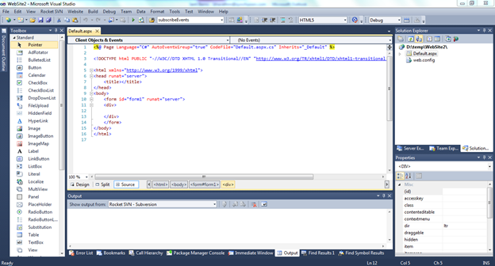
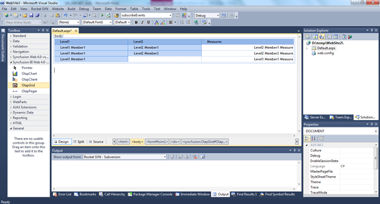
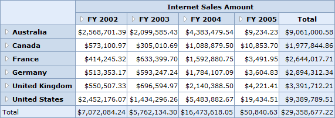

::: {style="DISPLAY: none"}
{#d2h_url_template}{#d2h_package_url style="WIDTH: 0px; DISPLAY: none; HEIGHT: 0px"}
:::

::::: {#nsbanner .d2h_main_nsbanner style="BORDER-BOTTOM: #999999 1px solid; POSITION: relative; PADDING-BOTTOM: 0px; BACKGROUND-COLOR: transparent; PADDING-LEFT: 0px; PADDING-RIGHT: 0px; DISPLAY: none; BORDER-TOP: #999999 1px solid; PADDING-TOP: 0px; LEFT: 0px"}
:::: {#TitleRow .d2h_main_titlerow style="PADDING-BOTTOM: 4px; BACKGROUND-COLOR: transparent; PADDING-LEFT: 22px; WIDTH: 100%; PADDING-RIGHT: 10px; DISPLAY: none; PADDING-TOP: 4px"}
::: {#ienav .d2h_main_ienav style="DISPLAY: none"}
{#D2HPrevious .D2HPreviousEnabled}  {#D2HNext .D2HNextEnabled}
:::
::::
:::::

:::: {#nstext .d2h_main_nstext style="PADDING-BOTTOM: 10px; BACKGROUND-COLOR: transparent; PADDING-LEFT: 22px; PADDING-RIGHT: 10px; HEIGHT: 100%; OVERFLOW: auto; PADDING-TOP: 5px" hasuserbackground="true" valign="bottom"}
## Adding OlapGrid Control to an Application {#adding-olapgrid-control-to-an-application style="tab-stops: 0pt"}

The steps to get started are as follows:

1.   Click **Start** \> **All Programs** \> **Microsoft Visual Studio 2010**.

2.   Create a new **ASP.NET Web Site**.

3.   Drag the **OlapGrid** control from the **Syncfusion BI Web Toolbox** onto the **Design** page.

 

{border="0"}

Figure 5: OLAP Grid in the Source Page

 

{border="0"}

Figure 6: OLAP Grid Appearance in the Design Page

 

4.   Add the following namespaces in the code-behind part.

[·      ]{style="FONT-FAMILY: Symbol"}Syncfusion.Web.UI.WebControls.Grid.Olap

[·      ]{style="FONT-FAMILY: Symbol"}Syncfusion.Olap.Manager

[·      ]{style="FONT-FAMILY: Symbol"}Syncfusion.Olap.Reports

[·      ]{style="FONT-FAMILY: Symbol"}Syncfusion.Olap.DataProvider

 

To bind the OlapGrid control with cube data, initiate the [**OlapDataManager**](http://help.syncfusion.com/UG/Business%20Intelligence/OLAP%20Common/Common/default.htm#!documents/42olapdatamanager.htm) using the methods provided in the following link

 

[**Methods for instantiating OlapDataManager**](http://help.syncfusion.com/UG/Business%20Intelligence/OLAP%20Common/Common/default.htm#!documents/42olapdatamanager.htm)**[]{style="COLOR: red"}**

[]{style="FONT-SIZE: 12pt"} 

5.   After instantiating the OlapDataManager*,* create an [OlapReport](http://help.syncfusion.com/UG/Business%20Intelligence/OLAP%20Common/Common/default.htm#!documents/4311creatingtheolapr.htm) and add it to the OlapDataManager either through the **SetCurrentReport(OlapReport)** method or by the **CurrentReport** property.

6.   Now the OlapReport is assigned to the OlapGrid control's **OlapDataManager** and the **DataBind()** method is called to render the OLAP grid with the current report information.

 

The OlapDataManager can be bound to the OlapGrid using the following code:

 

+----------------------------------------------------------------------------------------------------------------------------------------+
| []{#OLE_LINK2}[**[\[C#\]]{style="FONT-FAMILY: 'Courier New'"}**]{#OLE_LINK1}                                                           |
|                                                                                                                                        |
| [DataManager.SetCurrentReport([this]{style="COLOR: blue"}.CreateReport());]{style="FONT-FAMILY: 'Courier New'"}                        |
|                                                                                                                                        |
| [this]{style="FONT-FAMILY: 'Courier New'; COLOR: blue"}[.olapGrid1.OlapDataManager = DataManager;]{style="FONT-FAMILY: 'Courier New'"} |
|                                                                                                                                        |
| [this]{style="FONT-FAMILY: 'Courier New'; COLOR: blue"}[.olapGrid1.DataBind();]{style="FONT-FAMILY: 'Courier New'"}                    |
+----------------------------------------------------------------------------------------------------------------------------------------+

 

+-------------------------------------------------------------------------------------------------------------------------------------+
| **[\[VB\]]{style="FONT-FAMILY: 'Courier New'"}**                                                                                    |
|                                                                                                                                     |
| [DataManager.SetCurrentReport([Me]{style="COLOR: blue"}.CreateReport())]{style="FONT-FAMILY: 'Courier New'"}                        |
|                                                                                                                                     |
| [Me]{style="FONT-FAMILY: 'Courier New'; COLOR: blue"}[.olapGrid1.OlapDataManager = DataManager]{style="FONT-FAMILY: 'Courier New'"} |
|                                                                                                                                     |
| [Me]{style="FONT-FAMILY: 'Courier New'; COLOR: blue"}[.olapGrid1.DataBind()]{style="FONT-FAMILY: 'Courier New'"}                    |
+-------------------------------------------------------------------------------------------------------------------------------------+

 

Also, [click here](http://help.syncfusion.com/UG/Business%20Intelligence/OLAP%20Common/Common/default.htm#!documents/43olapreport.htm) for more sample reports. The OlapGrid control uses **HttpHandler** by default to procure data from the OLAP Server on the member drill-down and for the header cell ToolTip. Therefore, it requires **OlapDataHandler** to be included in the **httpHandlers** section in **Web.config** file.[ [\
\
]{style="COLOR: #001554"}]{style="FONT-FAMILY: 'Verdana','sans-serif'"}

+------------------------------------------------------------------------------------------------------------------------------------------------------------------------------------------------------------------------------------------------------------------------------------------------------------------------------------------------------------------------------------------------------------------------------------------------------------------------------------------------------------------------------------------------------------------------------------------------------------------------------------------------------------------------------------------------------------------------------------------+
| **[\[Web.Config\]]{style="FONT-FAMILY: 'Courier New'"}**                                                                                                                                                                                                                                                                                                                                                                                                                                                                                                                                                                                                                                                                                 |
|                                                                                                                                                                                                                                                                                                                                                                                                                                                                                                                                                                                                                                                                                                                                          |
| [\<httpHandlers\>]{style="FONT-FAMILY: 'Courier New'; COLOR: blue"}                                                                                                                                                                                                                                                                                                                                                                                                                                                                                                                                                                                                                                                                      |
|                                                                                                                                                                                                                                                                                                                                                                                                                                                                                                                                                                                                                                                                                                                                          |
| [      \.....]{style="FONT-FAMILY: 'Courier New'; COLOR: blue"}                                                                                                                                                                                                                                                                                                                                                                                                                                                                                                                                                                                                                                                                          |
|                                                                                                                                                                                                                                                                                                                                                                                                                                                                                                                                                                                                                                                                                                                                          |
| [\<]{style="FONT-FAMILY: 'Courier New'; COLOR: blue"}[add]{style="FONT-FAMILY: 'Courier New'; COLOR: #a31515"}[ ]{style="FONT-FAMILY: 'Courier New'; COLOR: blue"}[path]{style="FONT-FAMILY: 'Courier New'; COLOR: red"}[=]{style="FONT-FAMILY: 'Courier New'; COLOR: blue"}[\"[\*UpdateOlap\*]{style="COLOR: blue"}\" [verb]{style="COLOR: red"}[=]{style="COLOR: blue"}\"[GET]{style="COLOR: blue"}\"[   ]{style="COLOR: blue"}[type]{style="COLOR: red"}[=]{style="COLOR: blue"}\"[Syncfusion.Web.UI.WebControls.Grid.Olap.Handlers.OLAPDataHandler, Syncfusion.OlapGrid.Web,Version=x.x.x.x, Culture=neutral, PublicKeyToken=3d67ed1f87d44c89]{style="COLOR: blue"}\"[/\>]{style="COLOR: blue"}]{style="FONT-FAMILY: 'Courier New'"} |
|                                                                                                                                                                                                                                                                                                                                                                                                                                                                                                                                                                                                                                                                                                                                          |
| [\</httpHandlers\>]{style="FONT-FAMILY: 'Courier New'; COLOR: blue"}                                                                                                                                                                                                                                                                                                                                                                                                                                                                                                                                                                                                                                                                     |
+------------------------------------------------------------------------------------------------------------------------------------------------------------------------------------------------------------------------------------------------------------------------------------------------------------------------------------------------------------------------------------------------------------------------------------------------------------------------------------------------------------------------------------------------------------------------------------------------------------------------------------------------------------------------------------------------------------------------------------------+

::: {style="BORDER-BOTTOM: windowtext 1pt solid; BORDER-LEFT: medium none; PADDING-BOTTOM: 1pt; MARGIN-TOP: 9pt; PADDING-LEFT: 0pt; PADDING-RIGHT: 0pt; MARGIN-BOTTOM: 9pt; BORDER-TOP: windowtext 1pt solid; BORDER-RIGHT: medium none; PADDING-TOP: 1pt"}
[{border="0"}]{style="COLOR: black"}[Note:]{style="COLOR: black"}[ ]{style="COLOR: black"}x.x.x.x in the above code snippet refers to the current version of the Essential Studio running in your system.
:::

Run the application. The following output is generated.

 

{border="0"}

Figure 7: OlapGrid Control with OLAP Data

[]{#related-topics}
::::
