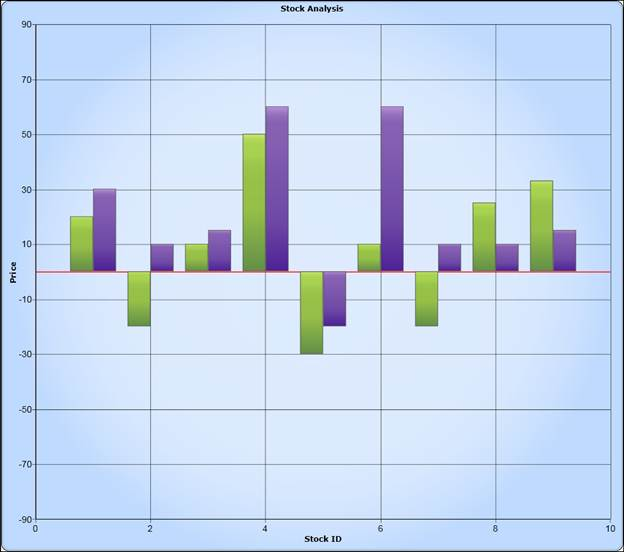
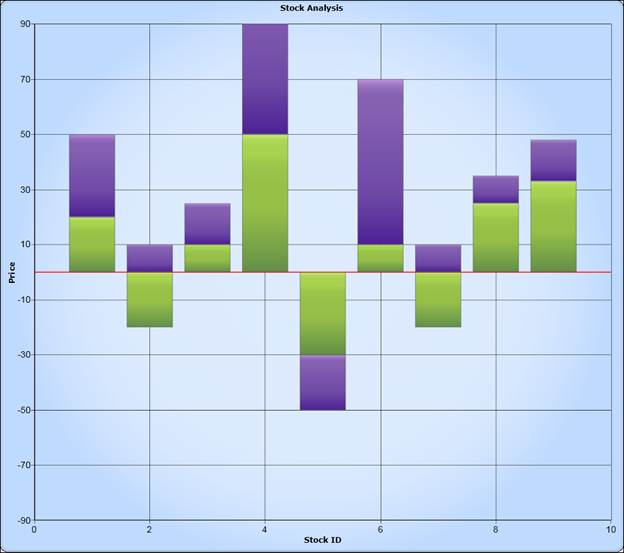

::: {style="DISPLAY: none"}
{#d2h_url_template}{#d2h_package_url style="WIDTH: 0px; DISPLAY: none; HEIGHT: 0px"}
:::

::: {.d2h_secondary_topic style="PADDING-BOTTOM: 10pt; MARGIN: 0pt; PADDING-LEFT: 0pt; PADDING-RIGHT: 0pt; PADDING-TOP: 0pt"}
#### Adding Origin Axis Support for Silverlight Chart to an Application {#adding-origin-axis-support-for-silverlight-chart-to-an-application style="tab-stops: 0pt"}

The origin axis support can be added to the chart using the following code samples.[]{style="COLOR: #c00000"}

[]{style="COLOR: #c00000"} 

**** 

+----------------------------------------------------------------------------------------------------------------------------------------------------------------------------------------------------------------------------------------------------------------------------------------------------------------------------------------------------------------------------------------------------------------------------------------------------------------------------------------------------------------------------------------------------------------------------------------------------------------------------------------------+
| **[\[XAML\]]{style="FONT-FAMILY: 'Courier New'"}**                                                                                                                                                                                                                                                                                                                                                                                                                                                                                                                                                                                           |
|                                                                                                                                                                                                                                                                                                                                                                                                                                                                                                                                                                                                                                              |
| [\<]{style="FONT-FAMILY: Consolas; COLOR: blue; FONT-SIZE: 9.5pt"}[sync]{style="FONT-FAMILY: Consolas; COLOR: #a31515; FONT-SIZE: 9.5pt"}[:]{style="FONT-FAMILY: Consolas; COLOR: blue; FONT-SIZE: 9.5pt"}[ChartAxis]{style="FONT-FAMILY: Consolas; COLOR: #a31515; FONT-SIZE: 9.5pt"}[ Origin]{style="FONT-FAMILY: Consolas; COLOR: red; FONT-SIZE: 9.5pt"}[=\"1\"]{style="FONT-FAMILY: Consolas; COLOR: blue; FONT-SIZE: 9.5pt"}[ ShowOriginLine]{style="FONT-FAMILY: Consolas; COLOR: red; FONT-SIZE: 9.5pt"}[=\"True\"]{style="FONT-FAMILY: Consolas; COLOR: blue; FONT-SIZE: 9.5pt"}[]{style="FONT-FAMILY: Consolas; FONT-SIZE: 9.5pt"} |
|                                                                                                                                                                                                                                                                                                                                                                                                                                                                                                                                                                                                                                              |
| [OriginLineStroke]{style="FONT-FAMILY: Consolas; COLOR: red; FONT-SIZE: 9.5pt"}[=\"Red\"]{style="FONT-FAMILY: Consolas; COLOR: blue; FONT-SIZE: 9.5pt"}[                                   ]{style="FONT-FAMILY: Consolas; FONT-SIZE: 9.5pt"}                                                                                                                                                                                                                                                                                                                                                                                                |
|                                                                                                                                                                                                                                                                                                                                                                                                                                                                                                                                                                                                                                              |
| [OriginLineStrokeThickness]{style="FONT-FAMILY: Consolas; COLOR: red; FONT-SIZE: 9.5pt"}[=\"2\"]{style="FONT-FAMILY: Consolas; COLOR: blue; FONT-SIZE: 9.5pt"}[                                    ]{style="FONT-FAMILY: Consolas; FONT-SIZE: 9.5pt"}                                                                                                                                                                                                                                                                                                                                                                                        |
|                                                                                                                                                                                                                                                                                                                                                                                                                                                                                                                                                                                                                                              |
| [                                   [ /\>]{style="COLOR: blue"}]{style="FONT-FAMILY: Consolas; FONT-SIZE: 9.5pt"}                                                                                                                                                                                                                                                                                                                                                                                                                                                                                                                            |
|                                                                                                                                                                                                                                                                                                                                                                                                                                                                                                                                                                                                                                              |
|                                                                                                                                                                                                                                                                                                                                                                                                                                                                                                                                                                                                                                              |
+----------------------------------------------------------------------------------------------------------------------------------------------------------------------------------------------------------------------------------------------------------------------------------------------------------------------------------------------------------------------------------------------------------------------------------------------------------------------------------------------------------------------------------------------------------------------------------------------------------------------------------------------+

[]{style="COLOR: #c00000"} 

**** 

+-----------------------------------------------------------------------------------------------------------------------------------------------------------------------------------------------------------------------------+
| **[\[C#\]]{style="FONT-FAMILY: 'Courier New'"}**                                                                                                                                                                            |
|                                                                                                                                                                                                                             |
| [chart1.Areas\[0\].PrimaryAxis.Origin = 1;]{style="FONT-FAMILY: Consolas; FONT-SIZE: 9.5pt"}                                                                                                                                |
|                                                                                                                                                                                                                             |
| [            chart1.Areas\[0\].PrimaryAxis.OriginLineStroke = [new]{style="COLOR: blue"} [SolidColorBrush]{style="COLOR: #2b91af"}([Colors]{style="COLOR: #2b91af"}.Red);]{style="FONT-FAMILY: Consolas; FONT-SIZE: 9.5pt"} |
|                                                                                                                                                                                                                             |
| [            chart1.Areas\[0\].PrimaryAxis.OriginLineStrokeThickness = 2;]{style="FONT-FAMILY: Consolas; FONT-SIZE: 9.5pt"}                                                                                                 |
|                                                                                                                                                                                                                             |
| [            chart1.Areas\[0\].PrimaryAxis.ShowOriginLine = [true]{style="COLOR: blue"};]{style="FONT-FAMILY: Consolas; FONT-SIZE: 9.5pt"}                                                                                  |
|                                                                                                                                                                                                                             |
|                                                                                                                                                                                                                             |
+-----------------------------------------------------------------------------------------------------------------------------------------------------------------------------------------------------------------------------+

**{border="0"}**

Figure 123: Origin Axis Support for Column Chart

 

 

**{border="0"}**

Figure 124: Origin Axis Support for Stacked Column Chart

[]{#related-topics}
:::
