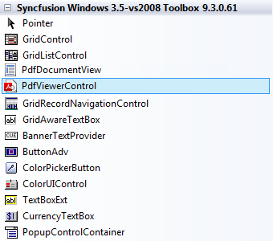
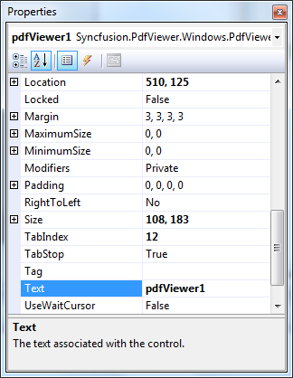

::: {style="DISPLAY: none"}
{#d2h_url_template}{#d2h_package_url style="WIDTH: 0px; DISPLAY: none; HEIGHT: 0px"}
:::

::::: {#nsbanner .d2h_main_nsbanner style="BORDER-BOTTOM: #999999 1px solid; POSITION: relative; PADDING-BOTTOM: 0px; BACKGROUND-COLOR: transparent; PADDING-LEFT: 0px; PADDING-RIGHT: 0px; DISPLAY: none; BORDER-TOP: #999999 1px solid; PADDING-TOP: 0px; LEFT: 0px"}
:::: {#TitleRow .d2h_main_titlerow style="PADDING-BOTTOM: 4px; BACKGROUND-COLOR: transparent; PADDING-LEFT: 22px; WIDTH: 100%; PADDING-RIGHT: 10px; DISPLAY: none; PADDING-TOP: 4px"}
::: {#ienav .d2h_main_ienav style="DISPLAY: none"}
{#D2HPrevious .D2HPreviousEnabled}  {#D2HNext .D2HNextEnabled}
:::
::::
:::::

:::: {#nstext .d2h_main_nstext style="PADDING-BOTTOM: 10px; BACKGROUND-COLOR: transparent; PADDING-LEFT: 22px; PADDING-RIGHT: 10px; HEIGHT: 100%; OVERFLOW: auto; PADDING-TOP: 5px" hasuserbackground="true" valign="bottom"}
::: {#d2h_breadcrumbs .d2h_breadcrumbs}
[Essential Studio User Guide Documentation](ms-xhelp:///?Id=12457748-09e3-4d74-a240-8e049cedf030){.d2h_breadcrumbsNormal}[ \> ]{.d2h_breadcrumbsLinkSeparator}[Reporting Edition](ms-xhelp:///?Id=027aa5b6-6676-4f93-ad23-c20e8c45792e){.d2h_breadcrumbsNormal}[ \> ]{.d2h_breadcrumbsLinkSeparator}[Essential PDF Viewer](ms-xhelp:///?Id=72561ebd-77ed-4f2a-94a7-2b4b635d1dd6){.d2h_breadcrumbsNormal}[ \> ]{.d2h_breadcrumbsLinkSeparator}[PDF Viewer Windows]{.d2h_breadcrumbsContentsOnly}[ \> ]{.d2h_breadcrumbsLinkSeparator}[Getting Started](ms-xhelp:///?Id=177b39ed-c5f2-439b-8f5f-b3665d0fb155){.d2h_breadcrumbsNormal}
:::

## Adding PDF Viewer to an Application {#adding-pdf-viewer-to-an-application style="tab-stops: 0pt"}

To add a PDF Viewer control to your application:

[]{style="COLOR: black"} 

1.   Open your form in the designer. Add the Syncfusion controls to your** **VS.NET toolbox if you haven\'t done so already (the install would have automatically done this unless you selected not to complete toolbox integration during installation).

[]{style="COLOR: #c00000"} 

{border="0"}[]{style="COLOR: #c00000"}

Figure 5*[: PDF Viewer control in Toolbox]{style="FONT-FAMILY: 'Verdana','sans-serif'"}*

*[]{style="FONT-FAMILY: 'Verdana','sans-serif'"}* 

2.   Drag a PDF Viewer control onto the form.

[]{style="COLOR: black"} 

Appearance and behavior-related aspects of the PDF Viewer can be controlled by setting the appropriate properties through the properties grid.

*[]{style="FONT-STYLE: normal; FONT-FAMILY: 'Verdana','sans-serif'"}* 

{border="0"}*[]{style="FONT-STYLE: normal; FONT-FAMILY: 'Verdana','sans-serif'"}*

Figure 6*[: Properties]{style="FONT-FAMILY: 'Verdana','sans-serif'"}*

*[]{style="FONT-STYLE: normal; FONT-FAMILY: 'Verdana','sans-serif'"}* 

3.   Add Syncfusion.PdfViewer.Windows namespace.

*[]{style="FONT-STYLE: normal; FONT-FAMILY: 'Verdana','sans-serif'"}* 

+----------------------------------------------------------------------------------------------------------------------------------------------------------------------------------+
|                                                                                                                                                                                  |
|                                                                                                                                                                                  |
| **C#:**                                                                                                                                                                          |
|                                                                                                                                                                                  |
|                                                                                                                                                                                  |
|                                                                                                                                                                                  |
| [using]{style="FONT-FAMILY: 'Courier New'; COLOR: blue"}[ Syncfusion.PdfViewer.Windows;]{style="FONT-FAMILY: 'Courier New'"}                                                     |
|                                                                                                                                                                                  |
|                                                                                                                                                                                  |
|                                                                                                                                                                                  |
| [//Initializing the PDF Viewer]{style="FONT-FAMILY: 'Courier New'; COLOR: green"}                                                                                                |
|                                                                                                                                                                                  |
| [PdfViewer]{style="FONT-FAMILY: 'Courier New'; COLOR: #2b91af"}[ viewer = [new]{style="COLOR: blue"} [PdfViewer]{style="COLOR: #2b91af"}();]{style="FONT-FAMILY: 'Courier New'"} |
|                                                                                                                                                                                  |
| []{style="FONT-FAMILY: 'Courier New'"}                                                                                                                                           |
|                                                                                                                                                                                  |
| [//Loading the document in the PDF Viewer]{style="FONT-FAMILY: 'Courier New'; COLOR: green"}                                                                                     |
|                                                                                                                                                                                  |
| [viewer.Load([@\"c:/documents/myPDF.pdf\"]{style="COLOR: #a31515"});]{style="FONT-FAMILY: 'Courier New'"}                                                                        |
|                                                                                                                                                                                  |
| []{style="FONT-FAMILY: 'Courier New'"}                                                                                                                                           |
|                                                                                                                                                                                  |
| **[VB:]{style="FONT-FAMILY: 'Courier New'"}**                                                                                                                                    |
|                                                                                                                                                                                  |
| []{style="FONT-FAMILY: 'Courier New'"}                                                                                                                                           |
|                                                                                                                                                                                  |
| []{style="FONT-FAMILY: 'Courier New'"}                                                                                                                                           |
|                                                                                                                                                                                  |
| [Imports]{style="FONT-FAMILY: 'Courier New'; COLOR: blue"}[ Syncfusion.PdfViewer.Windows]{style="FONT-FAMILY: 'Courier New'"}                                                    |
|                                                                                                                                                                                  |
| []{style="FONT-FAMILY: 'Courier New'"}                                                                                                                                           |
|                                                                                                                                                                                  |
| [\'Initializing the Pdf Viewer]{style="FONT-FAMILY: 'Courier New'; COLOR: green"}                                                                                                |
|                                                                                                                                                                                  |
| [ [Dim]{style="COLOR: blue"} viewer [As]{style="COLOR: blue"} PdfViewer = [New]{style="COLOR: blue"} PdfViewer()]{style="FONT-FAMILY: 'Courier New'"}                            |
|                                                                                                                                                                                  |
| []{style="FONT-FAMILY: 'Courier New'"}                                                                                                                                           |
|                                                                                                                                                                                  |
| [\'Loading the document in the Pdf Viewer]{style="FONT-FAMILY: 'Courier New'; COLOR: green"}                                                                                     |
|                                                                                                                                                                                  |
| [ viewer.Load([\"c:/documents/myPDF.pdf\"]{style="COLOR: #a31515"})]{style="FONT-FAMILY: 'Courier New'"}                                                                         |
+----------------------------------------------------------------------------------------------------------------------------------------------------------------------------------+

 

Refer to [Viewing PDF files](ms-xhelp:///?Id=9bba353e-bd74-446c-b1f9-ea8446d66add)[ ]{.UGHyperlink}for more information.[[]{style="COLOR: windowtext; TEXT-DECORATION: none; text-underline: none"}]{.UGHyperlink}

[]{#related-topics}
::::
