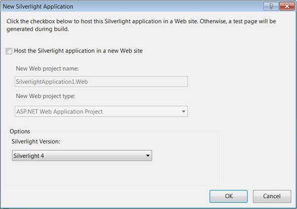
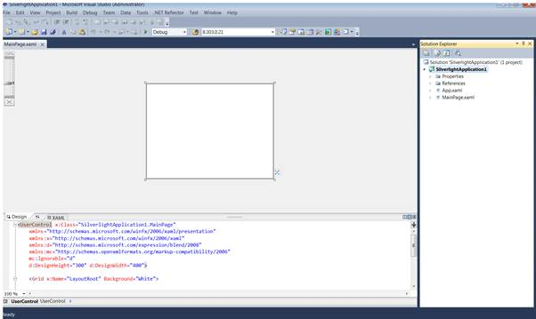

::: {style="DISPLAY: none"}
{#d2h_url_template}{#d2h_package_url style="WIDTH: 0px; DISPLAY: none; HEIGHT: 0px"}
:::

::::: {#nsbanner .d2h_main_nsbanner style="BORDER-BOTTOM: #999999 1px solid; POSITION: relative; PADDING-BOTTOM: 0px; BACKGROUND-COLOR: transparent; PADDING-LEFT: 0px; PADDING-RIGHT: 0px; DISPLAY: none; BORDER-TOP: #999999 1px solid; PADDING-TOP: 0px; LEFT: 0px"}
:::: {#TitleRow .d2h_main_titlerow style="PADDING-BOTTOM: 4px; BACKGROUND-COLOR: transparent; PADDING-LEFT: 22px; WIDTH: 100%; PADDING-RIGHT: 10px; DISPLAY: none; PADDING-TOP: 4px"}
::: {#ienav .d2h_main_ienav style="DISPLAY: none"}
{#D2HPrevious .D2HPreviousEnabled}  {#D2HNext .D2HNextEnabled}
:::
::::
:::::

:::: {#nstext .d2h_main_nstext style="PADDING-BOTTOM: 10px; BACKGROUND-COLOR: transparent; PADDING-LEFT: 22px; PADDING-RIGHT: 10px; HEIGHT: 100%; OVERFLOW: auto; PADDING-TOP: 5px" hasuserbackground="true" valign="bottom"}
::: {#d2h_breadcrumbs .d2h_breadcrumbs}
[Essential Studio User Guide Documentation](ms-xhelp:///?Id=12457748-09e3-4d74-a240-8e049cedf030){.d2h_breadcrumbsNormal}[ \> ]{.d2h_breadcrumbsLinkSeparator}[Business Intelligence Edition](ms-xhelp:///?Id=fdf33dd8-62b2-47b9-ad7b-fc50e590bca5){.d2h_breadcrumbsNormal}[ \> ]{.d2h_breadcrumbsLinkSeparator}[Essential BI Silverlight](ms-xhelp:///?Id=c006b39c-6aa2-4637-b7de-3e7b6cb3f9f9){.d2h_breadcrumbsNormal}[ \> ]{.d2h_breadcrumbsLinkSeparator}[Essential Pivot Grid]{.d2h_breadcrumbsContentsOnly}[ \> ]{.d2h_breadcrumbsLinkSeparator}[Getting Started](ms-xhelp:///?Id=bf406e0f-e28e-46a9-a872-ae5e60743686){.d2h_breadcrumbsNormal}
:::

## Adding PivotGrid to an Application {#adding-pivotgrid-to-an-application style="tab-stops: 0pt"}

 

To add a **PivotGrid** to an application, follow the below steps:

 

1.   Click the **Start** menu, and then click **Microsoft Visual Studio 2010**.

2.   From the **File** menu, click **New Project**. The **New Project** dialog box will be displayed, as shown below.

 

{border="0"}

Figure 5: New Project Dialog Box

 

3.   Select the **Silverlight Application** by navigating to the Silverlight node and then click **OK**.

4.   Uncheck **Host the Silverlight application in a new Web site** in the New Silverlight Application Dialog.

 

{border="0"}

Figure 6: Hosting Silverlight Application in Web

 

5.   Click **OK**, to create a Silverlight project, as shown below.

 

{border="0"}

Figure 7: New Silverlight Application

 

6.   Drag and Drop the **PivotGridControl** from the toolbox to the MainPage.xaml.

 

More:

[ ]{#related-topics}

[{border="0" align="absMiddle"}Populating Data to PivotGrid](ms-xhelp:///?Id=a3f63204-b6a8-40cb-8ea5-2dd2658e44c4){style="TEXT-DECORATION: none"}
::::
