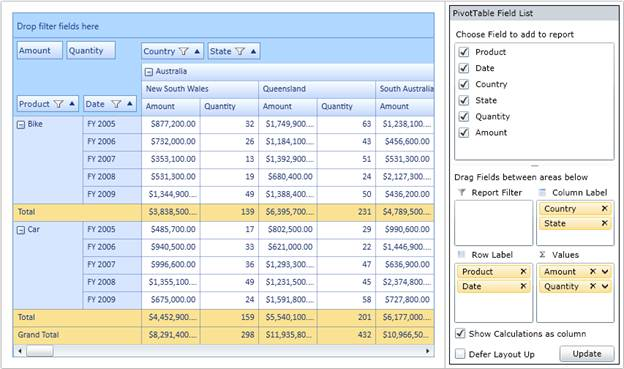
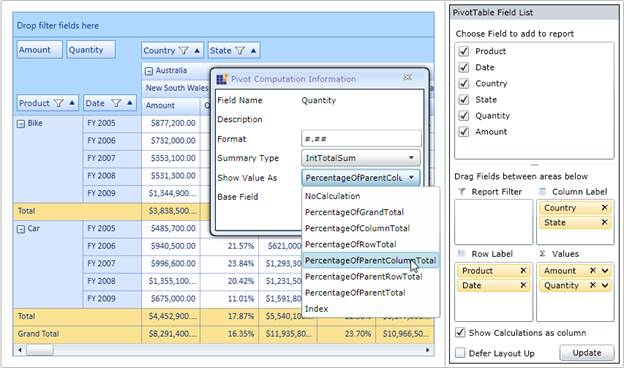
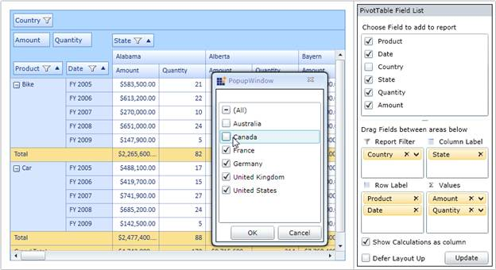

::: {style="DISPLAY: none"}
{#d2h_url_template}{#d2h_package_url style="WIDTH: 0px; DISPLAY: none; HEIGHT: 0px"}
:::

::::: {#nsbanner .d2h_main_nsbanner style="BORDER-BOTTOM: #999999 1px solid; POSITION: relative; PADDING-BOTTOM: 0px; BACKGROUND-COLOR: transparent; PADDING-LEFT: 0px; PADDING-RIGHT: 0px; DISPLAY: none; BORDER-TOP: #999999 1px solid; PADDING-TOP: 0px; LEFT: 0px"}
:::: {#TitleRow .d2h_main_titlerow style="PADDING-BOTTOM: 4px; BACKGROUND-COLOR: transparent; PADDING-LEFT: 22px; WIDTH: 100%; PADDING-RIGHT: 10px; DISPLAY: none; PADDING-TOP: 4px"}
::: {#ienav .d2h_main_ienav style="DISPLAY: none"}
{#D2HPrevious .D2HPreviousEnabled}  {#D2HNext .D2HNextEnabled}
:::
::::
:::::

::: {#nstext .d2h_main_nstext style="PADDING-BOTTOM: 10px; BACKGROUND-COLOR: transparent; PADDING-LEFT: 22px; PADDING-RIGHT: 10px; HEIGHT: 100%; OVERFLOW: auto; PADDING-TOP: 5px" hasuserbackground="true" valign="bottom"}
### Adding Pivot Schema Designer to an Application {#adding-pivot-schema-designer-to-an-application style="TEXT-ALIGN: justify; tab-stops: 0pt"}

The following steps illustrate the implementation of the pivot schema designer in an application.

1.  Create a Silverlight application and add **PivotGridControl** and **PivotSchemaDesigner** to it.

2.  Set the **PivotControl** property of **PivotSchemaDesigner** to the **PivotGridControl** object created via the designer. The following code snippet shows the implementation of the **PivotSchemaDesigner**.

+-----------------------------------------------------------------------------------------------------------------------------------------------------------------------------------------------------------------------------------------------------------------------------------------------------------------------------------------------------------------------------------------------------------------------------------------------------------------------------------------------------------------------------------------------------------------------------------------------------------------------------------------------------------------------------------------------------------------------------------------------+
| **[\[XAML\]]{style="FONT-FAMILY: 'Courier New'"}**                                                                                                                                                                                                                                                                                                                                                                                                                                                                                                                                                                                                                                                                                            |
|                                                                                                                                                                                                                                                                                                                                                                                                                                                                                                                                                                                                                                                                                                                                               |
| []{style="FONT-FAMILY: 'Courier New'"}                                                                                                                                                                                                                                                                                                                                                                                                                                                                                                                                                                                                                                                                                                        |
|                                                                                                                                                                                                                                                                                                                                                                                                                                                                                                                                                                                                                                                                                                                                               |
| [\<]{style="FONT-FAMILY: 'Courier New'; COLOR: blue"}[pivotSchemaDesigner]{style="FONT-FAMILY: 'Courier New'; COLOR: #a31515"}[:]{style="FONT-FAMILY: 'Courier New'; COLOR: blue"}[PivotSchemaDesigner]{style="FONT-FAMILY: 'Courier New'; COLOR: #a31515"}[ Name]{style="FONT-FAMILY: 'Courier New'; COLOR: red"}[=\"Designer\"]{style="FONT-FAMILY: 'Courier New'; COLOR: blue"}[ PivotControl]{style="FONT-FAMILY: 'Courier New'; COLOR: red"}[=\"{]{style="FONT-FAMILY: 'Courier New'; COLOR: blue"}[Binding]{style="FONT-FAMILY: 'Courier New'; COLOR: #a31515"}[ ElementName]{style="FONT-FAMILY: 'Courier New'; COLOR: red"}[=pivotGrid1 }\" ]{style="FONT-FAMILY: 'Courier New'; COLOR: blue"}[ ]{style="FONT-FAMILY: 'Courier New'"} |
|                                                                                                                                                                                                                                                                                                                                                                                                                                                                                                                                                                                                                                                                                                                                               |
|                                                                                                                                                                                                                                                                                                                                                                                                                                                                                                                                                                                                                                                                                                                                               |
+-----------------------------------------------------------------------------------------------------------------------------------------------------------------------------------------------------------------------------------------------------------------------------------------------------------------------------------------------------------------------------------------------------------------------------------------------------------------------------------------------------------------------------------------------------------------------------------------------------------------------------------------------------------------------------------------------------------------------------------------------+

 

+--------------------------------------------------------------------------------------------------------------------------------------------------------------------------+
| **[\[C#\]]{style="FONT-FAMILY: 'Courier New'"}**                                                                                                                         |
|                                                                                                                                                                          |
| [this]{style="FONT-FAMILY: 'Courier New'; COLOR: blue"}[.pivotSchemaDesigner.PivotControl = [this]{style="COLOR: blue"}.pivotGrid1;]{style="FONT-FAMILY: 'Courier New'"} |
|                                                                                                                                                                          |
|                                                                                                                                                                          |
+--------------------------------------------------------------------------------------------------------------------------------------------------------------------------+

[]{style="FONT-FAMILY: 'Calibri','sans-serif'; FONT-SIZE: 11pt"} 

3.  Bind the **PivotCalculations**, **PivotRows**, and **PivotColumns** to the **PivotGridControl** and run the application.

The following images illustrate remarkable functionalities of the pivot schema designer with the PivotGrid control.

{border="0"}

Figure 39: Pivot Schema Designer with PivotGrid Control

 

{border="0"}

Figure 40: Pivot Schema Designer showing Pivot Computation Info Dialog

 

{border="0"}

Figure 41: Pivot Schema Designer showing Pop-up Filter Window

[]{#related-topics}
:::
