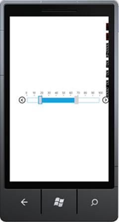

::: {style="DISPLAY: none"}
{#d2h_url_template}{#d2h_package_url style="WIDTH: 0px; DISPLAY: none; HEIGHT: 0px"}
:::

::: {.d2h_secondary_topic style="PADDING-BOTTOM: 10pt; MARGIN: 0pt; PADDING-LEFT: 0pt; PADDING-RIGHT: 0pt; PADDING-TOP: 0pt"}
#### Adding Range Slider to Windows Phone {#adding-range-slider-to-windows-phone style="tab-stops: 0pt"}

To [[create a Windows Phone application and deploy Essential Tools]{style="COLOR: blue"}](ms-xhelp:///?Id=e00c01e2-54ec-409e-ae1b-ed46f9d987ab)[[ ]{style="COLOR: blue"}]{.underline}for Windows Phone, refer to section [[3 Getting Started]{style="COLOR: blue"}](ms-xhelp:///?Id=d834657a-72d4-4708-ba64-765b92f7c9ea). This section covers how to add Range Slider control to this application.

 

The *Range Slider* control can be added to the application using either Xaml or procedural code. The following code illustrartes this:

[]{style="FONT-FAMILY: 'Calibri','sans-serif'"} 

+---------------------------------------------------------------------------------------------------------------------------------------------------------------------------------------------------------------------------------------------------------------------------------------------------------------------------------------------------------------------------------------------------------------------------------------------------------------------------------------------+
| **[\[XAML\]]{style="FONT-FAMILY: 'Calibri','sans-serif'"}**[]{style="FONT-FAMILY: Consolas; COLOR: blue; FONT-SIZE: 9.5pt"}                                                                                                                                                                                                                                                                                                                                                                 |
|                                                                                                                                                                                                                                                                                                                                                                                                                                                                                             |
| []{style="FONT-FAMILY: Consolas; COLOR: blue; FONT-SIZE: 9.5pt"}                                                                                                                                                                                                                                                                                                                                                                                                                            |
|                                                                                                                                                                                                                                                                                                                                                                                                                                                                                             |
| [\<]{style="FONT-FAMILY: Consolas; COLOR: blue; FONT-SIZE: 9.5pt"}[sync]{style="FONT-FAMILY: Consolas; COLOR: #a31515; FONT-SIZE: 9.5pt"}[:]{style="FONT-FAMILY: Consolas; COLOR: blue; FONT-SIZE: 9.5pt"}[RangeSlider]{style="FONT-FAMILY: Consolas; COLOR: #a31515; FONT-SIZE: 9.5pt"}[ x:Name]{style="FONT-FAMILY: Consolas; COLOR: red; FONT-SIZE: 9.5pt"}[=\"slider\"/\>]{style="FONT-FAMILY: Consolas; COLOR: blue; FONT-SIZE: 9.5pt"}[]{style="FONT-FAMILY: 'Calibri','sans-serif'"} |
+---------------------------------------------------------------------------------------------------------------------------------------------------------------------------------------------------------------------------------------------------------------------------------------------------------------------------------------------------------------------------------------------------------------------------------------------------------------------------------------------+

 

+----------------------------------------------------------------------------------------------------------------------------------------------------------------------------------------------------------------+
| [\[C#\]]{style="FONT-FAMILY: 'Calibri','sans-serif'"}[]{style="FONT-FAMILY: Consolas; COLOR: #2b91af; FONT-SIZE: 9.5pt"}                                                                                       |
|                                                                                                                                                                                                                |
| []{style="FONT-FAMILY: Consolas; COLOR: #2b91af; FONT-SIZE: 9.5pt"}                                                                                                                                            |
|                                                                                                                                                                                                                |
| [RangeSldier]{style="FONT-FAMILY: Consolas; COLOR: #2b91af; FONT-SIZE: 9.5pt"}[ slider = [new]{style="COLOR: blue"} [RangeSlider]{style="COLOR: #2b91af"}();]{style="FONT-FAMILY: Consolas; FONT-SIZE: 9.5pt"} |
+----------------------------------------------------------------------------------------------------------------------------------------------------------------------------------------------------------------+

 

{border="0"}

Figure 114: Range Slider

 

 

[]{#related-topics}
:::
