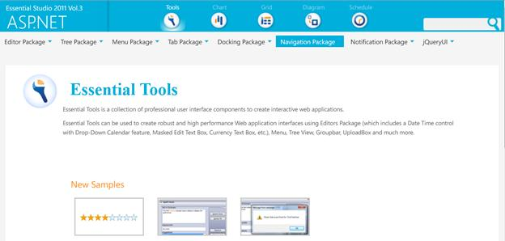
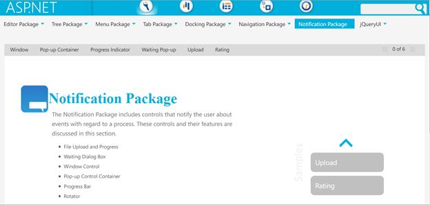
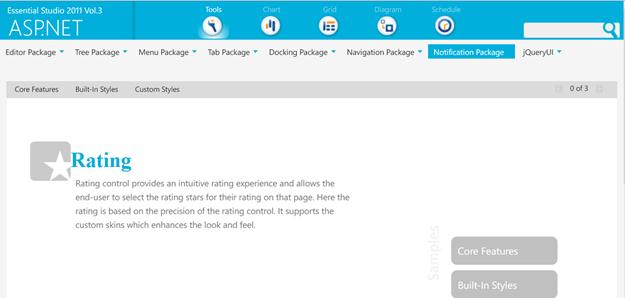

::: {style="DISPLAY: none"}
{#d2h_url_template}{#d2h_package_url style="WIDTH: 0px; DISPLAY: none; HEIGHT: 0px"}
:::

::: {.d2h_secondary_topic style="PADDING-BOTTOM: 10pt; MARGIN: 0pt; PADDING-LEFT: 0pt; PADDING-RIGHT: 0pt; PADDING-TOP: 0pt"}
#### Adding Rating control to ASP.NET Tools {#adding-rating-control-to-asp.net-tools style="tab-stops: 0pt"}

Rating Control can be created in the following two ways-

**Through Designer:**

+-------------------------------------------------------------------------------------------------------------------------------------------------------------------------------------------------------------------------------------------------------------------------------------------------------------------------------------------------------------+
| **[\[ASPX\]]{style="FONT-FAMILY: 'Courier New'"}**[]{style="FONT-FAMILY: 'Courier New'"}                                                                                                                                                                                                                                                                    |
|                                                                                                                                                                                                                                                                                                                                                             |
| [            [\<]{style="COLOR: blue"}[syncfusion]{style="COLOR: maroon"}[:]{style="COLOR: blue"}[rating]{style="COLOR: maroon"} [runat]{style="COLOR: red"}[=\"server\"\>\</]{style="COLOR: blue"}[syncfusion]{style="COLOR: maroon"}[:]{style="COLOR: blue"}[rating]{style="COLOR: maroon"}[\>]{style="COLOR: blue"}]{style="FONT-FAMILY: 'Courier New'"} |
+-------------------------------------------------------------------------------------------------------------------------------------------------------------------------------------------------------------------------------------------------------------------------------------------------------------------------------------------------------------+

**[]{style="FONT-FAMILY: 'Calibri','sans-serif'; FONT-SIZE: 11pt"}** 

 

**Through code:**

+--------------------------------------------------------------------------------------------------------------------------------------------------------+
| [\[C#\]]{style="FONT-FAMILY: 'Courier New'"}                                                                                                           |
|                                                                                                                                                        |
| [        [Rating]{style="COLOR: #2b91af"} rating = [new]{style="COLOR: blue"} [Rating]{style="COLOR: #2b91af"}();]{style="FONT-FAMILY: 'Courier New'"} |
|                                                                                                                                                        |
| [        rating.ID = [\"rating1\"]{style="COLOR: #a31515"};]{style="FONT-FAMILY: 'Courier New'"}                                                       |
|                                                                                                                                                        |
| [        [this]{style="COLOR: blue"}.Controls.Add(rating);]{style="FONT-FAMILY: 'Courier New'"}                                                        |
|                                                                                                                                                        |
| **[]{style="FONT-FAMILY: 'Courier New'"}**                                                                                                             |
+--------------------------------------------------------------------------------------------------------------------------------------------------------+

**[]{style="FONT-FAMILY: 'Calibri','sans-serif'; FONT-SIZE: 11pt"}** 

 

 

+-----------------------------------------------------------------------------------------------------------------------------------------------------------------------+
| **[]{style="FONT-FAMILY: 'Courier New'"}**                                                                                                                            |
|                                                                                                                                                                       |
| [\[VB\]]{style="FONT-FAMILY: 'Courier New'"}                                                                                                                          |
|                                                                                                                                                                       |
| []{style="FONT-FAMILY: 'Courier New'"}                                                                                                                                |
|                                                                                                                                                                       |
| [      [Dim]{style="COLOR: blue"} rating [As]{style="COLOR: blue"} [New]{style="COLOR: blue"} [Rating]{style="COLOR: #2b91af"}()]{style="FONT-FAMILY: 'Courier New'"} |
|                                                                                                                                                                       |
| [      rating.ID = \"rating1\"]{style="FONT-FAMILY: 'Courier New'"}                                                                                                   |
|                                                                                                                                                                       |
| [      [Me]{style="COLOR: blue"}.Controls.Add(rating)]{style="FONT-FAMILY: 'Courier New'"}                                                                            |
|                                                                                                                                                                       |
| []{style="FONT-FAMILY: 'Courier New'"}                                                                                                                                |
|                                                                                                                                                                       |
| **[]{style="FONT-FAMILY: 'Courier New'"}**                                                                                                                            |
|                                                                                                                                                                       |
| **[]{style="FONT-FAMILY: 'Courier New'"}**                                                                                                                            |
+-----------------------------------------------------------------------------------------------------------------------------------------------------------------------+

**[]{style="FONT-FAMILY: 'Calibri','sans-serif'; FONT-SIZE: 11pt"}** 

Where do I find Installed samples?

Source Code Location

The full source code of the Rotator Control will be available on the purchase of the product.

The default location of the Essential Tools Web source code is:

***\[Location where you have installed Syncfusion Products\]***[à]{style="FONT-FAMILY: Wingdings"} **** ***Essential Studio\\vx.x.x.x\\Web\\Tools.Web\\Src***

Viewing Samples

To view the samples:

1.   Click Dashboard. The Essential Studio Enterprise Edition window is displayed.

The User Interface Edition panel is displayed by default.

2.   Click the drop-down button of ASP.NET platform. 

3.   Click the **Run Locally Installed Samples** link. The Essential Studio ASP.NET Edition sample browser is displayed.

 

{border="0"}

Figure 3: ASP.NET Edition Sample Browser

[]{style="FONT-SIZE: 9pt"} 

4.   When you click on Locally Installed Samples, the default ASP.NET Tools sample browser page opens.[]{style="FONT-SIZE: 11pt"}

       {border="0"}

Figure 440: ASP.NET Tools Sample Browser page

5.   Select Notification package tab provided and browse through the features.

         

 

{border="0"}

Figure 441: Rating control

 

[]{#related-topics}
:::
