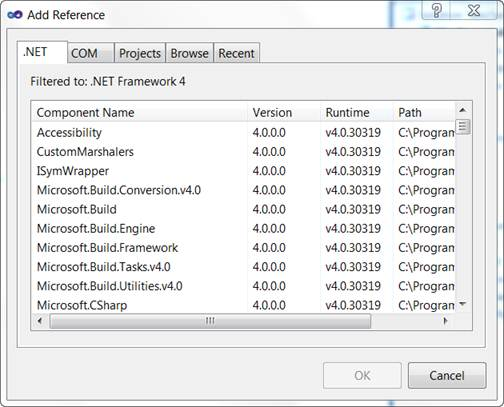
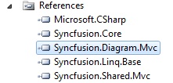

::: {style="DISPLAY: none"}
{#d2h_url_template}{#d2h_package_url style="WIDTH: 0px; DISPLAY: none; HEIGHT: 0px"}
:::

::::: {.d2h_secondary_topic style="PADDING-BOTTOM: 10pt; MARGIN: 0pt; PADDING-LEFT: 0pt; PADDING-RIGHT: 0pt; PADDING-TOP: 0pt"}
#### Adding Reference Assemblies {#adding-reference-assemblies style="tab-stops: 0pt"}

To add reference assemblies:

1.   On the **Solution Explorer**, right-click the **References** folder, and then click **Add Reference**.

[]{style="FONT-FAMILY: 'Calibri','sans-serif'"} 

{border="0"}

Figure 15: Add Reference Option Displayed on Right-Clicking the References Folder****

[]{style="FONT-FAMILY: 'Calibri','sans-serif'"} 

::: {style="BORDER-BOTTOM: windowtext 1pt solid; BORDER-LEFT: medium none; PADDING-BOTTOM: 1pt; MARGIN-TOP: 9pt; PADDING-LEFT: 0pt; PADDING-RIGHT: 0pt; MARGIN-BOTTOM: 9pt; BORDER-TOP: windowtext 1pt solid; BORDER-RIGHT: medium none; PADDING-TOP: 1pt"}
{border="0"}Note: The Add Reference dialog box appears and the .NET tab is highlighted by default. The assemblies for the MVC application are listed here.
:::

[]{style="FONT-FAMILY: 'Calibri','sans-serif'"} 

{border="0"}

Figure 16: Add Reference Dialog Box**[[]{style="FONT-STYLE: normal; FONT-FAMILY: 'Calibri','sans-serif'"}]{.underline}**

[]{style="FONT-FAMILY: 'Calibri','sans-serif'"} 

[]{style="FONT-FAMILY: 'Calibri','sans-serif'"} 

2.   Select the following assemblies: **Syncfusion.Core**, **Syncfusion.Diagram.Mvc**, **Syncfusion.Linq.Base**, and **Syncfusion.Shared.Mvc**.

3.   Click **OK**.

::: {style="BORDER-BOTTOM: windowtext 1pt solid; BORDER-LEFT: medium none; PADDING-BOTTOM: 1pt; MARGIN-TOP: 9pt; PADDING-LEFT: 0pt; PADDING-RIGHT: 0pt; MARGIN-BOTTOM: 9pt; BORDER-TOP: windowtext 1pt solid; BORDER-RIGHT: medium none; PADDING-TOP: 1pt"}
 

{border="0"}Note: The selected assemblies are added under References.
:::

[]{style="FONT-FAMILY: 'Calibri','sans-serif'"} 

{border="0"}

Figure 17: Selected Assemblies Displayed under the References Folder

[]{style="FONT-FAMILY: 'Calibri','sans-serif'"} 

[]{#related-topics}
:::::
