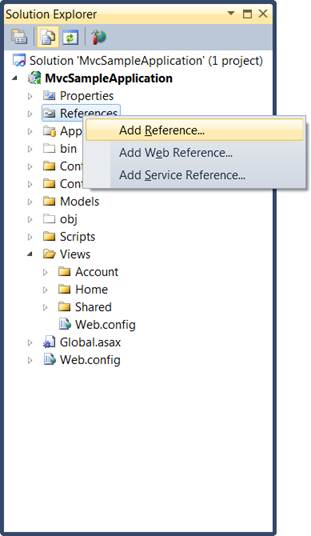
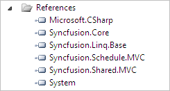

::: {style="DISPLAY: none"}
{#d2h_url_template}{#d2h_package_url style="WIDTH: 0px; DISPLAY: none; HEIGHT: 0px"}
:::

::::: {#nsbanner .d2h_main_nsbanner style="BORDER-BOTTOM: #999999 1px solid; POSITION: relative; PADDING-BOTTOM: 0px; BACKGROUND-COLOR: transparent; PADDING-LEFT: 0px; PADDING-RIGHT: 0px; DISPLAY: none; BORDER-TOP: #999999 1px solid; PADDING-TOP: 0px; LEFT: 0px"}
:::: {#TitleRow .d2h_main_titlerow style="PADDING-BOTTOM: 4px; BACKGROUND-COLOR: transparent; PADDING-LEFT: 22px; WIDTH: 100%; PADDING-RIGHT: 10px; DISPLAY: none; PADDING-TOP: 4px"}
::: {#ienav .d2h_main_ienav style="DISPLAY: none"}
{#D2HPrevious .D2HPreviousEnabled}  {#D2HNext .D2HNextEnabled}
:::
::::
:::::

:::::: {#nstext .d2h_main_nstext style="PADDING-BOTTOM: 10px; BACKGROUND-COLOR: transparent; PADDING-LEFT: 22px; PADDING-RIGHT: 10px; HEIGHT: 100%; OVERFLOW: auto; PADDING-TOP: 5px" hasuserbackground="true" valign="bottom"}
::: {#d2h_breadcrumbs .d2h_breadcrumbs}
[Essential Studio User Guide Documentation](ms-xhelp:///?Id=12457748-09e3-4d74-a240-8e049cedf030){.d2h_breadcrumbsNormal}[ \> ]{.d2h_breadcrumbsLinkSeparator}[User Interface Edition](ms-xhelp:///?Id=c29296b7-531c-413b-a0ec-488ca1f7f669){.d2h_breadcrumbsNormal}[ \> ]{.d2h_breadcrumbsLinkSeparator}[Essential ASP.NET MVC](ms-xhelp:///?Id=4b14e7d1-65c4-4f67-b1aa-2c37709905a5){.d2h_breadcrumbsNormal}[ \> ]{.d2h_breadcrumbsLinkSeparator}[Essential Schedule]{.d2h_breadcrumbsContentsOnly}[ \> ]{.d2h_breadcrumbsLinkSeparator}[Getting Started](ms-xhelp:///?Id=b686dbe4-808e-405b-8e03-33b17be71f0d){.d2h_breadcrumbsNormal}[ \> ]{.d2h_breadcrumbsLinkSeparator}[Adding Essential Schedule to the Application(Razor)](ms-xhelp:///?Id=31314140-fffc-4e28-9c13-759a6622063c){.d2h_breadcrumbsNormal}
:::

### Adding Reference Assemblies {#adding-reference-assemblies style="tab-stops: 0pt"}

To add Reference Assemblies:

6.   On the **Solution Explorer**, right-click **References** folder, and then click **Add Reference**.

[]{style="FONT-FAMILY: 'Calibri','sans-serif'"} 

{border="0"}****

[]{style="FONT-FAMILY: 'Calibri','sans-serif'"} 

Figure 52: Add Reference option displayed on right-clicking the References Folder

[]{style="FONT-FAMILY: 'Calibri','sans-serif'"} 

::: {style="BORDER-BOTTOM: windowtext 1pt solid; BORDER-LEFT: medium none; PADDING-BOTTOM: 1pt; MARGIN-TOP: 9pt; PADDING-LEFT: 0pt; PADDING-RIGHT: 0pt; MARGIN-BOTTOM: 9pt; BORDER-TOP: windowtext 1pt solid; BORDER-RIGHT: medium none; PADDING-TOP: 1pt"}
 

{border="0"}Note: The Add Reference dialog box appears and the .NET tab is highlighted by default. The assemblies for the MVC application are listed here.
:::

[]{style="FONT-FAMILY: 'Calibri','sans-serif'"} 

{border="0"}******

[]{style="FONT-FAMILY: 'Calibri','sans-serif'"} 

Figure 53: Add Reference Dialog Box

[]{style="FONT-FAMILY: 'Calibri','sans-serif'"} 

4.   Select the following assemblies: Syncfusion.Core, Syncfusion.Schedule.Mvc, Syncfusion.Linq.Base and Syncfusion.Shared.Mvc.

5.   Click **OK**.

::: {style="BORDER-BOTTOM: windowtext 1pt solid; BORDER-LEFT: medium none; PADDING-BOTTOM: 1pt; MARGIN-TOP: 9pt; PADDING-LEFT: 0pt; PADDING-RIGHT: 0pt; MARGIN-BOTTOM: 9pt; BORDER-TOP: windowtext 1pt solid; BORDER-RIGHT: medium none; PADDING-TOP: 1pt"}
{border="0"}Note: The selected assemblies are added under References.
:::

[]{style="FONT-FAMILY: 'Calibri','sans-serif'"} 

{border="0"}

[]{style="FONT-FAMILY: 'Calibri','sans-serif'"} 

Figure 54: Selected Assemblies displayed under the References Folder

[]{style="FONT-FAMILY: 'Calibri','sans-serif'"} 

[]{#related-topics}
::::::
