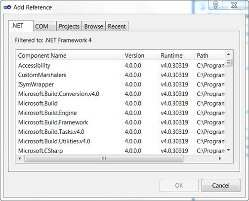
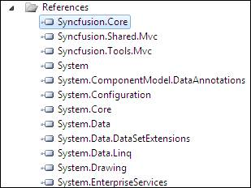

::: {style="DISPLAY: none"}
{#d2h_url_template}{#d2h_package_url style="WIDTH: 0px; DISPLAY: none; HEIGHT: 0px"}
:::

::::: {#nsbanner .d2h_main_nsbanner style="BORDER-BOTTOM: #999999 1px solid; POSITION: relative; PADDING-BOTTOM: 0px; BACKGROUND-COLOR: transparent; PADDING-LEFT: 0px; PADDING-RIGHT: 0px; DISPLAY: none; BORDER-TOP: #999999 1px solid; PADDING-TOP: 0px; LEFT: 0px"}
:::: {#TitleRow .d2h_main_titlerow style="PADDING-BOTTOM: 4px; BACKGROUND-COLOR: transparent; PADDING-LEFT: 22px; WIDTH: 100%; PADDING-RIGHT: 10px; DISPLAY: none; PADDING-TOP: 4px"}
::: {#ienav .d2h_main_ienav style="DISPLAY: none"}
{#D2HPrevious .D2HPreviousEnabled}  {#D2HNext .D2HNextEnabled}
:::
::::
:::::

:::: {#nstext .d2h_main_nstext style="PADDING-BOTTOM: 10px; BACKGROUND-COLOR: transparent; PADDING-LEFT: 22px; PADDING-RIGHT: 10px; HEIGHT: 100%; OVERFLOW: auto; PADDING-TOP: 5px" hasuserbackground="true" valign="bottom"}
::: {#d2h_breadcrumbs .d2h_breadcrumbs}
[Essential Studio User Guide Documentation](ms-xhelp:///?Id=12457748-09e3-4d74-a240-8e049cedf030){.d2h_breadcrumbsNormal}[ \> ]{.d2h_breadcrumbsLinkSeparator}[User Interface Edition](ms-xhelp:///?Id=c29296b7-531c-413b-a0ec-488ca1f7f669){.d2h_breadcrumbsNormal}[ \> ]{.d2h_breadcrumbsLinkSeparator}[Essential ASP.NET MVC](ms-xhelp:///?Id=4b14e7d1-65c4-4f67-b1aa-2c37709905a5){.d2h_breadcrumbsNormal}[ \> ]{.d2h_breadcrumbsLinkSeparator}[Essential Tools]{.d2h_breadcrumbsContentsOnly}[ \> ]{.d2h_breadcrumbsLinkSeparator}[Getting Started](ms-xhelp:///?Id=719c055e-a029-45a1-90f0-c5c2b8bae2a4){.d2h_breadcrumbsNormal}[ \> ]{.d2h_breadcrumbsLinkSeparator}[Adding Essential Tools to the Application (Razor)](ms-xhelp:///?Id=8d96edb1-c362-4052-87d0-95ea3f4bc6b9){.d2h_breadcrumbsNormal}
:::

### Adding Reference Assemblies {#adding-reference-assemblies style="tab-stops: 0pt"}

The following are the steps to add Reference Assemblies:

1.   In the **Solution Explorer**, right-click the **References** folder.

2.  Click **Add Reference**.

{border="0"}

*[Figure ]{style="FONT-SIZE: 9pt"}[45]{style="FONT-SIZE: 9pt"}[:]{style="FONT-SIZE: 9pt"}[ Add Reference option displayed on right-clicking the References Folder]{style="FONT-SIZE: 9pt"}*

*[[[]{style="TEXT-DECORATION: none"}]{style="FONT-SIZE: 9pt"}]{.underline}* 

**[]{style="FONT-FAMILY: 'Calibri','sans-serif'; FONT-SIZE: 12pt"}** 

***[]{style="LAYOUT-GRID-MODE: line; FONT-SIZE: 9pt"}*** 

[3.   ]{style="LAYOUT-GRID-MODE: line"}The Add Reference dialog box opens. The .NET tab is highlighted by default. ***[]{style="LAYOUT-GRID-MODE: line; FONT-SIZE: 9pt"}***

***[]{style="LAYOUT-GRID-MODE: line; FONT-SIZE: 9pt"}*** 

{border="0"}

*[Figure ]{style="FONT-SIZE: 9pt"}[46]{style="FONT-SIZE: 9pt"}[: ]{style="FONT-SIZE: 9pt"}[Add Reference Dialog Box]{style="FONT-SIZE: 9pt"}*

***[]{style="FONT-FAMILY: 'Calibri','sans-serif'"}*** 

4.  Select the following assemblies:

 

[·      ]{style="FONT-FAMILY: Symbol"}Syncfusion.Core

[·      ]{style="FONT-FAMILY: Symbol"}Syncfusion.Tools.Mvc

[·      ]{style="FONT-FAMILY: Symbol"}Syncfusion.Shared.Mvc.

 

5.  Click **OK**. The selected assemblies will be added to the Reference folder.

***[]{style="LAYOUT-GRID-MODE: line; FONT-SIZE: 9pt"}*** 

***[]{style="LAYOUT-GRID-MODE: line; FONT-SIZE: 9pt"}*** 

{border="0"}

*[Figure ]{style="FONT-SIZE: 9pt"}[47]{style="FONT-SIZE: 9pt"}[: ]{style="FONT-SIZE: 9pt"}[Selected Assemblies displayed under the References Folder]{style="FONT-SIZE: 9pt"}*

*[[[]{style="TEXT-DECORATION: none"}]{style="FONT-SIZE: 9pt"}]{.underline}* 

***[]{style="FONT-FAMILY: 'Calibri','sans-serif'"}*** 

[]{#related-topics}
::::
