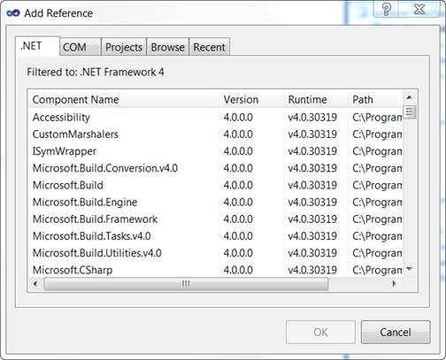
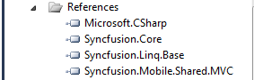

::: {style="DISPLAY: none"}
{#d2h_url_template}{#d2h_package_url style="WIDTH: 0px; DISPLAY: none; HEIGHT: 0px"}
:::

::::: {#nsbanner .d2h_main_nsbanner style="BORDER-BOTTOM: #999999 1px solid; POSITION: relative; PADDING-BOTTOM: 0px; BACKGROUND-COLOR: transparent; PADDING-LEFT: 0px; PADDING-RIGHT: 0px; DISPLAY: none; BORDER-TOP: #999999 1px solid; PADDING-TOP: 0px; LEFT: 0px"}
:::: {#TitleRow .d2h_main_titlerow style="PADDING-BOTTOM: 4px; BACKGROUND-COLOR: transparent; PADDING-LEFT: 22px; WIDTH: 100%; PADDING-RIGHT: 10px; DISPLAY: none; PADDING-TOP: 4px"}
::: {#ienav .d2h_main_ienav style="DISPLAY: none"}
{#D2HPrevious .D2HPreviousEnabled}  {#D2HNext .D2HNextEnabled}
:::
::::
:::::

:::: {#nstext .d2h_main_nstext style="PADDING-BOTTOM: 10px; BACKGROUND-COLOR: transparent; PADDING-LEFT: 22px; PADDING-RIGHT: 10px; HEIGHT: 100%; OVERFLOW: auto; PADDING-TOP: 5px" hasuserbackground="true" valign="bottom"}
::: {#d2h_breadcrumbs .d2h_breadcrumbs}
[Essential Studio User Guide Documentation](ms-xhelp:///?Id=12457748-09e3-4d74-a240-8e049cedf030){.d2h_breadcrumbsNormal}[ \> ]{.d2h_breadcrumbsLinkSeparator}[User Interface Edition](ms-xhelp:///?Id=c29296b7-531c-413b-a0ec-488ca1f7f669){.d2h_breadcrumbsNormal}[ \> ]{.d2h_breadcrumbsLinkSeparator}[Essential Mobile MVC](ms-xhelp:///?Id=74df42e3-5434-4590-9be6-3ae2f911cbbc){.d2h_breadcrumbsNormal}[ \> ]{.d2h_breadcrumbsLinkSeparator}[Essential Grid]{.d2h_breadcrumbsContentsOnly}[ \> ]{.d2h_breadcrumbsLinkSeparator}[Getting Started](ms-xhelp:///?Id=397f4d98-2e34-4dc5-8b77-1d56a317b150){.d2h_breadcrumbsNormal}[ \> ]{.d2h_breadcrumbsLinkSeparator}[Adding Essential Mobile Tools to the MVC3 ASPX Application](ms-xhelp:///?Id=0ca8a414-fdd5-4640-a96f-f144cf6b16be){.d2h_breadcrumbsNormal}
:::

### [[     ]{style="COLOR: windowtext; TEXT-DECORATION: none; text-underline: none"}](ms-xhelp:///?Id=2b5f6627-1320-4a9f-8c8f-215f023234fe)Adding Reference Assemblies {#adding-reference-assemblies style="tab-stops: 0pt"}

To add reference assemblies:

1.  On the **Solution Explorer**, right-click the **References** folder.

2.  Click **Add Reference**.

 

{border="0"}

Figure 16: Add Reference Option Displayed on Right-Clicking the References Folder

 

{border="0"}[Note: The **Add Reference** dialog box appears and the .NET tab is highlighted by default. The assemblies for the MVC application are listed here.]{style="FONT-FAMILY: 'Arial','sans-serif'; FONT-SIZE: 10pt"}

{border="0"}

Figure 17: Add Reference Dialog Box

 

3.  Select the following assemblies: **Syncfusion.Core**, **Syncfusion.Linq.Base**, and **Syncfusion.Mobile.Shared.Mvc**.

4.  Click **OK**.

 

{border="0"}[Note: The selected assemblies are added under **References**.]{style="FONT-FAMILY: 'Arial','sans-serif'; FONT-SIZE: 10pt"}

{border="0"}

Figure 18: Selected Assemblies Displayed Under the References Folder

[]{#related-topics}
::::
