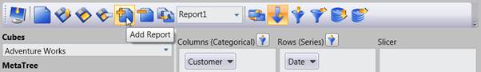
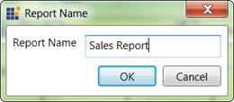

::: {style="DISPLAY: none"}
{#d2h_url_template} {#d2h_package_url style="WIDTH: 0px; DISPLAY: none; HEIGHT: 0px"}
:::

::: {.d2h_secondary_topic style="PADDING-BOTTOM: 10pt; MARGIN: 0pt; PADDING-LEFT: 0pt; PADDING-RIGHT: 0pt; PADDING-TOP: 0pt"}
#### Adding Report {#adding-report style="tab-stops: 0pt"}

 

To add a report, click **Add Report** in the tool bar. It will ask a name for the new report. By providing the name, a new report will be added.

 

{border="0"}

Figure 18: Adding a new Report to current Report Set

[]{style="FONT-FAMILY: 'Calibri','sans-serif'"} 

{border="0"}

Figure 19: Entering the name for New Report

This can also be done through an **API** which is mentioned in the following code snippet.

 

+-------------------------------------------------------------------------------------------------------------------------+
| [\[C#\]]{style="FONT-FAMILY: 'Courier New'"}                                                                            |
|                                                                                                                         |
| []{style="FONT-FAMILY: 'Courier New'"}                                                                                  |
|                                                                                                                         |
| [this]{style="FONT-FAMILY: 'Courier New'; COLOR: blue"} [.olapClient1.AddReport();]{style="FONT-FAMILY: 'Courier New'"} |
|                                                                                                                         |
| []{style="FONT-FAMILY: 'Courier New'"}                                                                                  |
+-------------------------------------------------------------------------------------------------------------------------+

[]{style="FONT-FAMILY: 'Calibri','sans-serif'"} 

+---------------------------------------------------------------------------------------------------------------------------------------------+
| [\[VB\]]{style="FONT-FAMILY: 'Courier New'"}                                                                                                |
|                                                                                                                                             |
| [   ]{style="FONT-FAMILY: 'Courier New'"}                                                                                                   |
|                                                                                                                                             |
| [Me]{style="FONT-FAMILY: 'Courier New'; COLOR: blue"} [.olapClient1.AddReport()[]{style="COLOR: blue"}]{style="FONT-FAMILY: 'Courier New'"} |
|                                                                                                                                             |
| []{style="FONT-FAMILY: 'Courier New'"}                                                                                                      |
+---------------------------------------------------------------------------------------------------------------------------------------------+

[]{#related-topics}
:::
