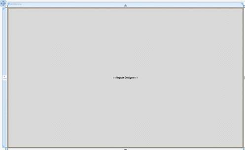
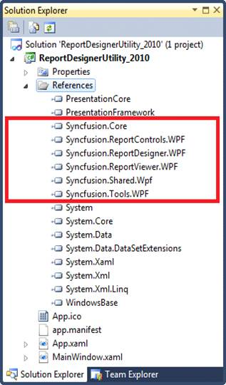
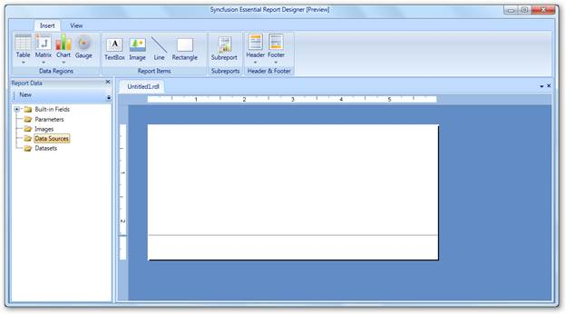
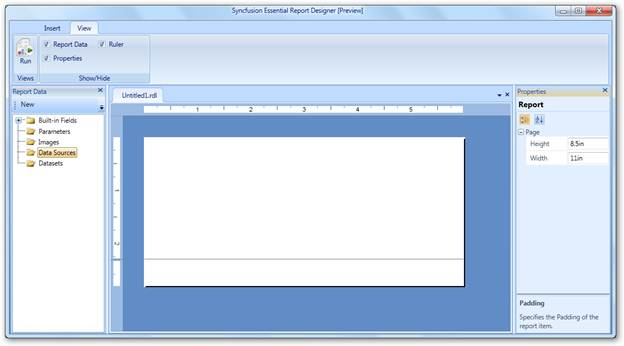

::: {style="DISPLAY: none"}
{#d2h_url_template}{#d2h_package_url style="WIDTH: 0px; DISPLAY: none; HEIGHT: 0px"}
:::

::::: {#nsbanner .d2h_main_nsbanner style="BORDER-BOTTOM: #999999 1px solid; POSITION: relative; PADDING-BOTTOM: 0px; BACKGROUND-COLOR: transparent; PADDING-LEFT: 0px; PADDING-RIGHT: 0px; DISPLAY: none; BORDER-TOP: #999999 1px solid; PADDING-TOP: 0px; LEFT: 0px"}
:::: {#TitleRow .d2h_main_titlerow style="PADDING-BOTTOM: 4px; BACKGROUND-COLOR: transparent; PADDING-LEFT: 22px; WIDTH: 100%; PADDING-RIGHT: 10px; DISPLAY: none; PADDING-TOP: 4px"}
::: {#ienav .d2h_main_ienav style="DISPLAY: none"}
{#D2HPrevious .D2HPreviousEnabled}  {#D2HNext .D2HNextEnabled}
:::
::::
:::::

:::::: {#nstext .d2h_main_nstext style="PADDING-BOTTOM: 10px; BACKGROUND-COLOR: transparent; PADDING-LEFT: 22px; PADDING-RIGHT: 10px; HEIGHT: 100%; OVERFLOW: auto; PADDING-TOP: 5px" hasuserbackground="true" valign="bottom"}
::: {#d2h_breadcrumbs .d2h_breadcrumbs}
[Essential Studio User Guide Documentation](ms-xhelp:///?Id=12457748-09e3-4d74-a240-8e049cedf030){.d2h_breadcrumbsNormal}[ \> ]{.d2h_breadcrumbsLinkSeparator}[Reporting Edition](ms-xhelp:///?Id=027aa5b6-6676-4f93-ad23-c20e8c45792e){.d2h_breadcrumbsNormal}[ \> ]{.d2h_breadcrumbsLinkSeparator}[Essential Report Designer](ms-xhelp:///?Id=13523a4c-1234-40c4-88a7-c4bb8909d778){.d2h_breadcrumbsNormal}[ \> ]{.d2h_breadcrumbsLinkSeparator}[Getting Started](ms-xhelp:///?Id=93f5074a-070d-4295-955d-6bc4d3c7108a){.d2h_breadcrumbsNormal}
:::

## Adding Report Designer through Designer {#adding-report-designer-through-designer style="tab-stops: 0pt"}

Users can create a simple application through the Visual Studio Designer with Syncfusion WPF Report Designer control using the following steps.

 

1.   Create a new WPF application in VS2008 or VS2010, and then add the following XAML code.[]{style="FONT-SIZE: 12pt"}

[]{style="FONT-SIZE: 12pt"} 

+-----------------------------------------------------------------------------------------------------------------------------------------------------------------------------------------------------------------------------------------------------------------------------------------------------------------------------------------------------------------------------------------------------------------------------------------------------------------------------------------------------------------------------------------------------------------------------------------------+
| **[\[XAML\]]{style="FONT-FAMILY: 'Courier New'"}**                                                                                                                                                                                                                                                                                                                                                                                                                                                                                                                                            |
|                                                                                                                                                                                                                                                                                                                                                                                                                                                                                                                                                                                               |
| [\<]{style="FONT-FAMILY: 'Courier New'; COLOR: blue"}[syncfusion[:]{style="COLOR: blue"}RibbonWindow ]{style="FONT-FAMILY: 'Courier New'"}                                                                                                                                                                                                                                                                                                                                                                                                                                                    |
|                                                                                                                                                                                                                                                                                                                                                                                                                                                                                                                                                                                               |
| [x]{style="FONT-FAMILY: 'Courier New'; COLOR: red"}[:]{style="FONT-FAMILY: 'Courier New'; COLOR: blue"}[Class]{style="FONT-FAMILY: 'Courier New'; COLOR: red"}[=\"Report_Designer_Utility_2008.MainWindow\"]{style="FONT-FAMILY: 'Courier New'; COLOR: blue"}[        ]{style="FONT-FAMILY: 'Courier New'"}                                                                                                                                                                                                                                                                                   |
|                                                                                                                                                                                                                                                                                                                                                                                                                                                                                                                                                                                               |
| [xmlns]{style="FONT-FAMILY: 'Courier New'; COLOR: red"}[:]{style="FONT-FAMILY: 'Courier New'; COLOR: blue"}[syncfusion]{style="FONT-FAMILY: 'Courier New'; COLOR: red"}[=\"clr-namespace:Syncfusion.Windows.Tools.Controls;assembly=Syncfusion.Tools.WPF\"]{style="FONT-FAMILY: 'Courier New'; COLOR: blue"}[       [ xmlns]{style="COLOR: red"}[:]{style="COLOR: blue"}[Reporting]{style="COLOR: red"}[=\"clr-namespace:Syncfusion.Windows.Reports.Designer;assembly=Syncfusion.ReportDesigner.WPF\"]{style="COLOR: blue"}      [ ]{style="COLOR: red"}]{style="FONT-FAMILY: 'Courier New'"} |
|                                                                                                                                                                                                                                                                                                                                                                                                                                                                                                                                                                                               |
| [WindowStartupLocation]{style="FONT-FAMILY: 'Courier New'; COLOR: red"}[=\"CenterScreen\" ]{style="FONT-FAMILY: 'Courier New'; COLOR: blue"}[xmlns]{style="FONT-FAMILY: 'Courier New'; COLOR: red"}[=\"http://schemas.microsoft.com/winfx/2006/xaml/presentation\"]{style="FONT-FAMILY: 'Courier New'; COLOR: blue"}[]{style="FONT-FAMILY: 'Courier New'"}                                                                                                                                                                                                                                    |
|                                                                                                                                                                                                                                                                                                                                                                                                                                                                                                                                                                                               |
| [xmlns]{style="FONT-FAMILY: 'Courier New'; COLOR: red"}[:]{style="FONT-FAMILY: 'Courier New'; COLOR: blue"}[x]{style="FONT-FAMILY: 'Courier New'; COLOR: red"}[=\"http://schemas.microsoft.com/winfx/2006/xaml\"]{style="FONT-FAMILY: 'Courier New'; COLOR: blue"}[]{style="FONT-FAMILY: 'Courier New'"}                                                                                                                                                                                                                                                                                      |
|                                                                                                                                                                                                                                                                                                                                                                                                                                                                                                                                                                                               |
| [Title]{style="FONT-FAMILY: 'Courier New'; COLOR: red"}[=\"MainWindow\"]{style="FONT-FAMILY: 'Courier New'; COLOR: blue"}[ Height]{style="FONT-FAMILY: 'Courier New'; COLOR: red"}[=\"600\"]{style="FONT-FAMILY: 'Courier New'; COLOR: blue"}[ Width]{style="FONT-FAMILY: 'Courier New'; COLOR: red"}[=\"1000\"]{style="FONT-FAMILY: 'Courier New'; COLOR: blue"}[ Icon]{style="FONT-FAMILY: 'Courier New'; COLOR: red"}[=\"App.ico\"\>]{style="FONT-FAMILY: 'Courier New'; COLOR: blue"}[    ]{style="FONT-FAMILY: 'Courier New'"}                                                           |
|                                                                                                                                                                                                                                                                                                                                                                                                                                                                                                                                                                                               |
| [\<]{style="FONT-FAMILY: 'Courier New'; COLOR: blue"}[syncfusion[:]{style="COLOR: blue"}RibbonWindow.StatusBar[\>]{style="COLOR: blue"}]{style="FONT-FAMILY: 'Courier New'"}                                                                                                                                                                                                                                                                                                                                                                                                                  |
|                                                                                                                                                                                                                                                                                                                                                                                                                                                                                                                                                                                               |
| [    [\<]{style="COLOR: blue"}syncfusion[:]{style="COLOR: blue"}RibbonStatusBar[\>]{style="COLOR: blue"}           ]{style="FONT-FAMILY: 'Courier New'"}                                                                                                                                                                                                                                                                                                                                                                                                                                      |
|                                                                                                                                                                                                                                                                                                                                                                                                                                                                                                                                                                                               |
| [        [\</]{style="COLOR: blue"}syncfusion[:]{style="COLOR: blue"}RibbonStatusBar[\>]{style="COLOR: blue"}]{style="FONT-FAMILY: 'Courier New'"}                                                                                                                                                                                                                                                                                                                                                                                                                                            |
|                                                                                                                                                                                                                                                                                                                                                                                                                                                                                                                                                                                               |
| [    [\</]{style="COLOR: blue"}syncfusion[:]{style="COLOR: blue"}RibbonWindow.StatusBar[\>]{style="COLOR: blue"}    ]{style="FONT-FAMILY: 'Courier New'"}                                                                                                                                                                                                                                                                                                                                                                                                                                     |
|                                                                                                                                                                                                                                                                                                                                                                                                                                                                                                                                                                                               |
| [    [\<]{style="COLOR: blue"}Grid[\>]{style="COLOR: blue"}]{style="FONT-FAMILY: 'Courier New'"}                                                                                                                                                                                                                                                                                                                                                                                                                                                                                              |
|                                                                                                                                                                                                                                                                                                                                                                                                                                                                                                                                                                                               |
| [        [\<]{style="COLOR: blue"}Grid.RowDefinitions[\>]{style="COLOR: blue"}]{style="FONT-FAMILY: 'Courier New'"}                                                                                                                                                                                                                                                                                                                                                                                                                                                                           |
+-----------------------------------------------------------------------------------------------------------------------------------------------------------------------------------------------------------------------------------------------------------------------------------------------------------------------------------------------------------------------------------------------------------------------------------------------------------------------------------------------------------------------------------------------------------------------------------------------+

 

2.   Drag the Report Designer control from the **Toolbox** to the Report Designer window. The Report Designer window is modified.

[]{style="FONT-FAMILY: 'Calibri','sans-serif'"} 

{border="0"}

Figure 3: Essential Report Designer Window[]{style="FONT-FAMILY: 'Calibri','sans-serif'"}

::: {style="BORDER-BOTTOM: windowtext 1pt solid; BORDER-LEFT: medium none; PADDING-BOTTOM: 1pt; MARGIN-TOP: 9pt; PADDING-LEFT: 0pt; PADDING-RIGHT: 0pt; MARGIN-BOTTOM: 9pt; BORDER-TOP: windowtext 1pt solid; BORDER-RIGHT: medium none; PADDING-TOP: 1pt"}
 

{border="0"}Note: The following code is automatically generated in the XAML window[.]{style="FONT-FAMILY: 'Times New Roman','serif'; COLOR: black"}

[]{style="FONT-FAMILY: 'Times New Roman','serif'; COLOR: black"} 
:::

+--------------------------------------------------------------------------------------------------------------------------------------------------------------------------------------------------------------------------------------------------------------------------------------------------------------------------------------------------------------------+
| **[\[XAML\]]{style="FONT-FAMILY: 'Courier New'"}**                                                                                                                                                                                                                                                                                                                 |
|                                                                                                                                                                                                                                                                                                                                                                    |
| [\<]{style="FONT-FAMILY: 'Courier New'; COLOR: blue"}[Reporting]{style="FONT-FAMILY: 'Courier New'; COLOR: #a31515"}[:]{style="FONT-FAMILY: 'Courier New'; COLOR: blue"}[ReportDesigner]{style="FONT-FAMILY: 'Courier New'; COLOR: #a31515"}[ ApplicationMenuVisibility[=\"Collapsed\"]{style="COLOR: blue"}                 ]{style="FONT-FAMILY: 'Courier New'"} |
|                                                                                                                                                                                                                                                                                                                                                                    |
| [ToolboxVisibility[=\"Visible\"]{style="COLOR: blue"}  ]{style="FONT-FAMILY: 'Courier New'"}                                                                                                                                                                                                                                                                       |
|                                                                                                                                                                                                                                                                                                                                                                    |
| [ReportDataVisibility[=\"Visible\"]{style="COLOR: blue"}                                       ]{style="FONT-FAMILY: 'Courier New'"}                                                                                                                                                                                                                               |
|                                                                                                                                                                                                                                                                                                                                                                    |
| [x[:]{style="COLOR: blue"}Name[=\"ReportDesignerControl\"]{style="COLOR: blue"} Margin[=\"0,6,0,-6\" /\>]{style="COLOR: blue"}]{style="FONT-FAMILY: 'Courier New'"}                                                                                                                                                                                                |
+--------------------------------------------------------------------------------------------------------------------------------------------------------------------------------------------------------------------------------------------------------------------------------------------------------------------------------------------------------------------+

 

3.   Check whether the following highlighted references are added in the **References** folder.

 

{border="0"}

Figure 4: Solution Explorer

::: {style="BORDER-BOTTOM: windowtext 1pt solid; BORDER-LEFT: medium none; PADDING-BOTTOM: 1pt; MARGIN-TOP: 9pt; PADDING-LEFT: 0pt; PADDING-RIGHT: 0pt; MARGIN-BOTTOM: 9pt; BORDER-TOP: windowtext 1pt solid; BORDER-RIGHT: medium none; PADDING-TOP: 1pt"}
{border="0"}Note: After building and debugging the application, the appearance of the Report Designer will be modified as shown in the following illustration.

[]{style="FONT-FAMILY: 'Calibri','sans-serif'"} 
:::

[{border="0"}]{style="FONT-FAMILY: 'Calibri','sans-serif'"}

Figure 5:  Adding Report Designer through Visual Studio Designer

 

4.   To view the **Properties** grid, click the **View** tab and select **Properties** check box.

 

{border="0"}

Figure 6:  View Tab in Report Designer[]{style="FONT-FAMILY: 'Calibri','sans-serif'"}

 

[]{#related-topics}
::::::
