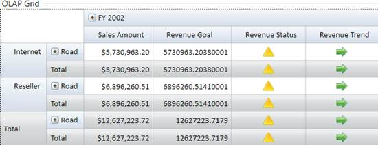

::: {style="DISPLAY: none"}
{#d2h_url_template} {#d2h_package_url style="WIDTH: 0px; DISPLAY: none; HEIGHT: 0px"}
:::

::::: {#nsbanner .d2h_main_nsbanner style="BORDER-BOTTOM: #999999 1px solid; POSITION: relative; PADDING-BOTTOM: 0px; BACKGROUND-COLOR: transparent; PADDING-LEFT: 0px; PADDING-RIGHT: 0px; DISPLAY: none; BORDER-TOP: #999999 1px solid; PADDING-TOP: 0px; LEFT: 0px"}
:::: {#TitleRow .d2h_main_titlerow style="PADDING-BOTTOM: 4px; BACKGROUND-COLOR: transparent; PADDING-LEFT: 22px; WIDTH: 100%; PADDING-RIGHT: 10px; DISPLAY: none; PADDING-TOP: 4px"}
::: {#ienav .d2h_main_ienav style="DISPLAY: none"}
{#D2HPrevious .D2HPreviousEnabled}  {#D2HNext .D2HNextEnabled}
:::
::::
:::::

:::: {#nstext .d2h_main_nstext style="PADDING-BOTTOM: 10px; BACKGROUND-COLOR: transparent; PADDING-LEFT: 22px; PADDING-RIGHT: 10px; HEIGHT: 100%; OVERFLOW: auto; PADDING-TOP: 5px" hasuserbackground="true" valign="bottom"}
::: {#d2h_breadcrumbs .d2h_breadcrumbs}
[Essential Studio User Guide Documentation](ms-xhelp:///?Id=12457748-09e3-4d74-a240-8e049cedf030){.d2h_breadcrumbsNormal} [ \> ]{.d2h_breadcrumbsLinkSeparator} [Business Intelligence Edition](ms-xhelp:///?Id=fdf33dd8-62b2-47b9-ad7b-fc50e590bca5){.d2h_breadcrumbsNormal} [ \> ]{.d2h_breadcrumbsLinkSeparator} [Essential BI WPF](ms-xhelp:///?Id=41e3d586-d922-4a01-8272-679fe4ae7343){.d2h_breadcrumbsNormal} [ \> ]{.d2h_breadcrumbsLinkSeparator} [Essential BI Grid]{.d2h_breadcrumbsContentsOnly} [ \> ]{.d2h_breadcrumbsLinkSeparator} [Concepts and Features](ms-xhelp:///?Id=ea758680-939d-4d65-8abe-8c3be198af29){.d2h_breadcrumbsNormal} [ \> ]{.d2h_breadcrumbsLinkSeparator} [Data Source](ms-xhelp:///?Id=ad8f80be-db8d-485a-b71c-ef670e32a912){.d2h_breadcrumbsNormal}
:::

### Adding report to OLAP Grid {#adding-report-to-olap-grid style="tab-stops: 0pt"}

Adding an OLAP report to OLAP Grid control in design time is described in the following code snippet:

 

+-------------------------------------------------------------------------------------------------+
| [\[XAML\]]{style="FONT-FAMILY: 'Courier New'"}                                                  |
|                                                                                                 |
|                     <                                                                           |
|                     syncfusion                                                                  |
|                     :                                                                           |
|                     OlapGrid                                                                    |
|                      x                                                                          |
|                     :                                                                           |
|                     Name                                                                        |
|                     ="olapGrid"                                                                 |
|                                                                                                 |
|                                                                                                 |
|                                                                                                 |
|                                           HorizontalAlignment                                   |
|                     ="Stretch"                                                                  |
|                                                                                                 |
|                                                                                                 |
|                                                                                                 |
|                                                                                                 |
|                      ReportName                                                                 |
|                     ="SalesReport"                                                              |
|                                                                                                 |
|                                                                                                 |
|                                                                                                 |
|                                 CurrentCubeName                                                 |
|                     ="Adventure Works"                                                          |
|                                                                                                 |
|                                                                                                 |
|                                                                                                 |
|                                           SharedDataManagerName                                 |
|                     ="localManager"                                                             |
|                                                                                                 |
|                                                                                                 |
|                                                                                                 |
|                                           olapshared                                            |
|                     :                                                                           |
|                     DataSource.DataManagerName                                                  |
|                     ="localManager"                                                             |
|                                                                                                 |
|                                                                                                 |
|                                                                                                 |
|                     olapshared                                                                  |
|                     :                                                                           |
|                     DataSource.ConnectionString                                                 |
|                     ="datasource=localhost; initial catalog=adventure works dw">                |
|                                                                                                 |
|                                                                                                 |
|                                                                                                 |
|                                                                                                 |
|                                                                                                 |
|                     <!- Adding Elements to Categorical Axis -->                                 |
|                                                                                                 |
|                                                                                                 |
|                     <                                                                           |
|                     syncfusion                                                                  |
|                     :                                                                           |
|                     OlapGrid.CategoricalAxis                                                    |
|                     >                                                                           |
|                                                                                                 |
|                                                                                                 |
|                                                                                                 |
|                                                                                                 |
|                     <                                                                           |
|                     syncfusion                                                                  |
|                     :                                                                           |
|                     Dimension                                                                   |
|                      Name                                                                       |
|                     ="Date"                                                                     |
|                      HierarchyName                                                              |
|                     ="Fiscal"                                                                   |
|                      LevelName                                                                  |
|                     ="Fiscal Year"                                                              |
|                      IncludeMembers                                                             |
|                     ="FY 2002, FY 2003"                                                         |
|                                                                                                 |
|                      />                                                                         |
|                                                                                                 |
|                     <!- Multiple Members where specified by comma separate -->                  |
|                                                                                                 |
|                                                                                                 |
|                                                                                                 |
|                     <                                                                           |
|                     syncfusion                                                                  |
|                     :                                                                           |
|                     Kpi                                                                         |
|                      Name                                                                       |
|                     ="Revenue"                                                                  |
|                      ShowGoal                                                                   |
|                     ="True"                                                                     |
|                      ShowStatus                                                                 |
|                     ="True"                                                                     |
|                      ShowValue                                                                  |
|                     ="True"                                                                     |
|                      ShowTrend                                                                  |
|                     ="True" />                                                                  |
|                                                                                                 |
|                                                                                                 |
|                                                                                                 |
|                     </                                                                          |
|                     syncfusion                                                                  |
|                     :                                                                           |
|                     OlapGrid.CategoricalAxis                                                    |
|                     >                                                                           |
|                                                                                                 |
|                                                                                                 |
|                                                                                                 |
|                                                                                                 |
|                                                                                                 |
|                     <!- Adding Elements to Series Axis -->                                      |
|                                                                                                 |
|                                                                                                 |
|                     <                                                                           |
|                     syncfusion                                                                  |
|                     :                                                                           |
|                     OlapGrid.SeriesAxis                                                         |
|                     >                                                                           |
|                                                                                                 |
|                                                                                                 |
|                                                                                                 |
|                                                                                                 |
|                     <                                                                           |
|                     syncfusion                                                                  |
|                     :                                                                           |
|                     Dimension                                                                   |
|                      Name                                                                       |
|                     ="Sales Channel"                                                            |
|                      HierarchyName                                                              |
|                     ="Sales Channel"                                                            |
|                      LevelName                                                                  |
|                     ="Sales Channel" />                                                         |
|                                                                                                 |
|                                                                                                 |
|                                                                                                 |
|                                                                                                 |
|                     <                                                                           |
|                     syncfusion                                                                  |
|                     :                                                                           |
|                     Dimension                                                                   |
|                      Name                                                                       |
|                     ="Product"                                                                  |
|                      HierarchyName                                                              |
|                     ="Product Model Lines"                                                      |
|                      LevelName                                                                  |
|                     ="Product Line"                                                             |
|                      IncludeMembers                                                             |
|                     ="Road" />                                                                  |
|                                                                                                 |
|                                                                                                 |
|                                                                                                 |
|                     </                                                                          |
|                     syncfusion                                                                  |
|                     :                                                                           |
|                     OlapGrid.SeriesAxis                                                         |
|                     >                                                                           |
|                                                                                                 |
|                                                                                                 |
|                                                                                                 |
|                                                                                                 |
|                                                                                                 |
|                     </                                                                          |
|                     syncfusion                                                                  |
|                     :                                                                           |
|                     OlapGrid                                                                    |
|                     >                                                                           |
|                                                                                                 |
|                                                                                                 |
|                                                                                                 |
| []{style="FONT-FAMILY: 'Courier New'"}                                                          |
+-------------------------------------------------------------------------------------------------+

 

 

{border="0"}

Figure 12: OLAP Grid with SalesReport created by XAML code

 

[]{style="FONT-FAMILY: 'Arial','sans-serif'"} 

Sample Link\
\

To access a XAML Configuration Demo sample:

1.  Open the Syncfusion Dashboard

2.  Select **Business Intelligence**

3.  Click the **WPF** drop-down list and select **Explore Samples**

4.  Navigate to **OlapGrid.WPF** -\> **Samples** -\> **Defining Reports** -\> **XAML Configuration Demo**

[Or]{style="FONT-FAMILY: 'Arial','sans-serif'"}

[]{style="FONT-FAMILY: 'Arial','sans-serif'"} 

[Navigate to:]{style="FONT-FAMILY: 'Arial','sans-serif'"}

**..\\Syncfusion\\EssentialStudio\\\<Versionnumber\>\\BI\\WPF\\OlapGrid.WPF\\Samples\\Defining Reports\\XAML Configuration Demo**

[ []{style="TEXT-DECORATION: none"} ]{.UGHyperlink} 

[]{#related-topics}
::::
