::: {style="DISPLAY: none"}
[](ms-xhelp:///?Id=d2h_url_template){#d2h_url_template}{#d2h_package_url style="WIDTH: 0px; DISPLAY: none; HEIGHT: 0px"}
:::

::::: {#nsbanner .d2h_main_nsbanner style="BORDER-BOTTOM: #999999 1px solid; POSITION: relative; PADDING-BOTTOM: 0px; BACKGROUND-COLOR: transparent; PADDING-LEFT: 0px; PADDING-RIGHT: 0px; DISPLAY: none; BORDER-TOP: #999999 1px solid; PADDING-TOP: 0px; LEFT: 0px"}
:::: {#TitleRow .d2h_main_titlerow style="PADDING-BOTTOM: 4px; BACKGROUND-COLOR: transparent; PADDING-LEFT: 22px; WIDTH: 100%; PADDING-RIGHT: 10px; DISPLAY: none; PADDING-TOP: 4px"}
::: {#ienav .d2h_main_ienav style="DISPLAY: none"}
[](ms-xhelp:///?Id=d9b63222-3998-4853-aefc-76a9296feee8){#D2HPrevious .D2HPreviousEnabled}  [](ms-xhelp:///?Id=e1f4aeae-2289-4b26-b9dd-38e72df239b2){#D2HNext .D2HNextEnabled}
:::
::::
:::::

::::::::: {#nstext .d2h_main_nstext style="PADDING-BOTTOM: 10px; BACKGROUND-COLOR: transparent; PADDING-LEFT: 22px; PADDING-RIGHT: 10px; HEIGHT: 100%; OVERFLOW: auto; PADDING-TOP: 5px" hasuserbackground="true" valign="bottom"}
::: {#d2h_breadcrumbs .d2h_breadcrumbs}
[Essential Studio User Guide Documentation](ms-xhelp:///?Id=12457748-09e3-4d74-a240-8e049cedf030){.d2h_breadcrumbsNormal}[ \> ]{.d2h_breadcrumbsLinkSeparator}[Reporting Edition](ms-xhelp:///?Id=027aa5b6-6676-4f93-ad23-c20e8c45792e){.d2h_breadcrumbsNormal}[ \> ]{.d2h_breadcrumbsLinkSeparator}[Essential Report Viewer](ms-xhelp:///?Id=35081cc7-4b81-4ef5-97d2-894ad584b907){.d2h_breadcrumbsNormal}[ \> ]{.d2h_breadcrumbsLinkSeparator}[Report Viewer Silverlight]{.d2h_breadcrumbsContentsOnly}[ \> ]{.d2h_breadcrumbsLinkSeparator}[Getting Started](ms-xhelp:///?Id=7a4490f0-f444-4f6b-b376-4bba56a9eb03){.d2h_breadcrumbsNormal}
:::

## Adding Report Viewer through Designer {#adding-report-viewer-through-designer style="TEXT-ALIGN: justify; tab-stops: 0pt"}

Users can create a simple sample through designer with Syncfusion SL ReportViewer Control using the following steps.

 

1.   Create a new web application in VS2010.

 

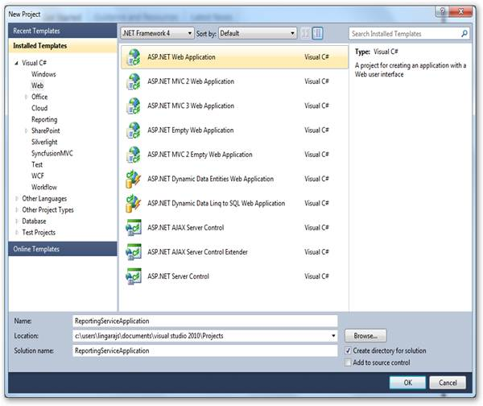{border="0"}

Figure 7: Create Web Application

 

2.   On the **Solution Explorer**, right-click **References** folder, and then click **Add Reference**.

 

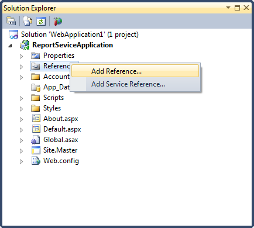{border="0"}

Figure 8: Adding**[ ]{style="FONT-SIZE: 11pt"}**Refernces

 

::: {style="BORDER-BOTTOM: windowtext 1pt solid; BORDER-LEFT: medium none; PADDING-BOTTOM: 1pt; MARGIN-TOP: 9pt; PADDING-LEFT: 0pt; PADDING-RIGHT: 0pt; MARGIN-BOTTOM: 9pt; BORDER-TOP: windowtext 1pt solid; BORDER-RIGHT: medium none; PADDING-TOP: 1pt"}
{border="0"}Note: The added references will appear under the References folder.
:::

 

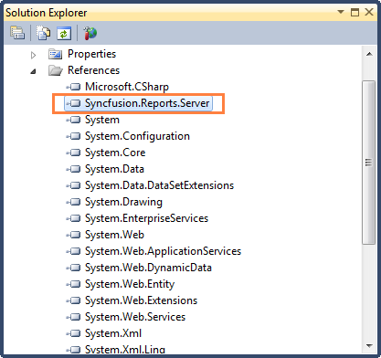{border="0"}

Figure 9: Added References

 

3.   To add a new WCF service file in the web application, right-click on the newly added web application under **Solution Explorer** dialog.

 

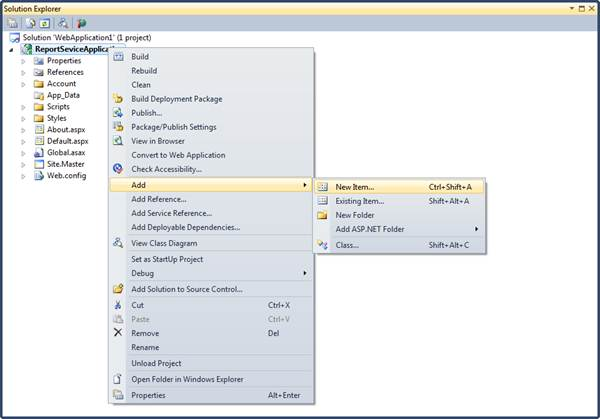{border="0"}

Figure 10: Adding**[ ]{style="FONT-SIZE: 11pt"}**New Item

 

4.   Click **Add** and select **New Item**. The **Add New Item** dialog will open.

 

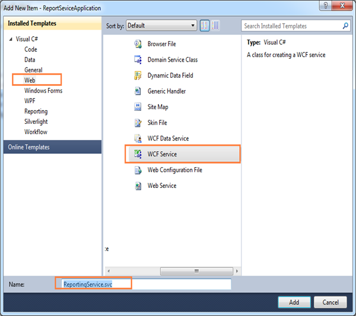{border="0"}

Figure 11: Adding WCF Service file

 

5.   Click **Web** under **Visual C#**.

6.   Click **WCF Service** and click **Add.**

7.   Update following changes in the auto generated WCF service file.

 

+-----------------------------------------------------------------------------+
| ``` {style="BACKGROUND: #f0f0f0"}                                           |
|                                                                             |
| ```                                                                         |
|                                                                             |
| ``` {style="BACKGROUND: #f0f0f0"}                                           |
| using System;                                                               |
| ```                                                                         |
|                                                                             |
| ``` {style="BACKGROUND: #f0f0f0"}                                           |
| using System.Collections.Generic;                                           |
| ```                                                                         |
|                                                                             |
| ``` {style="BACKGROUND: #f0f0f0"}                                           |
| using System.Linq;                                                          |
| ```                                                                         |
|                                                                             |
| ``` {style="BACKGROUND: #f0f0f0"}                                           |
| using System.Runtime.Serialization;                                         |
| ```                                                                         |
|                                                                             |
| ``` {style="BACKGROUND: #f0f0f0"}                                           |
| using System.ServiceModel;                                                  |
| ```                                                                         |
|                                                                             |
| ``` {style="BACKGROUND: #f0f0f0"}                                           |
| using System.Text;                                                          |
| ```                                                                         |
|                                                                             |
| ``` {style="BACKGROUND: #f0f0f0"}                                           |
|                                                                             |
| ```                                                                         |
|                                                                             |
| ``` {style="BACKGROUND: #f0f0f0"}                                           |
| namespace ReportingServiceApplication                                       |
| ```                                                                         |
|                                                                             |
| ``` {style="BACKGROUND: #f0f0f0"}                                           |
| {                                                                           |
| ```                                                                         |
|                                                                             |
| ``` {style="BACKGROUND: #f0f0f0"}                                           |
|     public class ReportingService : Syncfusion.Reports.Server.ReportService |
| ```                                                                         |
|                                                                             |
| ``` {style="BACKGROUND: #f0f0f0"}                                           |
|     {                                                                       |
| ```                                                                         |
|                                                                             |
| ``` {style="BACKGROUND: #f0f0f0"}                                           |
|     }                                                                       |
| ```                                                                         |
|                                                                             |
| ``` {style="BACKGROUND: #f0f0f0"}                                           |
| }                                                                           |
| ```                                                                         |
+-----------------------------------------------------------------------------+

 

 

::: {style="BORDER-BOTTOM: windowtext 1pt solid; BORDER-LEFT: medium none; PADDING-BOTTOM: 1pt; MARGIN-TOP: 9pt; PADDING-LEFT: 0pt; PADDING-RIGHT: 0pt; MARGIN-BOTTOM: 9pt; BORDER-TOP: windowtext 1pt solid; BORDER-RIGHT: medium none; PADDING-TOP: 1pt"}
{border="0"}Note: The added WCF Service file will appear under the created web application.

 
:::

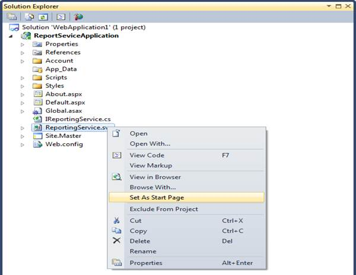{border="0"}

Figure 12: Set as start page option in Solution Explorer

 

8.   Right-click on the newly added WCF service file and select **Set As Start Page**.

9.   Run the service application. The service information is displayed.

 

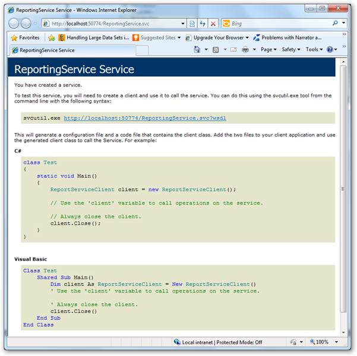{border="0"}

Figure 13: Created Reporting service

 

10.  Create a new Silverlight application in VS2010.

11.  Drag the **ReportViewer** control from **Toolbox** to the window.

 

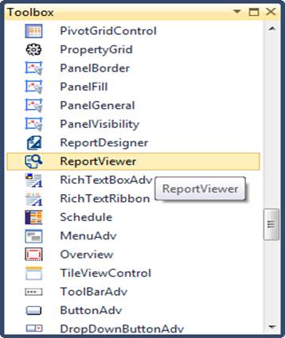{border="0"}

Figure 14: Toolbox

 

::: {style="BORDER-BOTTOM: windowtext 1pt solid; BORDER-LEFT: medium none; PADDING-BOTTOM: 1pt; MARGIN-TOP: 9pt; PADDING-LEFT: 0pt; PADDING-RIGHT: 0pt; MARGIN-BOTTOM: 9pt; BORDER-TOP: windowtext 1pt solid; BORDER-RIGHT: medium none; PADDING-TOP: 1pt"}
{border="0"}Note: The Report Viewer window will be modified as shown in below.

 
:::

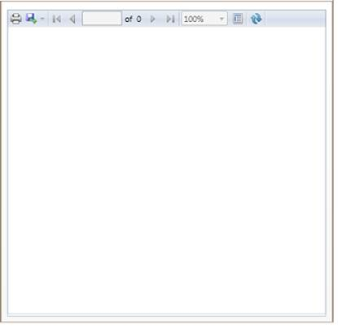{border="0"}

Figure 15: Report Viewer

 

::: {style="BORDER-BOTTOM: windowtext 1pt solid; BORDER-LEFT: medium none; PADDING-BOTTOM: 1pt; MARGIN-TOP: 9pt; PADDING-LEFT: 0pt; PADDING-RIGHT: 0pt; MARGIN-BOTTOM: 9pt; BORDER-TOP: windowtext 1pt solid; BORDER-RIGHT: medium none; PADDING-TOP: 1pt"}
{border="0"}Note: The following code is auto generated in XAML window[.]{style="FONT-FAMILY: 'Times New Roman','serif'; COLOR: black"}

[]{style="FONT-FAMILY: 'Times New Roman','serif'; COLOR: black"} 
:::

+------------------------------------------------------------------------------+
| ``` {style="BACKGROUND: #f0f0f0"}                                            |
| <UserControl x:Class="ReportViewerTestApplication.MainPage"                  |
| ```                                                                          |
|                                                                              |
| ``` {style="BACKGROUND: #f0f0f0"}                                            |
|     xmlns="http://schemas.microsoft.com/winfx/2006/xaml/presentation"        |
| ```                                                                          |
|                                                                              |
| ``` {style="BACKGROUND: #f0f0f0"}                                            |
|     xmlns:x="http://schemas.microsoft.com/winfx/2006/xaml"                   |
| ```                                                                          |
|                                                                              |
| ``` {style="BACKGROUND: #f0f0f0"}                                            |
|     xmlns:d="http://schemas.microsoft.com/expression/blend/2008"             |
| ```                                                                          |
|                                                                              |
| ``` {style="BACKGROUND: #f0f0f0"}                                            |
|     xmlns:mc="http://schemas.openxmlformats.org/markup-compatibility/2006"   |
| ```                                                                          |
|                                                                              |
| ``` {style="BACKGROUND: #f0f0f0"}                                            |
|     mc:Ignorable="d"                                                         |
| ```                                                                          |
|                                                                              |
| ``` {style="BACKGROUND: #f0f0f0"}                                            |
|     d:DesignHeight="400" d:DesignWidth="400" xmlns:my="clr-                  |
| ```                                                                          |
|                                                                              |
| ``` {style="BACKGROUND: #f0f0f0"}                                            |
| namespace:Syncfusion.Windows.Reports.Viewer;assembly=Syncfusion.ReportViewer |
| ```                                                                          |
|                                                                              |
| ``` {style="BACKGROUND: #f0f0f0"}                                            |
| .Silverlight">                                                               |
| ```                                                                          |
|                                                                              |
| ``` {style="BACKGROUND: #f0f0f0"}                                            |
|                                                                              |
| ```                                                                          |
|                                                                              |
| ``` {style="BACKGROUND: #f0f0f0"}                                            |
|    <Grid x:Name="LayoutRoot" Background="White">                             |
| ```                                                                          |
|                                                                              |
| ``` {style="BACKGROUND: #f0f0f0"}                                            |
|         <my:ReportViewer HorizontalAlignment="Left" Name="reportViewer1" />  |
| ```                                                                          |
|                                                                              |
| ``` {style="BACKGROUND: #f0f0f0"}                                            |
|     </Grid>                                                                  |
| ```                                                                          |
|                                                                              |
| ``` {style="BACKGROUND: #f0f0f0"}                                            |
| </UserControl>                                                               |
| ```                                                                          |
|                                                                              |
| []{style="FONT-FAMILY: 'Times New Roman','serif'; COLOR: black"}             |
+------------------------------------------------------------------------------+

[]{style="FONT-FAMILY: 'Times New Roman','serif'; COLOR: black"} 

12.  To load a report in Report Viewer from server (Hosted service) machine, set the **ReportPath**, **ReportServiceUrl** and **ProcessingMode**.

 

+-----------------------------------------------------------------------------------+
|     <UserControl x:Class="ReportViewerTestApplication.MainPage"                   |
|                                                                                   |
|         xmlns="http://schemas.microsoft.com/winfx/2006/xaml/presentation"         |
|                                                                                   |
|         xmlns:x="http://schemas.microsoft.com/winfx/2006/xaml"                    |
|                                                                                   |
|         xmlns:d="http://schemas.microsoft.com/expression/blend/2008"              |
|                                                                                   |
|         xmlns:mc="http://schemas.openxmlformats.org/markup-compatibility/2006"    |
|                                                                                   |
|         mc:Ignorable="d"                                                          |
|                                                                                   |
|         d:DesignHeight="400" d:DesignWidth="400" xmlns:my="clr-                   |
|                                                                                   |
|     namespace:Syncfusion.Windows.Reports.Viewer;assembly=Syncfusion.ReportViewer. |
|                                                                                   |
|     Silverlight">                                                                 |
|                                                                                   |
|                                                                                   |
|                                                                                   |
|         <Grid x:Name="LayoutRoot" Background="White">                             |
|                                                                                   |
|             <my:ReportViewer Name="reportViewer1" ProcessingMode="Remote" Report  |
|                                                                                   |
|     Path="D:\Invoice.rdl" ReportServiceURL="http://localhost:50774/ReportingServ  |
|                                                                                   |
|     ice.svc"  />                                                                  |
|                                                                                   |
|         </Grid>                                                                   |
|                                                                                   |
|     </UserControl>                                                                |
|                                                                                   |
| []{style="FONT-FAMILY: 'Times New Roman','serif'; COLOR: black"}                  |
+-----------------------------------------------------------------------------------+

 

 

13.  To render the provided report in Report Viewer, use the **RefreshReport** method in user control or parent control loaded event.

 

+---------------------------------------------------------------------------------------------------------------------------+
| [this]{style="FONT-FAMILY: 'Courier New'; COLOR: blue"}[.Loaded += (sender, arg) =\>]{style="FONT-FAMILY: 'Courier New'"} |
|                                                                                                                           |
| [                {]{style="FONT-FAMILY: 'Courier New'"}                                                                   |
|                                                                                                                           |
| ``` {style="BACKGROUND: #f0f0f0"}                                                                                         |
|                       // To Render the Report in ReportViewer.                                                            |
| ```                                                                                                                       |
|                                                                                                                           |
| [                    [this]{style="COLOR: blue"}.reportViewer1.RefreshReport();]{style="FONT-FAMILY: 'Courier New'"}      |
|                                                                                                                           |
| [                };]{style="FONT-FAMILY: 'Courier New'"}[]{style="FONT-FAMILY: 'Courier New'"}                            |
+---------------------------------------------------------------------------------------------------------------------------+

 

14.  Run the application. The following output displays.

 

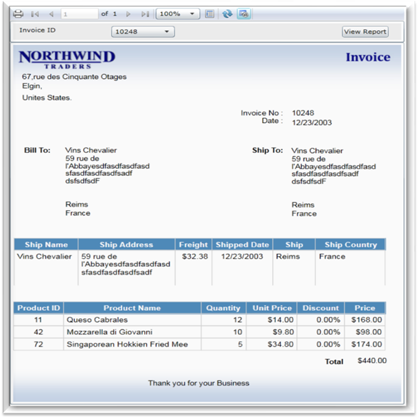{border="0"}

Figure 16: Report Viewer Sample

 

15.  To export the report into PDF format, click export drop-down arrow in ReportViewer toolbar.

 

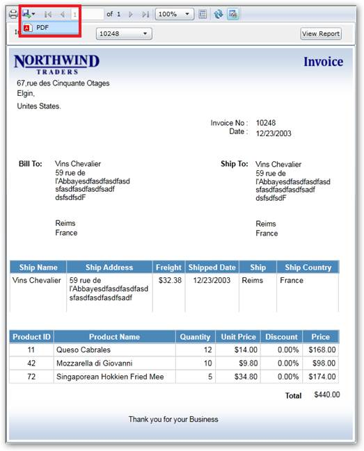{border="0"}

Figure 17: PDF option in Report Viewer

 

16.  Select **PDF**. The following PDF document will be generated.

::: {style="BORDER-BOTTOM: windowtext 1pt solid; BORDER-LEFT: medium none; PADDING-BOTTOM: 1pt; MARGIN-TOP: 9pt; PADDING-LEFT: 0pt; PADDING-RIGHT: 0pt; MARGIN-BOTTOM: 9pt; BORDER-TOP: windowtext 1pt solid; BORDER-RIGHT: medium none; PADDING-TOP: 1pt"}
[[]{style="TEXT-DECORATION: none"}]{.underline} 
:::

{border="0"}

Figure 18: Exported PDF Report

 

[]{#related-topics}
:::::::::
