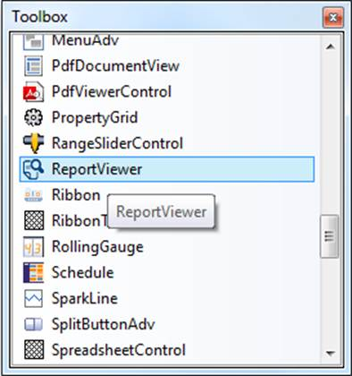
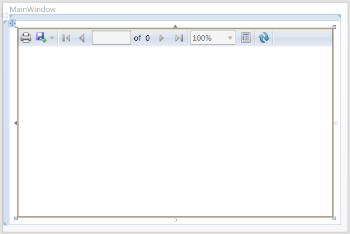
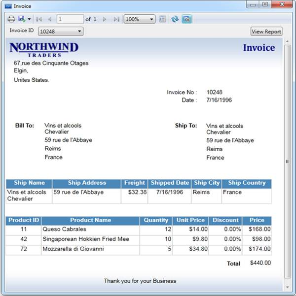
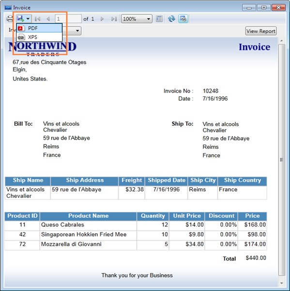
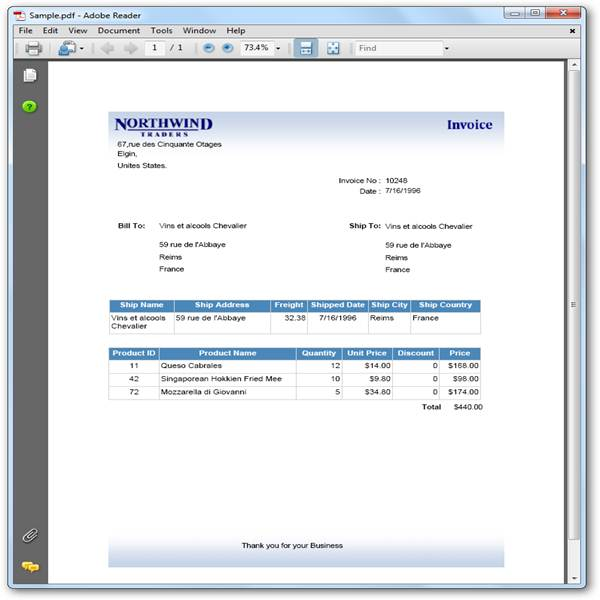

::: {style="DISPLAY: none"}
{#d2h_url_template}{#d2h_package_url style="WIDTH: 0px; DISPLAY: none; HEIGHT: 0px"}
:::

::::: {#nsbanner .d2h_main_nsbanner style="BORDER-BOTTOM: #999999 1px solid; POSITION: relative; PADDING-BOTTOM: 0px; BACKGROUND-COLOR: transparent; PADDING-LEFT: 0px; PADDING-RIGHT: 0px; DISPLAY: none; BORDER-TOP: #999999 1px solid; PADDING-TOP: 0px; LEFT: 0px"}
:::: {#TitleRow .d2h_main_titlerow style="PADDING-BOTTOM: 4px; BACKGROUND-COLOR: transparent; PADDING-LEFT: 22px; WIDTH: 100%; PADDING-RIGHT: 10px; DISPLAY: none; PADDING-TOP: 4px"}
::: {#ienav .d2h_main_ienav style="DISPLAY: none"}
{#D2HPrevious .D2HPreviousEnabled}  {#D2HNext .D2HNextEnabled}
:::
::::
:::::

:::::: {#nstext .d2h_main_nstext style="PADDING-BOTTOM: 10px; BACKGROUND-COLOR: transparent; PADDING-LEFT: 22px; PADDING-RIGHT: 10px; HEIGHT: 100%; OVERFLOW: auto; PADDING-TOP: 5px" hasuserbackground="true" valign="bottom"}
::: {#d2h_breadcrumbs .d2h_breadcrumbs}
[Essential Studio User Guide Documentation](ms-xhelp:///?Id=12457748-09e3-4d74-a240-8e049cedf030){.d2h_breadcrumbsNormal}[ \> ]{.d2h_breadcrumbsLinkSeparator}[Reporting Edition](ms-xhelp:///?Id=027aa5b6-6676-4f93-ad23-c20e8c45792e){.d2h_breadcrumbsNormal}[ \> ]{.d2h_breadcrumbsLinkSeparator}[Essential Report Viewer](ms-xhelp:///?Id=35081cc7-4b81-4ef5-97d2-894ad584b907){.d2h_breadcrumbsNormal}[ \> ]{.d2h_breadcrumbsLinkSeparator}[Report Viewer WPF]{.d2h_breadcrumbsContentsOnly}[ \> ]{.d2h_breadcrumbsLinkSeparator}[Getting Started](ms-xhelp:///?Id=4506bba9-91c2-4d5d-9ddb-15406b95479c){.d2h_breadcrumbsNormal}
:::

## Adding Report Viewer through Designer {#adding-report-viewer-through-designer style="tab-stops: 0pt"}

 

The section illustrates how to add the Report Viewer to the WPF application. It includes the following steps:

 

1.   Create a new WPF application in VS2008 or VS2010.

 

{border="0"}

Figure 8: Toolbox

 

2.   To add the Report Viewer control through designer, drag the **Report Viewer** control from **Toolbox** to **Report Viewer window**. The Report Viewer window will be modified as shown below.

 

{border="0"}

          Figure 9: Modified Report Viewer window**[ ]{style="FONT-SIZE: 11pt"}**

[]{style="FONT-STYLE: normal"} 

::: {style="BORDER-BOTTOM: windowtext 1pt solid; BORDER-LEFT: medium none; PADDING-BOTTOM: 1pt; MARGIN-TOP: 9pt; PADDING-LEFT: 0pt; PADDING-RIGHT: 0pt; MARGIN-BOTTOM: 9pt; BORDER-TOP: windowtext 1pt solid; BORDER-RIGHT: medium none; PADDING-TOP: 1pt"}
{border="0"}Note: The following code is auto generated in XAML window[.]{style="FONT-FAMILY: 'Times New Roman','serif'; COLOR: black"}

[]{style="FONT-FAMILY: 'Times New Roman','serif'; COLOR: black"} 
:::

+---------------------------------------------------------------------------------------------------------------------------------------------------------------------------------------------------------------------------------------------------------------------------------------------------------------------------------------------------------------------------------------------------------------------------------------------------------------------------------------------------------------------------+
| [\<]{style="FONT-FAMILY: 'Courier New'; COLOR: blue"}[Window]{style="FONT-FAMILY: 'Courier New'; COLOR: #a31515"}[ x]{style="FONT-FAMILY: 'Courier New'; COLOR: red"}[:]{style="FONT-FAMILY: 'Courier New'; COLOR: blue"}[Class]{style="FONT-FAMILY: 'Courier New'; COLOR: red"}[=\"WpfApplication6.Window1\"]{style="FONT-FAMILY: 'Courier New'; COLOR: blue"}[   [ xmlns]{style="COLOR: red"}[=\"http://schemas.microsoft.com/winfx/2006/xaml/presentation\"]{style="COLOR: blue"}]{style="FONT-FAMILY: 'Courier New'"} |
|                                                                                                                                                                                                                                                                                                                                                                                                                                                                                                                           |
| [   [ xmlns]{style="COLOR: red"}[:]{style="COLOR: blue"}[x]{style="COLOR: red"}[=\"http://schemas.microsoft.com/winfx/2006/xaml\"]{style="COLOR: blue"}]{style="FONT-FAMILY: 'Courier New'"}                                                                                                                                                                                                                                                                                                                              |
|                                                                                                                                                                                                                                                                                                                                                                                                                                                                                                                           |
| [   [ Title]{style="COLOR: red"}[=\"Window1\"]{style="COLOR: blue"}[ Height]{style="COLOR: red"}[=\"371\"]{style="COLOR: blue"}[ Width]{style="COLOR: red"}[=\"559\"]{style="COLOR: blue"}[ xmlns]{style="COLOR: red"}[:]{style="COLOR: blue"}[syncfusion]{style="COLOR: red"}[=\"http://schemas.syncfusion.com/wpf\"\>]{style="COLOR: blue"}]{style="FONT-FAMILY: 'Courier New'"}                                                                                                                                        |
|                                                                                                                                                                                                                                                                                                                                                                                                                                                                                                                           |
| [    ]{style="FONT-FAMILY: 'Courier New'; COLOR: #a31515"}[\<]{style="FONT-FAMILY: 'Courier New'; COLOR: blue"}[Grid]{style="FONT-FAMILY: 'Courier New'; COLOR: #a31515"}[\>]{style="FONT-FAMILY: 'Courier New'; COLOR: blue"}                                                                                                                                                                                                                                                                                            |
|                                                                                                                                                                                                                                                                                                                                                                                                                                                                                                                           |
| [        ]{style="FONT-FAMILY: 'Courier New'; COLOR: #a31515"}[\<]{style="FONT-FAMILY: 'Courier New'; COLOR: blue"}[syncfusion]{style="FONT-FAMILY: 'Courier New'; COLOR: #a31515"}[:]{style="FONT-FAMILY: 'Courier New'; COLOR: blue"}[ReportViewer]{style="FONT-FAMILY: 'Courier New'; COLOR: #a31515"}[ Name]{style="FONT-FAMILY: 'Courier New'; COLOR: red"}[=\"reportViewer1\" /\>]{style="FONT-FAMILY: 'Courier New'; COLOR: blue"}                                                                                 |
|                                                                                                                                                                                                                                                                                                                                                                                                                                                                                                                           |
| [    ]{style="FONT-FAMILY: 'Courier New'; COLOR: #a31515"}[\</]{style="FONT-FAMILY: 'Courier New'; COLOR: blue"}[Grid]{style="FONT-FAMILY: 'Courier New'; COLOR: #a31515"}[\>]{style="FONT-FAMILY: 'Courier New'; COLOR: blue"}                                                                                                                                                                                                                                                                                           |
|                                                                                                                                                                                                                                                                                                                                                                                                                                                                                                                           |
| [\</]{style="FONT-FAMILY: 'Courier New'; COLOR: blue"}[Window]{style="FONT-FAMILY: 'Courier New'; COLOR: #a31515"}[\>]{style="FONT-FAMILY: 'Courier New'; COLOR: blue"}[ ]{style="FONT-FAMILY: 'Times New Roman','serif'"}                                                                                                                                                                                                                                                                                                |
+---------------------------------------------------------------------------------------------------------------------------------------------------------------------------------------------------------------------------------------------------------------------------------------------------------------------------------------------------------------------------------------------------------------------------------------------------------------------------------------------------------------------------+

 

3.   Set the **ReportPath** to load the report in Report Viewer from a local machine.

 

+----------------------------------------------------------------------------------------------------------------------------------------------------------------------------------------------------------------------------------------------------------------------------------------------------------------------------------------------------------------------------------------------------------------------------------------------------------------------------------------------------------------------------------------------------------------------------------------------------------------------------------------------------+
| [   \<]{style="FONT-FAMILY: 'Courier New'; COLOR: blue"}[Window]{style="FONT-FAMILY: 'Courier New'; COLOR: #a31515"}[ x]{style="FONT-FAMILY: 'Courier New'; COLOR: red"}[:]{style="FONT-FAMILY: 'Courier New'; COLOR: blue"}[Class]{style="FONT-FAMILY: 'Courier New'; COLOR: red"}[=\"WpfApplication6.Window1\"]{style="FONT-FAMILY: 'Courier New'; COLOR: blue"}[   [ xmlns]{style="COLOR: red"}[=\"http://schemas.microsoft.com/winfx/2006/xaml/presentation\"]{style="COLOR: blue"}]{style="FONT-FAMILY: 'Courier New'"}                                                                                                                       |
|                                                                                                                                                                                                                                                                                                                                                                                                                                                                                                                                                                                                                                                    |
| [   ]{style="FONT-FAMILY: 'Courier New'; COLOR: blue"}[   [ xmlns]{style="COLOR: red"}[:]{style="COLOR: blue"}[x]{style="COLOR: red"}[=\"http://schemas.microsoft.com/winfx/2006/xaml\"]{style="COLOR: blue"}]{style="FONT-FAMILY: 'Courier New'"}                                                                                                                                                                                                                                                                                                                                                                                                 |
|                                                                                                                                                                                                                                                                                                                                                                                                                                                                                                                                                                                                                                                    |
| [   ]{style="FONT-FAMILY: 'Courier New'; COLOR: blue"}[   [ Title]{style="COLOR: red"}[=\"Window1\"]{style="COLOR: blue"}[ Height]{style="COLOR: red"}[=\"371\"]{style="COLOR: blue"}[ Width]{style="COLOR: red"}[=\"559\"]{style="COLOR: blue"}[ xmlns]{style="COLOR: red"}[:]{style="COLOR: blue"}[syncfusion]{style="COLOR: red"}[=\"http://schemas.syncfusion.com/wpf\"\>]{style="COLOR: blue"}]{style="FONT-FAMILY: 'Courier New'"}                                                                                                                                                                                                           |
|                                                                                                                                                                                                                                                                                                                                                                                                                                                                                                                                                                                                                                                    |
| [   ]{style="FONT-FAMILY: 'Courier New'; COLOR: blue"}[    ]{style="FONT-FAMILY: 'Courier New'; COLOR: #a31515"}[\<]{style="FONT-FAMILY: 'Courier New'; COLOR: blue"}[Grid]{style="FONT-FAMILY: 'Courier New'; COLOR: #a31515"}[\>]{style="FONT-FAMILY: 'Courier New'; COLOR: blue"}                                                                                                                                                                                                                                                                                                                                                               |
|                                                                                                                                                                                                                                                                                                                                                                                                                                                                                                                                                                                                                                                    |
| [   ]{style="FONT-FAMILY: 'Courier New'; COLOR: blue"}[        ]{style="FONT-FAMILY: 'Courier New'; COLOR: #a31515"}[\<]{style="FONT-FAMILY: 'Courier New'; COLOR: blue"}[syncfusion]{style="FONT-FAMILY: 'Courier New'; COLOR: #a31515"}[:]{style="FONT-FAMILY: 'Courier New'; COLOR: blue"}[ReportViewer]{style="FONT-FAMILY: 'Courier New'; COLOR: #a31515"}[ Name]{style="FONT-FAMILY: 'Courier New'; COLOR: red"}[=\"reportViewer1\"]{style="FONT-FAMILY: 'Courier New'; COLOR: blue"}[ ReportPath]{style="FONT-FAMILY: 'Courier New'; COLOR: red"}[=\"D:\\ReportTemplate\\Invoice.rdl\"/\>]{style="FONT-FAMILY: 'Courier New'; COLOR: blue"} |
|                                                                                                                                                                                                                                                                                                                                                                                                                                                                                                                                                                                                                                                    |
| [   ]{style="FONT-FAMILY: 'Courier New'; COLOR: blue"}[    ]{style="FONT-FAMILY: 'Courier New'; COLOR: #a31515"}[\</]{style="FONT-FAMILY: 'Courier New'; COLOR: blue"}[Grid]{style="FONT-FAMILY: 'Courier New'; COLOR: #a31515"}[\>]{style="FONT-FAMILY: 'Courier New'; COLOR: blue"}                                                                                                                                                                                                                                                                                                                                                              |
|                                                                                                                                                                                                                                                                                                                                                                                                                                                                                                                                                                                                                                                    |
| [\</]{style="FONT-FAMILY: 'Courier New'; COLOR: blue"}[Window]{style="FONT-FAMILY: 'Courier New'; COLOR: #a31515"}[\>]{style="FONT-FAMILY: 'Courier New'; COLOR: blue"}[ ]{style="FONT-FAMILY: 'Courier New'; COLOR: black"}[]{style="FONT-FAMILY: 'Times New Roman','serif'"}                                                                                                                                                                                                                                                                                                                                                                     |
+----------------------------------------------------------------------------------------------------------------------------------------------------------------------------------------------------------------------------------------------------------------------------------------------------------------------------------------------------------------------------------------------------------------------------------------------------------------------------------------------------------------------------------------------------------------------------------------------------------------------------------------------------+

 

4.   To render the provided report in Report Viewer, call the **RefreshReport** method in window or parent control loaded event.

 

+----------------------------------------------------------------------------------------------------------------------------------------------------------+
| [this]{style="FONT-FAMILY: 'Courier New'; COLOR: blue"}[.Loaded += (sender, arg) =\>]{style="FONT-FAMILY: 'Courier New'"}                                |
|                                                                                                                                                          |
| [                {]{style="FONT-FAMILY: 'Courier New'"}                                                                                                  |
|                                                                                                                                                          |
| [                      ]{style="FONT-FAMILY: 'Courier New'; COLOR: black"}[// To Render the Report in ReportViewer.]{style="FONT-FAMILY: 'Courier New'"} |
|                                                                                                                                                          |
| [                    [this]{style="COLOR: blue"}.reportViewer1.RefreshReport();]{style="FONT-FAMILY: 'Courier New'"}                                     |
|                                                                                                                                                          |
| [                };]{style="FONT-FAMILY: 'Courier New'"}[]{style="FONT-FAMILY: 'Courier New'"}                                                           |
+----------------------------------------------------------------------------------------------------------------------------------------------------------+

 

5.   Run the application. The following output displays.

 

{border="0"}

Figure 10: ReportViewer sample demo

 

6.   Click export drop-down button in Report Viewer toolbar and select **PDF** or **XPS** as needed. The report will be exported into PDF or XPS formats, respectively.

 

{border="0"}

Figure 11: PDF and XPS options in Report Viewer

*[]{style="FONT-SIZE: 9pt"}* 

The following output is the exported PDF report.

::: {style="BORDER-BOTTOM: windowtext 1pt solid; BORDER-LEFT: medium none; PADDING-BOTTOM: 1pt; MARGIN-TOP: 9pt; PADDING-LEFT: 0pt; PADDING-RIGHT: 0pt; MARGIN-BOTTOM: 9pt; BORDER-TOP: windowtext 1pt solid; BORDER-RIGHT: medium none; PADDING-TOP: 1pt"}
 
:::

{border="0"}

Figure 12: Exported PDF Report

 

[]{#related-topics}
::::::
