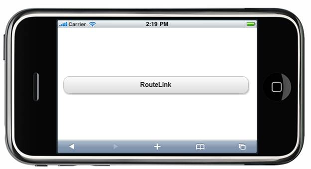

::: {style="DISPLAY: none"}
{#d2h_url_template} {#d2h_package_url style="WIDTH: 0px; DISPLAY: none; HEIGHT: 0px"}
:::

::: {.d2h_secondary_topic style="PADDING-BOTTOM: 10pt; MARGIN: 0pt; PADDING-LEFT: 0pt; PADDING-RIGHT: 0pt; PADDING-TOP: 0pt"}
#### Adding RouteLink Button Control to a Mobile MVC Application {#adding-routelink-button-control-to-a-mobile-mvc-application style="tab-stops: 0pt"}

In the [Getting Started]{.UGHyperlink} section, we discussed how to [create an Mobile MVC application]{.UGHyperlink} and [add the Tools package to the application]{.UGHyperlink}. This section guides you to add the ActionLink Button control to an application.

 

1.   In the **view**, invoke the **RouteLink Button** helper with the text of the button as the first argument.

 

+-------------------------------------------------------------------------------------------------------------------------------------------------------------------------------------------------------------------------------------------------------------------------------------------------------------------------------------------------------------------------------------------------------------------------------------------------------------------------------------------------------------------------------------------------------------------------------------------------------------------------------------------------+
| **[\[ASPX\]]{style="FONT-FAMILY: 'Courier New'"}**                                                                                                                                                                                                                                                                                                                                                                                                                                                                                                                                                                                              |
|                                                                                                                                                                                                                                                                                                                                                                                                                                                                                                                                                                                                                                                 |
| [        ]{style="FONT-FAMILY: 'Courier New'"} [\<%]{style="FONT-FAMILY: 'Courier New'; BACKGROUND: yellow"} [=]{style="FONT-FAMILY: 'Courier New'; COLOR: blue"} [ Html.MobSyncfusion().RouteLink([\"RouteLink\"]{style="COLOR: #a31515"}, [\"Button\"]{style="COLOR: #a31515"}).AutoFormat([MobSkins]{style="COLOR: #2b91af"}.Spinach)[%\>]{style="BACKGROUND: yellow"}]{style="FONT-FAMILY: 'Courier New'"}                                                                                                                                                                                                                                  |
|                                                                                                                                                                                                                                                                                                                                                                                                                                                                                                                                                                                                                                                 |
| **[]{style="FONT-FAMILY: 'Courier New'"}**                                                                                                                                                                                                                                                                                                                                                                                                                                                                                                                                                                                                      |
|                                                                                                                                                                                                                                                                                                                                                                                                                                                                                                                                                                                                                                                 |
| **[\[Razor\]]{style="FONT-FAMILY: 'Courier New'"}**                                                                                                                                                                                                                                                                                                                                                                                                                                                                                                                                                                                             |
|                                                                                                                                                                                                                                                                                                                                                                                                                                                                                                                                                                                                                                                 |
| [        ]{style="FONT-FAMILY: 'Courier New'; COLOR: blue"} [\@{]{style="FONT-FAMILY: 'Courier New'; BACKGROUND: yellow"} []{style="FONT-FAMILY: 'Courier New'"} [Html.MobSyncfusion().RouteLink([\"RouteLink\"]{style="COLOR: #a31515"}, [\"Button\"]{style="COLOR: #a31515"}).AutoFormat([MobSkins]{style="COLOR: #2b91af"}.Spinach)]{style="FONT-FAMILY: 'Courier New'"} [.]{style="FONT-FAMILY: 'Courier New'; FONT-SIZE: 11pt"} [Render();]{style="FONT-FAMILY: 'Courier New'; FONT-SIZE: 11pt"} []{style="FONT-FAMILY: 'Courier New'"} [}]{style="FONT-FAMILY: 'Courier New'; BACKGROUND: yellow"} []{style="FONT-FAMILY: 'Courier New'"} |
+-------------------------------------------------------------------------------------------------------------------------------------------------------------------------------------------------------------------------------------------------------------------------------------------------------------------------------------------------------------------------------------------------------------------------------------------------------------------------------------------------------------------------------------------------------------------------------------------------------------------------------------------------+

 

2.   Run the application.\
\

The output is shown in the following screenshot.

 

{border="0"}

Figure 217: RouteLink Button Sample

A sample that demonstrates a basic RouteLink Button control can be downloaded from the following links.\
\

[ASPX Sample](../../../../../../../thivyak/Desktop/RouteLink%20-%20ASPX.zip)

[Razor Sample](../../../../../../../thivyak/Desktop/RouteLink%20-%20Razor.zip)

 

{border="0"}Note: The version number for the assemblies has been set to 10.104.0.43 in the **Web.config** file of the attached sample. Change the version number to the appropriate version in the **Web-2008.config** or **Web-2010.config** files (available in the root directory) and they will automatically be updated in the **Web.config** file.

[]{#related-topics}
:::
