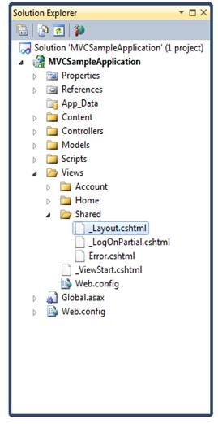

::: {style="DISPLAY: none"}
{#d2h_url_template} {#d2h_package_url style="WIDTH: 0px; DISPLAY: none; HEIGHT: 0px"}
:::

::::: {#nsbanner .d2h_main_nsbanner style="BORDER-BOTTOM: #999999 1px solid; POSITION: relative; PADDING-BOTTOM: 0px; BACKGROUND-COLOR: transparent; PADDING-LEFT: 0px; PADDING-RIGHT: 0px; DISPLAY: none; BORDER-TOP: #999999 1px solid; PADDING-TOP: 0px; LEFT: 0px"}
:::: {#TitleRow .d2h_main_titlerow style="PADDING-BOTTOM: 4px; BACKGROUND-COLOR: transparent; PADDING-LEFT: 22px; WIDTH: 100%; PADDING-RIGHT: 10px; DISPLAY: none; PADDING-TOP: 4px"}
::: {#ienav .d2h_main_ienav style="DISPLAY: none"}
{#D2HPrevious .D2HPreviousEnabled}  {#D2HNext .D2HNextEnabled}
:::
::::
:::::

:::: {#nstext .d2h_main_nstext style="PADDING-BOTTOM: 10px; BACKGROUND-COLOR: transparent; PADDING-LEFT: 22px; PADDING-RIGHT: 10px; HEIGHT: 100%; OVERFLOW: auto; PADDING-TOP: 5px" hasuserbackground="true" valign="bottom"}
::: {#d2h_breadcrumbs .d2h_breadcrumbs}
[Essential Studio User Guide Documentation](ms-xhelp:///?Id=12457748-09e3-4d74-a240-8e049cedf030){.d2h_breadcrumbsNormal} [ \> ]{.d2h_breadcrumbsLinkSeparator} [User Interface Edition](ms-xhelp:///?Id=c29296b7-531c-413b-a0ec-488ca1f7f669){.d2h_breadcrumbsNormal} [ \> ]{.d2h_breadcrumbsLinkSeparator} [Essential Mobile MVC](ms-xhelp:///?Id=74df42e3-5434-4590-9be6-3ae2f911cbbc){.d2h_breadcrumbsNormal} [ \> ]{.d2h_breadcrumbsLinkSeparator} [Essential Chart]{.d2h_breadcrumbsContentsOnly} [ \> ]{.d2h_breadcrumbsLinkSeparator} [Getting Started](ms-xhelp:///?Id=3eb7eb94-5332-4941-affa-4bfbabf22ff3){.d2h_breadcrumbsNormal} [ \> ]{.d2h_breadcrumbsLinkSeparator} [Adding Essential Chart to the Razor Application](ms-xhelp:///?Id=eb8a4a3b-d853-4fa4-a088-ac9ebe568d10){.d2h_breadcrumbsNormal}
:::

### Adding Scripts {#adding-scripts style="tab-stops: 0pt"}

The steps to add scripts are as follows:

[1.   ]{style="COLOR: black"}On the Solution Explorer, double-click the **Views** folder, double-click the **Shared** folder, and then double-click the **\_Layout.cshtml** file.[]{style="FONT-FAMILY: 'Calibri','sans-serif'"}The \_layout.cshtml page appears.

                      {border="0"}

Figure 25_Layout.cshtml file displayed under the Shared folder

{border="0"}

 

Figure 263: \_Layout.cshtml page

2.   On the Solution Explorer, click the **Scripts** folder. The lists of scripts available are displayed.

[{border="0"}]{.underline}

Figure 27: List of scripts displayed under the Scripts folder 

3.   Import the following javascript files onto the \_Layout.cshtml page:

 

[·      ]{style="FONT-FAMILY: Symbol"}jquery-1.5.1.min.js

 

+-------------------------------------------------------------------------------------------------------------------------------------------------------------------------------------------------------------------------------------------------------------------------------------------------------------------------------------------------------------------------------------------------+
| **[\[\_Layout.cshtml\] ]{style="FONT-FAMILY: 'Courier New'"}** []{style="FONT-FAMILY: 'Courier New'"}                                                                                                                                                                                                                                                                                           |
|                                                                                                                                                                                                                                                                                                                                                                                                 |
| [\<]{style="FONT-FAMILY: 'Courier New'; COLOR: blue"} [head]{style="FONT-FAMILY: 'Courier New'; COLOR: maroon"} [ [runat]{style="COLOR: red"} [=\"server\"\>]{style="COLOR: blue"} ]{style="FONT-FAMILY: 'Courier New'"}                                                                                                                                                                        |
|                                                                                                                                                                                                                                                                                                                                                                                                 |
| [............]{style="FONT-FAMILY: 'Courier New'"}                                                                                                                                                                                                                                                                                                                                              |
|                                                                                                                                                                                                                                                                                                                                                                                                 |
| [............]{style="FONT-FAMILY: 'Courier New'"}                                                                                                                                                                                                                                                                                                                                              |
|                                                                                                                                                                                                                                                                                                                                                                                                 |
| []{style="FONT-FAMILY: 'Courier New'"}                                                                                                                                                                                                                                                                                                                                                          |
|                                                                                                                                                                                                                                                                                                                                                                                                 |
| [     [\<]{style="COLOR: blue"}[script]{style="COLOR: maroon"}[src]{style="COLOR: red"}[=\"]{style="COLOR: blue"}[@]{style="BACKGROUND: yellow"}Url.Content(\"\~/Scripts/jquery-1.5.1.min.js\")[\"]{style="COLOR: blue"}[type]{style="COLOR: red"}[=\"text/javascript\"\>\</]{style="COLOR: blue"}[script]{style="COLOR: maroon"}[\>]{style="COLOR: blue"}]{style="FONT-FAMILY: 'Courier New'"} |
|                                                                                                                                                                                                                                                                                                                                                                                                 |
| [\</]{style="FONT-FAMILY: 'Courier New'; COLOR: blue"} [head]{style="FONT-FAMILY: 'Courier New'; COLOR: maroon"} [\>]{style="FONT-FAMILY: 'Courier New'; COLOR: blue"}                                                                                                                                                                                                                          |
+-------------------------------------------------------------------------------------------------------------------------------------------------------------------------------------------------------------------------------------------------------------------------------------------------------------------------------------------------------------------------------------------------+

 

[]{style="FONT-FAMILY: Consolas; COLOR: blue; FONT-SIZE: 9.5pt"} 

[]{#related-topics}
::::
