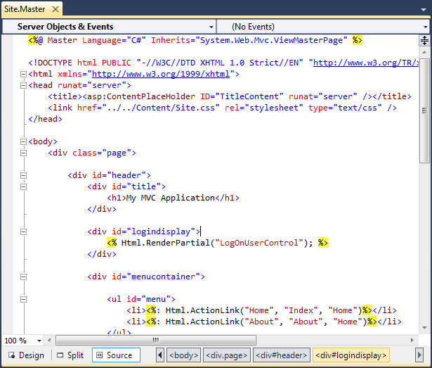
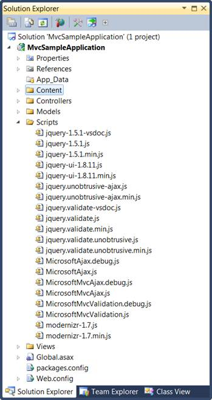

::: {style="DISPLAY: none"}
{#d2h_url_template}{#d2h_package_url style="WIDTH: 0px; DISPLAY: none; HEIGHT: 0px"}
:::

::::: {#nsbanner .d2h_main_nsbanner style="BORDER-BOTTOM: #999999 1px solid; POSITION: relative; PADDING-BOTTOM: 0px; BACKGROUND-COLOR: transparent; PADDING-LEFT: 0px; PADDING-RIGHT: 0px; DISPLAY: none; BORDER-TOP: #999999 1px solid; PADDING-TOP: 0px; LEFT: 0px"}
:::: {#TitleRow .d2h_main_titlerow style="PADDING-BOTTOM: 4px; BACKGROUND-COLOR: transparent; PADDING-LEFT: 22px; WIDTH: 100%; PADDING-RIGHT: 10px; DISPLAY: none; PADDING-TOP: 4px"}
::: {#ienav .d2h_main_ienav style="DISPLAY: none"}
{#D2HPrevious .D2HPreviousEnabled}  {#D2HNext .D2HNextEnabled}
:::
::::
:::::

::::: {#nstext .d2h_main_nstext style="PADDING-BOTTOM: 10px; BACKGROUND-COLOR: transparent; PADDING-LEFT: 22px; PADDING-RIGHT: 10px; HEIGHT: 100%; OVERFLOW: auto; PADDING-TOP: 5px" hasuserbackground="true" valign="bottom"}
::: {#d2h_breadcrumbs .d2h_breadcrumbs}
[Essential Studio User Guide Documentation](ms-xhelp:///?Id=12457748-09e3-4d74-a240-8e049cedf030){.d2h_breadcrumbsNormal}[ \> ]{.d2h_breadcrumbsLinkSeparator}[User Interface Edition](ms-xhelp:///?Id=c29296b7-531c-413b-a0ec-488ca1f7f669){.d2h_breadcrumbsNormal}[ \> ]{.d2h_breadcrumbsLinkSeparator}[Essential ASP.NET MVC](ms-xhelp:///?Id=4b14e7d1-65c4-4f67-b1aa-2c37709905a5){.d2h_breadcrumbsNormal}[ \> ]{.d2h_breadcrumbsLinkSeparator}[Essential Gauge]{.d2h_breadcrumbsContentsOnly}[ \> ]{.d2h_breadcrumbsLinkSeparator}[Getting Started](ms-xhelp:///?Id=0eb97268-6d10-4db1-8ac8-dab54249067e){.d2h_breadcrumbsNormal}[ \> ]{.d2h_breadcrumbsLinkSeparator}[Adding Essential Gauge to the Application (ASPX)](ms-xhelp:///?Id=6a9b5bee-53a2-46cf-99d3-3c3d407362c1){.d2h_breadcrumbsNormal}
:::

### Adding Scripts {#adding-scripts style="tab-stops: 0pt"}

To Add scripts:

1.   On the **Solution Explorer**, double-click the **Views** folder, double-click the Shared folder, and then double-click **Site.Master** file.

 

{border="0"}

Figure 38: Site.Master file displayed under the Shared Folder

**[]{style="FONT-FAMILY: 'Calibri','sans-serif'"}** 

::: {style="BORDER-BOTTOM: windowtext 1pt solid; BORDER-LEFT: medium none; PADDING-BOTTOM: 1pt; MARGIN-TOP: 9pt; PADDING-LEFT: 0pt; PADDING-RIGHT: 0pt; MARGIN-BOTTOM: 9pt; BORDER-TOP: windowtext 1pt solid; BORDER-RIGHT: medium none; PADDING-TOP: 1pt"}
{border="0"} Note: The Site.Master page appears.
:::

[]{style="FONT-FAMILY: 'Calibri','sans-serif'"} 

{border="0"}

Figure 39: Site.Master Page

**[]{style="FONT-FAMILY: 'Calibri','sans-serif'"}** 

2.   On the **Solution Explorer** click **Scripts** folder. The lists of scripts available are displayed.

 

{border="0"} 

Figure 40: List of scripts displayed under the Scripts Folder

**[]{style="FONT-FAMILY: 'Calibri','sans-serif'"}** 

3.   Import the following javascript files onto the Site.Master page.

 

[·      ]{style="FONT-FAMILY: Symbol"}jquery-1.5.1.min.js

[·      ]{style="FONT-FAMILY: Symbol"}MicrosoftAjax.js

[]{style="FONT-FAMILY: 'Calibri','sans-serif'"} 

+----------------------------------------------------------------------------------------------------------------------------------------------------------------------------------------------------------------------------------------------------------------------------------------------------------------------------------------------------------------------------------------------------------------------------------------------------------------+
| [\[Site.Master\] ]{style="FONT-FAMILY: 'Courier New'"}                                                                                                                                                                                                                                                                                                                                                                                                         |
|                                                                                                                                                                                                                                                                                                                                                                                                                                                                |
| [\<]{style="FONT-FAMILY: 'Courier New'; COLOR: blue"}[head]{style="FONT-FAMILY: 'Courier New'; COLOR: maroon"}[ [runat]{style="COLOR: red"}[=\"server\"\>]{style="COLOR: blue"}]{style="FONT-FAMILY: 'Courier New'"}                                                                                                                                                                                                                                           |
|                                                                                                                                                                                                                                                                                                                                                                                                                                                                |
| [............]{style="FONT-FAMILY: 'Courier New'"}                                                                                                                                                                                                                                                                                                                                                                                                             |
|                                                                                                                                                                                                                                                                                                                                                                                                                                                                |
| [............]{style="FONT-FAMILY: 'Courier New'"}                                                                                                                                                                                                                                                                                                                                                                                                             |
|                                                                                                                                                                                                                                                                                                                                                                                                                                                                |
| []{style="FONT-FAMILY: 'Courier New'"}                                                                                                                                                                                                                                                                                                                                                                                                                         |
|                                                                                                                                                                                                                                                                                                                                                                                                                                                                |
| [     [\<]{style="COLOR: blue"}[script]{style="COLOR: maroon"} [src]{style="COLOR: red"}[=\"]{style="COLOR: blue"}[\<%]{style="BACKGROUND: yellow"}[=]{style="COLOR: blue"} Url.Content(\"\~/Scripts/jquery-1.5.1.min.js\") [%\>]{style="BACKGROUND: yellow"}[\"]{style="COLOR: blue"} [type]{style="COLOR: red"}[=\"text/javascript\"\>\</]{style="COLOR: blue"}[script]{style="COLOR: maroon"}[\>]{style="COLOR: blue"}]{style="FONT-FAMILY: 'Courier New'"} |
|                                                                                                                                                                                                                                                                                                                                                                                                                                                                |
| [     [\<]{style="COLOR: blue"}[script]{style="COLOR: maroon"} [src]{style="COLOR: red"}[=\"]{style="COLOR: blue"}[\<%]{style="BACKGROUND: yellow"}[=]{style="COLOR: blue"} Url.Content(\"\~/Scripts/MicrosoftAjax.js\") [%\>]{style="BACKGROUND: yellow"}[\"]{style="COLOR: blue"} [type]{style="COLOR: red"}[=\"text/javascript\"\>\</]{style="COLOR: blue"}[script]{style="COLOR: maroon"}[\>]{style="COLOR: blue"}]{style="FONT-FAMILY: 'Courier New'"}    |
|                                                                                                                                                                                                                                                                                                                                                                                                                                                                |
| [     ]{style="FONT-FAMILY: 'Courier New'"}                                                                                                                                                                                                                                                                                                                                                                                                                    |
|                                                                                                                                                                                                                                                                                                                                                                                                                                                                |
| [\</]{style="FONT-FAMILY: 'Courier New'; COLOR: blue"}[head]{style="FONT-FAMILY: 'Courier New'; COLOR: maroon"}[\>]{style="FONT-FAMILY: 'Courier New'; COLOR: blue"}[]{style="FONT-FAMILY: 'Courier New'; FONT-SIZE: 11pt"}                                                                                                                                                                                                                                    |
+----------------------------------------------------------------------------------------------------------------------------------------------------------------------------------------------------------------------------------------------------------------------------------------------------------------------------------------------------------------------------------------------------------------------------------------------------------------+

[]{#related-topics}
:::::
