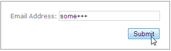
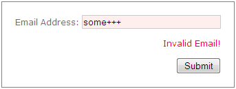

::: {style="DISPLAY: none"}
{#d2h_url_template}{#d2h_package_url style="WIDTH: 0px; DISPLAY: none; HEIGHT: 0px"}
:::

::::: {#nsbanner .d2h_main_nsbanner style="BORDER-BOTTOM: #999999 1px solid; POSITION: relative; PADDING-BOTTOM: 0px; BACKGROUND-COLOR: transparent; PADDING-LEFT: 0px; PADDING-RIGHT: 0px; DISPLAY: none; BORDER-TOP: #999999 1px solid; PADDING-TOP: 0px; LEFT: 0px"}
:::: {#TitleRow .d2h_main_titlerow style="PADDING-BOTTOM: 4px; BACKGROUND-COLOR: transparent; PADDING-LEFT: 22px; WIDTH: 100%; PADDING-RIGHT: 10px; DISPLAY: none; PADDING-TOP: 4px"}
::: {#ienav .d2h_main_ienav style="DISPLAY: none"}
{#D2HPrevious .D2HPreviousEnabled}  {#D2HNext .D2HNextEnabled}
:::
::::
:::::

::::: {#nstext .d2h_main_nstext style="PADDING-BOTTOM: 10px; BACKGROUND-COLOR: transparent; PADDING-LEFT: 22px; PADDING-RIGHT: 10px; HEIGHT: 100%; OVERFLOW: auto; PADDING-TOP: 5px" hasuserbackground="true" valign="bottom"}
::: {#d2h_breadcrumbs .d2h_breadcrumbs}
[Essential Studio User Guide Documentation](ms-xhelp:///?Id=12457748-09e3-4d74-a240-8e049cedf030){.d2h_breadcrumbsNormal}[ \> ]{.d2h_breadcrumbsLinkSeparator}[User Interface Edition](ms-xhelp:///?Id=c29296b7-531c-413b-a0ec-488ca1f7f669){.d2h_breadcrumbsNormal}[ \> ]{.d2h_breadcrumbsLinkSeparator}[Essential ASP.NET MVC](ms-xhelp:///?Id=4b14e7d1-65c4-4f67-b1aa-2c37709905a5){.d2h_breadcrumbsNormal}[ \> ]{.d2h_breadcrumbsLinkSeparator}[Essential Tools]{.d2h_breadcrumbsContentsOnly}[ \> ]{.d2h_breadcrumbsLinkSeparator}[Controls and Components](ms-xhelp:///?Id=f0af2fff-6f00-4ca4-85a6-54e41ac5dc96){.d2h_breadcrumbsNormal}[ \> ]{.d2h_breadcrumbsLinkSeparator}[Server Side Validator](ms-xhelp:///?Id=c51a8919-d734-4742-8ac6-53542d96decc){.d2h_breadcrumbsNormal}
:::

### Adding Server Side Validator to MVC application {#adding-server-side-validator-to-mvc-application style="tab-stops: 0pt"}

Refer to the [Getting Started]{.UGHyperlink} section to know the pre-requisites before stepping in to add a rich text editor control to MVC application application.

Methods

+----------+--------------+--------------------------------------------------------------------------------------------------------------------------------------------------------------------------------------------+---------------------------------------------------------------------------+-------------+---------------------------------------------------------------------------------------------------------------+
| Name     | Parameters                                                                                                                                                                                                                                                                            | Return type | Description                                                                                                   |
+----------+--------------+--------------------------------------------------------------------------------------------------------------------------------------------------------------------------------------------+---------------------------------------------------------------------------+-------------+---------------------------------------------------------------------------------------------------------------+
| Validate | Name         | Type                                                                                                                                                                                       | Description                                                               | void        | Validated the input field with respect to the defined expression and add model state error on validation fail |
|          +--------------+--------------------------------------------------------------------------------------------------------------------------------------------------------------------------------------------+---------------------------------------------------------------------------+             |                                                                                                               |
|          | Id           | [[string]{style="COLOR: windowtext; TEXT-DECORATION: none; text-underline: none"}]{.UGHyperlink}[[]{style="COLOR: windowtext; TEXT-DECORATION: none; text-underline: none"}]{.UGHyperlink} | The key to which the model state error has to be added on validation fail |             |                                                                                                               |
|          +--------------+--------------------------------------------------------------------------------------------------------------------------------------------------------------------------------------------+---------------------------------------------------------------------------+             |                                                                                                               |
|          | errorMessage | [[string]{style="COLOR: windowtext; TEXT-DECORATION: none; text-underline: none"}]{.UGHyperlink}[[]{style="COLOR: windowtext; TEXT-DECORATION: none; text-underline: none"}]{.UGHyperlink} | The message to be displayed on validation fail                            |             |                                                                                                               |
|          +--------------+--------------------------------------------------------------------------------------------------------------------------------------------------------------------------------------------+---------------------------------------------------------------------------+             |                                                                                                               |
|          | Value        | [[string]{style="COLOR: windowtext; TEXT-DECORATION: none; text-underline: none"}]{.UGHyperlink}[[]{style="COLOR: windowtext; TEXT-DECORATION: none; text-underline: none"}]{.UGHyperlink} | Value of the input field to be validated                                  |             |                                                                                                               |
+----------+--------------+--------------------------------------------------------------------------------------------------------------------------------------------------------------------------------------------+---------------------------------------------------------------------------+-------------+---------------------------------------------------------------------------------------------------------------+

[]{style="FONT-FAMILY: 'Calibri','sans-serif'"} 

The following steps explain adding the server side validator to an application.

1.   In **View**, create a form with input fields followed by the validation message as below.

**[]{style="FONT-FAMILY: 'Calibri','sans-serif'"}** 

**[]{style="FONT-FAMILY: 'Calibri','sans-serif'"}** 

+--------------------------------------------------------------------------------------------------------------------------------------------------------------------------------------------------------------------------------------------------------------------------------+
| **View\[ASPX\]**                                                                                                                                                                                                                                                               |
|                                                                                                                                                                                                                                                                                |
| [\<%]{style="FONT-FAMILY: Consolas; BACKGROUND: yellow; FONT-SIZE: 9.5pt"}[using]{style="FONT-FAMILY: Consolas; COLOR: blue; FONT-SIZE: 9.5pt"}[ (Html.BeginForm()){ [%\>]{style="BACKGROUND: yellow"}]{style="FONT-FAMILY: Consolas; FONT-SIZE: 9.5pt"}                       |
|                                                                                                                                                                                                                                                                                |
| [       Email Address:]{style="FONT-FAMILY: Consolas; FONT-SIZE: 9.5pt"}                                                                                                                                                                                                       |
|                                                                                                                                                                                                                                                                                |
| [              [\<%]{style="BACKGROUND: yellow"}[=]{style="COLOR: blue"}Html.Syncfusion().TextBox([\"Email\"]{style="COLOR: #a31515"}) [%\>]{style="BACKGROUND: yellow"}]{style="FONT-FAMILY: Consolas; FONT-SIZE: 9.5pt"}                                                     |
|                                                                                                                                                                                                                                                                                |
| [              [\<%]{style="BACKGROUND: yellow"}[=]{style="COLOR: blue"} Html.Syncfusion().ValidationMessage([\"Email\"]{style="COLOR: #a31515"})[%\>]{style="BACKGROUND: yellow"}]{style="FONT-FAMILY: Consolas; FONT-SIZE: 9.5pt"}                                           |
|                                                                                                                                                                                                                                                                                |
| [              [\<]{style="COLOR: blue"}[input]{style="COLOR: maroon"} [type]{style="COLOR: red"}[=\"submit\"]{style="COLOR: blue"} [value]{style="COLOR: red"}[=\"Submit\"]{style="COLOR: blue"} [/\>]{style="COLOR: blue"}]{style="FONT-FAMILY: Consolas; FONT-SIZE: 9.5pt"} |
|                                                                                                                                                                                                                                                                                |
| [       [\<%]{style="BACKGROUND: yellow"}} [%\>]{style="BACKGROUND: yellow"}]{style="FONT-FAMILY: Consolas; FONT-SIZE: 9.5pt"}                                                                                                                                                 |
|                                                                                                                                                                                                                                                                                |
| []{style="FONT-FAMILY: Consolas; BACKGROUND: yellow; FONT-SIZE: 9.5pt"}                                                                                                                                                                                                        |
+--------------------------------------------------------------------------------------------------------------------------------------------------------------------------------------------------------------------------------------------------------------------------------+

**[]{style="FONT-FAMILY: 'Calibri','sans-serif'"}** 

+--------------------------------------------------------------------------------------------------------------------------------------------------------------------------------------------------------------------------------------------------------------------------------+
| **View\[cshtml\]**                                                                                                                                                                                                                                                             |
|                                                                                                                                                                                                                                                                                |
|                                                                                                                                                                                                                                                                                |
|                                                                                                                                                                                                                                                                                |
| []{style="FONT-FAMILY: Consolas; FONT-SIZE: 9.5pt"}                                                                                                                                                                                                                            |
|                                                                                                                                                                                                                                                                                |
| [\@{]{style="FONT-FAMILY: Consolas; BACKGROUND: yellow; FONT-SIZE: 9.5pt"}[using]{style="FONT-FAMILY: Consolas; COLOR: blue; FONT-SIZE: 9.5pt"}[ (Html.BeginForm( )){]{style="FONT-FAMILY: Consolas; FONT-SIZE: 9.5pt"}                                                        |
|                                                                                                                                                                                                                                                                                |
| [    ]{style="FONT-FAMILY: Consolas; FONT-SIZE: 9.5pt"}                                                                                                                                                                                                                        |
|                                                                                                                                                                                                                                                                                |
| [              [@]{style="BACKGROUND: yellow"}Html.TextBox([\"Email\"]{style="COLOR: #a31515"})]{style="FONT-FAMILY: Consolas; FONT-SIZE: 9.5pt"}                                                                                                                              |
|                                                                                                                                                                                                                                                                                |
| [              [@]{style="BACKGROUND: yellow"}Html.ValidationMessage([\"Email\"]{style="COLOR: #a31515"})]{style="FONT-FAMILY: Consolas; FONT-SIZE: 9.5pt"}                                                                                                                    |
|                                                                                                                                                                                                                                                                                |
| []{style="FONT-FAMILY: Consolas; FONT-SIZE: 9.5pt"}                                                                                                                                                                                                                            |
|                                                                                                                                                                                                                                                                                |
| [              [\<]{style="COLOR: blue"}[input]{style="COLOR: maroon"} [type]{style="COLOR: red"}[=\"submit\"]{style="COLOR: blue"} [value]{style="COLOR: red"}[=\"Submit\"]{style="COLOR: blue"} [/\>]{style="COLOR: blue"}]{style="FONT-FAMILY: Consolas; FONT-SIZE: 9.5pt"} |
|                                                                                                                                                                                                                                                                                |
| [       } [}]{style="BACKGROUND: yellow"}]{style="FONT-FAMILY: Consolas; FONT-SIZE: 9.5pt"}                                                                                                                                                                                    |
|                                                                                                                                                                                                                                                                                |
|                                                                                                                                                                                                                                                                                |
|                                                                                                                                                                                                                                                                                |
| []{style="FONT-FAMILY: Consolas; BACKGROUND: yellow; FONT-SIZE: 9.5pt"}                                                                                                                                                                                                        |
+--------------------------------------------------------------------------------------------------------------------------------------------------------------------------------------------------------------------------------------------------------------------------------+

[]{style="FONT-FAMILY: Consolas; BACKGROUND: yellow; FONT-SIZE: 9.5pt"} 

[]{style="FONT-FAMILY: Consolas; BACKGROUND: yellow; FONT-SIZE: 9.5pt"} 

2.   In the **Controller**, invoke the validation method in the post action as below.

**[]{style="FONT-FAMILY: 'Calibri','sans-serif'"}** 

+------------------------------------------------------------------------------------------------------------------------------------------------------------------------------------------------------------------------------------------------------------------+
| **\[Controller\]**                                                                                                                                                                                                                                               |
|                                                                                                                                                                                                                                                                  |
| [public]{style="FONT-FAMILY: Consolas; COLOR: blue; FONT-SIZE: 9.5pt"}[ [ActionResult]{style="COLOR: #2b91af"} Index()]{style="FONT-FAMILY: Consolas; FONT-SIZE: 9.5pt"}                                                                                         |
|                                                                                                                                                                                                                                                                  |
| [        {            ]{style="FONT-FAMILY: Consolas; FONT-SIZE: 9.5pt"}                                                                                                                                                                                         |
|                                                                                                                                                                                                                                                                  |
| [            [return]{style="COLOR: blue"} View();]{style="FONT-FAMILY: Consolas; FONT-SIZE: 9.5pt"}                                                                                                                                                             |
|                                                                                                                                                                                                                                                                  |
| [        }]{style="FONT-FAMILY: Consolas; FONT-SIZE: 9.5pt"}                                                                                                                                                                                                     |
|                                                                                                                                                                                                                                                                  |
| []{style="FONT-FAMILY: Consolas; FONT-SIZE: 9.5pt"}                                                                                                                                                                                                              |
|                                                                                                                                                                                                                                                                  |
| [        [//Post Action for the form]{style="COLOR: green"}]{style="FONT-FAMILY: Consolas; FONT-SIZE: 9.5pt"}                                                                                                                                                    |
|                                                                                                                                                                                                                                                                  |
| [        \[[AcceptVerbs]{style="COLOR: #2b91af"}([HttpVerbs]{style="COLOR: #2b91af"}.Post)\]        ]{style="FONT-FAMILY: Consolas; FONT-SIZE: 9.5pt"}                                                                                                           |
|                                                                                                                                                                                                                                                                  |
| [        [public]{style="COLOR: blue"} [ActionResult]{style="COLOR: #2b91af"} Index([string]{style="COLOR: blue"} Email)]{style="FONT-FAMILY: Consolas; FONT-SIZE: 9.5pt"}                                                                                       |
|                                                                                                                                                                                                                                                                  |
| [        {]{style="FONT-FAMILY: Consolas; FONT-SIZE: 9.5pt"}                                                                                                                                                                                                     |
|                                                                                                                                                                                                                                                                  |
| [             [//Invoke the Validate method with the appropriate arguments]{style="COLOR: green"}]{style="FONT-FAMILY: Consolas; FONT-SIZE: 9.5pt"}                                                                                                              |
|                                                                                                                                                                                                                                                                  |
| [ModelState.Validate([\"Email\"]{style="COLOR: #a31515"}, [\"Invalid Email!\"]{style="COLOR: #a31515"},[ ModelStateExtensions]{style="COLOR: #2b91af"}.[ValidationType]{style="COLOR: #2b91af"}.Email, Email);]{style="FONT-FAMILY: Consolas; FONT-SIZE: 9.5pt"} |
|                                                                                                                                                                                                                                                                  |
| [              [return]{style="COLOR: blue"} View();]{style="FONT-FAMILY: Consolas; FONT-SIZE: 9.5pt"}                                                                                                                                                           |
|                                                                                                                                                                                                                                                                  |
| []{style="FONT-FAMILY: Consolas; FONT-SIZE: 9.5pt"}                                                                                                                                                                                                              |
|                                                                                                                                                                                                                                                                  |
| [        }  ]{style="FONT-FAMILY: Consolas; FONT-SIZE: 9.5pt"}                                                                                                                                                                                                   |
|                                                                                                                                                                                                                                                                  |
| []{style="FONT-FAMILY: Consolas; BACKGROUND: yellow; FONT-SIZE: 9.5pt"}                                                                                                                                                                                          |
+------------------------------------------------------------------------------------------------------------------------------------------------------------------------------------------------------------------------------------------------------------------+

[]{style="FONT-FAMILY: Consolas; FONT-SIZE: 9.5pt"} 

3.   Build and run the application

The output is displayed in the following screenshot.

 

{border="0"}

Figure 232: Form with input field

 

4.   Enter some text in the email address text box and click submit button as above. When the validation fail, you can see the below screen shot as ouput.

 

{border="0"}

Figure 233: Form on validation fail

 

A sample which demonstrates a basic Server Side Validator control can be downloaded from the below mentioned link.

[]{style="FONT-FAMILY: 'Calibri','sans-serif'; COLOR: black"} 

[[Server Side Validator]{.UGHyperlink}](http://files.syncfusion.com/Support/Tools_MVC/v8.3.0.20/Test_ServersideValidator.zip)[]{.UGHyperlink}

[]{style="FONT-FAMILY: 'Calibri','sans-serif'; COLOR: black"} 

::: {style="BORDER-BOTTOM: windowtext 1pt solid; BORDER-LEFT: medium none; PADDING-BOTTOM: 1pt; MARGIN-TOP: 9pt; PADDING-LEFT: 0pt; PADDING-RIGHT: 0pt; MARGIN-BOTTOM: 9pt; BORDER-TOP: windowtext 1pt solid; BORDER-RIGHT: medium none; PADDING-TOP: 1pt"}
{border="0"}Note:The version number for the assemblies has been set to 8.3.0.20 in the Web.config file of the attached sample. Please change the version number to the appropriate version in the Web-2008.config or Web-2010.config files (available in root directory) and those will automatically be updated in the Web.config file.
:::

 

[]{#related-topics}
:::::
