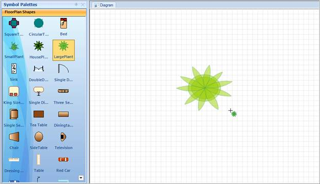

::: {style="DISPLAY: none"}
{#d2h_url_template}{#d2h_package_url style="WIDTH: 0px; DISPLAY: none; HEIGHT: 0px"}
:::

::::: {#nsbanner .d2h_main_nsbanner style="BORDER-BOTTOM: #999999 1px solid; POSITION: relative; PADDING-BOTTOM: 0px; BACKGROUND-COLOR: transparent; PADDING-LEFT: 0px; PADDING-RIGHT: 0px; DISPLAY: none; BORDER-TOP: #999999 1px solid; PADDING-TOP: 0px; LEFT: 0px"}
:::: {#TitleRow .d2h_main_titlerow style="PADDING-BOTTOM: 4px; BACKGROUND-COLOR: transparent; PADDING-LEFT: 22px; WIDTH: 100%; PADDING-RIGHT: 10px; DISPLAY: none; PADDING-TOP: 4px"}
::: {#ienav .d2h_main_ienav style="DISPLAY: none"}
{#D2HPrevious .D2HPreviousEnabled}  {#D2HNext .D2HNextEnabled}
:::
::::
:::::

:::::: {#nstext .d2h_main_nstext style="PADDING-BOTTOM: 10px; BACKGROUND-COLOR: transparent; PADDING-LEFT: 22px; PADDING-RIGHT: 10px; HEIGHT: 100%; OVERFLOW: auto; PADDING-TOP: 5px" hasuserbackground="true" valign="bottom"}
::: {#d2h_breadcrumbs .d2h_breadcrumbs}
[Essential Studio User Guide Documentation](ms-xhelp:///?Id=12457748-09e3-4d74-a240-8e049cedf030){.d2h_breadcrumbsNormal}[ \> ]{.d2h_breadcrumbsLinkSeparator}[User Interface Edition](ms-xhelp:///?Id=c29296b7-531c-413b-a0ec-488ca1f7f669){.d2h_breadcrumbsNormal}[ \> ]{.d2h_breadcrumbsLinkSeparator}[Essential Windows](ms-xhelp:///?Id=e60759d8-47a4-4570-9d7a-16a68d63f2ea){.d2h_breadcrumbsNormal}[ \> ]{.d2h_breadcrumbsLinkSeparator}[Essential Diagram]{.d2h_breadcrumbsContentsOnly}[ \> ]{.d2h_breadcrumbsLinkSeparator}[Concepts And Features](ms-xhelp:///?Id=008cec4b-5177-4859-8616-c062751d8fb6){.d2h_breadcrumbsNormal}[ \> ]{.d2h_breadcrumbsLinkSeparator}[Advanced Features](ms-xhelp:///?Id=f661be94-4825-49a2-ac75-df5e8495098e){.d2h_breadcrumbsNormal}
:::

### Adding Shapes by Clicking the Diagram Page {#adding-shapes-by-clicking-the-diagram-page style="TEXT-ALIGN: justify; tab-stops: 0pt"}

 

Essential Diagram enables you to draw the selected node by clicking the Diagram page instead of dragging from the Symbol Palette.

 

Properties

Table 4: Property[ ]{style="COLOR: #c00000"}Table

::: {align="center"}
  -------------- -------------------------------------------------------------------------------- ---------- --------------- ---------------------
  **Property**   **Description**                                                                  **Type**   **Data Type**   **Reference links**
  Diagram        Reference to enable drawing the selected node by clicking on the diagram page.   NA         Diagram         NA.
  -------------- -------------------------------------------------------------------------------- ---------- --------------- ---------------------
:::

 

[]{style="COLOR: #c00000"} 

[]{style="COLOR: #c00000"} 

Enabling Adding Shapes by Clicking Support

You can enable drawing shapes by clicking the diagram page using the *Diagram* property.

 

+----------------------------------------------------------------------------------------------------------------+
| **\[C#\]**                                                                                                     |
|                                                                                                                |
| [//Palette group view]{style="FONT-FAMILY: 'Courier New'; COLOR: green"}[]{style="FONT-FAMILY: 'Courier New'"} |
|                                                                                                                |
| [paletteGroupView1.Diagram = diagram1;]{style="FONT-FAMILY: 'Courier New'"}                                    |
|                                                                                                                |
| [           [// Platte group bar      ]{style="COLOR: green"}]{style="FONT-FAMILY: 'Courier New'"}             |
|                                                                                                                |
| [paletteGroupBar1.Diagram = diagram1;]{style="FONT-FAMILY: 'Courier New'"}                                     |
|                                                                                                                |
| []{style="FONT-FAMILY: 'Courier New'"}                                                                         |
+----------------------------------------------------------------------------------------------------------------+

[]{style="FONT-FAMILY: 'Courier New'"} 

+----------------------------------------------------------------------------------------------------------------+
| **\[VB\]**                                                                                                     |
|                                                                                                                |
| [           ]{style="FONT-FAMILY: 'Courier New'"}                                                              |
|                                                                                                                |
| [\'Palette group view]{style="FONT-FAMILY: 'Courier New'; COLOR: green"}[]{style="FONT-FAMILY: 'Courier New'"} |
|                                                                                                                |
| [paletteGroupView1.Diagram = diagram1;]{style="FONT-FAMILY: 'Courier New'"}                                    |
|                                                                                                                |
| [           [\'Platte group bar ]{style="COLOR: green"}]{style="FONT-FAMILY: 'Courier New'"}                   |
|                                                                                                                |
| [paletteGroupBar1.Diagram = diagram1;]{style="FONT-FAMILY: 'Courier New'"}                                     |
+----------------------------------------------------------------------------------------------------------------+

[]{style="FONT-FAMILY: 'Courier New'"} 

[]{style="FONT-FAMILY: 'Courier New'"} 

[]{style="FONT-FAMILY: 'Courier New'"} 

{border="0"}

Figure 119: Added Shares

 

::: {style="BORDER-BOTTOM: windowtext 1pt solid; BORDER-LEFT: medium none; PADDING-BOTTOM: 1pt; MARGIN-TOP: 9pt; PADDING-LEFT: 0pt; PADDING-RIGHT: 0pt; MARGIN-BOTTOM: 9pt; BORDER-TOP: windowtext 1pt solid; BORDER-RIGHT: medium none; PADDING-TOP: 1pt"}
{border="0"}Note: Click the Diagram page to add the selected node. Click and drag to get the required size.
:::

 

Sample Link

To view a sample:

 

1.   Open the Syncfusion Dashboard.

2.   Click the **Windows Forms** drop-down list and select **Run Locally Installed Samples.**

3.   Navigate to **Diagram[ ]{style="COLOR: #c00000"}Samples \> Product Showcase \> Diagram Builder.**

 

 

 

[]{#related-topics}
::::::
