::: {style="DISPLAY: none"}
{#d2h_url_template}{#d2h_package_url style="WIDTH: 0px; DISPLAY: none; HEIGHT: 0px"}
:::

::: {.d2h_secondary_topic style="PADDING-BOTTOM: 10pt; MARGIN: 0pt; PADDING-LEFT: 0pt; PADDING-RIGHT: 0pt; PADDING-TOP: 0pt"}
#### Adding Skin to an Application {#adding-skin-to-an-application style="tab-stops: 0pt"}

Visual styles can be set for a grid by using the **VisualStyle** property. The following code illustrates this:

 

+----------------------------------------------------------------------------------------------------------------------------------------------------------------------------------------------------------------------------------------------------------------------------------------------------------------------------------------------------------------------------------------------------------------------------------------------------------------------------------------------------------------------------------------------------------------------------------------------------------------------------------------------------------------------------------------------------------------------------------------------------------------------------------------------------------------------------------------------------------------------------------------------------------------------------------------------------------------------------------------------------------------------------------------------------------------------------+
| **[\[XAML\]]{style="FONT-FAMILY: 'Courier New'; COLOR: black"}**                                                                                                                                                                                                                                                                                                                                                                                                                                                                                                                                                                                                                                                                                                                                                                                                                                                                                                                                                                                                           |
|                                                                                                                                                                                                                                                                                                                                                                                                                                                                                                                                                                                                                                                                                                                                                                                                                                                                                                                                                                                                                                                                            |
|                                                                                                                                                                                                                                                                                                                                                                                                                                                                                                                                                                                                                                                                                                                                                                                                                                                                                                                                                                                                                                                                            |
|                                                                                                                                                                                                                                                                                                                                                                                                                                                                                                                                                                                                                                                                                                                                                                                                                                                                                                                                                                                                                                                                            |
| [\<]{style="FONT-FAMILY: 'Courier New'; COLOR: blue"}[syncfusion:GridDataControl]{style="FONT-FAMILY: 'Courier New'; COLOR: #a31515"}[ ]{style="FONT-FAMILY: 'Courier New'; COLOR: black"}[x:Name]{style="FONT-FAMILY: 'Courier New'; COLOR: red"}[=\"dataGrid2\"]{style="FONT-FAMILY: 'Courier New'; COLOR: blue"}[ ]{style="FONT-FAMILY: 'Courier New'; COLOR: black"}[AutoPopulateColumns]{style="FONT-FAMILY: 'Courier New'; COLOR: red"}[=\"False\"]{style="FONT-FAMILY: 'Courier New'; COLOR: blue"}[ ]{style="FONT-FAMILY: 'Courier New'; COLOR: black"}[AutoPopulateRelations]{style="FONT-FAMILY: 'Courier New'; COLOR: red"}[=\"False\"]{style="FONT-FAMILY: 'Courier New'; COLOR: blue"}[  ]{style="FONT-FAMILY: 'Courier New'; COLOR: black"}[ItemsSource]{style="FONT-FAMILY: 'Courier New'; COLOR: red"}[=\"{StaticResource ordersSource}\" ]{style="FONT-FAMILY: 'Courier New'; COLOR: blue"}[syncfusion:SkinStorage.VisualStyle]{style="FONT-FAMILY: 'Courier New'; COLOR: red"}[=\"Office2007Blue\" /\>]{style="FONT-FAMILY: 'Courier New'; COLOR: blue"} |
+----------------------------------------------------------------------------------------------------------------------------------------------------------------------------------------------------------------------------------------------------------------------------------------------------------------------------------------------------------------------------------------------------------------------------------------------------------------------------------------------------------------------------------------------------------------------------------------------------------------------------------------------------------------------------------------------------------------------------------------------------------------------------------------------------------------------------------------------------------------------------------------------------------------------------------------------------------------------------------------------------------------------------------------------------------------------------+

 

+----------------------------------------------------------------------------------------------------------------------------------------------------------------------------------+
| **[\[C#\]]{style="FONT-FAMILY: 'Courier New'; COLOR: black"}**                                                                                                                   |
|                                                                                                                                                                                  |
|                                                                                                                                                                                  |
|                                                                                                                                                                                  |
| [SkinStorage]{style="FONT-FAMILY: 'Courier New'; COLOR: #2b91af"}[.SetVisualStyle(dataGrid2, [\"Office2007Blue\"]{style="COLOR: #a31515"});]{style="FONT-FAMILY: 'Courier New'"} |
+----------------------------------------------------------------------------------------------------------------------------------------------------------------------------------+

 

The following images show different visual styles applied to the grid.

{border="0"}

Figure 147: Office14Blue

 

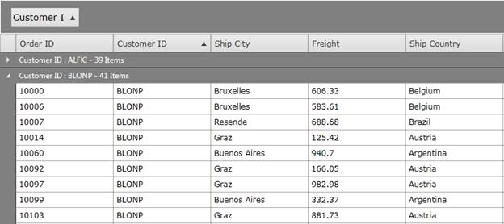{border="0"}

Figure 148: Office14Black

 

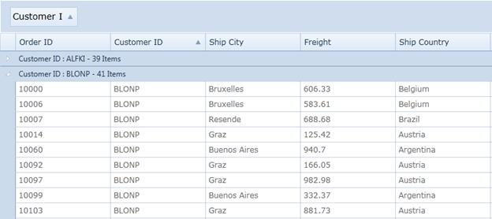{border="0"}

Figure 149: Office14Silver

 

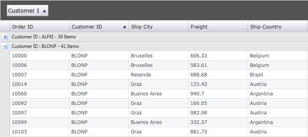{border="0"}

Figure 150: Office2007Black

 

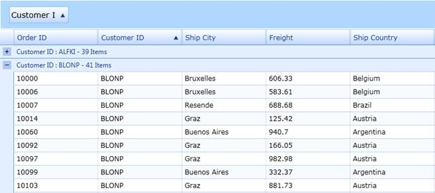{border="0"}

Figure 151: Office2007Blue

 

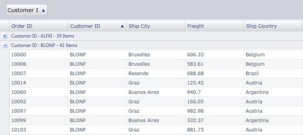{border="0"}

Figure 152: Office2007Silver

 

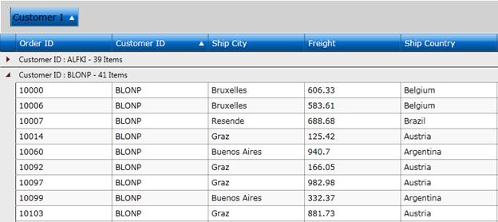{border="0"}

Figure 153:ShinyBlue

 

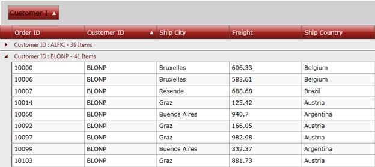{border="0"}

Figure 154: ShinyRed

 

 

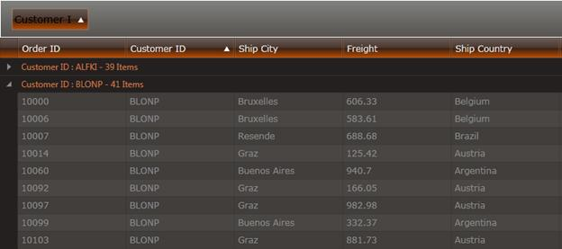{border="0"}

Figure 155: SunBlack

 

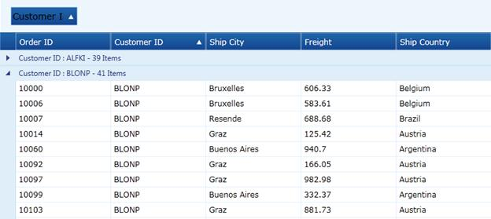{border="0"}

Figure 156: Syncfusion

 

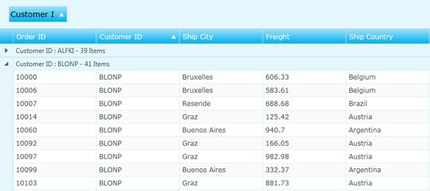{border="0"}

Figure 157: Twilight Blue

 

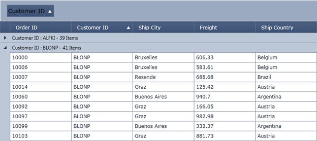{border="0"}

Figure 158: VS2010

 

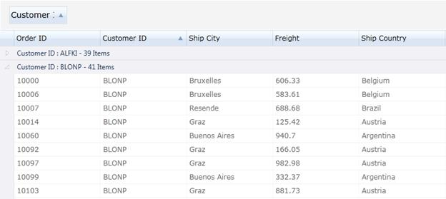{border="0"}

Figure 159: Windows7

 

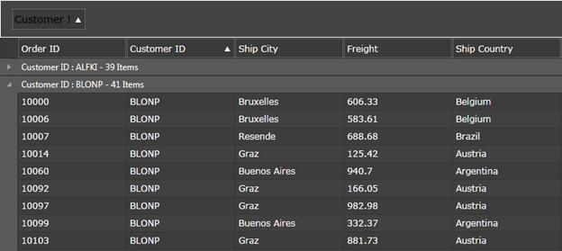{border="0"}

Figure 160: Blend

 

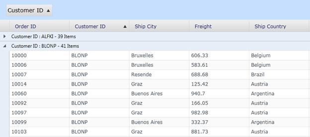{border="0"}

Figure 161: Bureau Blue

 

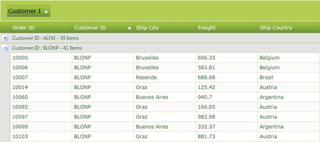{border="0"}

Figure 162: Glassy Green

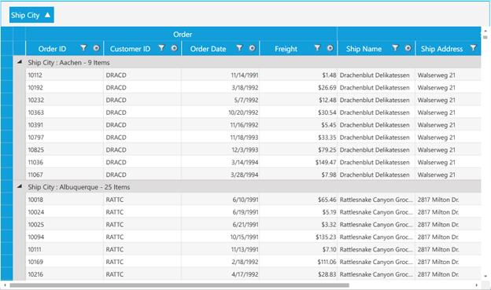{border="0"}

Figure 163: Metro

[]{#related-topics}
:::
