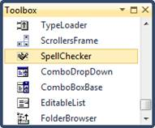
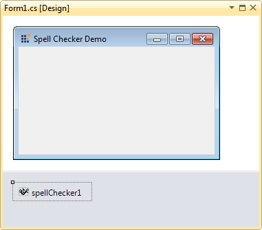

::: {style="DISPLAY: none"}
{#d2h_url_template}{#d2h_package_url style="WIDTH: 0px; DISPLAY: none; HEIGHT: 0px"}
:::

::: {.d2h_secondary_topic style="PADDING-BOTTOM: 10pt; MARGIN: 0pt; PADDING-LEFT: 0pt; PADDING-RIGHT: 0pt; PADDING-TOP: 0pt"}
##### Adding SpellChecker to an Application {#adding-spellchecker-to-an-application style="tab-stops: 0pt"}

 

Drag and drop the SpellChecker from the tool box to the form. SpellChecker will be added to the component tray of the form the control is hosted in.

 

{border="0"}

Figure 644: SpellChecker Toolbox View

 

{border="0"}

Figure 645: SpellChecker Designer view

 

[]{#related-topics}
:::
