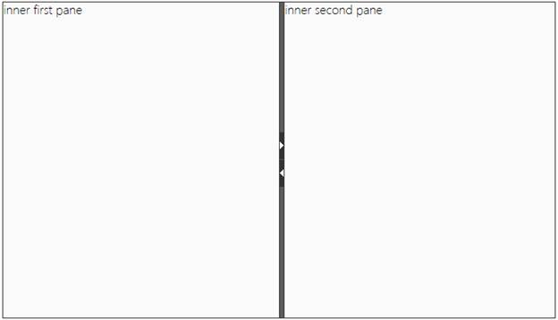
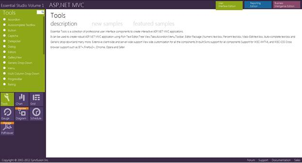
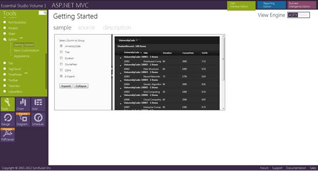

::: {style="DISPLAY: none"}
{#d2h_url_template}{#d2h_package_url style="WIDTH: 0px; DISPLAY: none; HEIGHT: 0px"}
:::

::::: {#nsbanner .d2h_main_nsbanner style="BORDER-BOTTOM: #999999 1px solid; POSITION: relative; PADDING-BOTTOM: 0px; BACKGROUND-COLOR: transparent; PADDING-LEFT: 0px; PADDING-RIGHT: 0px; DISPLAY: none; BORDER-TOP: #999999 1px solid; PADDING-TOP: 0px; LEFT: 0px"}
:::: {#TitleRow .d2h_main_titlerow style="PADDING-BOTTOM: 4px; BACKGROUND-COLOR: transparent; PADDING-LEFT: 22px; WIDTH: 100%; PADDING-RIGHT: 10px; DISPLAY: none; PADDING-TOP: 4px"}
::: {#ienav .d2h_main_ienav style="DISPLAY: none"}
{#D2HPrevious .D2HPreviousEnabled}  {#D2HNext .D2HNextEnabled}
:::
::::
:::::

:::: {#nstext .d2h_main_nstext style="PADDING-BOTTOM: 10px; BACKGROUND-COLOR: transparent; PADDING-LEFT: 22px; PADDING-RIGHT: 10px; HEIGHT: 100%; OVERFLOW: auto; PADDING-TOP: 5px" hasuserbackground="true" valign="bottom"}
::: {#d2h_breadcrumbs .d2h_breadcrumbs}
[Essential Studio User Guide Documentation](ms-xhelp:///?Id=12457748-09e3-4d74-a240-8e049cedf030){.d2h_breadcrumbsNormal}[ \> ]{.d2h_breadcrumbsLinkSeparator}[User Interface Edition](ms-xhelp:///?Id=c29296b7-531c-413b-a0ec-488ca1f7f669){.d2h_breadcrumbsNormal}[ \> ]{.d2h_breadcrumbsLinkSeparator}[Essential ASP.NET MVC](ms-xhelp:///?Id=4b14e7d1-65c4-4f67-b1aa-2c37709905a5){.d2h_breadcrumbsNormal}[ \> ]{.d2h_breadcrumbsLinkSeparator}[Essential Tools]{.d2h_breadcrumbsContentsOnly}[ \> ]{.d2h_breadcrumbsLinkSeparator}[Controls and Components](ms-xhelp:///?Id=f0af2fff-6f00-4ca4-85a6-54e41ac5dc96){.d2h_breadcrumbsNormal}[ \> ]{.d2h_breadcrumbsLinkSeparator}[Splitter Control](ms-xhelp:///?Id=5dbd2817-b3e4-4ea1-a6fa-209a3179c5e8){.d2h_breadcrumbsNormal}
:::

### Adding Splitter Control to an MVC Application[]{style="FONT-FAMILY: 'Cambria','serif'; FONT-SIZE: 13pt"} {#adding-splitter-control-to-an-mvc-application style="tab-stops: 0pt"}

[Refer to the ]{style="COLOR: black"}[[Getting Started]{style="COLOR: blue"}]{.underline}[ ]{style="COLOR: blue"}[section for the prerequisites needed to add the Splitter control to an ASP.NET MVC application.]{style="COLOR: black"}

[The following steps explain how to add the Splitter control.]{style="COLOR: black"}

[1.   In the **view**, invoke the **Splitter** helper with the control ID as the first argument.]{style="COLOR: black"}

+--------------------------------------------------------------------------------------------------------------------------------------------------------------------------------------------------------------------------------------------------------------------------------------------------------+
| [ ]{style="COLOR: black"}**[\[ASPX\]]{style="FONT-FAMILY: 'Courier New'"}**[]{style="FONT-FAMILY: 'Courier New'"}                                                                                                                                                                                      |
|                                                                                                                                                                                                                                                                                                        |
| [\<%]{style="FONT-FAMILY: 'Courier New'; BACKGROUND: yellow"}[=]{style="FONT-FAMILY: 'Courier New'; COLOR: blue"}[Html.Syncfusion().Splitter([\"splitter\"]{style="COLOR: #a31515"})]{style="FONT-FAMILY: 'Courier New'"}[.SplitterPanes(panes1=\>{ ]{style="FONT-FAMILY: Consolas; FONT-SIZE: 9.5pt"} |
|                                                                                                                                                                                                                                                                                                        |
| []{style="FONT-FAMILY: Consolas; FONT-SIZE: 9.5pt"}                                                                                                                                                                                                                                                    |
|                                                                                                                                                                                                                                                                                                        |
| [panes1.Add().PaneSize([Unit]{style="COLOR: #2b91af"}.Percentage(50)).ContentTemplate(()=\>{[%\>]{style="BACKGROUND: yellow"}]{style="FONT-FAMILY: Consolas; FONT-SIZE: 9.5pt"}                                                                                                                        |
|                                                                                                                                                                                                                                                                                                        |
| []{style="FONT-FAMILY: Consolas; FONT-SIZE: 9.5pt"}                                                                                                                                                                                                                                                    |
|                                                                                                                                                                                                                                                                                                        |
| [             [\<]{style="COLOR: blue"}[p]{style="COLOR: maroon"}[\>]{style="COLOR: blue"}inner first pane[\</]{style="COLOR: blue"}[p]{style="COLOR: maroon"}[\>]{style="COLOR: blue"}]{style="FONT-FAMILY: Consolas; FONT-SIZE: 9.5pt"}                                                              |
|                                                                                                                                                                                                                                                                                                        |
| []{style="FONT-FAMILY: Consolas; FONT-SIZE: 9.5pt"}                                                                                                                                                                                                                                                    |
|                                                                                                                                                                                                                                                                                                        |
| [\<%]{style="FONT-FAMILY: Consolas; BACKGROUND: yellow; FONT-SIZE: 9.5pt"}[}).SplitterBar(b=\>b.AllowSplitterBar([true]{style="COLOR: blue"})); ]{style="FONT-FAMILY: Consolas; FONT-SIZE: 9.5pt"}                                                                                                     |
|                                                                                                                                                                                                                                                                                                        |
| []{style="FONT-FAMILY: Consolas; FONT-SIZE: 9.5pt"}                                                                                                                                                                                                                                                    |
|                                                                                                                                                                                                                                                                                                        |
| [panes1.Add().PaneSize([Unit]{style="COLOR: #2b91af"}.Percentage(30)).ContentTemplate(()=\>{[%\>]{style="BACKGROUND: yellow"}]{style="FONT-FAMILY: Consolas; FONT-SIZE: 9.5pt"}                                                                                                                        |
|                                                                                                                                                                                                                                                                                                        |
| []{style="FONT-FAMILY: Consolas; FONT-SIZE: 9.5pt"}                                                                                                                                                                                                                                                    |
|                                                                                                                                                                                                                                                                                                        |
| [             [\<]{style="COLOR: blue"}[p]{style="COLOR: maroon"}[\>]{style="COLOR: blue"}inner second pane[\</]{style="COLOR: blue"}[p]{style="COLOR: maroon"}[\>]{style="COLOR: blue"}]{style="FONT-FAMILY: Consolas; FONT-SIZE: 9.5pt"}                                                             |
|                                                                                                                                                                                                                                                                                                        |
| []{style="FONT-FAMILY: Consolas; FONT-SIZE: 9.5pt"}                                                                                                                                                                                                                                                    |
|                                                                                                                                                                                                                                                                                                        |
| [   [\<%]{style="BACKGROUND: yellow"}});]{style="FONT-FAMILY: Consolas; FONT-SIZE: 9.5pt"}                                                                                                                                                                                                             |
|                                                                                                                                                                                                                                                                                                        |
| [})]{style="FONT-FAMILY: Consolas; FONT-SIZE: 9.5pt"}[%\>]{style="FONT-FAMILY: 'Courier New'; BACKGROUND: yellow"}[ ]{style="FONT-FAMILY: 'Courier New'"}                                                                                                                                              |
+--------------------------------------------------------------------------------------------------------------------------------------------------------------------------------------------------------------------------------------------------------------------------------------------------------+

[]{style="COLOR: black"}[]{style="FONT-FAMILY: 'Times New Roman','serif'; COLOR: black; FONT-SIZE: 12pt"} 

+---------------------------------------------------------------------------------------------------------------------------------------------------------------------------------------------------------------------------------------------------------------------------------------------------------------------------------------------------------------------------------------------------------------------------------+
| **[\[Razor\]]{style="FONT-FAMILY: 'Courier New'"}**[]{style="FONT-FAMILY: 'Courier New'"}                                                                                                                                                                                                                                                                                                                                       |
|                                                                                                                                                                                                                                                                                                                                                                                                                                 |
| []{style="FONT-FAMILY: 'Courier New'"}                                                                                                                                                                                                                                                                                                                                                                                          |
|                                                                                                                                                                                                                                                                                                                                                                                                                                 |
| [\@{]{style="FONT-FAMILY: 'Courier New'; BACKGROUND: yellow"}[Html.Syncfusion().Splitter([\"splitter\"]{style="COLOR: #a31515"})]{style="FONT-FAMILY: 'Courier New'"}[.SplitterPanes(panes1=\>{ ]{style="FONT-FAMILY: Consolas; FONT-SIZE: 9.5pt"}                                                                                                                                                                              |
|                                                                                                                                                                                                                                                                                                                                                                                                                                 |
| []{style="FONT-FAMILY: Consolas; FONT-SIZE: 9.5pt"}                                                                                                                                                                                                                                                                                                                                                                             |
|                                                                                                                                                                                                                                                                                                                                                                                                                                 |
| [panes1.Add().PaneSize([Unit]{style="COLOR: #2b91af"}.Percentage(50)).ContentTemplate(]{style="FONT-FAMILY: Consolas; FONT-SIZE: 9.5pt"}                                                                                                                                                                                                                                                                                        |
|                                                                                                                                                                                                                                                                                                                                                                                                                                 |
| []{style="FONT-FAMILY: Consolas; FONT-SIZE: 9.5pt"}                                                                                                                                                                                                                                                                                                                                                                             |
|                                                                                                                                                                                                                                                                                                                                                                                                                                 |
| [@]{style="FONT-FAMILY: Consolas; BACKGROUND: yellow; FONT-SIZE: 9.5pt"}[\<]{style="FONT-FAMILY: Consolas; COLOR: blue; FONT-SIZE: 9.5pt"}[p]{style="FONT-FAMILY: Consolas; COLOR: maroon; FONT-SIZE: 9.5pt"}[\>]{style="FONT-FAMILY: Consolas; COLOR: blue; FONT-SIZE: 9.5pt"}[inner first pane[\</]{style="COLOR: blue"}[p]{style="COLOR: maroon"}[\>]{style="COLOR: blue"}]{style="FONT-FAMILY: Consolas; FONT-SIZE: 9.5pt"} |
|                                                                                                                                                                                                                                                                                                                                                                                                                                 |
| []{style="FONT-FAMILY: Consolas; FONT-SIZE: 9.5pt"}                                                                                                                                                                                                                                                                                                                                                                             |
|                                                                                                                                                                                                                                                                                                                                                                                                                                 |
| [).SplitterBar(b=\>b.AllowSplitterBar([true]{style="COLOR: blue"})); ]{style="FONT-FAMILY: Consolas; FONT-SIZE: 9.5pt"}                                                                                                                                                                                                                                                                                                         |
|                                                                                                                                                                                                                                                                                                                                                                                                                                 |
| []{style="FONT-FAMILY: Consolas; FONT-SIZE: 9.5pt"}                                                                                                                                                                                                                                                                                                                                                                             |
|                                                                                                                                                                                                                                                                                                                                                                                                                                 |
| [panes1.Add().PaneSize([Unit]{style="COLOR: #2b91af"}.Percentage(30)).ContentTemplate(]{style="FONT-FAMILY: Consolas; FONT-SIZE: 9.5pt"}                                                                                                                                                                                                                                                                                        |
|                                                                                                                                                                                                                                                                                                                                                                                                                                 |
| [         [@]{style="BACKGROUND: yellow"}[\<]{style="COLOR: blue"}[p]{style="COLOR: maroon"}[\>]{style="COLOR: blue"}inner second pane[\</]{style="COLOR: blue"}[p]{style="COLOR: maroon"}[\>]{style="COLOR: blue"}]{style="FONT-FAMILY: Consolas; FONT-SIZE: 9.5pt"}                                                                                                                                                           |
|                                                                                                                                                                                                                                                                                                                                                                                                                                 |
| [  );]{style="FONT-FAMILY: Consolas; FONT-SIZE: 9.5pt"}                                                                                                                                                                                                                                                                                                                                                                         |
|                                                                                                                                                                                                                                                                                                                                                                                                                                 |
| [})]{style="FONT-FAMILY: Consolas; FONT-SIZE: 9.5pt"}                                                                                                                                                                                                                                                                                                                                                                           |
|                                                                                                                                                                                                                                                                                                                                                                                                                                 |
| [.Orientation([SplitterOrientation]{style="COLOR: #2b91af"}.Horizontal).Render() [}]{style="BACKGROUND: yellow"}]{style="FONT-FAMILY: 'Courier New'"}                                                                                                                                                                                                                                                                           |
|                                                                                                                                                                                                                                                                                                                                                                                                                                 |
| []{style="FONT-FAMILY: 'Courier New'"}                                                                                                                                                                                                                                                                                                                                                                                          |
|                                                                                                                                                                                                                                                                                                                                                                                                                                 |
| [   ]{style="FONT-FAMILY: 'Courier New'"}                                                                                                                                                                                                                                                                                                                                                                                       |
+---------------------------------------------------------------------------------------------------------------------------------------------------------------------------------------------------------------------------------------------------------------------------------------------------------------------------------------------------------------------------------------------------------------------------------+

[]{style="COLOR: black"} 

[2.   Build and run the application.]{style="COLOR: black"}

[The following figure shows the Splitter control output.]{style="COLOR: black"}

{border="0"}

Figure 254: Splitter Control[]{style="COLOR: black"}

**[]{style="FONT-FAMILY: 'Calibri','sans-serif'; FONT-SIZE: 11pt"}** 

Where do I find Installed samples?[]{style="FONT-FAMILY: 'Cambria','serif'; FONT-SIZE: 13pt"}

To view the samples:

1.   Open the **Dashboard.** The **Essential Studio Enterprise Edition** window is displayed, and the **User Interface Edition** panel is displayed by default.

2.   Click the **Run Locally Installed Samples** link. The Essential Studio for ASP.NET MVC Edition sample browser is displayed.

3.   Select the **Tools item** in the bottom-left of the window.

 

{border="0"}

Figure 255: MVC Tools Sample Browser

 

4.   Select any sample from the Splitter tab provided and browse through the features.

{border="0"}

Figure 256: Sample Browser for the Splitter Control

 

Source Code Location

The full source code of the Splitter control will be available on the purchase of the product.

The default location of the Essential Tools for ASP.NET MVC source code is:

***\[System Drive\]:\\Program Files\\Syncfusion\\Essential Studio\\\[Version Number\]\\MVC\\Tools.MVC\\Src***

[]{#related-topics}
::::
