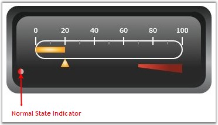
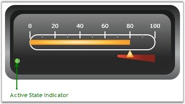

::: {style="DISPLAY: none"}
{#d2h_url_template}{#d2h_package_url style="WIDTH: 0px; DISPLAY: none; HEIGHT: 0px"}
:::

::: {.d2h_secondary_topic style="PADDING-BOTTOM: 10pt; MARGIN: 0pt; PADDING-LEFT: 0pt; PADDING-RIGHT: 0pt; PADDING-TOP: 0pt"}
##### Adding State Indicators to the Linear Gauge {#adding-state-indicators-to-the-linear-gauge style="tab-stops: 0pt"}

[]{style="FONT-FAMILY: 'Trebuchet MS','sans-serif'; COLOR: #15428b; FONT-SIZE: 9pt"} 

State Indicators indicate the state (for example: ON or OFF, TRUE or FALSE, etc.) of the Linear Gauge control. They support the following Indicator Styles.

[]{style="FONT-FAMILY: 'Trebuchet MS','sans-serif'; COLOR: #15428b; FONT-SIZE: 9pt"} 

[·      ]{style="FONT-FAMILY: Symbol"}CircularLED

[·      ]{style="FONT-FAMILY: Symbol"}RectangularLED

[·      ]{style="FONT-FAMILY: Symbol"}Text

[]{style="FONT-FAMILY: 'Trebuchet MS','sans-serif'; COLOR: #15428b; FONT-SIZE: 9pt"} 

You can also specify the text for the state indicators by making use of the following properties.

[]{style="FONT-FAMILY: 'Trebuchet MS','sans-serif'; COLOR: #15428b; FONT-SIZE: 9pt"} 

[·      ]{style="FONT-FAMILY: Symbol"}**Text**: displays the text when the indicator is inactive

[·      ]{style="FONT-FAMILY: Symbol"}**ActiveText**: displays the text when the indicator is active

 

The following code example illustrates how to set these properties.

[]{style="FONT-FAMILY: 'Trebuchet MS','sans-serif'; COLOR: #15428b; FONT-SIZE: 9pt"} 

+---------------------------------------------------------------------------------------------------------------------------------------------------------------------------------------------------------------------------------------------------------------------------------------------------------------------------------------------------------------------------------------------------------------------------------------------------------------------------------------------------------------------------------------------------------------------------------------------------------------------------------------------------------------------------------------------------------------------------------------------------------------------------------------------------------------------------------------------------------------------------------------------------------------------------------------------------------------------------------------------------------------------------------------------------------------------------------------------------------------------------------------------------------------------------------------+
| **[\[XAML\]]{style="FONT-FAMILY: 'Courier New'; COLOR: black"}**                                                                                                                                                                                                                                                                                                                                                                                                                                                                                                                                                                                                                                                                                                                                                                                                                                                                                                                                                                                                                                                                                                                      |
|                                                                                                                                                                                                                                                                                                                                                                                                                                                                                                                                                                                                                                                                                                                                                                                                                                                                                                                                                                                                                                                                                                                                                                                       |
| []{style="FONT-FAMILY: 'Courier New'; COLOR: black; FONT-SIZE: 9pt"}                                                                                                                                                                                                                                                                                                                                                                                                                                                                                                                                                                                                                                                                                                                                                                                                                                                                                                                                                                                                                                                                                                                  |
|                                                                                                                                                                                                                                                                                                                                                                                                                                                                                                                                                                                                                                                                                                                                                                                                                                                                                                                                                                                                                                                                                                                                                                                       |
| [\<]{style="FONT-FAMILY: 'Courier New'; COLOR: blue; FONT-SIZE: 9pt"}[syncfusion]{style="FONT-FAMILY: 'Courier New'; COLOR: #a31515; FONT-SIZE: 9pt"}[:]{style="FONT-FAMILY: 'Courier New'; COLOR: blue; FONT-SIZE: 9pt"}[LinearGauge.StateIndicators]{style="FONT-FAMILY: 'Courier New'; COLOR: #a31515; FONT-SIZE: 9pt"}[\>]{style="FONT-FAMILY: 'Courier New'; COLOR: blue; FONT-SIZE: 9pt"}                                                                                                                                                                                                                                                                                                                                                                                                                                                                                                                                                                                                                                                                                                                                                                                       |
|                                                                                                                                                                                                                                                                                                                                                                                                                                                                                                                                                                                                                                                                                                                                                                                                                                                                                                                                                                                                                                                                                                                                                                                       |
| [    ]{style="FONT-FAMILY: 'Courier New'; COLOR: #a31515; FONT-SIZE: 9pt"}[\<]{style="FONT-FAMILY: 'Courier New'; COLOR: blue; FONT-SIZE: 9pt"}[syncfusion]{style="FONT-FAMILY: 'Courier New'; COLOR: #a31515; FONT-SIZE: 9pt"}[:]{style="FONT-FAMILY: 'Courier New'; COLOR: blue; FONT-SIZE: 9pt"}[StateIndicator]{style="FONT-FAMILY: 'Courier New'; COLOR: #a31515; FONT-SIZE: 9pt"}[ Name]{style="FONT-FAMILY: 'Courier New'; COLOR: red; FONT-SIZE: 9pt"}[=\"m_indicator\"]{style="FONT-FAMILY: 'Courier New'; COLOR: blue; FONT-SIZE: 9pt"}[ Location]{style="FONT-FAMILY: 'Courier New'; COLOR: red; FONT-SIZE: 9pt"}[=\"75,93\"]{style="FONT-FAMILY: 'Courier New'; COLOR: blue; FONT-SIZE: 9pt"}[ IndicatorHeight]{style="FONT-FAMILY: 'Courier New'; COLOR: red; FONT-SIZE: 9pt"}[=\"10\"]{style="FONT-FAMILY: 'Courier New'; COLOR: blue; FONT-SIZE: 9pt"}[ IndicatorWidth]{style="FONT-FAMILY: 'Courier New'; COLOR: red; FONT-SIZE: 9pt"}[=\"10\" ]{style="FONT-FAMILY: 'Courier New'; COLOR: blue; FONT-SIZE: 9pt"}[FontSize]{style="FONT-FAMILY: 'Courier New'; COLOR: red; FONT-SIZE: 9pt"}[=\"12\"]{style="FONT-FAMILY: 'Courier New'; COLOR: blue; FONT-SIZE: 9pt"} |
|                                                                                                                                                                                                                                                                                                                                                                                                                                                                                                                                                                                                                                                                                                                                                                                                                                                                                                                                                                                                                                                                                                                                                                                       |
| [    FontFamily]{style="FONT-FAMILY: 'Courier New'; COLOR: red; FONT-SIZE: 9pt"}[=\"Verdana\"]{style="FONT-FAMILY: 'Courier New'; COLOR: blue; FONT-SIZE: 9pt"}[ IndicatorStyle]{style="FONT-FAMILY: 'Courier New'; COLOR: red; FONT-SIZE: 9pt"}[=\"CircularLED\"]{style="FONT-FAMILY: 'Courier New'; COLOR: blue; FONT-SIZE: 9pt"}[ Text]{style="FONT-FAMILY: 'Courier New'; COLOR: red; FONT-SIZE: 9pt"}[=\"Normal\"]{style="FONT-FAMILY: 'Courier New'; COLOR: blue; FONT-SIZE: 9pt"}[ Background]{style="FONT-FAMILY: 'Courier New'; COLOR: red; FONT-SIZE: 9pt"}[=\"Green\"]{style="FONT-FAMILY: 'Courier New'; COLOR: blue; FONT-SIZE: 9pt"}[ ActiveBackgroundBrush]{style="FONT-FAMILY: 'Courier New'; COLOR: red; FONT-SIZE: 9pt"}[=\"Red\"]{style="FONT-FAMILY: 'Courier New'; COLOR: blue; FONT-SIZE: 9pt"}[ ActiveText]{style="FONT-FAMILY: 'Courier New'; COLOR: red; FONT-SIZE: 9pt"}[=\"High\"\>]{style="FONT-FAMILY: 'Courier New'; COLOR: blue; FONT-SIZE: 9pt"}                                                                                                                                                                                                      |
|                                                                                                                                                                                                                                                                                                                                                                                                                                                                                                                                                                                                                                                                                                                                                                                                                                                                                                                                                                                                                                                                                                                                                                                       |
| [        ]{style="FONT-FAMILY: 'Courier New'; COLOR: #a31515; FONT-SIZE: 9pt"}[\<]{style="FONT-FAMILY: 'Courier New'; COLOR: blue; FONT-SIZE: 9pt"}[syncfusion]{style="FONT-FAMILY: 'Courier New'; COLOR: #a31515; FONT-SIZE: 9pt"}[:]{style="FONT-FAMILY: 'Courier New'; COLOR: blue; FONT-SIZE: 9pt"}[StateIndicator.StateRanges]{style="FONT-FAMILY: 'Courier New'; COLOR: #a31515; FONT-SIZE: 9pt"}[\>]{style="FONT-FAMILY: 'Courier New'; COLOR: blue; FONT-SIZE: 9pt"}                                                                                                                                                                                                                                                                                                                                                                                                                                                                                                                                                                                                                                                                                                          |
|                                                                                                                                                                                                                                                                                                                                                                                                                                                                                                                                                                                                                                                                                                                                                                                                                                                                                                                                                                                                                                                                                                                                                                                       |
| [            ]{style="FONT-FAMILY: 'Courier New'; COLOR: #a31515; FONT-SIZE: 9pt"}[\<]{style="FONT-FAMILY: 'Courier New'; COLOR: blue; FONT-SIZE: 9pt"}[syncfusion]{style="FONT-FAMILY: 'Courier New'; COLOR: #a31515; FONT-SIZE: 9pt"}[:]{style="FONT-FAMILY: 'Courier New'; COLOR: blue; FONT-SIZE: 9pt"}[StateRange]{style="FONT-FAMILY: 'Courier New'; COLOR: #a31515; FONT-SIZE: 9pt"}[ StartValue]{style="FONT-FAMILY: 'Courier New'; COLOR: red; FONT-SIZE: 9pt"}[=\"70\"]{style="FONT-FAMILY: 'Courier New'; COLOR: blue; FONT-SIZE: 9pt"}[ EndValue]{style="FONT-FAMILY: 'Courier New'; COLOR: red; FONT-SIZE: 9pt"}[=\"100\" /\>]{style="FONT-FAMILY: 'Courier New'; COLOR: blue; FONT-SIZE: 9pt"}                                                                                                                                                                                                                                                                                                                                                                                                                                                                          |
|                                                                                                                                                                                                                                                                                                                                                                                                                                                                                                                                                                                                                                                                                                                                                                                                                                                                                                                                                                                                                                                                                                                                                                                       |
| [        ]{style="FONT-FAMILY: 'Courier New'; COLOR: #a31515; FONT-SIZE: 9pt"}[\</]{style="FONT-FAMILY: 'Courier New'; COLOR: blue; FONT-SIZE: 9pt"}[syncfusion]{style="FONT-FAMILY: 'Courier New'; COLOR: #a31515; FONT-SIZE: 9pt"}[:]{style="FONT-FAMILY: 'Courier New'; COLOR: blue; FONT-SIZE: 9pt"}[StateIndicator.StateRanges]{style="FONT-FAMILY: 'Courier New'; COLOR: #a31515; FONT-SIZE: 9pt"}[\>]{style="FONT-FAMILY: 'Courier New'; COLOR: blue; FONT-SIZE: 9pt"}                                                                                                                                                                                                                                                                                                                                                                                                                                                                                                                                                                                                                                                                                                         |
|                                                                                                                                                                                                                                                                                                                                                                                                                                                                                                                                                                                                                                                                                                                                                                                                                                                                                                                                                                                                                                                                                                                                                                                       |
| [    ]{style="FONT-FAMILY: 'Courier New'; COLOR: #a31515; FONT-SIZE: 9pt"}[\</]{style="FONT-FAMILY: 'Courier New'; COLOR: blue; FONT-SIZE: 9pt"}[syncfusion]{style="FONT-FAMILY: 'Courier New'; COLOR: #a31515; FONT-SIZE: 9pt"}[:]{style="FONT-FAMILY: 'Courier New'; COLOR: blue; FONT-SIZE: 9pt"}[StateIndicator]{style="FONT-FAMILY: 'Courier New'; COLOR: #a31515; FONT-SIZE: 9pt"}[\>]{style="FONT-FAMILY: 'Courier New'; COLOR: blue; FONT-SIZE: 9pt"}                                                                                                                                                                                                                                                                                                                                                                                                                                                                                                                                                                                                                                                                                                                         |
|                                                                                                                                                                                                                                                                                                                                                                                                                                                                                                                                                                                                                                                                                                                                                                                                                                                                                                                                                                                                                                                                                                                                                                                       |
| [\</]{style="FONT-FAMILY: 'Courier New'; COLOR: blue; FONT-SIZE: 9pt"}[syncfusion]{style="FONT-FAMILY: 'Courier New'; COLOR: #a31515; FONT-SIZE: 9pt"}[:]{style="FONT-FAMILY: 'Courier New'; COLOR: blue; FONT-SIZE: 9pt"}[LinearGauge.StateIndicators]{style="FONT-FAMILY: 'Courier New'; COLOR: #a31515; FONT-SIZE: 9pt"}[\>]{style="FONT-FAMILY: 'Courier New'; COLOR: blue; FONT-SIZE: 9pt"}                                                                                                                                                                                                                                                                                                                                                                                                                                                                                                                                                                                                                                                                                                                                                                                      |
+---------------------------------------------------------------------------------------------------------------------------------------------------------------------------------------------------------------------------------------------------------------------------------------------------------------------------------------------------------------------------------------------------------------------------------------------------------------------------------------------------------------------------------------------------------------------------------------------------------------------------------------------------------------------------------------------------------------------------------------------------------------------------------------------------------------------------------------------------------------------------------------------------------------------------------------------------------------------------------------------------------------------------------------------------------------------------------------------------------------------------------------------------------------------------------------+

[]{style="FONT-FAMILY: 'Trebuchet MS','sans-serif'; COLOR: #15428b; FONT-SIZE: 9pt"} 

+------------------------------------------------------------------------------------------------------------------------------------------------------------------------------------------------------------------------------------+
| **[\[C#\]]{style="FONT-FAMILY: 'Courier New'; COLOR: black"}**                                                                                                                                                                     |
|                                                                                                                                                                                                                                    |
| []{style="FONT-FAMILY: 'Courier New'; COLOR: black; FONT-SIZE: 9pt"}                                                                                                                                                               |
|                                                                                                                                                                                                                                    |
| [StateIndicator]{style="FONT-FAMILY: 'Courier New'; COLOR: #2b91af; FONT-SIZE: 9pt"}[ stateindicator = [new]{style="COLOR: blue"} [StateIndicator]{style="COLOR: #2b91af"}();]{style="FONT-FAMILY: 'Courier New'; FONT-SIZE: 9pt"} |
|                                                                                                                                                                                                                                    |
| [stateindicator.Background = [new]{style="COLOR: blue"} [SolidColorBrush]{style="COLOR: #2b91af"}([Colors]{style="COLOR: #2b91af"}.Green);]{style="FONT-FAMILY: 'Courier New'; FONT-SIZE: 9pt"}                                    |
|                                                                                                                                                                                                                                    |
| [stateindicator.ActiveBackgroundBrush = [new]{style="COLOR: blue"} [SolidColorBrush]{style="COLOR: #2b91af"}([Colors]{style="COLOR: #2b91af"}.Red);]{style="FONT-FAMILY: 'Courier New'; FONT-SIZE: 9pt"}                           |
|                                                                                                                                                                                                                                    |
| [stateindicator.Text = [\"low\"]{style="COLOR: #a31515"};]{style="FONT-FAMILY: 'Courier New'; FONT-SIZE: 9pt"}                                                                                                                     |
|                                                                                                                                                                                                                                    |
| [stateindicator.ActiveText = [\"high\"]{style="COLOR: #a31515"};]{style="FONT-FAMILY: 'Courier New'; FONT-SIZE: 9pt"}                                                                                                              |
|                                                                                                                                                                                                                                    |
| [stateindicator.IndicatorWidth = 8;]{style="FONT-FAMILY: 'Courier New'; FONT-SIZE: 9pt"}                                                                                                                                           |
|                                                                                                                                                                                                                                    |
| [stateindicator.IndicatorHeight = 8;]{style="FONT-FAMILY: 'Courier New'; FONT-SIZE: 9pt"}                                                                                                                                          |
|                                                                                                                                                                                                                                    |
| [stateindicator.Location = [new]{style="COLOR: blue"} [Point]{style="COLOR: #2b91af"}(80, 90);]{style="FONT-FAMILY: 'Courier New'; FONT-SIZE: 9pt"}                                                                                |
|                                                                                                                                                                                                                                    |
| [StateRange]{style="FONT-FAMILY: 'Courier New'; COLOR: #2b91af; FONT-SIZE: 9pt"}[ staterange = [new]{style="COLOR: blue"} [StateRange]{style="COLOR: #2b91af"}(70, 100);]{style="FONT-FAMILY: 'Courier New'; FONT-SIZE: 9pt"}      |
|                                                                                                                                                                                                                                    |
| [stateindicator.StateRanges.Add(staterange);]{style="FONT-FAMILY: 'Courier New'; FONT-SIZE: 9pt"}                                                                                                                                  |
|                                                                                                                                                                                                                                    |
| [lineargauge.StateIndicators.Add(stateindicator);  ]{style="FONT-FAMILY: 'Courier New'; FONT-SIZE: 9pt"}                                                                                                                           |
+------------------------------------------------------------------------------------------------------------------------------------------------------------------------------------------------------------------------------------+

[]{style="FONT-FAMILY: 'Trebuchet MS','sans-serif'; COLOR: #15428b; FONT-SIZE: 9pt"} 

{border="0"}

[]{style="FONT-FAMILY: 'Trebuchet MS','sans-serif'; COLOR: #15428b; FONT-SIZE: 9pt"} 

Figure 87: Normal State Indicator

[]{style="FONT-FAMILY: 'Trebuchet MS','sans-serif'; COLOR: #15428b; FONT-SIZE: 9pt"} 

{border="0"}

[]{style="FONT-FAMILY: 'Trebuchet MS','sans-serif'; COLOR: #15428b; FONT-SIZE: 9pt"} 

Figure 88: Active State Indicator

 

[]{#p85} 

 

[]{#related-topics}
:::
