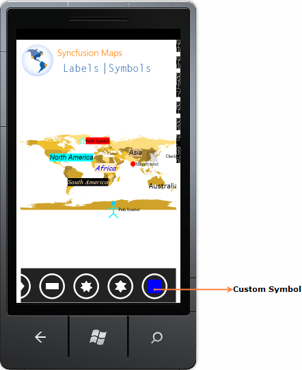

::: {style="DISPLAY: none"}
{#d2h_url_template}{#d2h_package_url style="WIDTH: 0px; DISPLAY: none; HEIGHT: 0px"}
:::

::: {.d2h_secondary_topic style="PADDING-BOTTOM: 10pt; MARGIN: 0pt; PADDING-LEFT: 0pt; PADDING-RIGHT: 0pt; PADDING-TOP: 0pt"}
#### Adding symbol item to Symbol Palette {#adding-symbol-item-to-symbol-palette style="tab-stops: 0pt"}

 

To add a symbol item create an object for SymbolPaletteItem and set the *PaletteItem* property to SymbolPaletteItem.  Then add the created object to the SymbolPaletteItems Collections of the Symbol Palette.

 

+----------------------------------------------------------------------------------------------------------------------------------------------------------------------------+
| **[\[C#\]]{style="FONT-FAMILY: 'Courier New'"}**                                                                                                                           |
|                                                                                                                                                                            |
| []{style="FONT-FAMILY: 'Courier New'; COLOR: green"}                                                                                                                       |
|                                                                                                                                                                            |
| [//  Symbol Palette item has been add in SymbolPaletteItems Collection. Here rectangle added as Symbol Palette Item. ]{style="FONT-FAMILY: 'Courier New'; COLOR: green"}   |
|                                                                                                                                                                            |
| []{style="FONT-FAMILY: 'Courier New'"}                                                                                                                                     |
|                                                                                                                                                                            |
| [            [SymbolPaletteItem]{style="COLOR: #2b91af"} symbolItem;]{style="FONT-FAMILY: 'Courier New'"}                                                                  |
|                                                                                                                                                                            |
| [            symbolItem = [new]{style="COLOR: blue"} [SymbolPaletteItem]{style="COLOR: #2b91af"}();]{style="FONT-FAMILY: 'Courier New'"}                                   |
|                                                                                                                                                                            |
| [            [Rectangle]{style="COLOR: #2b91af"} rect = [new]{style="COLOR: blue"} [Rectangle]{style="COLOR: #2b91af"}();]{style="FONT-FAMILY: 'Courier New'"}             |
|                                                                                                                                                                            |
| [            rect.Fill = [new]{style="COLOR: blue"} [SolidColorBrush]{style="COLOR: #2b91af"}([Colors]{style="COLOR: #2b91af"}.Blue);]{style="FONT-FAMILY: 'Courier New'"} |
|                                                                                                                                                                            |
| [            symbolItem.PaletteItem = rect;]{style="FONT-FAMILY: 'Courier New'"}                                                                                           |
|                                                                                                                                                                            |
| [            [this]{style="COLOR: blue"}.Map.SymbolPalette.SymbolPaletteItems.Add(symbolItem);]{style="FONT-FAMILY: 'Courier New'"}                                        |
+----------------------------------------------------------------------------------------------------------------------------------------------------------------------------+

 

 

 

 

 

 

 

 

**[]{style="COLOR: #e36c0a"}** 

{border="0"}

Figure 25: Adding Custom Symbol to Symbol Palette**[]{style="COLOR: #e36c0a"}**

 

 

[]{#related-topics}
:::
