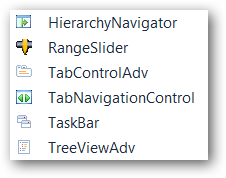
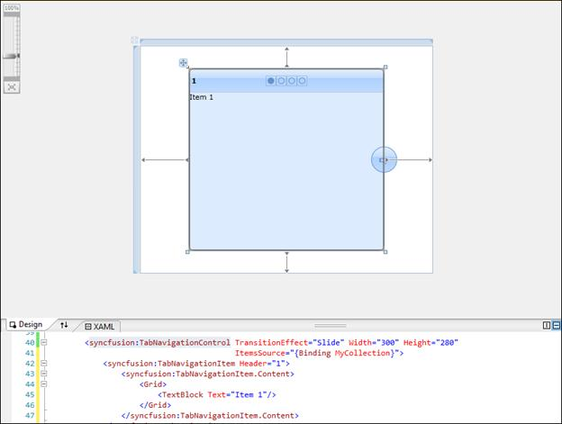
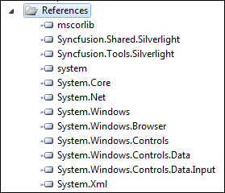
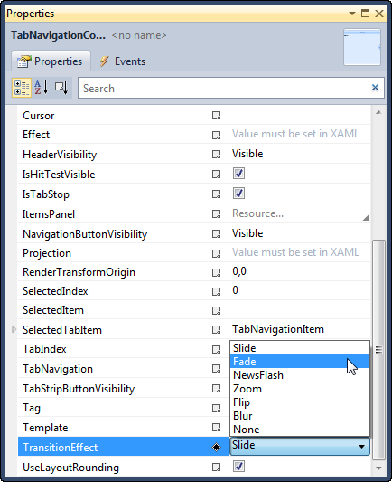

::: {style="DISPLAY: none"}
{#d2h_url_template}{#d2h_package_url style="WIDTH: 0px; DISPLAY: none; HEIGHT: 0px"}
:::

::::: {#nsbanner .d2h_main_nsbanner style="BORDER-BOTTOM: #999999 1px solid; POSITION: relative; PADDING-BOTTOM: 0px; BACKGROUND-COLOR: transparent; PADDING-LEFT: 0px; PADDING-RIGHT: 0px; DISPLAY: none; BORDER-TOP: #999999 1px solid; PADDING-TOP: 0px; LEFT: 0px"}
:::: {#TitleRow .d2h_main_titlerow style="PADDING-BOTTOM: 4px; BACKGROUND-COLOR: transparent; PADDING-LEFT: 22px; WIDTH: 100%; PADDING-RIGHT: 10px; DISPLAY: none; PADDING-TOP: 4px"}
::: {#ienav .d2h_main_ienav style="DISPLAY: none"}
{#D2HPrevious .D2HPreviousEnabled}  {#D2HNext .D2HNextEnabled}
:::
::::
:::::

:::: {#nstext .d2h_main_nstext style="PADDING-BOTTOM: 10px; BACKGROUND-COLOR: transparent; PADDING-LEFT: 22px; PADDING-RIGHT: 10px; HEIGHT: 100%; OVERFLOW: auto; PADDING-TOP: 5px" hasuserbackground="true" valign="bottom"}
::: {#d2h_breadcrumbs .d2h_breadcrumbs}
[Essential Studio User Guide Documentation](ms-xhelp:///?Id=12457748-09e3-4d74-a240-8e049cedf030){.d2h_breadcrumbsNormal}[ \> ]{.d2h_breadcrumbsLinkSeparator}[User Interface Edition](ms-xhelp:///?Id=c29296b7-531c-413b-a0ec-488ca1f7f669){.d2h_breadcrumbsNormal}[ \> ]{.d2h_breadcrumbsLinkSeparator}[Essential WPF](ms-xhelp:///?Id=7f4f82c5-151c-4262-94d0-75c4626c77bc){.d2h_breadcrumbsNormal}[ \> ]{.d2h_breadcrumbsLinkSeparator}[Essential Tools]{.d2h_breadcrumbsContentsOnly}[ \> ]{.d2h_breadcrumbsLinkSeparator}[Tools WPF Controls](ms-xhelp:///?Id=2ea58a12-9426-4a63-96b4-89eb80232c2c){.d2h_breadcrumbsNormal}[ \> ]{.d2h_breadcrumbsLinkSeparator}[Tab Navigation](ms-xhelp:///?Id=cd3740b5-4a59-46a8-b818-cb541bf97211){.d2h_breadcrumbsNormal}
:::

### Adding Tab Navigation Control to an Application {#adding-tab-navigation-control-to-an-application style="tab-stops: 0pt"}

 

To add Tab navigation control to a Visual Studio.NET project:

3.   Open a **VS2010** project. The Syncfusion controls are listed in the toolbox.

{border="0"}[]{style="BACKGROUND: yellow"}

Figure 1025: Syncfusion Controls

[]{style="BACKGROUND: yellow; COLOR: #f79646"} 

4.   Click and drag the **Tab Navigation** control from the toolbox and drop it in the designer.

{border="0"}[]{style="BACKGROUND: yellow"}

Figure 1026: Tab Navigation Control in Designer

 

5.   **Syncfusion.Tools.WPF and Syncfusion.Shared.WPF** assemblies will be added automatically to the application reference.

{border="0"}[]{style="BACKGROUND: yellow"}

Figure 1027: Assemblies added to References

 

6.   Press **F4** or open the **properties** window to customize the control by setting the required properties.

{border="0"}[]{style="BACKGROUND: yellow"}

Figure 1028: Customization using Properties Window

 

7.   Add Items to the control manually or through **Items Source** property.

8.   Press **F5** to run the application.

{border="0"}

Figure 1029: The Output

To enable transition effects, items should be added to the control. The following sections explain the methods through which you can add items.

 

[]{#related-topics}
::::
