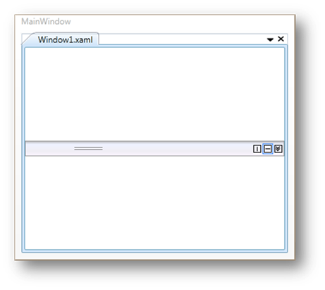

::: {style="DISPLAY: none"}
{#d2h_url_template}{#d2h_package_url style="WIDTH: 0px; DISPLAY: none; HEIGHT: 0px"}
:::

::: {.d2h_secondary_topic style="PADDING-BOTTOM: 10pt; MARGIN: 0pt; PADDING-LEFT: 0pt; PADDING-RIGHT: 0pt; PADDING-TOP: 0pt"}
##### Adding TabSplitterItem to the TabSplitter Control {#adding-tabsplitteritem-to-the-tabsplitter-control style="tab-stops: 0pt"}

TabSplitter contains one or more pages that are defined as TabSplitter Items. Use the following code to add a TabSplitter Item to the TabSplitter control.

[]{style="COLOR: #548dd4"} 

+-----------------------------------------------------------------------------------------------------------------------------------------------------------------------------------------------------------------------------------------------------------------------------------------------------------------------------------------------------------------------------------------------------------------------------------------------------------------------------------------------+
| []{style="FONT-FAMILY: 'Courier New'; COLOR: black"}                                                                                                                                                                                                                                                                                                                                                                                                                                          |
|                                                                                                                                                                                                                                                                                                                                                                                                                                                                                               |
| [\[XAML\]]{style="FONT-FAMILY: 'Courier New'; COLOR: black"}                                                                                                                                                                                                                                                                                                                                                                                                                                  |
|                                                                                                                                                                                                                                                                                                                                                                                                                                                                                               |
|                                                                                                                                                                                                                                                                                                                                                                                                                                                                                               |
|                                                                                                                                                                                                                                                                                                                                                                                                                                                                                               |
| [\<!\-- Adding TabSplitter \--\>]{style="FONT-FAMILY: 'Courier New'; COLOR: green"}                                                                                                                                                                                                                                                                                                                                                                                                           |
|                                                                                                                                                                                                                                                                                                                                                                                                                                                                                               |
| [\<]{style="FONT-FAMILY: 'Courier New'; COLOR: blue"}[syncfusion]{style="FONT-FAMILY: 'Courier New'; COLOR: #a31515"}[:]{style="FONT-FAMILY: 'Courier New'; COLOR: blue"}[TabSplitter]{style="FONT-FAMILY: 'Courier New'; COLOR: #a31515"}[ Name]{style="FONT-FAMILY: 'Courier New'; COLOR: red"}[=\"tabsplitter\"\>]{style="FONT-FAMILY: 'Courier New'; COLOR: blue"}                                                                                                                        |
|                                                                                                                                                                                                                                                                                                                                                                                                                                                                                               |
|                                                                                                                                                                                                                                                                                                                                                                                                                                                                                               |
|                                                                                                                                                                                                                                                                                                                                                                                                                                                                                               |
| [    ]{style="FONT-FAMILY: 'Courier New'; COLOR: #a31515"}[\<!\-- Adding TabSplitterItem \--\>]{style="FONT-FAMILY: 'Courier New'; COLOR: green"}                                                                                                                                                                                                                                                                                                                                             |
|                                                                                                                                                                                                                                                                                                                                                                                                                                                                                               |
| [   \<]{style="FONT-FAMILY: 'Courier New'; COLOR: blue"}[syncfusion]{style="FONT-FAMILY: 'Courier New'; COLOR: #a31515"}[:]{style="FONT-FAMILY: 'Courier New'; COLOR: blue"}[TabSplitterItem]{style="FONT-FAMILY: 'Courier New'; COLOR: #a31515"}[ Header]{style="FONT-FAMILY: 'Courier New'; COLOR: red"}[=\"Window1.xaml\"]{style="FONT-FAMILY: 'Courier New'; COLOR: blue"}[ [Name]{style="COLOR: red"}[=\"tabSplitterItem1\"\>]{style="COLOR: blue"}]{style="FONT-FAMILY: 'Courier New'"} |
|                                                                                                                                                                                                                                                                                                                                                                                                                                                                                               |
| [    ]{style="FONT-FAMILY: 'Courier New'; COLOR: #a31515"}[\</]{style="FONT-FAMILY: 'Courier New'; COLOR: blue"}[syncfusion]{style="FONT-FAMILY: 'Courier New'; COLOR: #a31515"}[:]{style="FONT-FAMILY: 'Courier New'; COLOR: blue"}[TabSplitterItem]{style="FONT-FAMILY: 'Courier New'; COLOR: #a31515"}[\>]{style="FONT-FAMILY: 'Courier New'; COLOR: blue"}                                                                                                                                |
|                                                                                                                                                                                                                                                                                                                                                                                                                                                                                               |
|                                                                                                                                                                                                                                                                                                                                                                                                                                                                                               |
|                                                                                                                                                                                                                                                                                                                                                                                                                                                                                               |
| [\</]{style="FONT-FAMILY: 'Courier New'; COLOR: blue"}[syncfusion]{style="FONT-FAMILY: 'Courier New'; COLOR: #a31515"}[:]{style="FONT-FAMILY: 'Courier New'; COLOR: blue"}[TabSplitter]{style="FONT-FAMILY: 'Courier New'; COLOR: #a31515"}[\>]{style="FONT-FAMILY: 'Courier New'; COLOR: blue"}                                                                                                                                                                                              |
|                                                                                                                                                                                                                                                                                                                                                                                                                                                                                               |
|                                                                                                                                                                                                                                                                                                                                                                                                                                                                                               |
+-----------------------------------------------------------------------------------------------------------------------------------------------------------------------------------------------------------------------------------------------------------------------------------------------------------------------------------------------------------------------------------------------------------------------------------------------------------------------------------------------+

[]{style="COLOR: #548dd4"} 

+--------------------------------------------------------------------------------------------------------------------------------------------------------------------------------------------------------+
| []{style="FONT-FAMILY: 'Courier New'; COLOR: black"}                                                                                                                                                   |
|                                                                                                                                                                                                        |
| [\[C#\]]{style="FONT-FAMILY: 'Courier New'; COLOR: black"}                                                                                                                                             |
|                                                                                                                                                                                                        |
|                                                                                                                                                                                                        |
|                                                                                                                                                                                                        |
| [// Creating an instance of TabSplitter]{style="FONT-FAMILY: 'Courier New'; COLOR: green"}                                                                                                             |
|                                                                                                                                                                                                        |
| [TabSplitter]{style="FONT-FAMILY: 'Courier New'; COLOR: #2b91af"}[ tabSplitter = [new]{style="COLOR: blue"} [TabSplitter]{style="COLOR: #2b91af"}();]{style="FONT-FAMILY: 'Courier New'"}              |
|                                                                                                                                                                                                        |
|                                                                                                                                                                                                        |
|                                                                                                                                                                                                        |
| [// Creating an instance of TabSplitterItem]{style="FONT-FAMILY: 'Courier New'; COLOR: green"}                                                                                                         |
|                                                                                                                                                                                                        |
| [TabSplitterItem]{style="FONT-FAMILY: 'Courier New'; COLOR: #2b91af"}[ tabSplitterItem1 = [new]{style="COLOR: blue"} [TabSplitterItem]{style="COLOR: #2b91af"}();]{style="FONT-FAMILY: 'Courier New'"} |
|                                                                                                                                                                                                        |
|                                                                                                                                                                                                        |
|                                                                                                                                                                                                        |
| [// Adding header of the TabSplitterItem]{style="FONT-FAMILY: 'Courier New'; COLOR: green"}                                                                                                            |
|                                                                                                                                                                                                        |
| [tabSplitterItem1.Header = [\"Window1.xaml\"]{style="COLOR: #a31515"};         ]{style="FONT-FAMILY: 'Courier New'"}                                                                                   |
|                                                                                                                                                                                                        |
|                                                                                                                                                                                                        |
|                                                                                                                                                                                                        |
| [// Adding TabSplitter Item to TabSplitter]{style="FONT-FAMILY: 'Courier New'; COLOR: green"}                                                                                                          |
|                                                                                                                                                                                                        |
| [tabSplitter.Items.Add(tabSplitterItem1);]{style="FONT-FAMILY: 'Courier New'"}                                                                                                                         |
|                                                                                                                                                                                                        |
|                                                                                                                                                                                                        |
|                                                                                                                                                                                                        |
| [// Adding TabSplitter to Window ]{style="FONT-FAMILY: 'Courier New'; COLOR: green"}                                                                                                                   |
|                                                                                                                                                                                                        |
| [this]{style="FONT-FAMILY: 'Courier New'; COLOR: blue"}[.Content = tabsplitter;]{style="FONT-FAMILY: 'Courier New'"}                                                                                   |
|                                                                                                                                                                                                        |
|                                                                                                                                                                                                        |
+--------------------------------------------------------------------------------------------------------------------------------------------------------------------------------------------------------+

[]{style="COLOR: #548dd4"} 

 

{border="0"}

Figure 1016: TabSplitter Item Added to TabSplitter Control

[]{#related-topics}
:::
