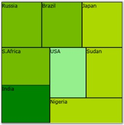

::: {style="DISPLAY: none"}
{#d2h_url_template}{#d2h_package_url style="WIDTH: 0px; DISPLAY: none; HEIGHT: 0px"}
:::

::: {.d2h_secondary_topic style="PADDING-BOTTOM: 10pt; MARGIN: 0pt; PADDING-LEFT: 0pt; PADDING-RIGHT: 0pt; PADDING-TOP: 0pt"}
#### Adding the HeatMap Control to the Application {#adding-the-heatmap-control-to-the-application style="tab-stops: 0pt"}

 

You have now created a Silverlight application and deployed Essential Chart Silverlight assembly. Let\'s see how to add HeatMap control to this application.

 

Following code snippets explains how to add the HeatMap control to an application.

 

+---------------------------------------------------------------------------------------------------------------------------------------------------------------------------------------------------------------------------------------------------------------------------------------------------------------------------------------------------------------------------------------------------------------------------------------------------------------------------------------------------------------------------------------------------------------------------------------------------------------------------------------------------------------------------+
| [\[XAML\]]{style="FONT-FAMILY: 'Courier New'; COLOR: black"}                                                                                                                                                                                                                                                                                                                                                                                                                                                                                                                                                                                                              |
|                                                                                                                                                                                                                                                                                                                                                                                                                                                                                                                                                                                                                                                                           |
| []{style="FONT-FAMILY: 'Courier New'; COLOR: black"}                                                                                                                                                                                                                                                                                                                                                                                                                                                                                                                                                                                                                      |
|                                                                                                                                                                                                                                                                                                                                                                                                                                                                                                                                                                                                                                                                           |
| [\<]{style="FONT-FAMILY: 'Courier New'; COLOR: blue"}[syncfusion]{style="FONT-FAMILY: 'Courier New'; COLOR: #a31515"}[:]{style="FONT-FAMILY: 'Courier New'; COLOR: blue"}[HeatMapControl]{style="FONT-FAMILY: 'Courier New'; COLOR: #a31515"}[ [x]{style="COLOR: #a31515"}[:]{style="COLOR: blue"}[Name]{style="COLOR: red"}[=\"heatMap\"]{style="COLOR: blue"} [Background]{style="COLOR: red"}[=\"Transparent\"\>]{style="COLOR: blue"}]{style="FONT-FAMILY: 'Courier New'"}                                                                                                                                                                                            |
|                                                                                                                                                                                                                                                                                                                                                                                                                                                                                                                                                                                                                                                                           |
| [\<]{style="FONT-FAMILY: 'Courier New'; COLOR: blue"}[syncfusion]{style="FONT-FAMILY: 'Courier New'; COLOR: #a31515"}[:]{style="FONT-FAMILY: 'Courier New'; COLOR: blue"}[HeatMapItem]{style="FONT-FAMILY: 'Courier New'; COLOR: #a31515"}[ [Weight]{style="COLOR: red"}[=\"150\"]{style="COLOR: blue"} [FontSize]{style="COLOR: red"}[=\"12\"]{style="COLOR: blue"} [Foreground]{style="COLOR: red"}[=\"White\"]{style="COLOR: blue"} [Header]{style="COLOR: red"}[=\"India\"]{style="COLOR: blue"} [ColorWeight]{style="COLOR: red"}[=\"50\"]{style="COLOR: blue"} [Level]{style="COLOR: red"}[=\"2\"/\>]{style="COLOR: blue"}]{style="FONT-FAMILY: 'Courier New'"}     |
|                                                                                                                                                                                                                                                                                                                                                                                                                                                                                                                                                                                                                                                                           |
| [\<]{style="FONT-FAMILY: 'Courier New'; COLOR: blue"}[syncfusion]{style="FONT-FAMILY: 'Courier New'; COLOR: #a31515"}[:]{style="FONT-FAMILY: 'Courier New'; COLOR: blue"}[HeatMapItem]{style="FONT-FAMILY: 'Courier New'; COLOR: #a31515"}[ [Weight]{style="COLOR: red"}[=\"150\"]{style="COLOR: blue"} [FontSize]{style="COLOR: red"}[=\"12\"]{style="COLOR: blue"} [Foreground]{style="COLOR: red"}[=\"White\"]{style="COLOR: blue"} [Header]{style="COLOR: red"}[=\"Nigeria\"]{style="COLOR: blue"} [ColorWeight]{style="COLOR: red"}[=\"350\"]{style="COLOR: blue"} [Level]{style="COLOR: red"}[=\"2\"/\>]{style="COLOR: blue"} ]{style="FONT-FAMILY: 'Courier New'"} |
|                                                                                                                                                                                                                                                                                                                                                                                                                                                                                                                                                                                                                                                                           |
| [\</]{style="FONT-FAMILY: 'Courier New'; COLOR: blue"}[syncfusion]{style="FONT-FAMILY: 'Courier New'; COLOR: #a31515"}[:]{style="FONT-FAMILY: 'Courier New'; COLOR: blue"}[HeatMapControl]{style="FONT-FAMILY: 'Courier New'; COLOR: #a31515"}[ [\>]{style="COLOR: blue"}]{style="FONT-FAMILY: 'Courier New'"}                                                                                                                                                                                                                                                                                                                                                            |
+---------------------------------------------------------------------------------------------------------------------------------------------------------------------------------------------------------------------------------------------------------------------------------------------------------------------------------------------------------------------------------------------------------------------------------------------------------------------------------------------------------------------------------------------------------------------------------------------------------------------------------------------------------------------------+

 

{border="0"}

Figure 55: HeatMap Control

 

Things to be considered

 

[·      ]{style="FONT-FAMILY: Symbol"}Specify the ItemsSource property.

[·      ]{style="FONT-FAMILY: Symbol"}Specify the ColorWeightValuePath and WeightValuePath properties.

[·      ]{style="FONT-FAMILY: Symbol"}Specify the Template, if needed.

 

+-------------------------------------------------------------------------------------------------------------------------------------------------------------------------------------------------------------------------------------------------------------------------------------------------------------------------------------------------------------------------------------------------------------------------------------------------------------------------------------------------------------------------------------------------------------------------------------------------------------------------------------------------------------------------------------------------------------------------------------------------------------------------------------------------------------------------------------------------------------------------------------------------------------------------------------------------------------------+
| [\[XAML\]]{style="FONT-FAMILY: 'Courier New'; COLOR: black"}                                                                                                                                                                                                                                                                                                                                                                                                                                                                                                                                                                                                                                                                                                                                                                                                                                                                                                      |
|                                                                                                                                                                                                                                                                                                                                                                                                                                                                                                                                                                                                                                                                                                                                                                                                                                                                                                                                                                   |
| []{style="FONT-FAMILY: 'Courier New'; COLOR: black"}                                                                                                                                                                                                                                                                                                                                                                                                                                                                                                                                                                                                                                                                                                                                                                                                                                                                                                              |
|                                                                                                                                                                                                                                                                                                                                                                                                                                                                                                                                                                                                                                                                                                                                                                                                                                                                                                                                                                   |
| [\<]{style="FONT-FAMILY: 'Courier New'; COLOR: blue"}[syncfusion]{style="FONT-FAMILY: 'Courier New'; COLOR: #a31515"}[:]{style="FONT-FAMILY: 'Courier New'; COLOR: blue"}[HeatMapControl]{style="FONT-FAMILY: 'Courier New'; COLOR: #a31515"}[ [x]{style="COLOR: #a31515"}[:]{style="COLOR: blue"}[Name]{style="COLOR: red"}[=\"heatMap\"]{style="COLOR: blue"} [ColorCalculationLevel]{style="COLOR: red"}[=\"2\"]{style="COLOR: blue"} [LowestWeightColor]{style="COLOR: red"}[=\"Green\"]{style="COLOR: blue"} [MedianWeightColor]{style="COLOR: red"}[=\"Yellow\"]{style="COLOR: blue"} [HighestWeightColor]{style="COLOR: red"}[=\"Cyan\"]{style="COLOR: blue"} [Background]{style="COLOR: red"}[=\"Transparent\"]{style="COLOR: blue"} [WeightValuePath]{style="COLOR: red"}[=\"Sales\" ]{style="COLOR: blue"}[ColorWeightValuePath]{style="COLOR: red"}[=\"Expense\"]{style="COLOR: blue"} [/\>]{style="COLOR: blue"}]{style="FONT-FAMILY: 'Courier New'"} |
+-------------------------------------------------------------------------------------------------------------------------------------------------------------------------------------------------------------------------------------------------------------------------------------------------------------------------------------------------------------------------------------------------------------------------------------------------------------------------------------------------------------------------------------------------------------------------------------------------------------------------------------------------------------------------------------------------------------------------------------------------------------------------------------------------------------------------------------------------------------------------------------------------------------------------------------------------------------------+

 

+-------------------------------------------------------------------------------------------------------------------------------------+
| [\[C#\]]{style="FONT-FAMILY: 'Courier New'; COLOR: black"}                                                                          |
|                                                                                                                                     |
| []{style="FONT-FAMILY: 'Courier New'"}                                                                                              |
|                                                                                                                                     |
| [this]{style="FONT-FAMILY: 'Courier New'; COLOR: blue"}[.heatMap.ItemsSource = Datasourcename;]{style="FONT-FAMILY: 'Courier New'"} |
+-------------------------------------------------------------------------------------------------------------------------------------+

[]{#related-topics}
:::
