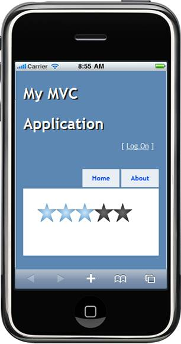

::: {style="DISPLAY: none"}
{#d2h_url_template} {#d2h_package_url style="WIDTH: 0px; DISPLAY: none; HEIGHT: 0px"}
:::

::::: {#nsbanner .d2h_main_nsbanner style="BORDER-BOTTOM: #999999 1px solid; POSITION: relative; PADDING-BOTTOM: 0px; BACKGROUND-COLOR: transparent; PADDING-LEFT: 0px; PADDING-RIGHT: 0px; DISPLAY: none; BORDER-TOP: #999999 1px solid; PADDING-TOP: 0px; LEFT: 0px"}
:::: {#TitleRow .d2h_main_titlerow style="PADDING-BOTTOM: 4px; BACKGROUND-COLOR: transparent; PADDING-LEFT: 22px; WIDTH: 100%; PADDING-RIGHT: 10px; DISPLAY: none; PADDING-TOP: 4px"}
::: {#ienav .d2h_main_ienav style="DISPLAY: none"}
{#D2HPrevious .D2HPreviousEnabled}  {#D2HNext .D2HNextEnabled}
:::
::::
:::::

:::: {#nstext .d2h_main_nstext style="PADDING-BOTTOM: 10px; BACKGROUND-COLOR: transparent; PADDING-LEFT: 22px; PADDING-RIGHT: 10px; HEIGHT: 100%; OVERFLOW: auto; PADDING-TOP: 5px" hasuserbackground="true" valign="bottom"}
::: {#d2h_breadcrumbs .d2h_breadcrumbs}
[Essential Studio User Guide Documentation](ms-xhelp:///?Id=12457748-09e3-4d74-a240-8e049cedf030){.d2h_breadcrumbsNormal} [ \> ]{.d2h_breadcrumbsLinkSeparator} [User Interface Edition](ms-xhelp:///?Id=c29296b7-531c-413b-a0ec-488ca1f7f669){.d2h_breadcrumbsNormal} [ \> ]{.d2h_breadcrumbsLinkSeparator} [Essential Mobile MVC](ms-xhelp:///?Id=74df42e3-5434-4590-9be6-3ae2f911cbbc){.d2h_breadcrumbsNormal} [ \> ]{.d2h_breadcrumbsLinkSeparator} [Essential Tools]{.d2h_breadcrumbsContentsOnly} [ \> ]{.d2h_breadcrumbsLinkSeparator} [Controls and Components](ms-xhelp:///?Id=143afae1-3f83-4d32-9bfa-92ed7022a696){.d2h_breadcrumbsNormal} [ \> ]{.d2h_breadcrumbsLinkSeparator} [Rating](ms-xhelp:///?Id=e796cbe8-f250-450d-ae73-8a29ebc8e4d5){.d2h_breadcrumbsNormal}
:::

### Adding the Rating Control to an Mobile ASP.NET MVC application {#adding-the-rating-control-to-an-mobile-asp.net-mvc-application style="tab-stops: 0pt"}

Refer to the [Getting Started]{.UGHyperlink}[]{.UGHyperlink}section for the prerequisites needed to add a rating control to the Mobile ASP.NET MVC application.

The following steps explain how to add a rating control.

1.   In **View**, invoke the rating helper with the control ID as the first argument.

 

+-------------------------------------------------------------------------------------------------------------------------------------------------------------------------------------------------------------------------------------------------------------------------+
| **[ \[ASPX\]]{style="FONT-FAMILY: 'Courier New'"}**                                                                                                                                                                                                                     |
|                                                                                                                                                                                                                                                                         |
| **[]{style="FONT-FAMILY: 'Courier New'"}**                                                                                                                                                                                                                              |
|                                                                                                                                                                                                                                                                         |
| [    ]{style="FONT-FAMILY: 'Courier New'"} [\<%]{style="FONT-FAMILY: 'Courier New'; BACKGROUND: yellow"} [=]{style="FONT-FAMILY: 'Courier New'; COLOR: blue"} [Html.MobSyncfusion().Rating([\"myRating\"]{style="COLOR: #a31515"})]{style="FONT-FAMILY: 'Courier New'"} |
|                                                                                                                                                                                                                                                                         |
| [            .IncrementStep(1)]{style="FONT-FAMILY: 'Courier New'"}                                                                                                                                                                                                     |
|                                                                                                                                                                                                                                                                         |
| [            .MaximumValue(5)]{style="FONT-FAMILY: 'Courier New'"}                                                                                                                                                                                                      |
|                                                                                                                                                                                                                                                                         |
| [            .ShapeWidth(40)]{style="FONT-FAMILY: 'Courier New'"}                                                                                                                                                                                                       |
|                                                                                                                                                                                                                                                                         |
| [            .ShapeHeight(40)]{style="FONT-FAMILY: 'Courier New'"}                                                                                                                                                                                                      |
|                                                                                                                                                                                                                                                                         |
| [            .CurrentValue(3)]{style="FONT-FAMILY: 'Courier New'"}                                                                                                                                                                                                      |
|                                                                                                                                                                                                                                                                         |
| [            .EditMode([true]{style="COLOR: blue"})]{style="FONT-FAMILY: 'Courier New'"}                                                                                                                                                                                |
|                                                                                                                                                                                                                                                                         |
| [    [%\>]{style="BACKGROUND: yellow"}]{style="FONT-FAMILY: 'Courier New'"}                                                                                                                                                                                             |
|                                                                                                                                                                                                                                                                         |
| []{style="FONT-FAMILY: 'Courier New'"}                                                                                                                                                                                                                                  |
|                                                                                                                                                                                                                                                                         |
| **[]{style="FONT-FAMILY: 'Courier New'"}**                                                                                                                                                                                                                              |
+-------------------------------------------------------------------------------------------------------------------------------------------------------------------------------------------------------------------------------------------------------------------------+

 

+--------------------------------------------------------------------------------------------------------------------------------------------------------------------------------------------------------------------+
| **[\[Razor\]]{style="FONT-FAMILY: 'Courier New'"}**                                                                                                                                                                |
|                                                                                                                                                                                                                    |
| **[]{style="FONT-FAMILY: 'Courier New'"}**                                                                                                                                                                         |
|                                                                                                                                                                                                                    |
| [    ]{style="FONT-FAMILY: 'Courier New'"} [\@{]{style="FONT-FAMILY: 'Courier New'; BACKGROUND: yellow"} [Html.MobSyncfusion().Rating([\"myRating\"]{style="COLOR: #a31515"})]{style="FONT-FAMILY: 'Courier New'"} |
|                                                                                                                                                                                                                    |
| [            .IncrementStep(1)]{style="FONT-FAMILY: 'Courier New'"}                                                                                                                                                |
|                                                                                                                                                                                                                    |
| [            .MaximumValue(5)]{style="FONT-FAMILY: 'Courier New'"}                                                                                                                                                 |
|                                                                                                                                                                                                                    |
| [            .ShapeWidth(40)]{style="FONT-FAMILY: 'Courier New'"}                                                                                                                                                  |
|                                                                                                                                                                                                                    |
| [            .ShapeHeight(40)]{style="FONT-FAMILY: 'Courier New'"}                                                                                                                                                 |
|                                                                                                                                                                                                                    |
| [            .CurrentValue(3)]{style="FONT-FAMILY: 'Courier New'"}                                                                                                                                                 |
|                                                                                                                                                                                                                    |
| [            .EditMode([true]{style="COLOR: blue"})]{style="FONT-FAMILY: 'Courier New'"}                                                                                                                           |
|                                                                                                                                                                                                                    |
| [           .Render();]{style="FONT-FAMILY: 'Courier New'"}                                                                                                                                                        |
|                                                                                                                                                                                                                    |
| [    [}]{style="BACKGROUND: yellow"}]{style="FONT-FAMILY: 'Courier New'"}                                                                                                                                          |
|                                                                                                                                                                                                                    |
|                                                                                                                                                                                                                    |
+--------------------------------------------------------------------------------------------------------------------------------------------------------------------------------------------------------------------+

 

5.   Build and run the application in emulator.

The following figure shows the rating control output:

{border="0"}

Figure 98: Rating Control

A sample demonstrating a basic rating control can be downloaded from the following link:

[]{style="FONT-FAMILY: 'Calibri','sans-serif'; COLOR: black"} 

[ [[Rating ASPX Application]{style="COLOR: blue"}](http://files2.syncfusion.com/Support/ToolsMobileMVC/9.4.0.62/Rating/ASPXApplication.zip) ]{.UGHyperlink}

[ []{style="TEXT-DECORATION: none"} ]{.UGHyperlink} 

[ [[Rating Razor Application]{style="COLOR: blue"}](http://files2.syncfusion.com/Support/ToolsMobileMVC/9.4.0.62/Rating/RazorApplication.zip) ]{.UGHyperlink}

[]{style="FONT-FAMILY: 'Calibri','sans-serif'; COLOR: black"} 

[]{#related-topics}
::::
