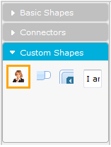

::: {style="DISPLAY: none"}
{#d2h_url_template}{#d2h_package_url style="WIDTH: 0px; DISPLAY: none; HEIGHT: 0px"}
:::

::::: {#nsbanner .d2h_main_nsbanner style="BORDER-BOTTOM: #999999 1px solid; POSITION: relative; PADDING-BOTTOM: 0px; BACKGROUND-COLOR: transparent; PADDING-LEFT: 0px; PADDING-RIGHT: 0px; DISPLAY: none; BORDER-TOP: #999999 1px solid; PADDING-TOP: 0px; LEFT: 0px"}
:::: {#TitleRow .d2h_main_titlerow style="PADDING-BOTTOM: 4px; BACKGROUND-COLOR: transparent; PADDING-LEFT: 22px; WIDTH: 100%; PADDING-RIGHT: 10px; DISPLAY: none; PADDING-TOP: 4px"}
::: {#ienav .d2h_main_ienav style="DISPLAY: none"}
{#D2HPrevious .D2HPreviousEnabled}  {#D2HNext .D2HNextEnabled}
:::
::::
:::::

:::: {#nstext .d2h_main_nstext style="PADDING-BOTTOM: 10px; BACKGROUND-COLOR: transparent; PADDING-LEFT: 22px; PADDING-RIGHT: 10px; HEIGHT: 100%; OVERFLOW: auto; PADDING-TOP: 5px" hasuserbackground="true" valign="bottom"}
::: {#d2h_breadcrumbs .d2h_breadcrumbs}
[Essential Studio User Guide Documentation](ms-xhelp:///?Id=12457748-09e3-4d74-a240-8e049cedf030){.d2h_breadcrumbsNormal}[ \> ]{.d2h_breadcrumbsLinkSeparator}[User Interface Edition](ms-xhelp:///?Id=c29296b7-531c-413b-a0ec-488ca1f7f669){.d2h_breadcrumbsNormal}[ \> ]{.d2h_breadcrumbsLinkSeparator}[Essential ASP.NET MVC](ms-xhelp:///?Id=4b14e7d1-65c4-4f67-b1aa-2c37709905a5){.d2h_breadcrumbsNormal}[ \> ]{.d2h_breadcrumbsLinkSeparator}[Essential Diagram]{.d2h_breadcrumbsContentsOnly}[ \> ]{.d2h_breadcrumbsLinkSeparator}[Concepts and Features](ms-xhelp:///?Id=04839cdf-94fc-4d24-9f6b-119fdbd7bbfb){.d2h_breadcrumbsNormal}[ \> ]{.d2h_breadcrumbsLinkSeparator}[Symbol Palette](ms-xhelp:///?Id=186ffc32-1736-4824-b89a-7f0ff3e22717){.d2h_breadcrumbsNormal}
:::

### [Adding the Symbol Palette Group and Items]{style="BACKGROUND: white"} {#adding-the-symbol-palette-group-and-items style="tab-stops: 0pt"}

[A **SymbolPaletteGroup** is a collection of symbol palette items, and is used to group the items in the SymbolPalette control based on classifications provided. The SymbolPaletteGroup can be added to the SymbolPalette using the **SymbolGroups** property. The new group can be placed anywhere within the symbol palette.]{style="BACKGROUND: white"}

**[]{style="BACKGROUND: white; COLOR: black"}** 

**[Symbol Palette Items]{style="BACKGROUND: white; COLOR: black"}**[ are contained in the symbol palette group. A symbol palette item does not restrict users to the type of content that can be added to it. ]{style="BACKGROUND: white; COLOR: black"}

[A symbol palette item can be a text box, combo box, image, button, or any other graphic-related items.]{style="BACKGROUND: white; COLOR: black"}

 

Use Case Scenario

This feature allows users to add any type of content as an item in the symbol palette, within a new symbol palette group.

 

Appearance and Structure

The following image shows you the symbol palette with a new group added to it.

 

{border="0"}

Figure 131: Newly Added Symbol Palette Group

\

Where do I find the installed samples?

To view a sample:

1.   Open the Essential Diagram sample browser from the dashboard. (Refer to the Samples and Location[.)]{style="COLOR: windowtext; TEXT-DECORATION: none; text-underline: none"}

2.   Navigate to **Getting Started** \> **SymbolPalette Customization Demo**.

 

More:

[ ]{#related-topics}

[{border="0" align="absMiddle"}Property tables](ms-xhelp:///?Id=7885c89a-4e5f-405c-9862-3231aa0dfab1){style="TEXT-DECORATION: none"}

[{border="0" align="absMiddle"}Enabling the Addition of a Symbol Palette Group in Diagram MVC](ms-xhelp:///?Id=0f5f26f7-cb1c-49af-8d64-ad13697a676e){style="TEXT-DECORATION: none"}
::::
