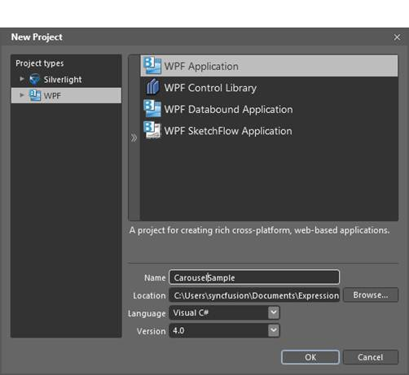

::: {style="DISPLAY: none"}
{#d2h_url_template}{#d2h_package_url style="WIDTH: 0px; DISPLAY: none; HEIGHT: 0px"}
:::

::: {.d2h_secondary_topic style="PADDING-BOTTOM: 10pt; MARGIN: 0pt; PADDING-LEFT: 0pt; PADDING-RIGHT: 0pt; PADDING-TOP: 0pt"}
#### Adding through Blend {#adding-through-blend style="tab-stops: 0pt"}

Follow the steps to add Carousel in an application by using Blend.

1.   Open Blend, and on the File Menu, click New Project. This opens the New Project dialog box as shown below.

[]{style="FONT-FAMILY: 'Calibri','sans-serif'"} 

{border="0"}

Figure 107: Blend---New Project

[]{style="FONT-FAMILY: 'Calibri','sans-serif'"} 

2.   In the Project type's panel, select WPF application and then click OK.

{border="0"}

Figure 108: Blend---New Project Dialog

[]{style="FONT-FAMILY: 'Calibri','sans-serif'"} 

3.   Add the following Reference with the sample project.

Syncfusion.Shared.Wpf.dll

4.   On the Window menu, select Assets. This opens the Assets Library dialog box.

5.   In the Search box, type **Carousel**. This displays the search results.

6.   Drag the Carousel control to DesignView.

{border="0"}

Figure 109: Blend---Design View

[]{#related-topics}
:::
