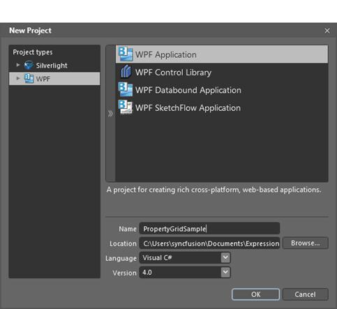
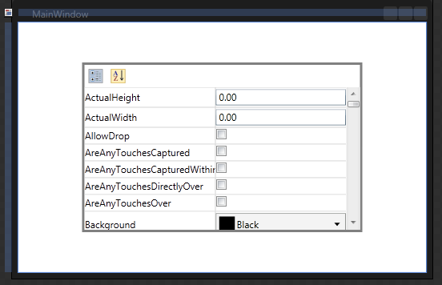

::: {style="DISPLAY: none"}
{#d2h_url_template}{#d2h_package_url style="WIDTH: 0px; DISPLAY: none; HEIGHT: 0px"}
:::

::: {.d2h_secondary_topic style="PADDING-BOTTOM: 10pt; MARGIN: 0pt; PADDING-LEFT: 0pt; PADDING-RIGHT: 0pt; PADDING-TOP: 0pt"}
#### Adding through Blend {#adding-through-blend style="tab-stops: 0pt"}

Following are the steps to add the PropertyGrid control by using Blend.

[]{style="FONT-FAMILY: 'Trebuchet MS','sans-serif'; COLOR: #15428b; FONT-SIZE: 9pt"} 

1.   Open Blend, On the **File** Menu click New Project. This opens the New Project dialog box.

[]{style="FONT-FAMILY: 'Trebuchet MS','sans-serif'; COLOR: #15428b; FONT-SIZE: 9pt"} 

{border="0"}

Figure 818: Blend New Project

 

2.   In the Project type's panel, select WPF application and then click OK.

[]{style="FONT-FAMILY: 'Trebuchet MS','sans-serif'; COLOR: #15428b; FONT-SIZE: 9pt"} 

{border="0"}

Figure 819: New Project Dialog

[]{style="FONT-FAMILY: 'Calibri','sans-serif'"} 

3.   Add the following Reference with the sample project.

Syncfusion.PropertyGrid.Wpf.dll

Syncfusion.Shared.Wpf.dll

Syncfusion.Tools.Wpf.dll

4.   4. On the Window menu, select Assets. This opens the Assets Library dialog box.

 

5.   In the Search box, type PropertyGrid. This displays the search results.

 

6.   Drag the PropertyGrid control to Design View.

[]{style="FONT-FAMILY: 'Trebuchet MS','sans-serif'; COLOR: #15428b; FONT-SIZE: 9pt"} 

[]{style="FONT-FAMILY: 'Trebuchet MS','sans-serif'; COLOR: #15428b; FONT-SIZE: 9pt"} 

[]{style="FONT-FAMILY: 'Trebuchet MS','sans-serif'; COLOR: #15428b; FONT-SIZE: 9pt"} 

{border="0"}

Figure 820: Blend Design View

 

[]{#related-topics}
:::
