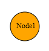

::: {style="DISPLAY: none"}
{#d2h_url_template}{#d2h_package_url style="WIDTH: 0px; DISPLAY: none; HEIGHT: 0px"}
:::

::: {.d2h_secondary_topic style="PADDING-BOTTOM: 10pt; MARGIN: 0pt; PADDING-LEFT: 0pt; PADDING-RIGHT: 0pt; PADDING-TOP: 0pt"}
#### Adding through DiagramBuilder {#adding-through-diagrambuilder style="tab-stops: 0pt"}

A node can also be added into the diagram through Builder. The following code describes the method in which it can be done.[]{style="FONT-FAMILY: 'Calibri','sans-serif'"}

[]{#_Using_View_customization}1.   Create an application.[]{style="FONT-FAMILY: 'Calibri','sans-serif'"}

2.   Add the following code into the view page.

 

+----------------------------------------------------------------------------------------------------------------------------------------------------------------------------------------------------------------------------------------------------------------------------------------------------------------------------------------------------------------------+
| **[View]{style="FONT-FAMILY: 'Courier New'; FONT-SIZE: 11pt"}**                                                                                                                                                                                                                                                                                                      |
|                                                                                                                                                                                                                                                                                                                                                                      |
| []{style="FONT-FAMILY: 'Courier New'; FONT-SIZE: 11pt"}                                                                                                                                                                                                                                                                                                              |
|                                                                                                                                                                                                                                                                                                                                                                      |
| [\<%]{style="FONT-FAMILY: 'Courier New'; BACKGROUND: yellow; FONT-SIZE: 11pt"}[ [Node]{style="COLOR: #2b91af"} node1 = [new]{style="COLOR: blue"} [Node]{style="COLOR: #2b91af"}()]{style="FONT-FAMILY: 'Courier New'; FONT-SIZE: 11pt"}                                                                                                                             |
|                                                                                                                                                                                                                                                                                                                                                                      |
| [   {]{style="FONT-FAMILY: 'Courier New'; FONT-SIZE: 11pt"}                                                                                                                                                                                                                                                                                                          |
|                                                                                                                                                                                                                                                                                                                                                                      |
| [       Name = [\"Node1\"]{style="COLOR: #a31515"},]{style="FONT-FAMILY: 'Courier New'; FONT-SIZE: 11pt"}                                                                                                                                                                                                                                                            |
|                                                                                                                                                                                                                                                                                                                                                                      |
| [       Label = [\"Node1\"]{style="COLOR: #a31515"},]{style="FONT-FAMILY: 'Courier New'; FONT-SIZE: 11pt"}                                                                                                                                                                                                                                                           |
|                                                                                                                                                                                                                                                                                                                                                                      |
| [       LabelHorizontalAlignment = [Horizontal]{style="COLOR: #2b91af"}.Center,]{style="FONT-FAMILY: 'Courier New'; FONT-SIZE: 11pt"}                                                                                                                                                                                                                                |
|                                                                                                                                                                                                                                                                                                                                                                      |
| [       LabelVerticalAlignment = [Vertical]{style="COLOR: #2b91af"}.Middle,]{style="FONT-FAMILY: 'Courier New'; FONT-SIZE: 11pt"}                                                                                                                                                                                                                                    |
|                                                                                                                                                                                                                                                                                                                                                                      |
| [       OffsetX = 225,]{style="FONT-FAMILY: 'Courier New'; FONT-SIZE: 11pt"}                                                                                                                                                                                                                                                                                         |
|                                                                                                                                                                                                                                                                                                                                                                      |
| [       OffsetY = 100,]{style="FONT-FAMILY: 'Courier New'; FONT-SIZE: 11pt"}                                                                                                                                                                                                                                                                                         |
|                                                                                                                                                                                                                                                                                                                                                                      |
| [       Shape = [Shapes]{style="COLOR: #2b91af"}.Ellipse,]{style="FONT-FAMILY: 'Courier New'; FONT-SIZE: 11pt"}                                                                                                                                                                                                                                                      |
|                                                                                                                                                                                                                                                                                                                                                                      |
| [       Height = 50.00,]{style="FONT-FAMILY: 'Courier New'; FONT-SIZE: 11pt"}                                                                                                                                                                                                                                                                                        |
|                                                                                                                                                                                                                                                                                                                                                                      |
| [       Width = 50.00,]{style="FONT-FAMILY: 'Courier New'; FONT-SIZE: 11pt"}                                                                                                                                                                                                                                                                                         |
|                                                                                                                                                                                                                                                                                                                                                                      |
| [       BackgroundColor = [\"orange\"]{style="COLOR: #a31515"},]{style="FONT-FAMILY: 'Courier New'; FONT-SIZE: 11pt"}                                                                                                                                                                                                                                                |
|                                                                                                                                                                                                                                                                                                                                                                      |
| [       BorderColor = [\"black\"]{style="COLOR: #a31515"},]{style="FONT-FAMILY: 'Courier New'; FONT-SIZE: 11pt"}                                                                                                                                                                                                                                                     |
|                                                                                                                                                                                                                                                                                                                                                                      |
| [       BorderWidth = 1,]{style="FONT-FAMILY: 'Courier New'; FONT-SIZE: 11pt"}                                                                                                                                                                                                                                                                                       |
|                                                                                                                                                                                                                                                                                                                                                                      |
| [       LabelFontColor = [\"black\"]{style="COLOR: #a31515"},]{style="FONT-FAMILY: 'Courier New'; FONT-SIZE: 11pt"}                                                                                                                                                                                                                                                  |
|                                                                                                                                                                                                                                                                                                                                                                      |
| [       LabelFontSize = 12,]{style="FONT-FAMILY: 'Courier New'; FONT-SIZE: 11pt"}                                                                                                                                                                                                                                                                                    |
|                                                                                                                                                                                                                                                                                                                                                                      |
| [       LabelFontFamily=[\"Times New Roman]{style="COLOR: #a31515"}]{style="FONT-FAMILY: 'Courier New'; FONT-SIZE: 11pt"}                                                                                                                                                                                                                                            |
|                                                                                                                                                                                                                                                                                                                                                                      |
| [   };]{style="FONT-FAMILY: 'Courier New'; FONT-SIZE: 11pt"}                                                                                                                                                                                                                                                                                                         |
|                                                                                                                                                                                                                                                                                                                                                                      |
| []{style="FONT-FAMILY: 'Courier New'; FONT-SIZE: 11pt"}                                                                                                                                                                                                                                                                                                              |
|                                                                                                                                                                                                                                                                                                                                                                      |
| [%\>]{style="FONT-FAMILY: 'Courier New'; BACKGROUND: yellow; FONT-SIZE: 11pt"}[]{style="FONT-FAMILY: 'Courier New'; FONT-SIZE: 11pt"}                                                                                                                                                                                                                                |
|                                                                                                                                                                                                                                                                                                                                                                      |
| [\<%]{style="FONT-FAMILY: 'Courier New'; BACKGROUND: yellow; FONT-SIZE: 11pt"}[{]{style="FONT-FAMILY: 'Courier New'; FONT-SIZE: 11pt"}                                                                                                                                                                                                                               |
|                                                                                                                                                                                                                                                                                                                                                                      |
| [  Html.Syncfusion().Diagram([\"FlatDiagram\"]{style="COLOR: #a31515"})]{style="FONT-FAMILY: 'Courier New'; FONT-SIZE: 11pt"}                                                                                                                                                                                                                                        |
|                                                                                                                                                                                                                                                                                                                                                                      |
| [          **.Nodes(nodes =\> nodes.Add(node1))**]{style="FONT-FAMILY: 'Courier New'; FONT-SIZE: 11pt"}                                                                                                                                                                                                                                                              |
|                                                                                                                                                                                                                                                                                                                                                                      |
| [          .Width([Unit]{style="COLOR: #2b91af"}.Pixel(1100))]{style="FONT-FAMILY: 'Courier New'; FONT-SIZE: 11pt"}                                                                                                                                                                                                                                                  |
|                                                                                                                                                                                                                                                                                                                                                                      |
| [          .Height([Unit]{style="COLOR: #2b91af"}.Pixel(500))]{style="FONT-FAMILY: 'Courier New'; FONT-SIZE: 11pt"}                                                                                                                                                                                                                                                  |
|                                                                                                                                                                                                                                                                                                                                                                      |
| [           ]{style="FONT-FAMILY: 'Courier New'; COLOR: black"}[.DiagramMode(]{style="FONT-FAMILY: 'Courier New'; COLOR: black; FONT-SIZE: 11pt"}[DiagramMode]{style="FONT-FAMILY: 'Courier New'; COLOR: #2b91af; FONT-SIZE: 11pt"}[.SVG)]{style="FONT-FAMILY: 'Courier New'; COLOR: black; FONT-SIZE: 11pt"}[]{style="FONT-FAMILY: 'Courier New'; FONT-SIZE: 11pt"} |
|                                                                                                                                                                                                                                                                                                                                                                      |
| [          .Render();]{style="FONT-FAMILY: 'Courier New'; FONT-SIZE: 11pt"}                                                                                                                                                                                                                                                                                          |
|                                                                                                                                                                                                                                                                                                                                                                      |
| [  }]{style="FONT-FAMILY: 'Courier New'; FONT-SIZE: 11pt"}                                                                                                                                                                                                                                                                                                           |
|                                                                                                                                                                                                                                                                                                                                                                      |
| [%\>]{style="FONT-FAMILY: 'Courier New'; BACKGROUND: yellow; FONT-SIZE: 11pt"}[]{style="FONT-FAMILY: 'Courier New'; FONT-SIZE: 11pt"}                                                                                                                                                                                                                                |
+----------------------------------------------------------------------------------------------------------------------------------------------------------------------------------------------------------------------------------------------------------------------------------------------------------------------------------------------------------------------+

**Note:** If you want to create the diagram in the Canvas mode. Change the **DiagramMode** to **Canvas**. By default the diagram is rendered in the SVG mode. []{style="BACKGROUND: yellow"}

[]{style="BACKGROUND: yellow"} 

[]{style="FONT-FAMILY: 'Calibri','sans-serif'; BACKGROUND: yellow"} 

3.   Run the application. The node will appear in the working area as shown below

[]{style="FONT-FAMILY: 'Calibri','sans-serif'"} 

{border="0"}

Figure 38: Node[]{style="FONT-FAMILY: 'Calibri','sans-serif'"}

[]{style="FONT-FAMILY: 'Calibri','sans-serif'"} 

[]{#related-topics}
:::
