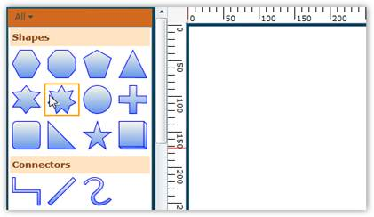
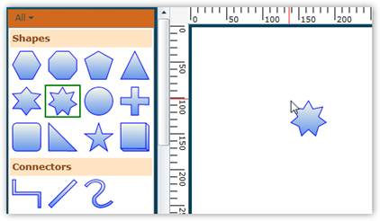
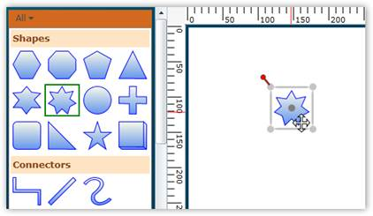

::: {style="DISPLAY: none"}
{#d2h_url_template}{#d2h_package_url style="WIDTH: 0px; DISPLAY: none; HEIGHT: 0px"}
:::

::: {.d2h_secondary_topic style="PADDING-BOTTOM: 10pt; MARGIN: 0pt; PADDING-LEFT: 0pt; PADDING-RIGHT: 0pt; PADDING-TOP: 0pt"}
#### Adding Through SymbolPalette {#adding-through-symbolpalette style="tab-stops: 0pt"}

[]{style="FONT-FAMILY: 'Trebuchet MS','sans-serif'; COLOR: #15428b; FONT-SIZE: 9pt"} 

Steps for adding a node to the diagram using the Symbol Palette are:

[]{style="FONT-FAMILY: 'Trebuchet MS','sans-serif'; COLOR: #15428b; FONT-SIZE: 9pt"} 

1.   Click the desired node on the Symbol Palette.

[]{style="FONT-FAMILY: 'Trebuchet MS','sans-serif'; COLOR: #15428b; FONT-SIZE: 9pt"} 

{border="0"}

Figure 23: Item Selected**[]{style="FONT-STYLE: normal; FONT-FAMILY: 'Trebuchet MS','sans-serif'; COLOR: #15428b"}**

**[]{style="FONT-FAMILY: 'Trebuchet MS','sans-serif'; COLOR: #15428b; FONT-SIZE: 9pt"}** 

2.   When pressing the left mouse button, drag the pointer to the drawing area.

[]{style="FONT-FAMILY: 'Calibri','sans-serif'"} 

{border="0"}

Figure 24: Item Dragged**[]{style="FONT-STYLE: normal; FONT-FAMILY: 'Trebuchet MS','sans-serif'; COLOR: #15428b"}**

**[]{style="FONT-FAMILY: 'Trebuchet MS','sans-serif'; COLOR: #15428b; FONT-SIZE: 9pt"}** 

3.   Now release the mouse button. The desired node is now on the drawing area at the point where the pointer was released.

[]{style="FONT-FAMILY: 'Trebuchet MS','sans-serif'; FONT-SIZE: 9pt"} 

{border="0"}

Figure 25: Items Dropped**[]{style="FONT-STYLE: normal; FONT-FAMILY: 'Trebuchet MS','sans-serif'; COLOR: #15428b"}**

[]{style="FONT-FAMILY: 'Trebuchet MS','sans-serif'; FONT-SIZE: 9pt"} 

[]{#related-topics}
:::
