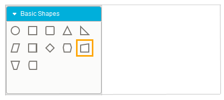
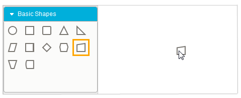
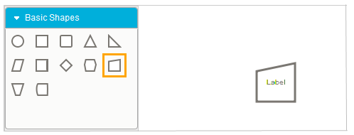

::: {style="DISPLAY: none"}
{#d2h_url_template}{#d2h_package_url style="WIDTH: 0px; DISPLAY: none; HEIGHT: 0px"}
:::

::: {.d2h_secondary_topic style="PADDING-BOTTOM: 10pt; MARGIN: 0pt; PADDING-LEFT: 0pt; PADDING-RIGHT: 0pt; PADDING-TOP: 0pt"}
#### Adding Through Symbol Palette  {#adding-through-symbol-palette style="tab-stops: 0pt"}

The steps for adding a node to the diagram using the symbol palette are: 

1.   Click the desired node on the symbol palette.

 

                       {border="0"}

Figure 35: Item Selected

 

2.   When holding the left mouse button, drag the node to the drawing area. 

{border="0"}

Figure 36: Item Dragged

 

3.   Now release the mouse button. The desired node is now on the drawing area at the point where the pointer was released.

 

{border="0"}

Figure 37: Item Dropped

 

[]{#related-topics}
:::
