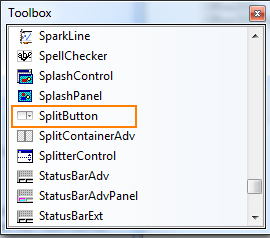

::: {style="DISPLAY: none"}
{#d2h_url_template}{#d2h_package_url style="WIDTH: 0px; DISPLAY: none; HEIGHT: 0px"}
:::

::: {.d2h_secondary_topic style="PADDING-BOTTOM: 10pt; MARGIN: 0pt; PADDING-LEFT: 0pt; PADDING-RIGHT: 0pt; PADDING-TOP: 0pt"}
##### Adding through Visual Studio {#adding-through-visual-studio style="tab-stops: 0pt"}

The following are steps to add the SplitButton control to an Application through Visual Studio:

 

1.   Create a new Windows Form application in Visual Studio.

2.   Drag SplitButton from the Toolbox tab to the designer.

 

       {border="0"}

Figure 1487: ToolBox

 

3.   SplitButton control is added.

4.   Now customize the properties of SplitButton in the Properties Window.

 

 

 

[]{#related-topics}
:::
