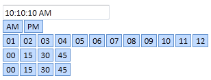
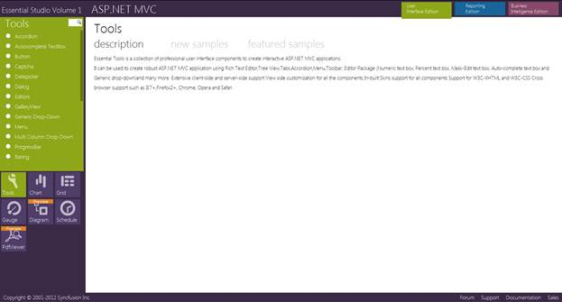
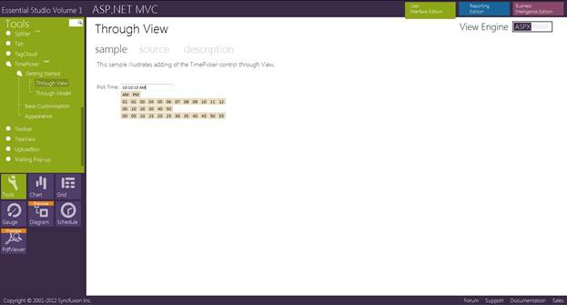

::: {style="DISPLAY: none"}
{#d2h_url_template}{#d2h_package_url style="WIDTH: 0px; DISPLAY: none; HEIGHT: 0px"}
:::

::::: {#nsbanner .d2h_main_nsbanner style="BORDER-BOTTOM: #999999 1px solid; POSITION: relative; PADDING-BOTTOM: 0px; BACKGROUND-COLOR: transparent; PADDING-LEFT: 0px; PADDING-RIGHT: 0px; DISPLAY: none; BORDER-TOP: #999999 1px solid; PADDING-TOP: 0px; LEFT: 0px"}
:::: {#TitleRow .d2h_main_titlerow style="PADDING-BOTTOM: 4px; BACKGROUND-COLOR: transparent; PADDING-LEFT: 22px; WIDTH: 100%; PADDING-RIGHT: 10px; DISPLAY: none; PADDING-TOP: 4px"}
::: {#ienav .d2h_main_ienav style="DISPLAY: none"}
{#D2HPrevious .D2HPreviousEnabled}  {#D2HNext .D2HNextEnabled}
:::
::::
:::::

:::: {#nstext .d2h_main_nstext style="PADDING-BOTTOM: 10px; BACKGROUND-COLOR: transparent; PADDING-LEFT: 22px; PADDING-RIGHT: 10px; HEIGHT: 100%; OVERFLOW: auto; PADDING-TOP: 5px" hasuserbackground="true" valign="bottom"}
::: {#d2h_breadcrumbs .d2h_breadcrumbs}
[Essential Studio User Guide Documentation](ms-xhelp:///?Id=12457748-09e3-4d74-a240-8e049cedf030){.d2h_breadcrumbsNormal}[ \> ]{.d2h_breadcrumbsLinkSeparator}[User Interface Edition](ms-xhelp:///?Id=c29296b7-531c-413b-a0ec-488ca1f7f669){.d2h_breadcrumbsNormal}[ \> ]{.d2h_breadcrumbsLinkSeparator}[Essential ASP.NET MVC](ms-xhelp:///?Id=4b14e7d1-65c4-4f67-b1aa-2c37709905a5){.d2h_breadcrumbsNormal}[ \> ]{.d2h_breadcrumbsLinkSeparator}[Essential Tools]{.d2h_breadcrumbsContentsOnly}[ \> ]{.d2h_breadcrumbsLinkSeparator}[Controls and Components](ms-xhelp:///?Id=f0af2fff-6f00-4ca4-85a6-54e41ac5dc96){.d2h_breadcrumbsNormal}[ \> ]{.d2h_breadcrumbsLinkSeparator}[TimePicker Control](ms-xhelp:///?Id=1a1de4ee-d424-4020-be0c-c7a526b2197a){.d2h_breadcrumbsNormal}
:::

### Adding TimePicker Control to an MVC Application {#adding-timepicker-control-to-an-mvc-application style="tab-stops: 0pt"}

[]{style="COLOR: black"} 

[Refer to the ]{style="COLOR: black"}[[Getting Started]{style="COLOR: blue"}]{.underline}[ ]{style="COLOR: blue"}[section for the prerequisites needed to add the TimePicker control to an ASP.NET MVC application.]{style="COLOR: black"}

[The following steps explain how to add a time picker control.]{style="COLOR: black"}

[1.  In the **view**, invoke the **TimePicker** helper with the control ID as the first argument.]{style="COLOR: black"}

[]{style="COLOR: black"}[]{style="FONT-FAMILY: 'Times New Roman','serif'; COLOR: black; FONT-SIZE: 12pt"} 

+------------------------------------------------------------------------------------------------------------------------------------------------------------------------------------------------------------------------------------------------------------------------------------------------------------------------------------------------------+
| **[\[ASPX\]]{style="FONT-FAMILY: 'Courier New'"}**[]{style="FONT-FAMILY: 'Courier New'"}                                                                                                                                                                                                                                                             |
|                                                                                                                                                                                                                                                                                                                                                      |
| [\<%]{style="FONT-FAMILY: Consolas; BACKGROUND: yellow; FONT-SIZE: 9.5pt"}[=]{style="FONT-FAMILY: Consolas; COLOR: blue; FONT-SIZE: 9.5pt"}[Html.Syncfusion().TimePicker([\"TimePicker\"]{style="COLOR: #a31515"}).Value([\"10:10:10\"]{style="COLOR: #a31515"}) [%\>]{style="BACKGROUND: yellow"}]{style="FONT-FAMILY: Consolas; FONT-SIZE: 9.5pt"} |
+------------------------------------------------------------------------------------------------------------------------------------------------------------------------------------------------------------------------------------------------------------------------------------------------------------------------------------------------------+

[]{style="COLOR: black"}[]{style="FONT-FAMILY: 'Times New Roman','serif'; COLOR: black; FONT-SIZE: 12pt"} 

+----------------------------------------------------------------------------------------------------------------------------------------------------------------------------------------------------------------------------------------------------------------------------------------------+
| **[\[Razor\]]{style="FONT-FAMILY: 'Courier New'"}**[ ]{style="FONT-FAMILY: 'Courier New'"}                                                                                                                                                                                                   |
|                                                                                                                                                                                                                                                                                              |
| [@]{style="FONT-FAMILY: 'Courier New'; BACKGROUND: yellow"}[Html.Syncfusion().TimePicker([\"TimePicker\"]{style="COLOR: #a31515"}).Value([\"10:10:10\"]{style="COLOR: #a31515"})]{style="FONT-FAMILY: Consolas; FONT-SIZE: 9.5pt"}[]{style="FONT-FAMILY: 'Courier New'; BACKGROUND: yellow"} |
|                                                                                                                                                                                                                                                                                              |
| []{style="FONT-FAMILY: 'Courier New'"}                                                                                                                                                                                                                                                       |
|                                                                                                                                                                                                                                                                                              |
| [   ]{style="FONT-FAMILY: 'Courier New'"}                                                                                                                                                                                                                                                    |
+----------------------------------------------------------------------------------------------------------------------------------------------------------------------------------------------------------------------------------------------------------------------------------------------+

[]{style="COLOR: black; FONT-SIZE: 9pt"} 

2.  [Build and run the application.]{style="COLOR: black"}

 

{border="0"}

Figure 279: TimePicker Control

 

Locally Installed Samples

To view the samples:

4.   Open the **Dashboard**. The **Essential Studio Enterprise Edition** window is displayed, and the **User Interface Edition** panel is displayed by default.

5.   Click the **Run Locally Installed Samples** link. The **Essential Studio for ASP.NET MVC** sample browser is displayed.

6.   Select **Tools** at the bottom-left of the screen.

 

 

{border="0"}

Figure 280: MVC Tools Sample Browser

 

7.   Select any sample from the **TimePicker** item provided and browse through the features.

{border="0"}

Figure 281: Sample Browser for the TimePicker Control

 

Source Code Location

The full source code of the TimePicker control will be available on the purchase of the product.

The default location of the Essential Tools for ASP.NET MVC source code is:

***\[System Drive\]:\\Program Files\\Syncfusion\\Essential Studio\\\[Version Number\]\\MVC\\Tools.MVC\\Src***

**** 

[]{#related-topics}
::::
