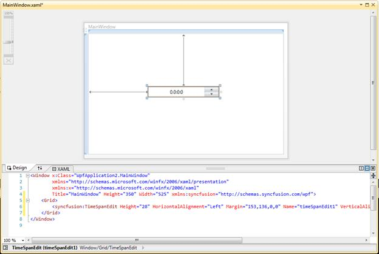
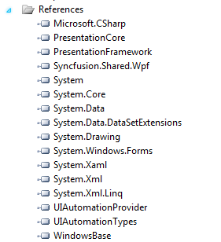

::: {style="DISPLAY: none"}
{#d2h_url_template}{#d2h_package_url style="WIDTH: 0px; DISPLAY: none; HEIGHT: 0px"}
:::

::: {.d2h_secondary_topic style="PADDING-BOTTOM: 10pt; MARGIN: 0pt; PADDING-LEFT: 0pt; PADDING-RIGHT: 0pt; PADDING-TOP: 0pt"}
#### Adding TimeSpanEdit Control to an Application {#adding-timespanedit-control-to-an-application style="tab-stops: 0pt"}

To add TimeSpanEdit control to a Visual Studio.NET project:

1.   Open a VS2010 project. The Syncfusion controls are listed in the Toolbox.

2.   Click and drag the TimeSpanEdit control from the toolbox and drop it in the designer.

{border="0"}

Figure 1096: TimeSpanEdit control in Designer

 

 

3.   **Syncfusion.Shared.WPF** assemblies will be added automatically to the application reference.

 

{border="0"}

Figure 1097: Assemblies added into References

 

 

4.   Press **F4** or open the **Properties** Window to customize the control by setting the required properties.

{border="0"}

Fig 1098: Customization using Properties Window

 

 

[]{#related-topics}
:::
