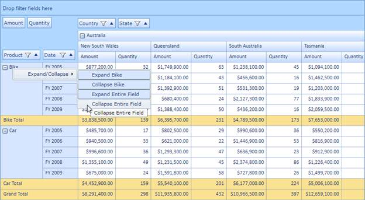
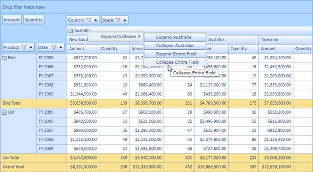

::: {style="DISPLAY: none"}
{#d2h_url_template}{#d2h_package_url style="WIDTH: 0px; DISPLAY: none; HEIGHT: 0px"}
:::

::::: {#nsbanner .d2h_main_nsbanner style="BORDER-BOTTOM: #999999 1px solid; POSITION: relative; PADDING-BOTTOM: 0px; BACKGROUND-COLOR: transparent; PADDING-LEFT: 0px; PADDING-RIGHT: 0px; DISPLAY: none; BORDER-TOP: #999999 1px solid; PADDING-TOP: 0px; LEFT: 0px"}
:::: {#TitleRow .d2h_main_titlerow style="PADDING-BOTTOM: 4px; BACKGROUND-COLOR: transparent; PADDING-LEFT: 22px; WIDTH: 100%; PADDING-RIGHT: 10px; DISPLAY: none; PADDING-TOP: 4px"}
::: {#ienav .d2h_main_ienav style="DISPLAY: none"}
{#D2HPrevious .D2HPreviousEnabled}  {#D2HNext .D2HNextEnabled}
:::
::::
:::::

:::: {#nstext .d2h_main_nstext style="PADDING-BOTTOM: 10px; BACKGROUND-COLOR: transparent; PADDING-LEFT: 22px; PADDING-RIGHT: 10px; HEIGHT: 100%; OVERFLOW: auto; PADDING-TOP: 5px" hasuserbackground="true" valign="bottom"}
::: {#d2h_breadcrumbs .d2h_breadcrumbs}
[Essential Studio User Guide Documentation](ms-xhelp:///?Id=12457748-09e3-4d74-a240-8e049cedf030){.d2h_breadcrumbsNormal}[ \> ]{.d2h_breadcrumbsLinkSeparator}[Business Intelligence Edition](ms-xhelp:///?Id=fdf33dd8-62b2-47b9-ad7b-fc50e590bca5){.d2h_breadcrumbsNormal}[ \> ]{.d2h_breadcrumbsLinkSeparator}[Essential BI Silverlight](ms-xhelp:///?Id=c006b39c-6aa2-4637-b7de-3e7b6cb3f9f9){.d2h_breadcrumbsNormal}[ \> ]{.d2h_breadcrumbsLinkSeparator}[Essential Pivot Grid]{.d2h_breadcrumbsContentsOnly}[ \> ]{.d2h_breadcrumbsLinkSeparator}[Features](ms-xhelp:///?Id=9d7968f1-d52c-4e79-a6ae-fb01305e9f98){.d2h_breadcrumbsNormal}[ \> ]{.d2h_breadcrumbsLinkSeparator}[Header Cell Context Menu](ms-xhelp:///?Id=5f164a1a-f92c-462c-9744-c5b5aa3e5165){.d2h_breadcrumbsNormal}
:::

### Adding to an Application {#adding-to-an-application style="tab-stops: 0pt"}

You can enable the context menu for row/column header cells present in the grid by setting the **EnableContextMenu** Boolean property of that cell style to **true**.

The property usage is illustrated in the code given below.

 

+---------------------------------------------------------------------------------------------------------------------------------------------------------------------------------+
| **[\[C#\]]{style="FONT-FAMILY: 'Courier New'"}**                                                                                                                                |
|                                                                                                                                                                                 |
| [// To Enable Context Menu for Column Header.]{style="FONT-FAMILY: 'Courier New'; COLOR: green"}                                                                                |
|                                                                                                                                                                                 |
| [this]{style="FONT-FAMILY: 'Courier New'; COLOR: blue"}[.PivotGrid1.ColumnHeaderCellStyle.EnableContextMenu = [true]{style="COLOR: blue"};]{style="FONT-FAMILY: 'Courier New'"} |
|                                                                                                                                                                                 |
| [// To Enable Context Menu for Row Header.]{style="FONT-FAMILY: 'Courier New'; COLOR: green"}                                                                                   |
|                                                                                                                                                                                 |
| [this]{style="FONT-FAMILY: 'Courier New'; COLOR: blue"}[.PivotGrid1.RowHeaderCellStyle.EnableContextMenu = [true]{style="COLOR: blue"};]{style="FONT-FAMILY: 'Courier New'"}    |
|                                                                                                                                                                                 |
|                                                                                                                                                                                 |
+---------------------------------------------------------------------------------------------------------------------------------------------------------------------------------+

 

+------------------------------------------------------------------------------------------------------------------------------------------------------------------------------------------------+
| **[\[VB\]]{style="FONT-FAMILY: 'Courier New'"}**                                                                                                                                               |
|                                                                                                                                                                                                |
| [// To Enable Context Menu for Column Header.]{style="FONT-FAMILY: 'Courier New'; COLOR: green"}                                                                                               |
|                                                                                                                                                                                                |
| [Me]{style="FONT-FAMILY: 'Courier New'; COLOR: blue; FONT-SIZE: 9.5pt"}[.PivotGrid1.ColumnHeaderCellStyle.EnableContextMenu = [True]{style="COLOR: blue"}]{style="FONT-FAMILY: 'Courier New'"} |
|                                                                                                                                                                                                |
| [// To Enable Context Menu for Row Header.]{style="FONT-FAMILY: 'Courier New'; COLOR: green"}[]{style="FONT-FAMILY: 'Courier New'"}                                                            |
|                                                                                                                                                                                                |
| [Me]{style="FONT-FAMILY: 'Courier New'; COLOR: blue; FONT-SIZE: 9.5pt"}[.PivotGrid1.RowHeaderCellStyle.EnableContextMenu = [True]{style="COLOR: blue"}]{style="FONT-FAMILY: 'Courier New'"}    |
|                                                                                                                                                                                                |
| []{style="FONT-FAMILY: 'Courier New'"}                                                                                                                                                         |
+------------------------------------------------------------------------------------------------------------------------------------------------------------------------------------------------+

 

{border="0"}

Figure 32: Context Menu in Row Header

 

{border="0"}

Figure 33: Context Menu in Column Header

 

To perform the expand/collapse operations programmatically you can make use of the eight methods respectively as per your requirement. Passing the **UniqueText** as a parameter, you can expand/collapse one or more columns/rows. The method usage is illustrated in the following code below.

 

+-----------------------------------------------------------------------------------------------------------------------------------------------------------------------------------------------------------------------------------------------------------------------------------------------------------------------------------------------------------------------------------------------------------------------------------------------------------------------------------------------------------------------------------------------------------------------------------------------------------------------------------------------------------------------------------------------------------------------------------------------------------------------------------------------------------------------------------------------------------------------------------------------------------------------------------------------------------------------------------------------+
| **[\[C#\]]{style="FONT-FAMILY: 'Courier New'"}**                                                                                                                                                                                                                                                                                                                                                                                                                                                                                                                                                                                                                                                                                                                                                                                                                                                                                                                                              |
|                                                                                                                                                                                                                                                                                                                                                                                                                                                                                                                                                                                                                                                                                                                                                                                                                                                                                                                                                                                               |
| [/// Expands the Bike from row]{style="FONT-FAMILY: 'Courier New'; COLOR: green; FONT-SIZE: 9.5pt"}[       ]{style="FONT-FAMILY: 'Courier New'; COLOR: black; FONT-SIZE: 9.5pt"}                                                                                                                                                                                                                                                                                                                                                                                                                                                                                                                                                                                                                                                                                                                                                                                                              |
|                                                                                                                                                                                                                                                                                                                                                                                                                                                                                                                                                                                                                                                                                                                                                                                                                                                                                                                                                                                               |
| [this]{style="FONT-FAMILY: 'Courier New'; COLOR: blue; FONT-SIZE: 9.5pt"}[.]{style="FONT-FAMILY: 'Courier New'; COLOR: black; FONT-SIZE: 9.5pt"}[pivotGrid1.ExpandRow]{style="FONT-FAMILY: 'Courier New'; FONT-SIZE: 9.5pt"}[(]{style="FONT-FAMILY: 'Courier New'; COLOR: black; FONT-SIZE: 9.5pt"}[\"Bike\"]{style="FONT-FAMILY: 'Courier New'; COLOR: #a31515; FONT-SIZE: 9.5pt"}[);]{style="FONT-FAMILY: 'Courier New'; COLOR: black; FONT-SIZE: 9.5pt"}[]{style="FONT-FAMILY: 'Courier New'; COLOR: #a31515; FONT-SIZE: 9.5pt"}                                                                                                                                                                                                                                                                                                                                                                                                                                                           |
|                                                                                                                                                                                                                                                                                                                                                                                                                                                                                                                                                                                                                                                                                                                                                                                                                                                                                                                                                                                               |
| [/// Collapses the Bike from row]{style="FONT-FAMILY: 'Courier New'; COLOR: green; FONT-SIZE: 9.5pt"}[        ]{style="FONT-FAMILY: 'Courier New'; COLOR: black; FONT-SIZE: 9.5pt"}[]{style="FONT-FAMILY: 'Courier New'; COLOR: green; FONT-SIZE: 9.5pt"}                                                                                                                                                                                                                                                                                                                                                                                                                                                                                                                                                                                                                                                                                                                                     |
|                                                                                                                                                                                                                                                                                                                                                                                                                                                                                                                                                                                                                                                                                                                                                                                                                                                                                                                                                                                               |
| [this]{style="FONT-FAMILY: 'Courier New'; COLOR: blue; FONT-SIZE: 9.5pt"}[.pivotGrid1.CollapseRow(]{style="FONT-FAMILY: 'Courier New'; COLOR: black; FONT-SIZE: 9.5pt"}[\"Bike\"]{style="FONT-FAMILY: 'Courier New'; COLOR: #a31515; FONT-SIZE: 9.5pt"}[);        ]{style="FONT-FAMILY: 'Courier New'; COLOR: black; FONT-SIZE: 9.5pt"}                                                                                                                                                                                                                                                                                                                                                                                                                                                                                                                                                                                                                                                       |
|                                                                                                                                                                                                                                                                                                                                                                                                                                                                                                                                                                                                                                                                                                                                                                                                                                                                                                                                                                                               |
| [/// Expands the Canada from column]{style="FONT-FAMILY: 'Courier New'; COLOR: green; FONT-SIZE: 9.5pt"}[        ]{style="FONT-FAMILY: 'Courier New'; COLOR: black; FONT-SIZE: 9.5pt"}[]{style="FONT-FAMILY: 'Courier New'; COLOR: green; FONT-SIZE: 9.5pt"}                                                                                                                                                                                                                                                                                                                                                                                                                                                                                                                                                                                                                                                                                                                                  |
|                                                                                                                                                                                                                                                                                                                                                                                                                                                                                                                                                                                                                                                                                                                                                                                                                                                                                                                                                                                               |
| [this]{style="FONT-FAMILY: 'Courier New'; COLOR: blue; FONT-SIZE: 9.5pt"}[.pivotGrid1.ExpandColumn(]{style="FONT-FAMILY: 'Courier New'; COLOR: black; FONT-SIZE: 9.5pt"}[\"Canada\"]{style="FONT-FAMILY: 'Courier New'; COLOR: #a31515; FONT-SIZE: 9.5pt"}[);        ]{style="FONT-FAMILY: 'Courier New'; COLOR: black; FONT-SIZE: 9.5pt"}                                                                                                                                                                                                                                                                                                                                                                                                                                                                                                                                                                                                                                                    |
|                                                                                                                                                                                                                                                                                                                                                                                                                                                                                                                                                                                                                                                                                                                                                                                                                                                                                                                                                                                               |
| [/// Collapses the Canada from column]{style="FONT-FAMILY: 'Courier New'; COLOR: green; FONT-SIZE: 9.5pt"}[        ]{style="FONT-FAMILY: 'Courier New'; COLOR: black; FONT-SIZE: 9.5pt"}[]{style="FONT-FAMILY: 'Courier New'; COLOR: green; FONT-SIZE: 9.5pt"}                                                                                                                                                                                                                                                                                                                                                                                                                                                                                                                                                                                                                                                                                                                                |
|                                                                                                                                                                                                                                                                                                                                                                                                                                                                                                                                                                                                                                                                                                                                                                                                                                                                                                                                                                                               |
| [this]{style="FONT-FAMILY: 'Courier New'; COLOR: blue; FONT-SIZE: 9.5pt"}[.pivotGrid1.CollapseColumn(]{style="FONT-FAMILY: 'Courier New'; COLOR: black; FONT-SIZE: 9.5pt"}[\"Canada\"]{style="FONT-FAMILY: 'Courier New'; COLOR: #a31515; FONT-SIZE: 9.5pt"}[);        ]{style="FONT-FAMILY: 'Courier New'; COLOR: black; FONT-SIZE: 9.5pt"}                                                                                                                                                                                                                                                                                                                                                                                                                                                                                                                                                                                                                                                  |
|                                                                                                                                                                                                                                                                                                                                                                                                                                                                                                                                                                                                                                                                                                                                                                                                                                                                                                                                                                                               |
| [/// Collapses the given collection of UniqueText string values for row]{style="FONT-FAMILY: 'Courier New'; COLOR: green; FONT-SIZE: 9.5pt"}[        ]{style="FONT-FAMILY: 'Courier New'; COLOR: black; FONT-SIZE: 9.5pt"}[]{style="FONT-FAMILY: 'Courier New'; COLOR: green; FONT-SIZE: 9.5pt"}                                                                                                                                                                                                                                                                                                                                                                                                                                                                                                                                                                                                                                                                                              |
|                                                                                                                                                                                                                                                                                                                                                                                                                                                                                                                                                                                                                                                                                                                                                                                                                                                                                                                                                                                               |
| [this]{style="FONT-FAMILY: 'Courier New'; COLOR: blue; FONT-SIZE: 9.5pt"}[.pivotGrid1.CollapseRow(]{style="FONT-FAMILY: 'Courier New'; COLOR: black; FONT-SIZE: 9.5pt"}[new]{style="FONT-FAMILY: 'Courier New'; COLOR: blue; FONT-SIZE: 9.5pt"}[ ]{style="FONT-FAMILY: 'Courier New'; COLOR: black; FONT-SIZE: 9.5pt"}[List]{style="FONT-FAMILY: 'Courier New'; COLOR: #2b91af; FONT-SIZE: 9.5pt"}[\<]{style="FONT-FAMILY: 'Courier New'; COLOR: black; FONT-SIZE: 9.5pt"}[string]{style="FONT-FAMILY: 'Courier New'; COLOR: blue; FONT-SIZE: 9.5pt"}[\> { ]{style="FONT-FAMILY: 'Courier New'; COLOR: black; FONT-SIZE: 9.5pt"}[\"Bike\"]{style="FONT-FAMILY: 'Courier New'; COLOR: #a31515; FONT-SIZE: 9.5pt"}[, ]{style="FONT-FAMILY: 'Courier New'; COLOR: black; FONT-SIZE: 9.5pt"}[\"Car\"]{style="FONT-FAMILY: 'Courier New'; COLOR: #a31515; FONT-SIZE: 9.5pt"}[ });        ]{style="FONT-FAMILY: 'Courier New'; COLOR: black; FONT-SIZE: 9.5pt"}                                     |
|                                                                                                                                                                                                                                                                                                                                                                                                                                                                                                                                                                                                                                                                                                                                                                                                                                                                                                                                                                                               |
| [/// Expands the given collection of UniqueText string values for row]{style="FONT-FAMILY: 'Courier New'; COLOR: green; FONT-SIZE: 9.5pt"}[        ]{style="FONT-FAMILY: 'Courier New'; COLOR: black; FONT-SIZE: 9.5pt"}[]{style="FONT-FAMILY: 'Courier New'; COLOR: green; FONT-SIZE: 9.5pt"}                                                                                                                                                                                                                                                                                                                                                                                                                                                                                                                                                                                                                                                                                                |
|                                                                                                                                                                                                                                                                                                                                                                                                                                                                                                                                                                                                                                                                                                                                                                                                                                                                                                                                                                                               |
| [this]{style="FONT-FAMILY: 'Courier New'; COLOR: blue; FONT-SIZE: 9.5pt"}[.pivotGrid1.ExpandRow(]{style="FONT-FAMILY: 'Courier New'; COLOR: black; FONT-SIZE: 9.5pt"}[new]{style="FONT-FAMILY: 'Courier New'; COLOR: blue; FONT-SIZE: 9.5pt"}[ ]{style="FONT-FAMILY: 'Courier New'; COLOR: black; FONT-SIZE: 9.5pt"}[List]{style="FONT-FAMILY: 'Courier New'; COLOR: #2b91af; FONT-SIZE: 9.5pt"}[\<]{style="FONT-FAMILY: 'Courier New'; COLOR: black; FONT-SIZE: 9.5pt"}[string]{style="FONT-FAMILY: 'Courier New'; COLOR: blue; FONT-SIZE: 9.5pt"}[\> { ]{style="FONT-FAMILY: 'Courier New'; COLOR: black; FONT-SIZE: 9.5pt"}[\"Bike\"]{style="FONT-FAMILY: 'Courier New'; COLOR: #a31515; FONT-SIZE: 9.5pt"}[, ]{style="FONT-FAMILY: 'Courier New'; COLOR: black; FONT-SIZE: 9.5pt"}[\"Car\"]{style="FONT-FAMILY: 'Courier New'; COLOR: #a31515; FONT-SIZE: 9.5pt"}[ });        ]{style="FONT-FAMILY: 'Courier New'; COLOR: black; FONT-SIZE: 9.5pt"}                                       |
|                                                                                                                                                                                                                                                                                                                                                                                                                                                                                                                                                                                                                                                                                                                                                                                                                                                                                                                                                                                               |
| [/// Collapses the given collection of UniqueText string values for Column]{style="FONT-FAMILY: 'Courier New'; COLOR: green; FONT-SIZE: 9.5pt"}[        ]{style="FONT-FAMILY: 'Courier New'; COLOR: black; FONT-SIZE: 9.5pt"}[]{style="FONT-FAMILY: 'Courier New'; COLOR: green; FONT-SIZE: 9.5pt"}                                                                                                                                                                                                                                                                                                                                                                                                                                                                                                                                                                                                                                                                                           |
|                                                                                                                                                                                                                                                                                                                                                                                                                                                                                                                                                                                                                                                                                                                                                                                                                                                                                                                                                                                               |
| [this]{style="FONT-FAMILY: 'Courier New'; COLOR: blue; FONT-SIZE: 9.5pt"}[.pivotGrid1.CollapseColumn(]{style="FONT-FAMILY: 'Courier New'; COLOR: black; FONT-SIZE: 9.5pt"}[new]{style="FONT-FAMILY: 'Courier New'; COLOR: blue; FONT-SIZE: 9.5pt"}[ ]{style="FONT-FAMILY: 'Courier New'; COLOR: black; FONT-SIZE: 9.5pt"}[List]{style="FONT-FAMILY: 'Courier New'; COLOR: #2b91af; FONT-SIZE: 9.5pt"}[\<]{style="FONT-FAMILY: 'Courier New'; COLOR: black; FONT-SIZE: 9.5pt"}[string]{style="FONT-FAMILY: 'Courier New'; COLOR: blue; FONT-SIZE: 9.5pt"}[\> { ]{style="FONT-FAMILY: 'Courier New'; COLOR: black; FONT-SIZE: 9.5pt"}[\"Canada\"]{style="FONT-FAMILY: 'Courier New'; COLOR: #a31515; FONT-SIZE: 9.5pt"}[, ]{style="FONT-FAMILY: 'Courier New'; COLOR: black; FONT-SIZE: 9.5pt"}[\"France\"]{style="FONT-FAMILY: 'Courier New'; COLOR: #a31515; FONT-SIZE: 9.5pt"}[ });        ]{style="FONT-FAMILY: 'Courier New'; COLOR: black; FONT-SIZE: 9.5pt"}                             |
|                                                                                                                                                                                                                                                                                                                                                                                                                                                                                                                                                                                                                                                                                                                                                                                                                                                                                                                                                                                               |
| [/// Expands the given collection of UniqueText string values for Column]{style="FONT-FAMILY: 'Courier New'; COLOR: green; FONT-SIZE: 9.5pt"}[        ]{style="FONT-FAMILY: 'Courier New'; COLOR: black; FONT-SIZE: 9.5pt"}[]{style="FONT-FAMILY: 'Courier New'; COLOR: green; FONT-SIZE: 9.5pt"}                                                                                                                                                                                                                                                                                                                                                                                                                                                                                                                                                                                                                                                                                             |
|                                                                                                                                                                                                                                                                                                                                                                                                                                                                                                                                                                                                                                                                                                                                                                                                                                                                                                                                                                                               |
| [this]{style="FONT-FAMILY: 'Courier New'; COLOR: blue; FONT-SIZE: 9.5pt"}[.pivotGrid1.ExpandColumn(]{style="FONT-FAMILY: 'Courier New'; COLOR: black; FONT-SIZE: 9.5pt"}[new]{style="FONT-FAMILY: 'Courier New'; COLOR: blue; FONT-SIZE: 9.5pt"}[ ]{style="FONT-FAMILY: 'Courier New'; COLOR: black; FONT-SIZE: 9.5pt"}[List]{style="FONT-FAMILY: 'Courier New'; COLOR: #2b91af; FONT-SIZE: 9.5pt"}[\<]{style="FONT-FAMILY: 'Courier New'; COLOR: black; FONT-SIZE: 9.5pt"}[string]{style="FONT-FAMILY: 'Courier New'; COLOR: blue; FONT-SIZE: 9.5pt"}[\> { ]{style="FONT-FAMILY: 'Courier New'; COLOR: black; FONT-SIZE: 9.5pt"}[\"Canada\"]{style="FONT-FAMILY: 'Courier New'; COLOR: #a31515; FONT-SIZE: 9.5pt"}[, ]{style="FONT-FAMILY: 'Courier New'; COLOR: black; FONT-SIZE: 9.5pt"}[\"France\"]{style="FONT-FAMILY: 'Courier New'; COLOR: #a31515; FONT-SIZE: 9.5pt"}[ });]{style="FONT-FAMILY: 'Courier New'; COLOR: black; FONT-SIZE: 9.5pt"}[]{style="FONT-FAMILY: 'Courier New'"} |
+-----------------------------------------------------------------------------------------------------------------------------------------------------------------------------------------------------------------------------------------------------------------------------------------------------------------------------------------------------------------------------------------------------------------------------------------------------------------------------------------------------------------------------------------------------------------------------------------------------------------------------------------------------------------------------------------------------------------------------------------------------------------------------------------------------------------------------------------------------------------------------------------------------------------------------------------------------------------------------------------------+

 

+-------------------------------------------------------------------------------------------------------------------------------------------------------------------------------------------------------------------------------------------------------------------------------------------------------------+
| **[\[VB\]]{style="FONT-FAMILY: 'Courier New'"}**                                                                                                                                                                                                                                                            |
|                                                                                                                                                                                                                                                                                                             |
| [/// Expands the Bike from row]{style="FONT-FAMILY: 'Courier New'; COLOR: green; FONT-SIZE: 9.5pt"}[       ]{style="FONT-FAMILY: 'Courier New'; COLOR: black; FONT-SIZE: 9.5pt"}                                                                                                                            |
|                                                                                                                                                                                                                                                                                                             |
| [Me]{style="FONT-FAMILY: 'Courier New'; COLOR: blue; FONT-SIZE: 9.5pt"}[.pivotGrid1.ExpandRow([\"Bike\"]{style="COLOR: #a31515"})]{style="FONT-FAMILY: 'Courier New'; FONT-SIZE: 9.5pt"}                                                                                                                    |
|                                                                                                                                                                                                                                                                                                             |
| [/// Collapses the Bike from row]{style="FONT-FAMILY: 'Courier New'; COLOR: green; FONT-SIZE: 9.5pt"}[        ]{style="FONT-FAMILY: 'Courier New'; COLOR: black; FONT-SIZE: 9.5pt"}[]{style="FONT-FAMILY: 'Courier New'; COLOR: green; FONT-SIZE: 9.5pt"}                                                   |
|                                                                                                                                                                                                                                                                                                             |
| [Me]{style="FONT-FAMILY: 'Courier New'; COLOR: blue; FONT-SIZE: 9.5pt"}[.pivotGrid1.CollapseRow([\"Bike\"]{style="COLOR: #a31515"})]{style="FONT-FAMILY: 'Courier New'; FONT-SIZE: 9.5pt"}                                                                                                                  |
|                                                                                                                                                                                                                                                                                                             |
| [/// Expands the Canada from column]{style="FONT-FAMILY: 'Courier New'; COLOR: green; FONT-SIZE: 9.5pt"}[        ]{style="FONT-FAMILY: 'Courier New'; COLOR: black; FONT-SIZE: 9.5pt"}[]{style="FONT-FAMILY: 'Courier New'; COLOR: green; FONT-SIZE: 9.5pt"}                                                |
|                                                                                                                                                                                                                                                                                                             |
| [Me]{style="FONT-FAMILY: 'Courier New'; COLOR: blue; FONT-SIZE: 9.5pt"}[.pivotGrid1.ExpandColumn([\"Canada\"]{style="COLOR: #a31515"})]{style="FONT-FAMILY: 'Courier New'; FONT-SIZE: 9.5pt"}                                                                                                               |
|                                                                                                                                                                                                                                                                                                             |
| [/// Collapses the Canada from column]{style="FONT-FAMILY: 'Courier New'; COLOR: green; FONT-SIZE: 9.5pt"}[        ]{style="FONT-FAMILY: 'Courier New'; COLOR: black; FONT-SIZE: 9.5pt"}[]{style="FONT-FAMILY: 'Courier New'; COLOR: green; FONT-SIZE: 9.5pt"}                                              |
|                                                                                                                                                                                                                                                                                                             |
| [Me]{style="FONT-FAMILY: 'Courier New'; COLOR: blue; FONT-SIZE: 9.5pt"}[.pivotGrid1.CollapseColumn([\"Canada\"]{style="COLOR: #a31515"})]{style="FONT-FAMILY: 'Courier New'; FONT-SIZE: 9.5pt"}                                                                                                             |
|                                                                                                                                                                                                                                                                                                             |
| [/// Collapses the given collection of UniqueText string values for row]{style="FONT-FAMILY: 'Courier New'; COLOR: green; FONT-SIZE: 9.5pt"}[        ]{style="FONT-FAMILY: 'Courier New'; COLOR: black; FONT-SIZE: 9.5pt"}[]{style="FONT-FAMILY: 'Courier New'; COLOR: green; FONT-SIZE: 9.5pt"}            |
|                                                                                                                                                                                                                                                                                                             |
| [Me]{style="FONT-FAMILY: 'Courier New'; COLOR: blue; FONT-SIZE: 9.5pt"}[.pivotGrid1.CollapseRow([New]{style="COLOR: blue"} [String]{style="COLOR: blue"}() {[\"Bike\"]{style="COLOR: #a31515"}, [\"Car\"]{style="COLOR: #a31515"}}.ToList())]{style="FONT-FAMILY: 'Courier New'; FONT-SIZE: 9.5pt"}         |
|                                                                                                                                                                                                                                                                                                             |
| [/// Expands the given collection of UniqueText string values for row]{style="FONT-FAMILY: 'Courier New'; COLOR: green; FONT-SIZE: 9.5pt"}[        ]{style="FONT-FAMILY: 'Courier New'; COLOR: black; FONT-SIZE: 9.5pt"}[]{style="FONT-FAMILY: 'Courier New'; COLOR: green; FONT-SIZE: 9.5pt"}              |
|                                                                                                                                                                                                                                                                                                             |
| [Me]{style="FONT-FAMILY: 'Courier New'; COLOR: blue; FONT-SIZE: 9.5pt"}[.pivotGrid1.ExpandRow([New]{style="COLOR: blue"} [String]{style="COLOR: blue"}() {[\"Bike\"]{style="COLOR: #a31515"}, [\"Car\"]{style="COLOR: #a31515"}}.ToList())]{style="FONT-FAMILY: 'Courier New'; FONT-SIZE: 9.5pt"}           |
|                                                                                                                                                                                                                                                                                                             |
| [/// Collapses the given collection of UniqueText string values for Column]{style="FONT-FAMILY: 'Courier New'; COLOR: green; FONT-SIZE: 9.5pt"}[        ]{style="FONT-FAMILY: 'Courier New'; COLOR: black; FONT-SIZE: 9.5pt"}[]{style="FONT-FAMILY: 'Courier New'; COLOR: green; FONT-SIZE: 9.5pt"}         |
|                                                                                                                                                                                                                                                                                                             |
| [Me]{style="FONT-FAMILY: 'Courier New'; COLOR: blue; FONT-SIZE: 9.5pt"}[.pivotGrid1.CollapseColumn([New]{style="COLOR: blue"} [String]{style="COLOR: blue"}() {[\"Canada\"]{style="COLOR: #a31515"}, [\"France\"]{style="COLOR: #a31515"}}.ToList())]{style="FONT-FAMILY: 'Courier New'; FONT-SIZE: 9.5pt"} |
|                                                                                                                                                                                                                                                                                                             |
| [/// Expands the given collection of UniqueText string values for Column]{style="FONT-FAMILY: 'Courier New'; COLOR: green; FONT-SIZE: 9.5pt"}[        ]{style="FONT-FAMILY: 'Courier New'; COLOR: black; FONT-SIZE: 9.5pt"}[]{style="FONT-FAMILY: 'Courier New'; COLOR: green; FONT-SIZE: 9.5pt"}           |
|                                                                                                                                                                                                                                                                                                             |
| [Me]{style="FONT-FAMILY: 'Courier New'; COLOR: blue; FONT-SIZE: 9.5pt"}[.pivotGrid1.ExpandColumn([New]{style="COLOR: blue"} [String]{style="COLOR: blue"}() {[\"Canada\"]{style="COLOR: #a31515"}, [\"France\"]{style="COLOR: #a31515"}}.ToList())]{style="FONT-FAMILY: 'Courier New'; FONT-SIZE: 9.5pt"}   |
|                                                                                                                                                                                                                                                                                                             |
| []{style="FONT-FAMILY: 'Courier New'"}                                                                                                                                                                                                                                                                      |
+-------------------------------------------------------------------------------------------------------------------------------------------------------------------------------------------------------------------------------------------------------------------------------------------------------------+

 

[]{#related-topics}
::::
