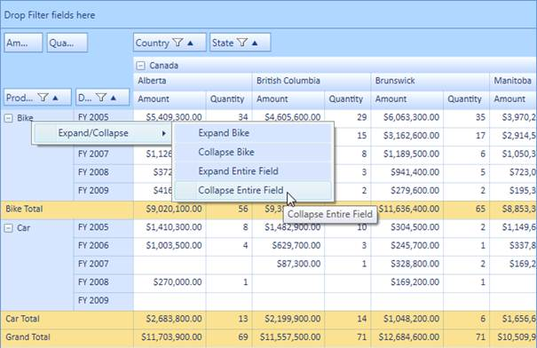
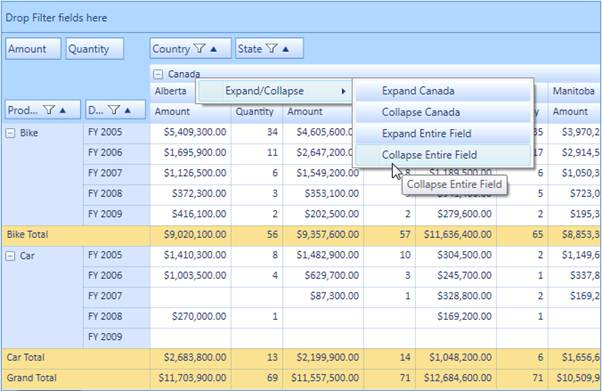

::: {style="DISPLAY: none"}
{#d2h_url_template} {#d2h_package_url style="WIDTH: 0px; DISPLAY: none; HEIGHT: 0px"}
:::

::: {.d2h_secondary_topic style="PADDING-BOTTOM: 10pt; MARGIN: 0pt; PADDING-LEFT: 0pt; PADDING-RIGHT: 0pt; PADDING-TOP: 0pt"}
##### Adding to an Application {#adding-to-an-application style="tab-stops: 0pt"}

You can enable the context menu for row/column header cells present in the grid by setting the **EnableContextMenu** Boolean property of that cell style to **true**.

The property usage is illustrated in the code given below.

 

+----------------------------------------------------------------------------------------------------------------------------------------------------------------------------------+
| **[\[C#\]]{style="FONT-FAMILY: 'Courier New'"}**                                                                                                                                 |
|                                                                                                                                                                                  |
| [// To Enable Context Menu for Column Header.]{style="FONT-FAMILY: 'Courier New'; COLOR: green"}                                                                                 |
|                                                                                                                                                                                  |
| [this]{style="FONT-FAMILY: 'Courier New'; COLOR: blue"} [.PivotGrid1.ColumnHeaderCellStyle.EnableContextMenu = [true]{style="COLOR: blue"};]{style="FONT-FAMILY: 'Courier New'"} |
|                                                                                                                                                                                  |
| [// To Enable Context Menu for Row Header.]{style="FONT-FAMILY: 'Courier New'; COLOR: green"}                                                                                    |
|                                                                                                                                                                                  |
| [this]{style="FONT-FAMILY: 'Courier New'; COLOR: blue"} [.PivotGrid1.RowHeaderCellStyle.EnableContextMenu = [true]{style="COLOR: blue"};]{style="FONT-FAMILY: 'Courier New'"}    |
+----------------------------------------------------------------------------------------------------------------------------------------------------------------------------------+

 

+--------------------------------------------------------------------------------------------------------------------------------------------------------------------------------------------+
| **[\[VB\]]{style="FONT-FAMILY: 'Courier New'"}**                                                                                                                                           |
|                                                                                                                                                                                            |
| [// To Enable Context Menu for Column Header.]{style="FONT-FAMILY: 'Courier New'; COLOR: green"}                                                                                           |
|                                                                                                                                                                                            |
| [Me]{style="FONT-FAMILY: Consolas; COLOR: blue; FONT-SIZE: 9.5pt"} [.PivotGrid1.ColumnHeaderCellStyle.EnableContextMenu = [True]{style="COLOR: blue"}]{style="FONT-FAMILY: 'Courier New'"} |
|                                                                                                                                                                                            |
| [// To Enable Context Menu for Row Header.]{style="FONT-FAMILY: 'Courier New'; COLOR: green"}                                                                                              |
|                                                                                                                                                                                            |
| [Me]{style="FONT-FAMILY: Consolas; COLOR: blue; FONT-SIZE: 9.5pt"} [.PivotGrid1.RowHeaderCellStyle.EnableContextMenu = [True]{style="COLOR: blue"}]{style="FONT-FAMILY: 'Courier New'"}    |
+--------------------------------------------------------------------------------------------------------------------------------------------------------------------------------------------+

 

 

{border="0"}

Figure 47: Context Menu in Row Header

 

{border="0"}

Figure 48: Context Menu in Column Header

 

To perform the expand/collapse operations programmatically, you can make use of the eight methods respectively as per your requirement. Passing the **UniqueText** as a parameter you can expand/collapse one or more columns/rows. The method usage is illustrated in the following code sample.

 

+----------------------------------------------------------------------------------------------------------------------------------------------------------------------------------------------------------------------------------------------------------------------------------------------------------------------------------------------------------------------------------------------------------------------------------------------------------------------------------------------------------------------------------------------------------------------------------------------------------------------------------------------------------------------------------------------------------------------------------------------------------------------------------------------------------------------------------------------------------------------------------------------------------------------------------------------------------------------------------------------------------+
| **[\[C#\]]{style="FONT-FAMILY: 'Courier New'"}**                                                                                                                                                                                                                                                                                                                                                                                                                                                                                                                                                                                                                                                                                                                                                                                                                                                                                                                                                         |
|                                                                                                                                                                                                                                                                                                                                                                                                                                                                                                                                                                                                                                                                                                                                                                                                                                                                                                                                                                                                          |
| [/// Expands the Bike from row]{style="FONT-FAMILY: 'Courier New'; COLOR: green; FONT-SIZE: 9.5pt"} [       ]{style="FONT-FAMILY: 'Courier New'; COLOR: black; FONT-SIZE: 9.5pt"}                                                                                                                                                                                                                                                                                                                                                                                                                                                                                                                                                                                                                                                                                                                                                                                                                        |
|                                                                                                                                                                                                                                                                                                                                                                                                                                                                                                                                                                                                                                                                                                                                                                                                                                                                                                                                                                                                          |
| [this]{style="FONT-FAMILY: 'Courier New'; COLOR: blue; FONT-SIZE: 9.5pt"} [.]{style="FONT-FAMILY: 'Courier New'; COLOR: black; FONT-SIZE: 9.5pt"} [pivotGrid1.ExpandRow]{style="FONT-FAMILY: 'Courier New'; FONT-SIZE: 9.5pt"} [(]{style="FONT-FAMILY: 'Courier New'; COLOR: black; FONT-SIZE: 9.5pt"} [\"Bike\"]{style="FONT-FAMILY: 'Courier New'; COLOR: #a31515; FONT-SIZE: 9.5pt"} [);]{style="FONT-FAMILY: 'Courier New'; COLOR: black; FONT-SIZE: 9.5pt"} []{style="FONT-FAMILY: 'Courier New'; COLOR: #a31515; FONT-SIZE: 9.5pt"}                                                                                                                                                                                                                                                                                                                                                                                                                                                                |
|                                                                                                                                                                                                                                                                                                                                                                                                                                                                                                                                                                                                                                                                                                                                                                                                                                                                                                                                                                                                          |
| [/// Collapses the Bike from row]{style="FONT-FAMILY: 'Courier New'; COLOR: green; FONT-SIZE: 9.5pt"} [        ]{style="FONT-FAMILY: 'Courier New'; COLOR: black; FONT-SIZE: 9.5pt"} []{style="FONT-FAMILY: 'Courier New'; COLOR: green; FONT-SIZE: 9.5pt"}                                                                                                                                                                                                                                                                                                                                                                                                                                                                                                                                                                                                                                                                                                                                              |
|                                                                                                                                                                                                                                                                                                                                                                                                                                                                                                                                                                                                                                                                                                                                                                                                                                                                                                                                                                                                          |
| [this]{style="FONT-FAMILY: 'Courier New'; COLOR: blue; FONT-SIZE: 9.5pt"} [.pivotGrid1.CollapseRow(]{style="FONT-FAMILY: 'Courier New'; COLOR: black; FONT-SIZE: 9.5pt"} [\"Bike\"]{style="FONT-FAMILY: 'Courier New'; COLOR: #a31515; FONT-SIZE: 9.5pt"} [);        ]{style="FONT-FAMILY: 'Courier New'; COLOR: black; FONT-SIZE: 9.5pt"}                                                                                                                                                                                                                                                                                                                                                                                                                                                                                                                                                                                                                                                               |
|                                                                                                                                                                                                                                                                                                                                                                                                                                                                                                                                                                                                                                                                                                                                                                                                                                                                                                                                                                                                          |
| [/// Expands the Canada from column]{style="FONT-FAMILY: 'Courier New'; COLOR: green; FONT-SIZE: 9.5pt"} [        ]{style="FONT-FAMILY: 'Courier New'; COLOR: black; FONT-SIZE: 9.5pt"} []{style="FONT-FAMILY: 'Courier New'; COLOR: green; FONT-SIZE: 9.5pt"}                                                                                                                                                                                                                                                                                                                                                                                                                                                                                                                                                                                                                                                                                                                                           |
|                                                                                                                                                                                                                                                                                                                                                                                                                                                                                                                                                                                                                                                                                                                                                                                                                                                                                                                                                                                                          |
| [this]{style="FONT-FAMILY: 'Courier New'; COLOR: blue; FONT-SIZE: 9.5pt"} [.pivotGrid1.ExpandColumn(]{style="FONT-FAMILY: 'Courier New'; COLOR: black; FONT-SIZE: 9.5pt"} [\"Canada\"]{style="FONT-FAMILY: 'Courier New'; COLOR: #a31515; FONT-SIZE: 9.5pt"} [);        ]{style="FONT-FAMILY: 'Courier New'; COLOR: black; FONT-SIZE: 9.5pt"}                                                                                                                                                                                                                                                                                                                                                                                                                                                                                                                                                                                                                                                            |
|                                                                                                                                                                                                                                                                                                                                                                                                                                                                                                                                                                                                                                                                                                                                                                                                                                                                                                                                                                                                          |
| [/// Collapses the Canada from column]{style="FONT-FAMILY: 'Courier New'; COLOR: green; FONT-SIZE: 9.5pt"} [        ]{style="FONT-FAMILY: 'Courier New'; COLOR: black; FONT-SIZE: 9.5pt"} []{style="FONT-FAMILY: 'Courier New'; COLOR: green; FONT-SIZE: 9.5pt"}                                                                                                                                                                                                                                                                                                                                                                                                                                                                                                                                                                                                                                                                                                                                         |
|                                                                                                                                                                                                                                                                                                                                                                                                                                                                                                                                                                                                                                                                                                                                                                                                                                                                                                                                                                                                          |
| [this]{style="FONT-FAMILY: 'Courier New'; COLOR: blue; FONT-SIZE: 9.5pt"} [.pivotGrid1.CollapseColumn(]{style="FONT-FAMILY: 'Courier New'; COLOR: black; FONT-SIZE: 9.5pt"} [\"Canada\"]{style="FONT-FAMILY: 'Courier New'; COLOR: #a31515; FONT-SIZE: 9.5pt"} [);        ]{style="FONT-FAMILY: 'Courier New'; COLOR: black; FONT-SIZE: 9.5pt"}                                                                                                                                                                                                                                                                                                                                                                                                                                                                                                                                                                                                                                                          |
|                                                                                                                                                                                                                                                                                                                                                                                                                                                                                                                                                                                                                                                                                                                                                                                                                                                                                                                                                                                                          |
| [/// Collapses the given collection of UniqueText string values for row]{style="FONT-FAMILY: 'Courier New'; COLOR: green; FONT-SIZE: 9.5pt"} [        ]{style="FONT-FAMILY: 'Courier New'; COLOR: black; FONT-SIZE: 9.5pt"} []{style="FONT-FAMILY: 'Courier New'; COLOR: green; FONT-SIZE: 9.5pt"}                                                                                                                                                                                                                                                                                                                                                                                                                                                                                                                                                                                                                                                                                                       |
|                                                                                                                                                                                                                                                                                                                                                                                                                                                                                                                                                                                                                                                                                                                                                                                                                                                                                                                                                                                                          |
| [this]{style="FONT-FAMILY: 'Courier New'; COLOR: blue; FONT-SIZE: 9.5pt"} [.pivotGrid1.CollapseRow(]{style="FONT-FAMILY: 'Courier New'; COLOR: black; FONT-SIZE: 9.5pt"} [new]{style="FONT-FAMILY: 'Courier New'; COLOR: blue; FONT-SIZE: 9.5pt"} []{style="FONT-FAMILY: 'Courier New'; COLOR: black; FONT-SIZE: 9.5pt"} [List]{style="FONT-FAMILY: 'Courier New'; COLOR: #2b91af; FONT-SIZE: 9.5pt"} [\<]{style="FONT-FAMILY: 'Courier New'; COLOR: black; FONT-SIZE: 9.5pt"} [string]{style="FONT-FAMILY: 'Courier New'; COLOR: blue; FONT-SIZE: 9.5pt"} [\> { ]{style="FONT-FAMILY: 'Courier New'; COLOR: black; FONT-SIZE: 9.5pt"} [\"Bike\"]{style="FONT-FAMILY: 'Courier New'; COLOR: #a31515; FONT-SIZE: 9.5pt"} [, ]{style="FONT-FAMILY: 'Courier New'; COLOR: black; FONT-SIZE: 9.5pt"} [\"Car\"]{style="FONT-FAMILY: 'Courier New'; COLOR: #a31515; FONT-SIZE: 9.5pt"} [ });        ]{style="FONT-FAMILY: 'Courier New'; COLOR: black; FONT-SIZE: 9.5pt"}                                      |
|                                                                                                                                                                                                                                                                                                                                                                                                                                                                                                                                                                                                                                                                                                                                                                                                                                                                                                                                                                                                          |
| [/// Expands the given collection of UniqueText string values for row]{style="FONT-FAMILY: 'Courier New'; COLOR: green; FONT-SIZE: 9.5pt"} [        ]{style="FONT-FAMILY: 'Courier New'; COLOR: black; FONT-SIZE: 9.5pt"} []{style="FONT-FAMILY: 'Courier New'; COLOR: green; FONT-SIZE: 9.5pt"}                                                                                                                                                                                                                                                                                                                                                                                                                                                                                                                                                                                                                                                                                                         |
|                                                                                                                                                                                                                                                                                                                                                                                                                                                                                                                                                                                                                                                                                                                                                                                                                                                                                                                                                                                                          |
| [this]{style="FONT-FAMILY: 'Courier New'; COLOR: blue; FONT-SIZE: 9.5pt"} [.pivotGrid1.ExpandRow(]{style="FONT-FAMILY: 'Courier New'; COLOR: black; FONT-SIZE: 9.5pt"} [new]{style="FONT-FAMILY: 'Courier New'; COLOR: blue; FONT-SIZE: 9.5pt"} []{style="FONT-FAMILY: 'Courier New'; COLOR: black; FONT-SIZE: 9.5pt"} [List]{style="FONT-FAMILY: 'Courier New'; COLOR: #2b91af; FONT-SIZE: 9.5pt"} [\<]{style="FONT-FAMILY: 'Courier New'; COLOR: black; FONT-SIZE: 9.5pt"} [string]{style="FONT-FAMILY: 'Courier New'; COLOR: blue; FONT-SIZE: 9.5pt"} [\> { ]{style="FONT-FAMILY: 'Courier New'; COLOR: black; FONT-SIZE: 9.5pt"} [\"Bike\"]{style="FONT-FAMILY: 'Courier New'; COLOR: #a31515; FONT-SIZE: 9.5pt"} [, ]{style="FONT-FAMILY: 'Courier New'; COLOR: black; FONT-SIZE: 9.5pt"} [\"Car\"]{style="FONT-FAMILY: 'Courier New'; COLOR: #a31515; FONT-SIZE: 9.5pt"} [ });        ]{style="FONT-FAMILY: 'Courier New'; COLOR: black; FONT-SIZE: 9.5pt"}                                        |
|                                                                                                                                                                                                                                                                                                                                                                                                                                                                                                                                                                                                                                                                                                                                                                                                                                                                                                                                                                                                          |
| [/// Collapses the given collection of UniqueText string values for Column]{style="FONT-FAMILY: 'Courier New'; COLOR: green; FONT-SIZE: 9.5pt"} [        ]{style="FONT-FAMILY: 'Courier New'; COLOR: black; FONT-SIZE: 9.5pt"} []{style="FONT-FAMILY: 'Courier New'; COLOR: green; FONT-SIZE: 9.5pt"}                                                                                                                                                                                                                                                                                                                                                                                                                                                                                                                                                                                                                                                                                                    |
|                                                                                                                                                                                                                                                                                                                                                                                                                                                                                                                                                                                                                                                                                                                                                                                                                                                                                                                                                                                                          |
| [this]{style="FONT-FAMILY: 'Courier New'; COLOR: blue; FONT-SIZE: 9.5pt"} [.pivotGrid1.CollapseColumn(]{style="FONT-FAMILY: 'Courier New'; COLOR: black; FONT-SIZE: 9.5pt"} [new]{style="FONT-FAMILY: 'Courier New'; COLOR: blue; FONT-SIZE: 9.5pt"} []{style="FONT-FAMILY: 'Courier New'; COLOR: black; FONT-SIZE: 9.5pt"} [List]{style="FONT-FAMILY: 'Courier New'; COLOR: #2b91af; FONT-SIZE: 9.5pt"} [\<]{style="FONT-FAMILY: 'Courier New'; COLOR: black; FONT-SIZE: 9.5pt"} [string]{style="FONT-FAMILY: 'Courier New'; COLOR: blue; FONT-SIZE: 9.5pt"} [\> { ]{style="FONT-FAMILY: 'Courier New'; COLOR: black; FONT-SIZE: 9.5pt"} [\"Canada\"]{style="FONT-FAMILY: 'Courier New'; COLOR: #a31515; FONT-SIZE: 9.5pt"} [, ]{style="FONT-FAMILY: 'Courier New'; COLOR: black; FONT-SIZE: 9.5pt"} [\"France\"]{style="FONT-FAMILY: 'Courier New'; COLOR: #a31515; FONT-SIZE: 9.5pt"} [ });        ]{style="FONT-FAMILY: 'Courier New'; COLOR: black; FONT-SIZE: 9.5pt"}                              |
|                                                                                                                                                                                                                                                                                                                                                                                                                                                                                                                                                                                                                                                                                                                                                                                                                                                                                                                                                                                                          |
| [/// Expands the given collection of UniqueText string values for Column]{style="FONT-FAMILY: 'Courier New'; COLOR: green; FONT-SIZE: 9.5pt"} [        ]{style="FONT-FAMILY: 'Courier New'; COLOR: black; FONT-SIZE: 9.5pt"} []{style="FONT-FAMILY: 'Courier New'; COLOR: green; FONT-SIZE: 9.5pt"}                                                                                                                                                                                                                                                                                                                                                                                                                                                                                                                                                                                                                                                                                                      |
|                                                                                                                                                                                                                                                                                                                                                                                                                                                                                                                                                                                                                                                                                                                                                                                                                                                                                                                                                                                                          |
| [this]{style="FONT-FAMILY: 'Courier New'; COLOR: blue; FONT-SIZE: 9.5pt"} [.pivotGrid1.ExpandColumn(]{style="FONT-FAMILY: 'Courier New'; COLOR: black; FONT-SIZE: 9.5pt"} [new]{style="FONT-FAMILY: 'Courier New'; COLOR: blue; FONT-SIZE: 9.5pt"} []{style="FONT-FAMILY: 'Courier New'; COLOR: black; FONT-SIZE: 9.5pt"} [List]{style="FONT-FAMILY: 'Courier New'; COLOR: #2b91af; FONT-SIZE: 9.5pt"} [\<]{style="FONT-FAMILY: 'Courier New'; COLOR: black; FONT-SIZE: 9.5pt"} [string]{style="FONT-FAMILY: 'Courier New'; COLOR: blue; FONT-SIZE: 9.5pt"} [\> { ]{style="FONT-FAMILY: 'Courier New'; COLOR: black; FONT-SIZE: 9.5pt"} [\"Canada\"]{style="FONT-FAMILY: 'Courier New'; COLOR: #a31515; FONT-SIZE: 9.5pt"} [, ]{style="FONT-FAMILY: 'Courier New'; COLOR: black; FONT-SIZE: 9.5pt"} [\"France\"]{style="FONT-FAMILY: 'Courier New'; COLOR: #a31515; FONT-SIZE: 9.5pt"} [ });]{style="FONT-FAMILY: 'Courier New'; COLOR: black; FONT-SIZE: 9.5pt"} []{style="FONT-FAMILY: 'Courier New'"} |
+----------------------------------------------------------------------------------------------------------------------------------------------------------------------------------------------------------------------------------------------------------------------------------------------------------------------------------------------------------------------------------------------------------------------------------------------------------------------------------------------------------------------------------------------------------------------------------------------------------------------------------------------------------------------------------------------------------------------------------------------------------------------------------------------------------------------------------------------------------------------------------------------------------------------------------------------------------------------------------------------------------+

 

+-------------------------------------------------------------------------------------------------------------------------------------------------------------------------------------------------------------------------------------------------------------------------------------------------------------+
| **[\[VB\]]{style="FONT-FAMILY: 'Courier New'"}**                                                                                                                                                                                                                                                            |
|                                                                                                                                                                                                                                                                                                             |
| [/// Expands the Bike from row]{style="FONT-FAMILY: 'Courier New'; COLOR: green; FONT-SIZE: 9.5pt"} [       ]{style="FONT-FAMILY: 'Courier New'; COLOR: black; FONT-SIZE: 9.5pt"}                                                                                                                           |
|                                                                                                                                                                                                                                                                                                             |
| [Me]{style="FONT-FAMILY: 'Courier New'; COLOR: blue; FONT-SIZE: 9.5pt"} [.pivotGrid1.ExpandRow([\"Bike\"]{style="COLOR: #a31515"})]{style="FONT-FAMILY: 'Courier New'; FONT-SIZE: 9.5pt"}                                                                                                                   |
|                                                                                                                                                                                                                                                                                                             |
| [/// Collapses the Bike from row]{style="FONT-FAMILY: 'Courier New'; COLOR: green; FONT-SIZE: 9.5pt"} [        ]{style="FONT-FAMILY: 'Courier New'; COLOR: black; FONT-SIZE: 9.5pt"} []{style="FONT-FAMILY: 'Courier New'; COLOR: green; FONT-SIZE: 9.5pt"}                                                 |
|                                                                                                                                                                                                                                                                                                             |
| [Me]{style="FONT-FAMILY: 'Courier New'; COLOR: blue; FONT-SIZE: 9.5pt"} [.pivotGrid1.CollapseRow([\"Bike\"]{style="COLOR: #a31515"})]{style="FONT-FAMILY: 'Courier New'; FONT-SIZE: 9.5pt"}                                                                                                                 |
|                                                                                                                                                                                                                                                                                                             |
| [/// Expands the Canada from column]{style="FONT-FAMILY: 'Courier New'; COLOR: green; FONT-SIZE: 9.5pt"} [        ]{style="FONT-FAMILY: 'Courier New'; COLOR: black; FONT-SIZE: 9.5pt"} []{style="FONT-FAMILY: 'Courier New'; COLOR: green; FONT-SIZE: 9.5pt"}                                              |
|                                                                                                                                                                                                                                                                                                             |
| [Me]{style="FONT-FAMILY: 'Courier New'; COLOR: blue; FONT-SIZE: 9.5pt"} [.pivotGrid1.ExpandColumn([\"Canada\"]{style="COLOR: #a31515"})]{style="FONT-FAMILY: 'Courier New'; FONT-SIZE: 9.5pt"}                                                                                                              |
|                                                                                                                                                                                                                                                                                                             |
| [/// Collapses the Canada from column]{style="FONT-FAMILY: 'Courier New'; COLOR: green; FONT-SIZE: 9.5pt"} [        ]{style="FONT-FAMILY: 'Courier New'; COLOR: black; FONT-SIZE: 9.5pt"} []{style="FONT-FAMILY: 'Courier New'; COLOR: green; FONT-SIZE: 9.5pt"}                                            |
|                                                                                                                                                                                                                                                                                                             |
| [Me]{style="FONT-FAMILY: 'Courier New'; COLOR: blue; FONT-SIZE: 9.5pt"} [.pivotGrid1.CollapseColumn([\"Canada\"]{style="COLOR: #a31515"})]{style="FONT-FAMILY: 'Courier New'; FONT-SIZE: 9.5pt"}                                                                                                            |
|                                                                                                                                                                                                                                                                                                             |
| [/// Collapses the given collection of UniqueText string values for row]{style="FONT-FAMILY: 'Courier New'; COLOR: green; FONT-SIZE: 9.5pt"} [        ]{style="FONT-FAMILY: 'Courier New'; COLOR: black; FONT-SIZE: 9.5pt"} []{style="FONT-FAMILY: 'Courier New'; COLOR: green; FONT-SIZE: 9.5pt"}          |
|                                                                                                                                                                                                                                                                                                             |
| [Me]{style="FONT-FAMILY: 'Courier New'; COLOR: blue; FONT-SIZE: 9.5pt"} [.pivotGrid1.CollapseRow([New]{style="COLOR: blue"}[String]{style="COLOR: blue"}() {[\"Bike\"]{style="COLOR: #a31515"}, [\"Car\"]{style="COLOR: #a31515"}}.ToList())]{style="FONT-FAMILY: 'Courier New'; FONT-SIZE: 9.5pt"}         |
|                                                                                                                                                                                                                                                                                                             |
| [/// Expands the given collection of UniqueText string values for row]{style="FONT-FAMILY: 'Courier New'; COLOR: green; FONT-SIZE: 9.5pt"} [        ]{style="FONT-FAMILY: 'Courier New'; COLOR: black; FONT-SIZE: 9.5pt"} []{style="FONT-FAMILY: 'Courier New'; COLOR: green; FONT-SIZE: 9.5pt"}            |
|                                                                                                                                                                                                                                                                                                             |
| [Me]{style="FONT-FAMILY: 'Courier New'; COLOR: blue; FONT-SIZE: 9.5pt"} [.pivotGrid1.ExpandRow([New]{style="COLOR: blue"}[String]{style="COLOR: blue"}() {[\"Bike\"]{style="COLOR: #a31515"}, [\"Car\"]{style="COLOR: #a31515"}}.ToList())]{style="FONT-FAMILY: 'Courier New'; FONT-SIZE: 9.5pt"}           |
|                                                                                                                                                                                                                                                                                                             |
| [/// Collapses the given collection of UniqueText string values for Column]{style="FONT-FAMILY: 'Courier New'; COLOR: green; FONT-SIZE: 9.5pt"} [        ]{style="FONT-FAMILY: 'Courier New'; COLOR: black; FONT-SIZE: 9.5pt"} []{style="FONT-FAMILY: 'Courier New'; COLOR: green; FONT-SIZE: 9.5pt"}       |
|                                                                                                                                                                                                                                                                                                             |
| [Me]{style="FONT-FAMILY: 'Courier New'; COLOR: blue; FONT-SIZE: 9.5pt"} [.pivotGrid1.CollapseColumn([New]{style="COLOR: blue"}[String]{style="COLOR: blue"}() {[\"Canada\"]{style="COLOR: #a31515"}, [\"France\"]{style="COLOR: #a31515"}}.ToList())]{style="FONT-FAMILY: 'Courier New'; FONT-SIZE: 9.5pt"} |
|                                                                                                                                                                                                                                                                                                             |
| [/// Expands the given collection of UniqueText string values for Column]{style="FONT-FAMILY: 'Courier New'; COLOR: green; FONT-SIZE: 9.5pt"} [        ]{style="FONT-FAMILY: 'Courier New'; COLOR: black; FONT-SIZE: 9.5pt"} []{style="FONT-FAMILY: 'Courier New'; COLOR: green; FONT-SIZE: 9.5pt"}         |
|                                                                                                                                                                                                                                                                                                             |
| [Me]{style="FONT-FAMILY: 'Courier New'; COLOR: blue; FONT-SIZE: 9.5pt"} [.pivotGrid1.ExpandColumn([New]{style="COLOR: blue"}[String]{style="COLOR: blue"}() {[\"Canada\"]{style="COLOR: #a31515"}, [\"France\"]{style="COLOR: #a31515"}}.ToList())]{style="FONT-FAMILY: 'Courier New'; FONT-SIZE: 9.5pt"}   |
+-------------------------------------------------------------------------------------------------------------------------------------------------------------------------------------------------------------------------------------------------------------------------------------------------------------+

 

[]{#related-topics}
:::
