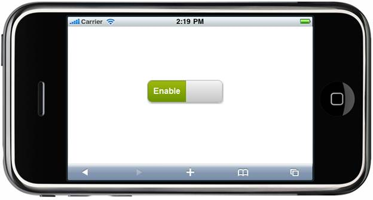
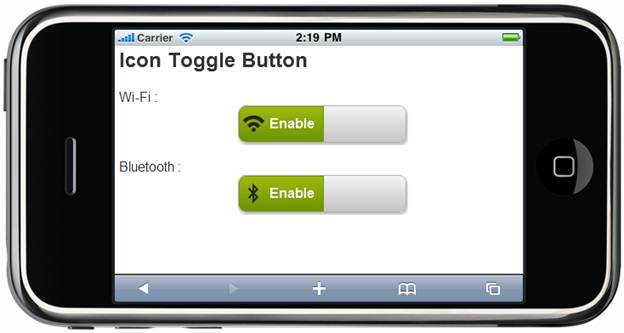

::: {style="DISPLAY: none"}
{#d2h_url_template} {#d2h_package_url style="WIDTH: 0px; DISPLAY: none; HEIGHT: 0px"}
:::

:::: {.d2h_secondary_topic style="PADDING-BOTTOM: 10pt; MARGIN: 0pt; PADDING-LEFT: 0pt; PADDING-RIGHT: 0pt; PADDING-TOP: 0pt"}
#### Adding ToggleButton Control to a Mobile MVC Application {#adding-togglebutton-control-to-a-mobile-mvc-application style="tab-stops: 0pt"}

In the [Getting Started]{.UGHyperlink} section, we discussed how to [create a Mobile MVC application]{.UGHyperlink} and [add the Tools package to an application]{.UGHyperlink}. This section guides you to add the ToggleButton control to an application.

 

1.   In the **view**, invoke the **ToggleButton** helper with the toggle button ID as the first argument.

 

+----------------------------------------------------------------------------------------------------------------------------------------------------------------------------------------------------------------------------------------------------+
| **[\[ASPX\]]{style="FONT-FAMILY: 'Courier New'"}** [   ]{style="FONT-FAMILY: 'Courier New'"}                                                                                                                                                       |
|                                                                                                                                                                                                                                                    |
| [\                                                                                                                                                                                                                                                 |
|  [\<%]{style="BACKGROUND: yellow"}[=]{style="COLOR: blue"}\                                                                                                                                                                                        |
| Html.MobSyncfusion().ToggleButton([\"Togg\"]{style="COLOR: #a31515"})\                                                                                                                                                                             |
|                                  .ToggleState([MobToggleState]{style="COLOR: #2b91af"}.On)\                                                                                                                                                        |
|                                  .OnText([\"Enable\"]{style="COLOR: #a31515"})\                                                                                                                                                                    |
|                                  .OffText([\"Disable\"]{style="COLOR: #a31515"})\                                                                                                                                                                  |
|                                  .AutoFormat([MobSkins]{style="COLOR: #2b91af"}.Spinach)[%\>]{style="BACKGROUND: yellow"}]{style="FONT-FAMILY: 'Courier New'"}                                                                                     |
|                                                                                                                                                                                                                                                    |
| **[\[Razor\]]{style="FONT-FAMILY: 'Courier New'"}**                                                                                                                                                                                                |
|                                                                                                                                                                                                                                                    |
| **[]{style="FONT-FAMILY: 'Courier New'"}**                                                                                                                                                                                                         |
|                                                                                                                                                                                                                                                    |
| [       ]{style="FONT-FAMILY: 'Courier New'; COLOR: blue"} [\@{]{style="FONT-FAMILY: 'Courier New'; BACKGROUND: yellow"} [\                                                                                                                        |
|        ]{style="FONT-FAMILY: 'Courier New'"} [Html.MobSyncfusion().ToggleButton([\"Togg\"]{style="COLOR: #a31515"})\                                                                                                                               |
|                                         .ToggleState([MobToggleState]{style="COLOR: #2b91af"}.On)\                                                                                                                                                 |
|                                         .OnText([\"Enable\"]{style="COLOR: #a31515"})\                                                                                                                                                             |
|                                         .OffText([\"Disable\"]{style="COLOR: #a31515"})\                                                                                                                                                           |
|                                          .AutoFormat([MobSkins]{style="COLOR: #2b91af"}.Spinach).Render();]{style="FONT-FAMILY: 'Courier New'"} [}]{style="FONT-FAMILY: 'Courier New'; BACKGROUND: yellow"} []{style="FONT-FAMILY: 'Courier New'"} |
|                                                                                                                                                                                                                                                    |
|                                                                                                                                                                                                                                                    |
+----------------------------------------------------------------------------------------------------------------------------------------------------------------------------------------------------------------------------------------------------+

2.   Run the application.

 

The output is shown in the following screenshot:

{border="0"}

Figure 163: ToggleButton---Sample

 

A sample that demonstrates a basic ToggleButton control can be downloaded from the following links:

[ToggleButton---ASPX Sample](file:///D:\Rajendran_Reference\Aspx)

[ToggleButton---Razor Sample](file:///D:\Rajendran_Reference\Razor)

 

::: {style="BORDER-BOTTOM: windowtext 1pt solid; BORDER-LEFT: medium none; PADDING-BOTTOM: 1pt; MARGIN-TOP: 9pt; PADDING-LEFT: 0pt; PADDING-RIGHT: 0pt; MARGIN-BOTTOM: 9pt; BORDER-TOP: windowtext 1pt solid; BORDER-RIGHT: medium none; PADDING-TOP: 1pt"}
{border="0"}Note: The version number for the assemblies has been set to 10.104.0.44 in the Web.config file of the attached sample. Change the version number to the appropriate version in the Web-2008.config or Web-2010.config files (available in the root directory) and they will automatically be updated in the Web.config file.
:::

 

Use Case Scenario

The ToggleButton control can be used to toggle connections such as Wi-Fi or Bluetooth between "On" and "Off."

 

{border="0"}

Figure 164: ToogleButton Control used to Set Wi-Fi and Bluetooth Connections

[]{#related-topics}
::::
