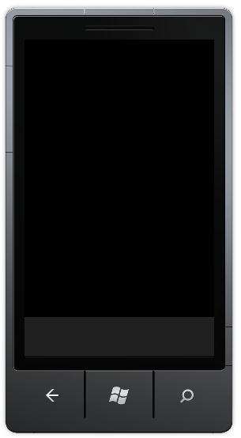

::: {style="DISPLAY: none"}
{#d2h_url_template}{#d2h_package_url style="WIDTH: 0px; DISPLAY: none; HEIGHT: 0px"}
:::

:::: {.d2h_secondary_topic style="PADDING-BOTTOM: 10pt; MARGIN: 0pt; PADDING-LEFT: 0pt; PADDING-RIGHT: 0pt; PADDING-TOP: 0pt"}
#### Adding Toolbar Control to Windows Phone an Application {#adding-toolbar-control-to-windows-phone-an-application style="tab-stops: 0pt"}

To [[create a Windows Phone application and deploy Essential Tools for Windows Phone]{.UGHyperlink}](ms-xhelp:///?Id=7d640d4d-88ca-45b4-bdec-dea8eb32a2c4), refer to section [[3 Getting Started]{.UGHyperlink}](ms-xhelp:///?Id=3e84b3d6-73dd-4308-93d7-d887254f15c5). This section covers how to add Toolbar control to this application.

 

The *Toolbar* control can be added to the application using either Xaml or procedural code. The following code illustrartes this:

 

+---------------------------------------------------------------------------------------------------------------------------------------------------------------------------------------------------------------------------------------------------------------------------------------------------------------------------------------------------------------+
| **[\[XAML\]]{style="FONT-FAMILY: 'Calibri','sans-serif'"}**[]{style="FONT-FAMILY: Consolas; COLOR: blue; FONT-SIZE: 9.5pt"}                                                                                                                                                                                                                                   |
|                                                                                                                                                                                                                                                                                                                                                               |
| [\<]{style="FONT-FAMILY: Consolas; COLOR: blue; FONT-SIZE: 9.5pt"}[syncfusion]{style="FONT-FAMILY: Consolas; COLOR: #a31515; FONT-SIZE: 9.5pt"}[:]{style="FONT-FAMILY: Consolas; COLOR: blue; FONT-SIZE: 9.5pt"}[ToolBar]{style="FONT-FAMILY: Consolas; COLOR: #a31515; FONT-SIZE: 9.5pt"}[\>]{style="FONT-FAMILY: Consolas; COLOR: blue; FONT-SIZE: 9.5pt"}  |
|                                                                                                                                                                                                                                                                                                                                                               |
| []{style="FONT-FAMILY: Consolas; COLOR: blue; FONT-SIZE: 9.5pt"}                                                                                                                                                                                                                                                                                              |
|                                                                                                                                                                                                                                                                                                                                                               |
| [\</]{style="FONT-FAMILY: Consolas; COLOR: blue; FONT-SIZE: 9.5pt"}[syncfusion]{style="FONT-FAMILY: Consolas; COLOR: #a31515; FONT-SIZE: 9.5pt"}[:]{style="FONT-FAMILY: Consolas; COLOR: blue; FONT-SIZE: 9.5pt"}[ToolBar]{style="FONT-FAMILY: Consolas; COLOR: #a31515; FONT-SIZE: 9.5pt"}[\>]{style="FONT-FAMILY: Consolas; COLOR: blue; FONT-SIZE: 9.5pt"} |
|                                                                                                                                                                                                                                                                                                                                                               |
| []{style="FONT-FAMILY: 'Calibri','sans-serif'"}                                                                                                                                                                                                                                                                                                               |
+---------------------------------------------------------------------------------------------------------------------------------------------------------------------------------------------------------------------------------------------------------------------------------------------------------------------------------------------------------------+

 

+----------------------------------------------------------------------------------------------------------------------------------------------------------------------------------------------------------+
| **[\[C#\]]{style="FONT-FAMILY: 'Calibri','sans-serif'"}[]{style="FONT-FAMILY: Consolas; COLOR: #2b91af; FONT-SIZE: 9.5pt"}**                                                                             |
|                                                                                                                                                                                                          |
| []{style="FONT-FAMILY: Consolas; COLOR: #2b91af; FONT-SIZE: 9.5pt"}                                                                                                                                      |
|                                                                                                                                                                                                          |
| [ToolBar]{style="FONT-FAMILY: Consolas; COLOR: #2b91af; FONT-SIZE: 9.5pt"}[ toolbar1 = [new]{style="COLOR: blue"} [ToolBar]{style="COLOR: #2b91af"}();]{style="FONT-FAMILY: Consolas; FONT-SIZE: 9.5pt"} |
|                                                                                                                                                                                                          |
| [ [this]{style="COLOR: blue"}.LayoutRoot.Children.Add(toolbar1);]{style="FONT-FAMILY: Consolas; FONT-SIZE: 9.5pt"}                                                                                       |
+----------------------------------------------------------------------------------------------------------------------------------------------------------------------------------------------------------+

 

 

{border="0"}

Figure 59: Adding Toolbar control

 

::: {style="BORDER-BOTTOM: windowtext 1pt solid; BORDER-LEFT: medium none; PADDING-BOTTOM: 1pt; MARGIN-TOP: 9pt; PADDING-LEFT: 0pt; PADDING-RIGHT: 0pt; MARGIN-BOTTOM: 9pt; BORDER-TOP: windowtext 1pt solid; BORDER-RIGHT: medium none; PADDING-TOP: 1pt"}
{border="0"}Note: Toolbar has to be added into the Root Layout element of the page, and only one Toolbar can be added in a page.

 
:::

***[]{style="FONT-SIZE: 9pt"}*** 

[]{#related-topics}
::::
